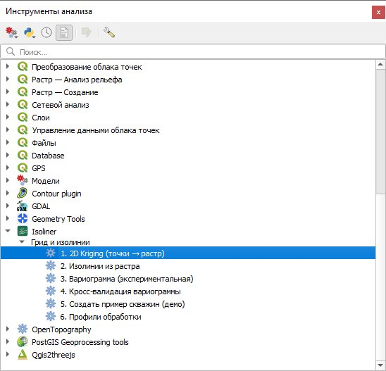
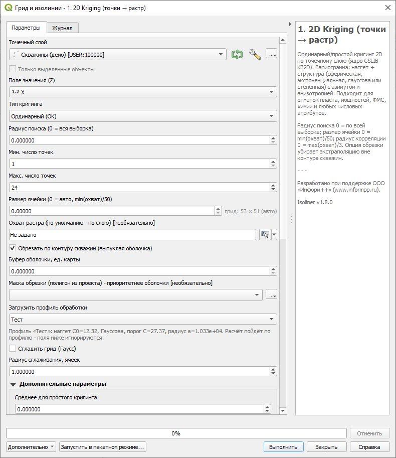
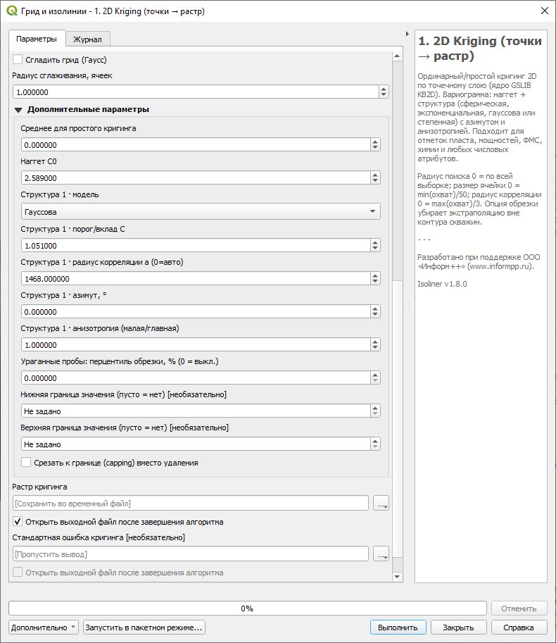
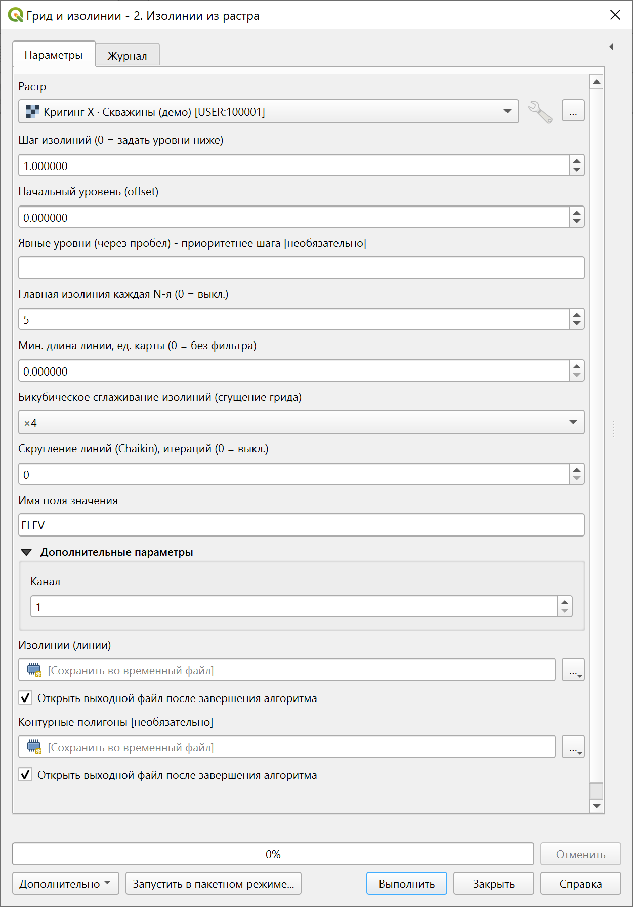
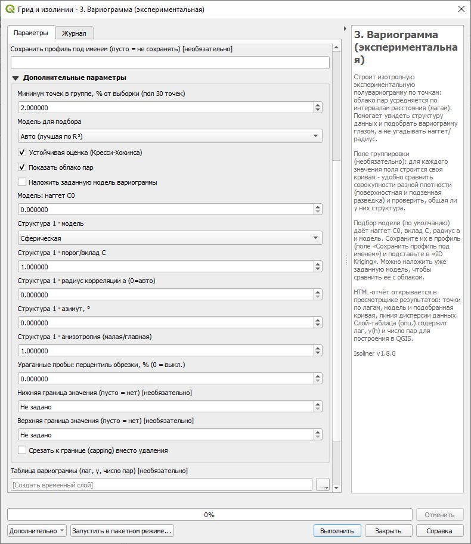
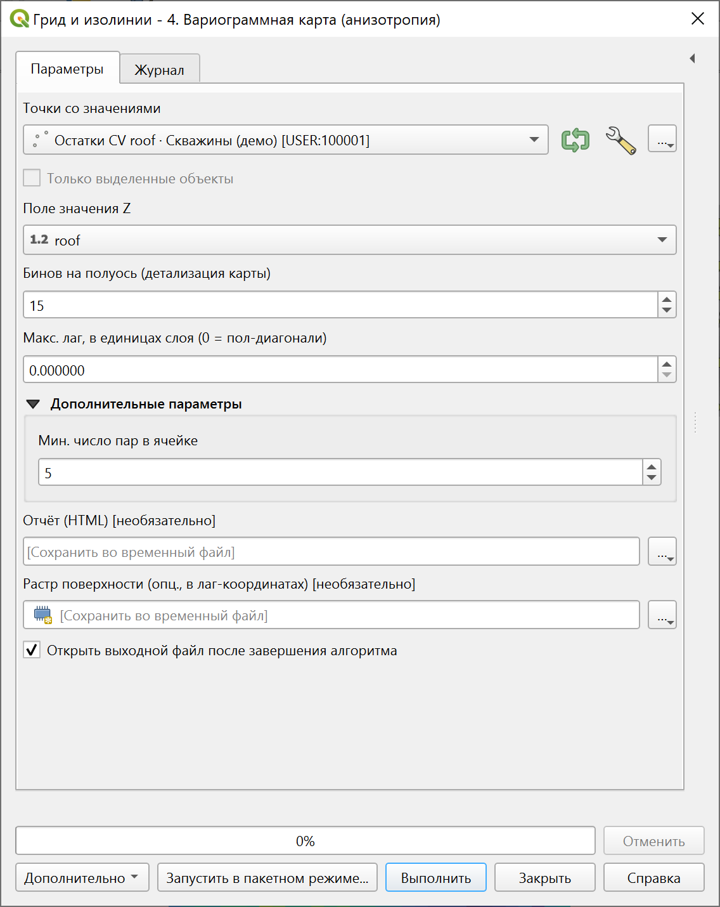
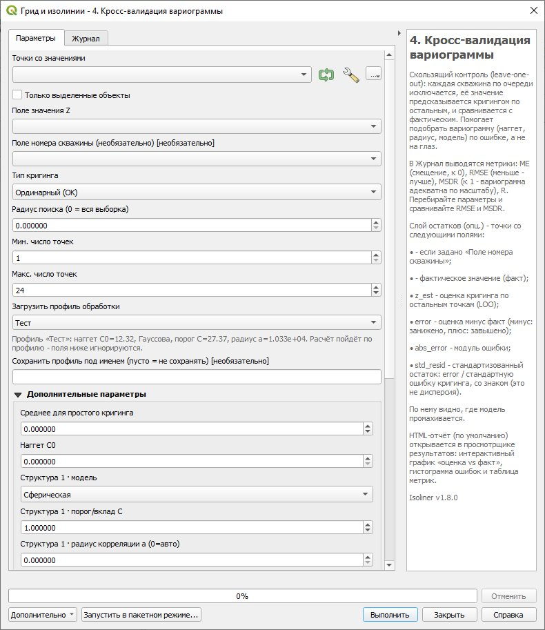
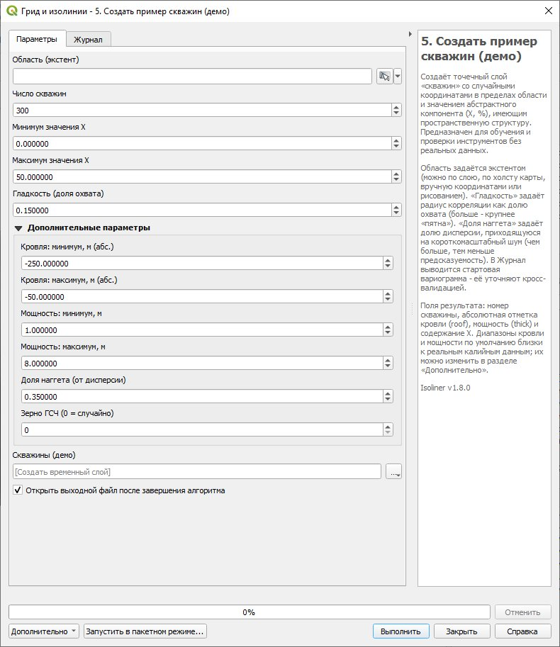
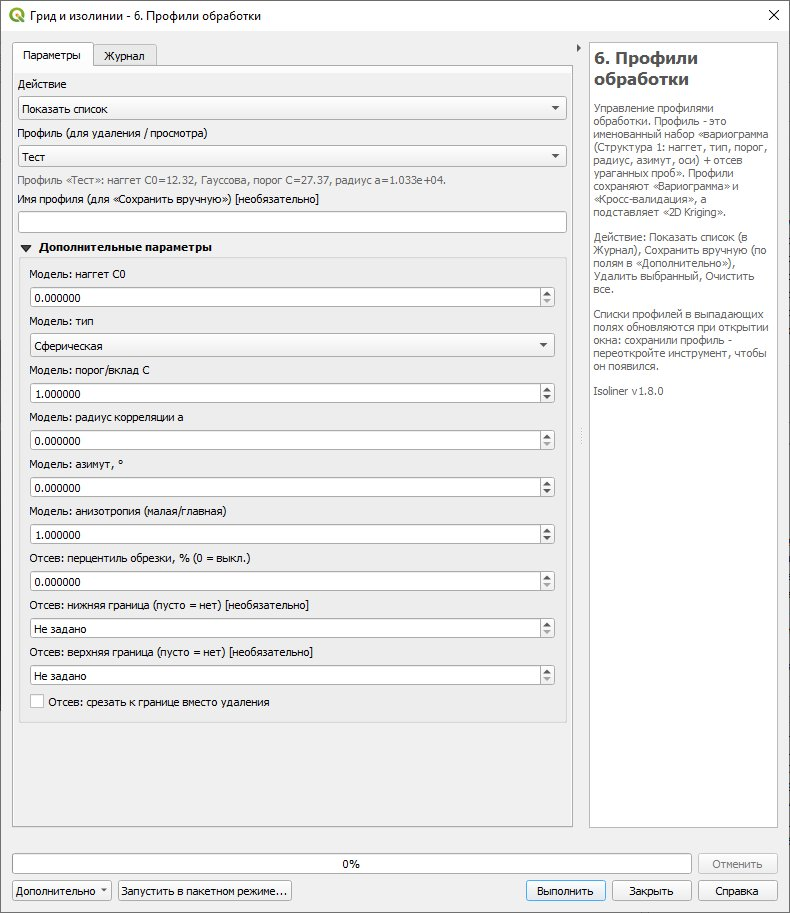
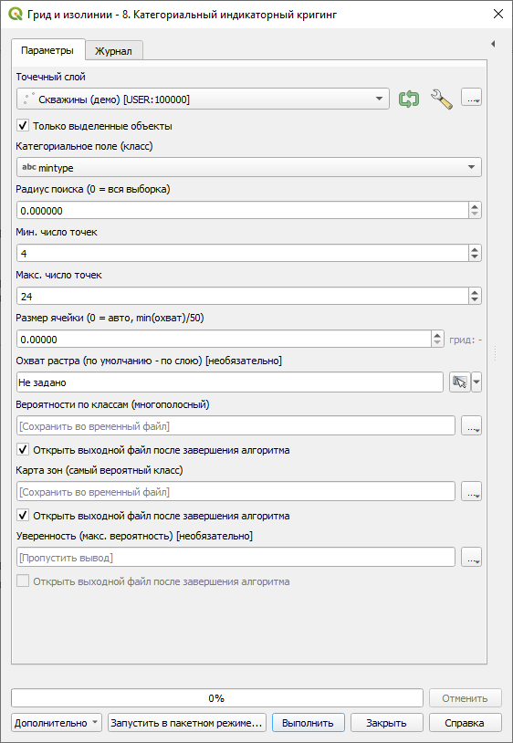

# Введение

Isoliner - провайдер инструментов Processing для интерполяции точечных данных и построения изолиний. Ядро кригинга - алгоритм KB2D из GSLIB. Инструменты разнесены по двум группам: «Грид и изолинии» - семь инструментов основного потока обработки, и «Дополнительные инструменты» - два специализированных расчёта.

«2D Kriging (точки → растр)» - ординарный или простой кригинг по точечному слою.

«Изолинии из растра» - изолинии (линии) и контурные полигоны (пояса между изолиниями), границы которых совпадают с линиями.

«Вариограммная карта (анизотропия)» - поверхность γ(h_x, h_y) с оценкой азимута и анизотропии для учёта направленности в кригинге.

«Кросс-валидация вариограммы» - скользящий контроль (leave-one-out) для проверки и подбора параметров кригинга по ошибке, а не визуально.

«Создать пример скважин (демо)» - генерация учебного точечного слоя с пространственной структурой (кровля, мощность, содержание компонента) для обучения и проверки без реальных данных.

В группе «Дополнительные инструменты» два специализированных расчёта.

«Категориальный индикаторный кригинг» - карта вероятности классов по категориальному полю (минтип, литотип): на каждый класс строится индикатор и кригуется отдельно, на выходе растр вероятностей, карта зон и уверенность.

«Гидравлический градиент и направление потока» - по растру напора строит модуль гидравлического градиента, азимут направления потока (вниз по градиенту) и точечный слой векторов потока, который сразу оформляется стрелками. Гидрогеология без проницаемости.

Подходит для отметок пласта, мощностей, ФМС, химии и любых числовых атрибутов скважин.

Несколько терминов, которые встречаются далее. Вариограмма описывает, насколько сильнее различаются значения с ростом расстояния между точками. Силл - уровень, на который она выходит (близок к дисперсии данных). Наггет (от англ. nugget, «эффект самородка») - скачок вариограммы у нуля, то есть разброс на сколь угодно малых расстояниях, вызванный измерительным шумом и микроизменчивостью. Далее по тексту - просто «наггет».

## Установка и расположение

Основной способ - из официального репозитория QGIS. Откройте Модули → Управление и установка модулей → вкладка «Все», в поиске наберите «Isoliner», выберите плагин и нажмите «Установить». При установке из репозитория QGIS сам сообщает о выходе новых версий и обновляет плагин по кнопке.

{width=55%}

Альтернативный способ - из ZIP-файла. Модули → Управление и установка модулей → Установить из ZIP. Это удобно для офлайн-установки и предрелизных сборок.

После установки инструменты появляются в панели «Обработка» (Processing), провайдер «Isoliner», группы «Грид и изолинии» и «Дополнительные инструменты». Требования: QGIS 3.16+. Внешних зависимостей нет - используются NumPy, GDAL и штатные алгоритмы Processing из состава QGIS.

## Обновление

При установке из репозитория QGIS показывает уведомление о доступной новой версии - значок в строке состояния и список во вкладке «Обновляемые» менеджера модулей. Обновление выполняется одной кнопкой. При установке из ZIP новая версия ставится тем же путём, поверх старой.

Плагин корректно перезагружается «на лету», перезапуск QGIS не требуется. Для быстрой перезагрузки кода при разработке удобен модуль Plugin Reloader (кнопка «Reload a plugin…»). Выберите «Isoliner» - провайдер и все инструменты перерегистрируются сразу.

## Вызов справки

В диалоге каждого инструмента есть кнопка «Справка», открывающая это руководство (PDF в комплекте плагина). Правая панель диалога дополнительно показывает краткую подсказку по инструменту.

# Общая логика работы

Типовой сценарий состоит из двух шагов:

2D Kriging: по точечному слою и числовому полю Z строится растр (регулярная сетка значений).

Изолинии из растра: по полученному растру строятся изолинии и, при необходимости, залитые контурные полигоны.

Шаги независимы: «Изолинии из растра» работают с любым растром, не только с результатом кригинга.

Инструменты собраны в две группы Processing. Группа «Грид и изолинии» это основной поток обработки, от кригинга до изолиний. Группа «Дополнительные инструменты» это специализированные расчёты, категориальный индикаторный кригинг и гидравлический градиент с направлением потока.

{width=98%}

# Инструмент «2D Kriging (точки → растр)»

Ординарный (OK) или простой (SK) кригинг по точечному слою. Совпадающие точки (один и тот же XY) усредняются по Z. В узлах сетки значения исходных точек воспроизводятся точно (при нулевом наггете).

{width=70%}

Основные параметры:

| Параметр | Что задаёт | По умолчанию / совет |
|---|---|---|
| Точечный слой | Исходные точки (скважины) для интерполяции. | - |
| Только выделенные объекты | Считать лишь по выделенным точкам слоя. | выкл. |
| Поле значения (Z) | Числовой атрибут, который интерполируется: отметка пласта, мощность, ФМС, химия и т. п. | запоминается между запусками |
| Тип кригинга | Ординарный (OK) - локально оценивает среднее сам. Простой (SK) - использует заданное «Среднее». | OK |
| Радиус поиска | Радиус окна поиска соседних точек вокруг узла. 0 = вся выборка. | 0 (вся выборка) |
| Мин. число точек | Если в окне меньше точек - узел остаётся пустым (nodata). | 1 |
| Макс. число точек | Сколько ближайших точек включается в систему кригинга. | 24 |
| Размер ячейки | Шаг грида. 0 = авто = min(охват)/50. | мельче = плавнее, но дольше |
| Охват растра | Прямоугольник расчёта. По умолчанию - по слою. | по слою |
| Обрезать по контуру скважин | Растр обрезается выпуклой оболочкой всех точек - убирает экстраполяцию в пустых углах. | рекомендуется вкл. |
| Буфер оболочки | Расширить оболочку на N единиц карты наружу. | 0 |
| Маска обрезки | Свой полигон вместо оболочки (приоритетнее) - удобно для вогнутых участков. | - |
| Загрузить профиль обработки | Подставляет сохранённый профиль (наггет, структура вариограммы, отсев) поверх полей диалога. Список обновляется при открытии окна. | (не выбран) |

{width=82%}

{width=56%}

## Автоматические значения

Размер ячейки = min(ширина, высота охвата) / 50.

Радиус корреляции вариограммы = max(ширина, высота охвата) / 3.

Радиус поиска (при 0) = диагональ охвата, то есть берётся вся выборка.

## Обрезка по контуру скважин

Кригинг считает весь прямоугольный охват, поэтому вне области данных значения являются экстраполяцией и дают артефакты (длинные «веерные» изолинии в пустых углах). Опция «Обрезать по контуру скважин» строит выпуклую оболочку всех точек (с необязательным буфером) и обрезает по ней растр. Экстраполяция исчезает. Если фактическая граница участка вогнутая, задайте свой полигон в «Маске обрезки» - он приоритетнее оболочки.

## Вариограмма и наггет

{width=85%}

Кригинг опирается на модель вариограммы - она описывает, насколько сильно различаются значения Z в двух точках в зависимости от расстояния между ними. По этой модели каждой соседней скважине назначается вес. Модель задаётся в разделе «Дополнительные параметры».

{width=82%}

Модель вариограммы: наггет C0, силл (C0 + C) и радиус корреляции a.

### Наггет C0

Наггет - это значение, к которому стремится кривая вариограммы при расстоянии, стремящемся к нулю. Теоретически, на нулевом расстоянии расхождение должно быть нулевым (точка сравнивается сама с собой), но на практике остаётся ступенька. Она отражает то, что данные на очень малых расстояниях всё равно не совпадают: погрешность измерения и оцифровки, микроизменчивость на масштабе меньше расстояния между скважинами, расхождение дублей в одной точке.

{width=80%}

Как наггет влияет на результат:

C0 = 0 (по умолчанию) - кригинг является точным интерполятором: поверхность обязана пройти ровно через каждую скважину. Изолированная скважина с выбросом по Z превращается в конус («бычий глаз»).

C0 > 0 - кригинг перестаёт точно восстанавливать значение в точке измерений и становится сглаживателем: вблизи скважины оценка подтягивается к локальному среднему. Чем больше доля наггета C0 / (C0 + C), тем сильнее сглаживание.

C0 = весь силл (чистый наггет) - пространственная связь теряется, поверхность вырождается в простое среднее. Это перебор.

**Важно - единицы.** Наггет C0 и силл задаются в **абсолютных единицах дисперсии данных** (квадрат единиц Z), а не в долях 0-1. Значение «1» у силла по умолчанию - это условное значение, которое почти всегда нужно изменить: задайте суммарный силл (C0 + вклады структур C) **близким к дисперсии данных**. Уровень сглаживания определяет не абсолютная величина наггета, а его **доля в силле** C0 / (C0 + C). Практический порядок: возьмите суммарный силл ≈ дисперсии, затем наггет = 0.2-0.4 от него (то есть 0.2-0.4 × дисперсии - абсолютное число, а не 0.2-0.4 как таковое). Чем меньше наггет, тем больше деталей, но и больше локальных пиков. Чем больше, тем поверхность ровнее, но возможно сглаживание реальной структуры. Дисперсию данных инструмент печатает в Журнал при запуске - это и есть ваш ориентир для выбора силла.

### Структуры, радиус и анизотропия

Силл (полка) это уровень, на который выходит вариограмма. Он складывается из наггета C0 и вклада структуры C. Структура задаётся моделью (сферическая, экспоненциальная, гауссова или степенная), порогом C, радиусом a, азимутом и анизотропией.

**Силл: смысл и порядок величины.** Силл - это верхний предел различий между точками: насколько в среднем отличаются далёкие друг от друга скважины. Он практически равен обычной дисперсии данных. Пример по KCl: среднее ≈ 25 %, дисперсия ≈ 47.6 (%²), то есть σ ≈ 6.9 %. Значит, суммарный силл задаём ≈ 47.6. Если наггет C0 ≈ 17 (примерно 0.35 силла), то структурный вклад первой структуры C ≈ 47.6 − 17 ≈ 30. На сам грид абсолютный масштаб не влияет - для оценок важно только отношение C0 : C. Но он нужен, чтобы карта стандартной ошибки и MSDR в кросс-валидации были в реальном масштабе (суммарный силл ≈ дисперсии → MSDR ≈ 1). Поэтому: не оставляйте силл = 1 по умолчанию, поднимите его до дисперсии данных.

**Выбор модели.** Сферическая и экспоненциальная подходят для большинства задач. Степенная модель не имеет силла и радиуса в обычном смысле: её применяют, когда изменчивость растёт с расстоянием и не выходит на полку (нестационарность приращений), поля порога и радиуса для неё условны. Гауссову модель применяйте осторожно: при нулевом или очень малом наггете она даёт численно неустойчивую систему и артефакты (осцилляции, отрицательные веса). Поэтому при выборе гауссовой модели инструмент принудительно удерживает небольшой минимальный наггет; по возможности задавайте его и сами.

**Тип данных и режим.** Под разные данные нужны разные настройки. Гладкие структурные поверхности (отметки кровли и подошвы, мощности) лучше моделировать длинным радиусом или степенной моделью при широком (глобальном, 0) радиусе поиска - тогда поверхность получается гладкой. Короткий радиус с локальным поиском на таких данных даёт «бычьи глаза» и разрывы оценки при смене состава соседних скважин. Для концентраций и химии (ФМС, газоопасность) кригинг работает в своём праве: здесь важны корректный наггет и, при сильной асимметрии распределения, преобразование данных (см. ниже про ураганные пробы).

Радиус корреляции a - расстояние, на котором вариограмма выходит на полку. Дальше этого расстояния точки практически не влияют друг на друга. При 0 берётся автоматическое значение max(охват)/3.

Анизотропия задаётся азимутом главной оси и отношением радиусов (малая/главная). Значение 1 - изотропно (влияние одинаково во всех направлениях). Значение меньше 1 укорачивает корреляцию поперёк главной оси - полезно для вытянутых геологических структур.

{width=70%}

| Параметр | Что задаёт | По умолчанию / совет |
|---|---|---|
| Среднее для простого кригинга | Используется только при типе SK. | 0 |
| Наггет C0 | «Шум»/скачок вариограммы у нуля. Подавляет локальные пики. В абсолютных единицах дисперсии. | 0. Для сглаживания 0.2-0.4 от силла |
| Структура i · модель | Форма вариограммы: сферическая, экспоненциальная, гауссова, степенная. | сферическая |
| Структура i · порог/вклад C | Вклад структуры в силл (абс. единицы дисперсии). Сумма C0+C ≈ дисперсии данных. Для структур 2 и 3: 0 = выкл. | стр. 1 = 1 (замените на ≈ дисперсию) |
| Структура i · радиус корреляции a | Дистанция выхода на полку. 0 = авто = max(охват)/3. | 0 (авто) |
| Структура i · азимут, ° | Направление главной оси анизотропии. | 0 |
| Структура i · анизотропия (малая/главная) | Отношение радиусов поперёк/вдоль оси. 1 = изотропно. | 1 |

&nbsp;

{width=85%}

Так схема выглядит на реальных данных. Вариограмму строят по скважинам: для пар точек считают полудисперсию и усредняют по расстояниям - получается облако (зелёные точки), под которое подбирают модель (кривая). По нему и задают параметры кригинга: высота «скачка» у нуля - наггет C0, полка - силл (обычно близок к дисперсии данных), расстояние выхода на полку - радиус a. Если на больших расстояниях точки уходят выше силла, как здесь, - это региональный тренд (нестационарность). Его либо учитывают отдельно, либо ограничивают радиус поиска.

## Отсев ураганных проб

Ураганные пробы - аномально высокие (или ошибочные) значения, которые искажают оценку: несколько «бонанц» по содержанию могут перетянуть на себя всю карту грейда, а явные ошибки (например, отрицательная мощность) портят поверхность. Инструмент «2D Kriging» позволяет ограничить такие пробы прямо при расчёте, без правки исходных данных. Параметры - в разделе «Дополнительно».

Отсев и срезка - грубый практичный инструмент против явных ошибок. Для концентраций и химии будьте осторожны: экстремальные значения часто не шум, а сигнал (например, очаги загрязнения), и слепо обрезать хвосты распределения не стоит. Для сильно асимметричных данных корректнее не обрезать пробы, а преобразовать их к близкому к нормальному виду (логарифм, Box-Cox) или применять индикаторный кригинг - это уже за рамками отсева, но именно так обходятся с тяжёлыми хвостами в геостатистике руд и загрязнений.

{width=98%}

**Два режима. **«Удалить» - пробы вне допустимого диапазона выбрасываются (для явно битых записей). «Срезать (capping)» - значения вне диапазона прижимаются к границе, а сама точка остаётся в расчёте. Срезка - классический приём для ураганных проб по содержанию: положение точки не теряется, но её влияние ограничивается. Режим переключается флажком «Срезать к границе (capping) вместо удаления».

**Границы по абсолюту. **«Нижняя граница» и «Верхняя граница» задают пороги в единицах Z напрямую. Пустое поле - граница не задана. Они приоритетнее перцентиля. Пример: для мощности поставьте нижнюю границу 0 - уйдут отрицательные значения, верхнюю, скажем, 30 - уйдёт явный выброс в 122 м.

**Границы по перцентилю. **p-й перцентиль - это значение, ниже которого лежит p% всех проб. Например, 5-й перцентиль - порог, ниже которого только 5% самых малых значений. 95-й - порог, выше которого 5% самых больших. Параметр «перцентиль обрезки, %» задаёт число p, и границы берутся симметрично: от p-го до (100−p)-го перцентиля. То есть p = 2 означает «считать ураганными 2% самых низких и 2% самых высоких проб»: всё ниже 2-го и выше 98-го перцентиля либо удаляется, либо срезается. Чем больше p, тем агрессивнее обрезка. P = 0 выключает перцентильный режим. Удобство в том, что абсолютные пороги знать не нужно - они вычисляются по самим данным и подходят к любому распределению и масштабу.

**Двусторонность - важно для химии. **Перцентильный режим режет оба хвоста - и верхний, и нижний. Для содержаний это опасно: KCl = 0 в зонах замещения - реальная геология, и обрезка нижнего хвоста ошибочно поднимет «пустые» участки. Поэтому для грейда отсекайте только сверху: оставьте «Нижнюю границу» пустой и задайте «Верхнюю» абсолютом (или применяйте перцентиль, понимая, что низ тоже будет затронут). Для отметок и мощностей двусторонняя обрезка обычно уместна.

**Порядок и журнал. **Фильтр применяется до усреднения совпадающих точек. В Журнал инструмента выводится, сколько проб удалено или срезано и в каких границах - это удобно для контроля.

## Стандартная ошибка кригинга

{width=66%}

Кроме самой оценки, кригинг даёт в каждом узле дисперсию ошибки - меру неопределённости. Её корень, стандартная ошибка, выводится необязательным вторым растром (параметр «Стандартная ошибка кригинга» инструмента «2D Kriging»). Единицы - те же, что у интерполируемой величины Z.

Ключевое свойство: стандартная ошибка зависит от геометрии расположения скважин и модели вариограммы, но не от самих значений Z. Поэтому это карта надёжности сети наблюдений, а не разброса данных. В точке скважины (при нулевом наггете) ошибка равна нулю - там значение известно точно. По мере удаления от скважин она растёт, а в областях без данных достигает максимума (примерно корень из силла).

**Как читать. **Тёмные (малые) значения - оценке можно доверять: рядом достаточно скважин. Светлые (большие) - оценка держится на далёких точках, фактически экстраполяция. Это первые кандидаты на доразведку. Сравнивать удобнее относительно (где больше, где меньше), потому что абсолютная величина зависит от масштаба вариограммы (силла S1_SILL).

**Важно. **Это модельная оценка: она верна настолько, насколько верна заданная вариограмма (наггет, радиус, анизотропия). При наггете больше нуля ошибка у скважин не нулевая - наггет задаёт нижний «пол» неопределённости. Строгим доверительным интервалом стандартная ошибка не является, но как относительная карта неопределённости очень полезна.

**Оформление. **Задайте слою градуированную символику по значению (например, от тёмного к красному) - и сразу видно, где карта надёжна, а где нет.

## Снятие тренда (регрессия-кригинг)

Обычный кригинг оценивает среднее локально, по окну поиска, поэтому плавно меняющееся по площади среднее он отслеживает сам. Сложность возникает, когда у поля есть выраженная региональная составляющая, например общее падение пласта на участке. Тогда экспериментальная вариограмма сырого значения раздувается: радиус завышен, порога нет, форма напоминает степенную модель, и подобрать устойчивую модель трудно.

Флажок **Снять полиномиальный тренд** убирает региональную составляющую методом наименьших квадратов перед кригингом. Дальше кригуются остатки, а тренд добавляется к оценке обратно. Вариограмма остатков возвращается к нормальному виду: выходит на порог с наггетом, и радиус отражает истинный масштаб корреляции, а не размах тренда. Поле **Степень тренда** задаёт плоскость или квадратичную поверхность.

Снятие тренда помогает там, где падение однородно, в пределах одного рудника или локального участка. На всю площадь месторождения сразу его применять не стоит. Соседние блоки разнесены по высоте, единый полином описывает их плохо, а локальный кригинг и без того держит меняющееся среднее, поэтому снятие глобального тренда там скорее вредит. Уместность видна по вариограмме. Если у сырого значения радиус сопоставим с размером участка и нет внятного порога, тренд есть и его стоит снять. Если вариограмма сырого значения уже выходит на порог с малым наггетом, снимать нечего.

Степени 1 обычно достаточно. Степень 2 описывает изгиб, но может вобрать в тренд часть реальной структуры, поэтому после её применения посмотрите на вариограмму остатков. Если порог и наггет стали выражены хуже, вернитесь к степени 1. Тот же флажок есть в инструменте **Кросс-валидация вариограммы**, там тренд переподбирается на каждом шаге контроля, и выигрыш или проигрыш от снятия тренда виден прямо по RMSE.

Вариограмму после снятия тренда задавайте по остаткам. Растр стандартной ошибки в этом режиме это ошибка кригинга остатков, тренд считается детерминированным и собственной погрешности к ней не добавляет.

## Блочный кригинг

Обычный кригинг оценивает значение в точке, в центре ячейки грида. Но в горном деле чаще нужна не точечная отметка, а среднее по площади, по блоку отработки, панели или ячейке подсчёта запасов. Содержание полезного компонента в блоке это среднее по его площади, и оценивать его как значение в одной точке не вполне корректно. Для этого служит флажок **Блочный кригинг**.

Включённый режим оценивает среднее по ячейке грида, а не значение в её центре. Ячейка мысленно разбивается на сетку точек размером N×N, число задаёт поле **Дискретизация блока, N×N на ячейку**, и ковариации в системе кригинга усредняются по этим точкам. Так система решается не для одной точки, а сразу для всего блока. Это классическая схема блочного кригинга GSLIB.

У блочной оценки два следствия, оба полезные для подсчёта запасов. Поверхность получается глаже точечной, потому что усреднение по блоку гасит мелкие колебания. И стандартная ошибка кригинга выходит ниже точечной, потому что среднее по площади оценивается надёжнее, чем значение в одной точке. Расплата одна. Блочный кригинг не воспроизводит пробы в узлах точно. Среднее по блоку, даже центрированному на скважине, не равно значению в самой скважине, и это закономерно.

Дискретизации 4×4 хватает почти всегда. Большее N считается дольше, а точность растёт незначительно. При N равном единице блочный кригинг вырождается в точечный, поэтому минимальное значение поля равно двум, а сам режим по умолчанию выключен.

Блочный кригинг сочетается со снятием тренда. Кригуются остатки по блоку, а тренд добавляется к оценке обратно. Сочетается он и со сглаживанием грида, но обычно одного блочного усреднения достаточно и дополнительное сглаживание не нужно.

# Инструмент «Изолинии из растра»

Строит изолинии (линии) и, по умолчанию, контурные полигоны. Уровни задаются равномерным шагом или явным списком. Параметры:

{width=82%}

| Параметр | Что задаёт | По умолчанию / совет |
|---|---|---|
| Растр | Входной растр (например, результат кригинга). | - |
| Шаг изолиний | Равномерный шаг по Z. 0 = задать «Явные уровни». | - |
| Начальный уровень (offset) | Привязка сетки уровней (уровни кратны шагу от offset). | 0 |
| Явные уровни | Список уровней через пробел. Приоритетнее шага. Десятичный разделитель - запятая или точка. | - |
| Главная изолиния каждая N-я | Каждая N-я линия помечается is_index = 1 (для утолщения). 0 = выкл. | 5 |
| Мин. длина линии | Отбрасывать линии короче порога (ед. карты). 0 = без фильтра. | - |
| Бикубическое сглаживание | Сгущение грида (×2…×4) бикубической интерполяцией перед контурингом - основной способ сглаживания изолиний, убирает «октагоны» от грубой сетки. Работает и для линий, и для полигонов. выкл. = без сгущения. | выкл. (×4 на грубом гриде) |
| Скругление линий (Chaikin), итераций | Дополнительное лёгкое скругление линий (Chaikin). Слабее бикубического сглаживания; обычно не нужно, если оно включено. 0 = выкл. | 2 |
| Имя поля значения | Имя атрибута уровня в выходных линиях. | ELEV |
| Канал (доп.) | Номер канала входного растра. | 1 |
| Изолинии / Контурные полигоны | Выходные слои. Полигоны строятся по умолчанию во временный слой. | - |

Выходные поля: у линий - значение уровня (по умолчанию ELEV) и is_index (1 у главных изолиний). У полигонов - ELEV_MIN и ELEV_MAX (диапазон пояса).

## Сглаживание изолиний

Основной способ сгладить изолинии в этом инструменте - **бикубическое сглаживание**: грид перед контурингом сгущается бикубической интерполяцией (×2…×4), и контуры строятся по более мелкой сетке. На грубом гриде изолинии иначе выглядят «октагонами» (вершины ставятся по краям ячеек) - сгущение убирает эту угловатость топологически чисто. Реализовано в чистом NumPy, без внешних зависимостей; nodata-границы и внутренние «окна» данных сохраняются. Сгущение действует и на линии, и на контурные полигоны - границы поясов при этом совпадают с изолиниями. Цена - больше ячеек (×4 = в 16 раз больше), поэтому на очень крупном гриде начните с ×2.

Дополнительно есть лёгкое скругление линий алгоритмом **Chaikin** (число итераций). Оно слабее бикубического и обычно не требуется, если сгущение включено; имеет смысл как быстрая альтернатива на грубом гриде, когда сгущать не хочется.

Сглаживание самого поля (гауссово, по растру) - это отдельная операция, она выполняется не здесь, а в инструменте «2D Kriging»: там оно идёт по гриду до контуринга и убирает не угловатость, а бугристость поля («бычьи глаза» вокруг скважин). Бикубическое сглаживание и гауссово сглаживание поля дополняют друг друга: первое лечит угловатость сетки, второе - бугристость данных. Контурный растр кригинга при этом не меняется - сглаживается лишь временная копия.

## Контурные полигоны (пояса)

Контурные полигоны - это залитые пояса между соседними изолиниями. Они строятся не классификацией «ступенек» растра, а полигонизацией самих сглаженных изолиний вместе с контуром валидной области растра: концы линий притягиваются к контуру, сеть нодируется и полигонизуется. Диапазон уровней каждого пояса определяется выборкой растра в репрезентативной точке полигона.

Благодаря этому границы полигонов совпадают с изолиниями, а покрытие сплошное (без дыр). Полигоны несут поля ELEV_MIN и ELEV_MAX. По умолчанию они строятся во временный слой. Чтобы их не строить, очистите поле «Контурные полигоны».

## Оформление слоёв

Линии: задайте символику по правилу на основе is_index - главным изолониям (is_index = 1) дайте бóльшую толщину. Подпись - по полю уровня (ELEV).

Полигоны создаются с одним символом. Для заливки по диапазонам задайте градуированную символику по ELEV_MIN (или ELEV_MAX).

Слой изолиний автоматически помещается над слоем полигонов, чтобы линии были видны поверх заливки.

# Инструмент «Вариограмма (экспериментальная)»

Инструмент строит по точкам экспериментальную полувариограмму, при необходимости подбирает по ней модель и выдаёт HTML-отчёт с графиком. Он не считает грид и не входит в расчётную цепочку кригинга напрямую. Его задача диагностическая: показать структуру пространственной изменчивости данных и помочь задать параметры вариограммы осознанно, по виду облака, а не на глаз.

## Зачем нужен предпросмотр

Кригинг опирается на модель вариограммы: наггет, порог и радиус. От них зависят веса при интерполяции и карта стандартной ошибки. Соблазнительно поручить подбор этих чисел автоматике и не думать о них. На кластеризованной разведочной сети это опасно. Скопления близких скважин дают огромное число пар на коротких расстояниях и придавливают ближнюю часть вариограммы, поэтому автоподбор по такому облаку легко выдаёт уверенно неправильный наггет. Предпросмотр снимает эту проблему: геолог видит само облако пар, понимает, где данных много, а где мало, и подгоняет модель с пониманием того, что под ней лежит.

Поэтому подбор модели в инструменте дан как рекомендация, а не как готовый результат. Числа, которые он предлагает, разумно сверить с видом графика и только потом переносить в кригинг.

## Краткая теория

Полувариограмма описывает, насколько статистически связаны значения параметра в двух точках в зависимости от расстояния между ними. Для пары точек, разнесённых на расстояние h, берётся половина квадрата разности их значений (полудисперсия приращения). Эти величины усредняются по интервалам расстояния (лагам), и получается кривая γ(h). Это мера не «средней разницы» значений, а статистической надёжности предсказания значения по соседу: чем меньше γ, тем теснее связь.

У типичной кривой три характеристики. «Наггет» C0 это значение, к которому стремится γ при стремлении расстояния к нулю. Он отражает изменчивость на масштабе мельче, чем шаг сети, плюс ошибку измерения. «Порог» это уровень, на который кривая выходит на больших расстояниях. Полный порог равен сумме наггета и структурных вкладов и в идеале близок к дисперсии данных. Радиус (a) это расстояние, на котором кривая выходит на порог - то есть на котором пространственная корреляция спадает практически до нуля. Дальше этого расстояния точки статистически не связаны. Для экспоненциальной и гауссовой моделей порог достигается асимптотически, поэтому радиус для них - эффективный.

Наггет и вклады в инструменте заданы в абсолютных единицах дисперсии параметра, а не долями от единицы. Ориентир для полного порога это дисперсия данных, которая выводится в сводке отчёта.

## Параметры

{width=82%}

| Параметр | Что задаёт | По умолчанию / совет |
|----------|-----------|----------------------|
| Точки со значениями | Точечный слой со скважинами или пробами. | - |
| Поле значения Z | Числовой атрибут для анализа: отметка пласта, мощность, содержание. | запоминается между запусками |
| Поле группировки (необяз.) | Строит отдельную кривую для каждого значения поля (напр. вид разведки) и накладывает их на один график. | выкл. |
| Число лагов | На сколько интервалов расстояния разбивается облако пар. | 15 |
| Максимальное расстояние | Дальний край вариограммы, в единицах слоя (для метровых координат - метры). 0 = половина диагонали охвата. | 0 |
| Подобрать модель (рекомендация) | Автоподбор наггета, порога, радиуса и типа модели; результат запоминается для подстановки в «2D Kriging». | вкл. |
| Модель для подбора (доп.) | Зафиксировать тип модели или оставить автовыбор лучшей по R². | Авто |
| Минимум точек в группе, % (доп.) | Группы мельче порога не строятся и перечисляются в журнале. Пол - 30 точек. | 2 |
| Устойчивая оценка (Кресси-Хокинса) (доп.) | Снижает влияние редких аномальных пар. | выкл. |
| Показать облако пар (доп.) | Добавляет на график исходные пары до усреднения. | выкл. |
| Наложить заданную модель вариограммы (доп.) | Рисует поверх облака модель с заданными вручную наггетом, порогом и радиусом - удобно сравнить свою модель с данными. | выкл. |
| Ураганные пробы (доп.) | Перцентиль обрезки, нижняя и верхняя границы значения, режим срезания к границе вместо удаления. В самом конце списка. | выкл. |
| Сохранить профиль под именем | Если заполнить - подобранная (изотропная) модель и текущий отсев сохраняются как профиль обработки под этим именем. | пусто |
| Таблица вариограммы | Выходной слой-таблица с точками вариограммы (столбцы ниже). | временный слой |
| Отчёт (HTML) | Отчёт с облаком, подобранной кривой и линией дисперсии данных. | временный файл |

Параметры с пометкой «доп.» лежат в свёрнутом разделе **Дополнительные параметры**.

На выходе формируется **Отчёт (HTML)** с графиком, подобранной кривой и линией дисперсии данных, а также необязательная **Таблица вариограммы** - точки экспериментальной вариограммы в виде слоя без геометрии (по строке на каждый лаг каждой серии). По ней можно построить свой график в QGIS или выгрузить значения. Её столбцы:

| Поле | Тип | Что содержит |
|------|-----|--------------|
| **series** | строка | Серия: «все точки» либо значение поля группировки, если оно задано. |
| **lag** | дробное | Среднее расстояние между точками в интервале (лаге), в единицах слоя. |
| **gamma** | дробное | Полудисперсия γ(h): среднее половины квадрата разностей значений по парам этого лага (или устойчивая оценка Кресси-Хокинса, если она включена). |
| **npairs** | целое | Число пар точек, попавших в лаг. Малое число пар - точка вариограммы ненадёжна. |

## Поле группировки и разноплотностная разведка

Необязательное **Поле группировки** строит отдельную вариограмму для каждого значения поля и накладывает их на один график. Это нужно, когда выборка собрана сетями разной природы и плотности, например поверхностной и подземной разведкой. Подав в группировку вид разведки, можно увидеть, общая ли у этих совокупностей структура или у каждой своя.

Смешение разноплотностных сетей не создаёт артефактов само по себе, но искажает общую вариограмму. Плотная сеть даёт много пар на коротких лагах и формирует ближнюю часть кривой, редкая сеть работает на дальних. Одна модель, натянутая на такое облако, оказывается смесью двух структур и не описывает корректно ни одну. Группировка эту смесь показывает, и решение, законно ли объединять совокупности, остаётся за геологом. Декластеризация к облаку пар при этом не применяется. Её веса предназначены для исправления гистограммы и среднего, а не для пар вариограммы, где каждая пара полноправна независимо от плотности сети.

{width=70%}

## Три типичные геологические ситуации

Отметки залегания, мощности и содержания полезного компонента имеют разные геостатистические характеристики, и полезно видеть их рядом. На иллюстрации показаны вариограммы трёх параметров одного промышленного пласта, рассчитанные в едином окне расстояний.

{width=98%}

Отметка кровли это гладкая поверхность. Наггет почти нулевой, радиус большой, модель близка к гауссовой, качество подбора очень высокое. Соседние скважины дают почти одинаковую отметку, изменчивость крупномасштабная. Кригинг работает уверенно. Здесь есть тонкость: гауссова модель с почти нулевым наггетом численно неустойчива и даёт на карте характерные «бычьи глаза». Небольшой наггет стоит задать вручную.

Мощность это промежуточный случай. Наггет составляет заметную долю порога, радиус средний, модель чаще сферическая. Около половины изменчивости структурная, половина мелкомасштабная. Это типичная рабочая вариограмма.

Содержание полезного компонента самый шумный параметр. Наггет сопоставим со структурным вкладом или превышает его, кривая поднимается медленно, качество подбора ниже, и модель плохо отличается от соседних типов. Основная изменчивость сидит на масштабе мельче сети опробования. Кригинг такой параметр сильно сглаживает, а кросс-валидация показывает большую ошибку. Содержание предсказуемо хуже, чем отметки и мощности, и это нормально.

## Максимальное расстояние и выход на плато

Самая частая ошибка это слишком большое максимальное расстояние. Если оставить автоматическое значение в половину диагонали, на вытянутом месторождении окно растягивается на десятки километров. Лаги начинают связывать точки через безрудные провалы и межблоковые разрывы, вариограмма ловит региональный тренд вместо локальной структуры, а подбор выдаёт радиус больше самого окна и порог в разы выше дисперсии. Признак беды простой: радиус подобранной модели сопоставим с окном или превышает его. Это значит, что кривая не вышла на плато и порог получен экстраполяцией.

Лечится это уменьшением максимального расстояния до локального масштаба и проверкой, что вариограмма успела выйти на полку. На примере содержания одного пласта при окне 6 километров подбор давал радиус около 9 километров и порог ниже дисперсии, то есть кривая ещё не вышла на плато. При окне 12 километров она вышла, дав радиус около 18 километров и полный порог, близкий к дисперсии данных. Реальный радиус корреляции оказался больше, чем виделось в узком окне, и правильный ответ дала именно проверка на выход кривой на плато.

При этом окно не должно перешагивать крупные безрудные зоны. На разведочной сети их видно по падению плотности точек, и вариограмму следует строить в пределах одного рудного блока, иначе локальная геология смешивается с региональной тектоникой.

## Рабочий цикл с кросс-валидацией

Вариограмма даёт стартовую модель, а проверяет её **Кросс-валидация вариограммы**. Порядок такой. Сначала строится экспериментальная вариограмма с максимальным расстоянием, при котором кривая выходит на плато, и снимаются подобранные наггет, вклад, радиус и модель. Затем эти числа переносятся в кросс-валидацию и оцениваются метрики скользящего контроля. Подобранную и проверенную модель удобно сохранить как **профиль обработки** (поле **Сохранить профиль под именем**) и подставить её в **2D Kriging** полем **Загрузить профиль обработки** - см. раздел про инструмент «Профили обработки».

Среднее смещение ME должно быть около нуля, это значит, что систематической ошибки нет. Среднеквадратичная ошибка RMSE показывает абсолютную точность. Отдельного внимания заслуживает MSDR, отношение квадрата ошибки к дисперсии кригинга. Если оно заметно больше единицы, кригинг недооценивает неопределённость и карта стандартной ошибки занижена.

Правка MSDR делается точно, а не на глаз. В ординарном кригинге домножение всей вариограммы на постоянный множитель не меняет оценки, поскольку веса зависят только от формы кривой, а не от её масштаба. Меняется лишь дисперсия кригинга. Поэтому достаточно умножить наггет и вклады на текущее значение MSDR, оставив радиус и модель прежними, и повторить кросс-валидацию. Метрики ME, MAE, RMSE и R при этом не сдвигаются, а MSDR приходит к единице, и карта ошибки становится достоверной.

После масштабирования полный порог может оказаться выше дисперсии данных. На кластеризованной сети это не ошибка. Наивная дисперсия занижена, потому что плотные скопления скважин её перетягивают, а истинная разброска по площади больше. Превышение порога над дисперсией здесь следствие неравномерной сети.

Готовую и проверенную модель остаётся перенести в **2D Kriging** для расчёта грида, а дальше при необходимости в **Изолинии из растра**.

# Инструмент «Вариограммная карта (анизотропия)»

Инструмент строит вариограммную карту - поверхность полудисперсии γ как функцию двумерного вектора разноса (h_x, h_y). Обычная вариограмма усредняет все направления в одну кривую и направленность теряет; карта же показывает, как непрерывность параметра зависит от направления. По ней видно, есть ли в данных анизотропия и куда смотрит ось максимальной непрерывности. Инструмент диагностический: грид он не считает, а помогает осознанно задать азимут и анизотропию в структуре вариограммы «2D Kriging».

## Что такое анизотропия и зачем её видеть

Изотропная вариограмма предполагает, что связь значений зависит только от расстояния между точками, но не от направления. Для складчатых и вытянутых геологических тел это не так. Вдоль простирания пласт выдержан, поперёк меняется быстрее: та же разница в отметках кровли набирается вдоль складки на километры, а вкрест - на сотнях метров. Если этого не учесть, кригинг сглаживает поле одинаково во все стороны и размывает реальную вытянутость структуры.

Вариограммная карта вскрывает направленность напрямую. Для каждой пары точек берётся не только расстояние, но и направление вектора между ними, и полудисперсия приращения раскладывается по двумерной сетке лагов. Там, где γ растёт медленно и карта остаётся тёмной далеко от центра, непрерывность высокая. Там, где γ растёт быстро, непрерывность низкая. Область низкой γ в сумме вытягивается в эллипс, длинная ось которого и есть направление максимальной непрерывности - для складчатости это направление простирания.

## Как читать карту

В центре карты лежит нулевой лаг: значение в точке всегда равно само себе, поэтому γ здесь равна нулю и центр самый тёмный. По мере удаления от центра точки разносятся всё дальше и γ растёт. Ось h_x направлена на восток, ось h_y на север, масштаб по обеим осям одинаковый. Карта точечно-симметрична: пара и её зеркальное отражение дают одну и ту же полудисперсию, поэтому рисунок одинаков в противоположных направлениях.

Анизотропия читается по форме тёмной зоны. Если она круглая - структура изотропна, направление роли не играет. Если вытянута - вдоль её длинной оси γ нарастает медленнее, то есть в этом направлении значения связаны на большем расстоянии. Поверх карты рисуются подсказки: белый эллипс по оценённым радиусам и красная пунктирная линия по главной оси.

{width=80%}

## Параметры

{width=58%}

| Параметр | Что задаёт | По умолчанию / совет |
|----------|-----------|----------------------|
| Точки со значениями | Точечный слой со скважинами или пробами. | - |
| Поле значения Z | Числовой атрибут для анализа: отметка пласта, мощность, содержание. | запоминается между запусками |
| Бинов на полуось (детализация карты) | На сколько ячеек делится каждая полуось лага. Карта получается размером (2N+1)×(2N+1). Больше бинов - детальнее карта, но меньше пар в ячейке и больше шума. | 15 |
| Макс. лаг, в единицах слоя | Размер окна карты, в единицах слоя (для метровых координат - метры). 0 = половина диагонали охвата. | 0 |
| Мин. число пар в ячейке (доп.) | Ячейки, в которые попало меньше пар, оставляются пустыми. Отсекает шумные дальние лаги, где пар мало. | 5 |
| Отчёт (HTML) | Отчёт с хитмапом, эллипсом, главной осью и сводкой оценок. | временный файл |
| Растр поверхности (опц.) | Поверхность γ как растр в координатах лага (см. ниже). По умолчанию не создаётся. | выкл. |

Параметр с пометкой «доп.» лежит в свёрнутом разделе **Дополнительные параметры**.

## Оценка азимута, анизотропии и радиуса

Кроме самой карты инструмент выводит в Журнал и в HTML-отчёт три числа: азимут главной оси (географический, 0 - на север, по часовой стрелке), коэффициент анизотропии как отношение малой оси к главной (1 - изотропно, меньше - сильнее вытянутость) и радиус главной оси. Оценка устроена так: по каждому направлению ищется лаг, на котором γ выходит на полку (близко к дисперсии данных), радиусы сглаживаются по азимуту, главная ось берётся по наибольшему радиусу, а малая - перпендикулярно ей.

Эти три числа подставляются в структуру вариограммы инструмента «2D Kriging»: азимут, анизотропия (малая/главная) и радиус a. Это и есть учёт анизотропии в кригинге. Оценка индикативная: её стоит сверить с формой самого хитмапа, а не переносить вслепую. Азимут карта определяет надёжнее всего; радиус и коэффициент - грубее, особенно на разреженной сети.

Чтобы не переносить числа вручную, в окне есть поле **Записать анизотропию в профиль**. Выберите ранее сохранённый профиль, и азимут, коэффициент и радиус главной оси допишутся в него поверх модели и наггета, заданных в **Вариограмме**. При следующей загрузке профиля в **2D Kriging** эти значения подставятся сами и появятся в подписи под списком профилей. Если радиус упёрся в окно, он остаётся прежним, обновляются только азимут и коэффициент.

Если структура близка к изотропной или радиус главной оси оказывается меньше нескольких ячеек карты, анизотропия не оценивается и помечается в отчёте как «не выражена». В этом случае радиусы лежат на уровне сетки, и направленность недостоверна - правильнее сообщить об этом, чем выдать случайный азимут. Помогает уменьшить макс. лаг или увеличить число бинов, чтобы разрешить ближнюю структуру.

## Когда радиус упирается в окно

Если вдоль главной оси γ не успевает выйти на полку в пределах окна, радиус возвращается равным макс. лагу, а в отчёте и Журнале появляется предупреждение: радиус упёрся в макс. лаг, это нижняя оценка. Это та же ситуация, что и для обычной вариограммы (см. раздел «Максимальное расстояние и выход на плато»): кривая не вышла на плато, и порог получен экстраполяцией. На карте признак простой - тёмная зона вдоль главной оси тянется до самого края.

В этом случае радиус a в кригинг переносить как есть нельзя: настоящая длина корреляции больше окна, а коэффициент анизотропии занижен по выраженности (поле на деле ещё анизотропнее). Азимут при этом обычно определён нормально. Лечится увеличением макс. лага, чтобы карта захватила выход на полку. Если же γ не выходит на полку даже при широком окне, в данных доминирует тренд - его убирают до интерполяции либо учитывают соответствующим видом кригинга.

## Растр поверхности

По желанию карта сохраняется ещё и растром (поле **Растр поверхности**). Это та же поверхность γ, но в координатах лага: начало в точке (0, 0), размер пиксела равен ячейке лага. Растр не привязан к местности - он лежит в пространстве разносов, а не в плане месторождения, - и нужен тем, кто хочет покрутить карту на холсте QGIS, наложить свою цветовую шкалу или измерить лаг линейкой. Для самой оценки анизотропии достаточно HTML-отчёта.

# Инструмент «Кросс-валидация вариограммы»

{width=70%}

{width=98%}

Инструмент проверяет, насколько удачно подобрана вариограмма, методом скользящего контроля (leave-one-out): каждая скважина по очереди исключается, её значение предсказывается кригингом по всем остальным, и сравнивается с фактическим. Так параметры (наггет, радиус, модель) подбираются по ошибке, а не субъективно.

{width=82%}

В Журнал выводятся метрики:

**ME (среднее смещение)** - систематическая ошибка. Должна быть близка к 0 (несмещённость).

**MAE и RMSE** - средняя и среднеквадратичная ошибка предсказания. Чем меньше, тем точнее. Но одной RMSE недостаточно: она минимальна при нулевом наггете (переобучение), хотя неопределённость при этом оценена неверно.

**MSDR (стандартизованная ошибка)** - средний квадрат ошибки, делённой на стандартную ошибку кригинга. Должен быть близок к 1. Если MSDR заметно больше 1 - дисперсия недооценена (наггет или силл малы). Если меньше 1 - переоценена.

**R** - коэффициент корреляции «оценка - факт».

Полезно различать две стороны. Облако «оценка - факт» и RMSE говорят о **точности предсказания**. А насколько корректна сама **модель** - то есть верно ли вариограмма описывает неопределённость - показывают стандартизованные ошибки: MSDR около 1 и qq-график. Для кригинга ценны обе стороны: маленькая RMSE при MSDR около 1 означает, что модель и предсказывает хорошо, и не обманывается в собственной точности. Гнаться только за RMSE нельзя - она минимальна при нулевом наггете, где неопределённость занижена.

На практике переберите несколько вариантов вариограммы и сравните. Хорошая модель даёт ME около 0, малую RMSE и MSDR около 1. Если RMSE тянет к нулевому наггету, а MSDR при этом огромный - это признак переобучения. Небольшой наггет калибрует неопределённость.

Опциональный слой остатков (точки с полями: факт - под именем проверяемого поля, z_est, error, abs_error и std_resid. Плюс номер скважины, если задано поле ID) показывает, где модель промахивается: крупные по модулю остатки - проблемные участки, систематические знаки остатков - локальный тренд. Слой автоматически называется по проверяемому полю и источнику, а у полей заданы псевдонимы - понятные названия (видны в таблице атрибутов и свойствах поля). std_resid - это стандартизованный остаток (оценка − факт) / стандартную ошибку кригинга, со знаком: минус - кригинг занизил, плюс - завысил (это не дисперсия, дисперсия всегда ≥ 0).

Поля слоя остатков:

| Поле | Псевдоним | Описание |
|------|-----------|----------|
| `<номер скважины>` | Номер скважины | Значение выбранного поля ID (если задано «Поле номера скважины»). |
| `<имя поля>` | Факт (имя поля) | Фактическое значение проверяемого поля. |
| `z_est` | Оценка кригинга (LOO) | Оценка по остальным точкам (leave-one-out). |
| `error` | Ошибка (оценка − факт) | Оценка минус факт. Минус - занижено, плюс - завышено. |
| `abs_error` | Модуль ошибки | Абсолютная величина ошибки, \|error\|. |
| `std_resid` | Станд. остаток | (оценка − факт) / стандартную ошибку кригинга, со знаком. Не дисперсия (она ≥ 0). |

Кроме слоя остатков инструмент по умолчанию формирует HTML-отчёт (на plotly): интерактивный график «оценка vs факт» с диагональю, гистограмма ошибок, QQ-график остатков и таблица метрик с блоком рекомендаций. В таблицу добавлена дисперсия данных - ориентир для суммарного силла C0+C. Рядом с таблицей метрик показывается блок «Параметры кригинга»: перечислены только настройки, отличающиеся от стандартных (наггет, силл, радиус, отсев и так далее), чтобы было видно, какими параметрами получены эти метрики. На графике «оценка vs факт» при наведении на точку видны номер скважины и значения, а восемь скважин с наибольшими по модулю остатками подписаны прямо на графике - их удобно проверить в первую очередь. Отчёт открывается в просмотрщике результатов QGIS (или в браузере). Если plotly в сборке QGIS недоступен, отчёт всё равно создаётся - с таблицей метрик, но без графиков.

**QQ-график остатков.** Показывает форму распределения ошибок. Ошибки нормируются на их собственную дисперсию (z-оценка) и сравниваются с нормальным распределением, поэтому график читается по форме при любой калибровке. За масштаб неопределённости отвечает отдельно MSDR в таблице метрик. По горизонтали - квантили нормального распределения, по вертикали - нормированная ошибка. Если ошибки нормальны, точки ложатся на красную диагональ. Отклонения читаются сразу. Загнутые концы (S-образно) - тяжёлые хвосты, то есть крупных промахов больше, чем при норме. Общий изгиб дугой - асимметрия, стоит подумать о трансформации значений. Отдельная группа, оторвавшаяся от линии, - чужая совокупность в данных, например безрудные пробы из зон замещения (где полезного компонента практически нет). Нормальность важна потому, что на ней основаны MSDR и карта стандартной ошибки.

{width=92%}

**Главное - что делать с результатами.** Смысл инструмента в том, чтобы перед построением грида утвердить или поправить весь набор параметров, который вы затем зададите в «2D Kriging». Это и вариограмма (наггет, силл, радиус, модель, анизотропия), и настройки самого кригинга (радиус поиска, минимум/максимум точек, тип - ординарный или простой): кросс-валидация считает кригинг ровно с теми же настройками, поэтому удачный набор переносится в инструмент «2D Kriging» без изменений. Порядок решений:

- ME около 0, MSDR около 1, RMSE и R вас устраивают - набор можно утверждать: переносите эти же параметры (вариограмму и настройки поиска) в «2D Kriging» и стройте поверхность.
- MSDR заметно больше 1 - кригинг слишком «уверен в себе», карта стандартной ошибки будет занижена: увеличьте наггет C0 или силл и проверьте снова.
- MSDR меньше 1 - неопределённость завышена: уменьшите наггет или силл.
- ME заметно отличается от 0 - систематический сдвиг: проверьте данные и тип кригинга (для простого кригинга - заданное среднее).
- Большая RMSE и низкий R - модель плохо предсказывает: попробуйте другой радиус, модель или анизотропию (азимут и отношение осей). Если ничего не помогает - это предел данных: короткомасштабная изменчивость, которую сеть не ловит (например, зоны замещения по руде - на графике выше это вертикальная полоса при факте около 0).

Слой остатков подсказывает точечно: где остатки крупные - там стоит сгустить сеть (добавить скважины) или проверить пробы. Где остатки систематически одного знака по площади - там локальный тренд, который кригинг не учёл.

Итог: этот инструмент - последний шаг перед финальным кригингом. Сначала вы калибруете вариограмму здесь по ошибке, затем те же параметры ставите в «2D Kriging» - и поверхность вместе с картой стандартной ошибки получаются обоснованными, а не подобранными субъективно.

Замечание о скорости: контроль решает кригинг столько раз, сколько точек, поэтому на больших наборах (десятки тысяч скважин) выполняется заметно дольше. При необходимости уменьшите выборку.

# Инструмент «Создать пример скважин (демо)»

Инструмент «Создать пример скважин (демо)» формирует точечный слой со случайными координатами и тремя структурированными полями: абсолютная отметка кровли пласта (roof), мощность (thick) и содержание абстрактного компонента X (%). Диапазоны кровли и мощности заданы по образцу промышленного пласта (КрII). Инструмент предназначен для обучения и проверки кригинга, изолиний и кросс-валидации без реальных данных.

{width=82%}

Параметры: область (экстент - можно задать по слою, по холсту карты, координатами или рисованием на карте). Число скважин. Минимум и максимум значения X. Диапазоны кровли и мощности (по умолчанию - как у КрII). Гладкость (доля охвата - задаёт радиус корреляции: больше значение - крупнее области однородности). Доля наггета (доля дисперсии, приходящаяся на короткомасштабный шум. Чем больше, тем ниже предсказуемость). В разделе «Дополнительно» - зерно генератора случайных чисел для воспроизводимости.

При запуске в Журнал выводится стартовая вариограмма (суммарный силл ≈ дисперсии данных, наггет, радиус). Сгенерированные данные имеют восстановимую вариограмму, поэтому на них удобно освоить весь цикл: построить грид в «2D Kriging», затем изолинии, и проверить параметры кросс-валидацией.

Две галки добавляют необязательные поля для обучения смежных инструментов. **Добавить категориальное поле минтипа** даёт поле mintype с фоном сильвинита и очагами замещения для категориального индикаторного кригинга. **Добавить поле напора** даёт поле head с выраженным региональным уклоном для гидравлического градиента: кригуете head, подаёте растр в инструмент потока, и стрелки идут вниз по склону напора.

# Инструмент «Профили обработки»

Профиль - это именованный набор настроек обработки одного параметра: вариограмма (наггет C0, тип модели, порог C, радиус a, азимут и оси анизотропии) плюс отсев ураганных проб (перцентиль, границы, режим срезки). Профили удобны, когда в проекте несколько пластов или зон с разной изменчивостью: один раз подобрал модель для пласта - и переиспользуешь её в кригинге, не вводя числа заново.

Профили хранятся глобально в настройках QGIS, поэтому доступны во всех проектах: собрал модель пласта однажды - применяешь где угодно. Профиль описывает одну структуру вариограммы - ровно столько, сколько использует кригинг.

{width=82%}

## Откуда берутся профили

- **Вариограмма** - поле **Сохранить профиль под именем**. Сохраняется подобранная модель. Кривая строится изотропной, поэтому азимут и оси записываются нейтральными (0 и 1) - анизотропию задают позже.
- **Кросс-валидация** - поле **Сохранить профиль под именем**. Сохраняется проверенная модель вместе с заданной анизотропией. Это основной способ получить профиль с азимутом и осями.
- **Профили обработки** - действие **Сохранить вручную**: все значения профиля вводятся в полях раздела **Дополнительные параметры**.

## Применение

В инструменте **2D Kriging** и в **Кросс-валидации** поле **Загрузить профиль обработки** подставляет выбранный профиль поверх полей диалога. Что именно подставлено, печатается в Журнал.

## Управление

Сам инструмент **Профили обработки** управляет хранилищем через параметр **Действие**:

| Действие | Что делает |
|----------|-----------|
| Показать список | Выводит в Журнал все профили с их параметрами. |
| Сохранить вручную | Сохраняет профиль с именем из поля **Имя профиля** по значениям полей в «Дополнительно». |
| Удалить выбранный | Удаляет профиль, выбранный в поле **Профиль**. |
| Очистить все | Удаляет все профили. |

Сохранение под уже существующим именем перезаписывает профиль. Списки профилей в выпадающих полях (выбор для удаления, загрузка в кригинге) обновляются при открытии окна инструмента: сохранили профиль - переоткройте инструмент, чтобы он появился в списке.

Под выпадающим списком профиля строкой ниже показываются параметры выбранного профиля (наггет, тип, порог, радиус, азимут, оси, отсев). В **2D Kriging** и **Кросс-валидации** там же выводится напоминание, что расчёт пойдёт по профилю, а не по полям диалога. На сборках QGIS без старого API виджетов подпись не появляется - остаётся обычный список (на работу это не влияет).

# Инструмент «Категориальный индикаторный кригинг»

Инструмент **Категориальный индикаторный кригинг** строит карту вероятности по категориальному полю: минеральному типу, литотипу, любому текстовому классу. В отличие от обычного кригинга, который интерполирует число, здесь оценивается, насколько вероятен каждый класс в каждой точке площади. Это нужно там, где важна не величина, а принадлежность к типу: где ожидать замещение, где сменяется состав пласта, где проходит граница между разностями.

{width=80%}

Параметры: точечный слой и категориальное поле. Радиус поиска, минимальное и максимальное число точек, размер ячейки и охват растра заданы так же, как в **2D Kriging**, с теми же умолчаниями. Пустые значения и NULL в расчёт не идут.

## Как считается

Кодировать классы числами 1, 2, 3 и интерполировать этот код нельзя. У категорий нет порядка, класс 3 не «дальше» класса 1, и среднее между ними бессмысленно. Поэтому инструмент идёт индикаторным путём. На каждый класс строится индикатор: единица там, где скважина этого класса, ноль везде иначе. Каждый индикатор кригуется отдельно ординарным кригингом, как обычное поле, и даёт поверхность от нуля до единицы, это и есть вероятность класса. Вариограмма индикатора подбирается автоматически сферической моделью по экспериментальной.

Раздельные индикаторы в сумме не дают ровно единицу и могут немного выходить за диапазон, это известное свойство метода. Поэтому оценка каждого класса обрезается в ноль один, а затем вероятности по классам нормируются так, чтобы в каждой ячейке их сумма равнялась единице.

## Что на выходе

Три результата. Многополосный растр вероятностей, одна полоса на класс, имя класса записано в описание полосы. Карта зон, код самого вероятного класса в ячейке, соответствие кодов и классов печатается в Журнал. Необязательный растр уверенности, максимум вероятности в ячейке, по нему видно, где класс уверенный, а где зоны спорят и проходит граница.

Категориальный подход удобен тем, что не требует заранее проводить границу. Не нужно решать, считать ли частичное замещение опасным. Картируются все типы как есть, а нужную комбинацию классов собирают потом из вероятностей. Редкие классы с малым числом скважин дают шумную вариограмму, инструмент предупреждает об этом в Журнал, вероятность по такому классу читайте осторожно.

Чтобы освоить инструмент без реальных данных, включите в **Создать пример скважин (демо)** галку **Добавить категориальное поле минтипа**. В слой добавится поле mintype с фоном сильвинита и очагами замещения по образцу рудника, на нём инструмент можно сразу прогнать.

# Инструмент «Гидравлический градиент и направление потока»

Инструмент **Гидравлический градиент и направление потока** работает с полем напора, то есть с пьезометрической поверхностью, и показывает, куда и насколько круто течёт подземная вода. На вход подаётся растр напора, обычно результат **2D Kriging** по уровням в скважинах. Для гидрогеолога это такой же естественный шаг после построения поверхности напора, как изолинии после кригинга.

{width=78%}

На выходе три слоя. Растр **модуля градиента** показывает крутизну поверхности напора, гидравлический градиент i равен модулю ∇h и безразмерен. Растр **азимута** хранит направление потока в градусах, где ноль это север, а отсчёт идёт по часовой стрелке. Точечный слой **векторов потока** прорежен по сетке и сразу оформлен стрелками, поэтому картина фильтрации видна без настройки символики.

Направление считается строго. Вода течёт вниз по градиенту, от большего напора к меньшему, поэтому стрелка смотрит в сторону падения поверхности. На пологих участках, где напор почти постоянен, направление не определено, и азимут там остаётся пустым.

## Без проницаемости

Инструмент описывает геометрию поля напора, но не скорость потока. Скорость фильтрации по закону Дарси равна минус коэффициент фильтрации K на градиент, и для неё нужен сам коэффициент K, который инструмент не запрашивает и не считает. Иначе говоря, карта отвечает на вопрос куда и насколько круто, но не как быстро. Когда появится K по площади, скорость получится умножением градиента на проницаемость отдельным шагом.

## Параметры и сглаживание

Вход это **растр напора** и его **канал**. Параметр **векторы потока, шаг прореживания** задаёт, через сколько ячеек ставить стрелку, чтобы они не сливались, по умолчанию восемь. Параметр **сглаживание напора перед расчётом** убирает мелкую рябь грида, задаётся в ячейках, по умолчанию выключен.

Сглаживание включают не для красоты, а по существу. Дифференцирование усиливает шум, поэтому даже аккуратный грид кригинга способен дать пятнистое поле градиента с дёргаными стрелками. Лёгкое сглаживание возвращает картину к читаемому виду. Того же эффекта можно добиться, сгладив сам напор ещё в **2D Kriging**.

## Стрелки из точек

Слой векторов это точки, а стрелки рисует символика. Пресет накладывается автоматически. Маркер-стрелка поворачивается по полю **az**, поэтому показывает направление потока, а размер масштабируется по полю **grad**, поэтому стрелка длиннее там, где градиент круче. Размер задан в миллиметрах и не зависит от масштаба карты. Символику можно поменять в свойствах слоя. Если нужна классическая квивер-диаграмма, где длина стрелки отложена в единицах карты, маркер заменяют генератором геометрии, рецепт лежит в папке стилей рядом с пресетом.

## Учебный цикл

Чтобы пройти весь путь без реальных данных, включите в **Создать пример скважин (демо)** галку **Добавить поле напора**. В слой добавится поле head с выраженным региональным уклоном. Постройте по нему грид в **2D Kriging**, подайте растр сюда, и стрелки пойдут вниз по склону напора. Тот же сквозной сценарий, что и для остальных инструментов, только про гидрогеологию.

# Типичные ситуации и решения

| Что видно | Причина | Решение |
|---|---|---|
| Концентрические «бычьи глаза», конусы | Кригинг точно протягивает значение через скважины-выбросы (наггет 0). | Задать наггет C0 (0.2-0.4 от силла, в абсолютных единицах дисперсии). И/или включить сглаживание грида в «2D Kriging». |
| Угловатые изолинии («октагоны») | Грубый грид: вершины ставятся по краям ячеек. | Увеличить «Скругление линий» до 3 или уменьшить размер ячейки в кригинге. |
| Радиальные/веерные линии в пустых углах | Экстраполяция за пределами данных. | Включить «Обрезать по контуру скважин» или задать маску обрезки. |
| Изолинии пересекаются в густых местах | Раньше - следствие сглаживания каждой линии. | Сглаживание идёт по полю (в «2D Kriging»). Увеличить там радиус сглаживания грида. |
| Полигоны одного цвета | По умолчанию слой создаётся с одним символом. | Задать градуированную символику по ELEV_MIN. |

# Лицензия и поддержка

Плагин распространяется под лицензией GNU GPL v2 или новее (GPL-2.0-or-later) - той же, что и сам QGIS. Полный текст в файле LICENSE в комплекте. © ООО «Информ++», www.informpp.ru.
