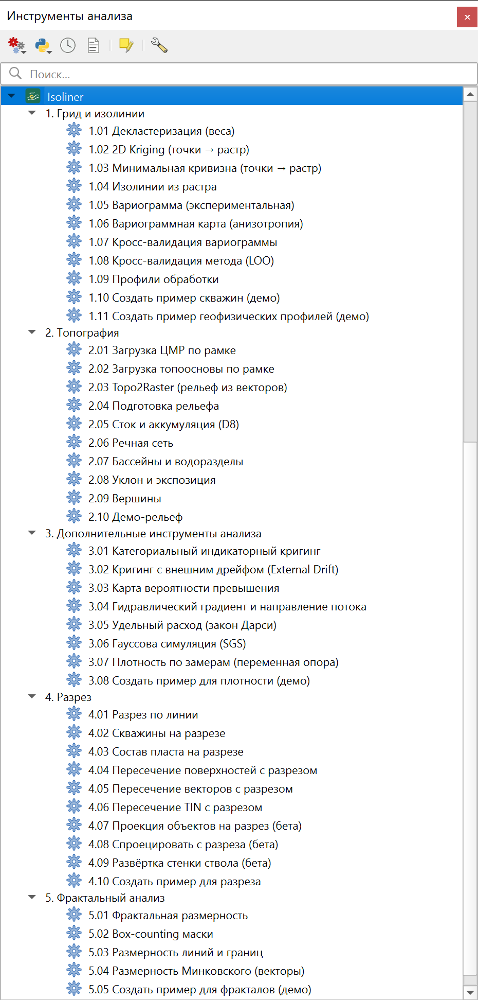
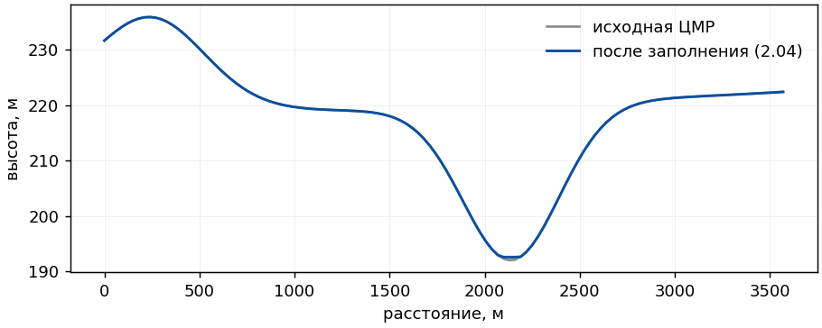
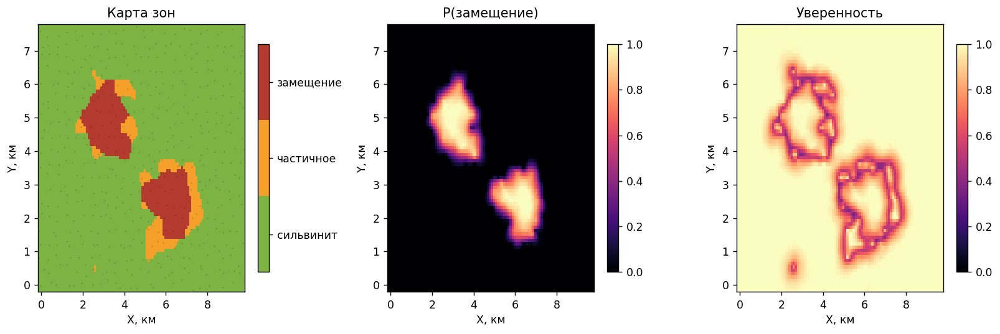
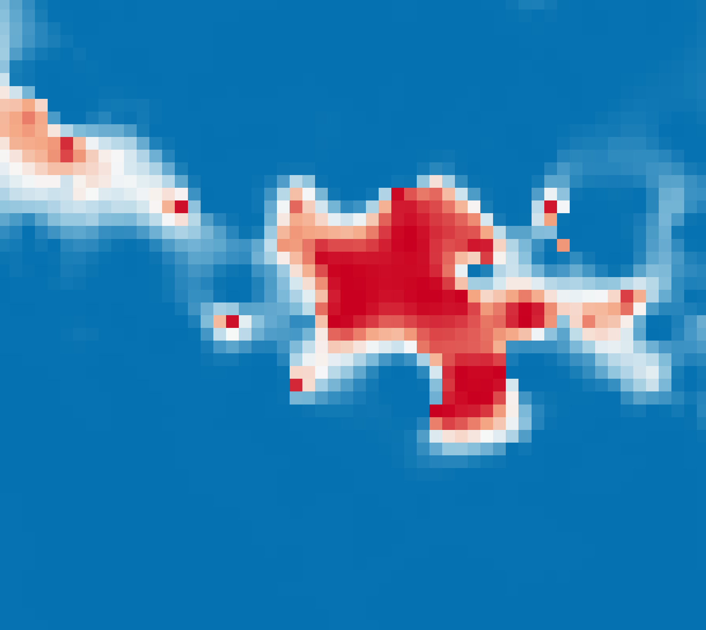
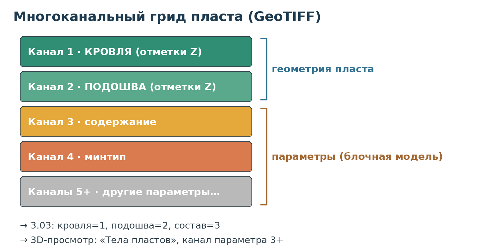

# Введение

Isoliner - провайдер инструментов Processing для интерполяции точечных данных, построения изолиний и работы с рельефом. Ядро кригинга - алгоритм KB2D из GSLIB. Инструменты разнесены по пяти группам: «Грид и изолинии» - основной поток обработки от декластеризации до изолиний, «Топография» - рельеф из открытых данных и гидрологический анализ, «Дополнительные инструменты анализа» - специализированные расчёты от индикаторного кригинга до плотности переменной опоры, «Разрез» - построение геологических разрезов, «Фрактальный анализ» - размерности поверхностей, масок и линий.

«2D Kriging (точки → растр)» - ординарный или простой кригинг по точечному слою.

«Изолинии из растра» - изолинии (линии) и контурные полигоны (пояса между изолиниями), границы которых совпадают с линиями.

«Вариограммная карта (анизотропия)» - поверхность γ(h_x, h_y) с оценкой азимута и анизотропии для учёта направленности в кригинге.

«Кросс-валидация вариограммы» - скользящий контроль (leave-one-out) для проверки и подбора параметров кригинга по ошибке, а не визуально.

«Создать пример скважин (демо)» - генерация учебного точечного слоя с пространственной структурой (кровля, мощность, содержание компонента) для обучения и проверки без реальных данных.

В группе «Дополнительные инструменты анализа» специализированные расчёты, например:

«Категориальный индикаторный кригинг» - карта вероятности классов по категориальному полю (минтип, литотип): на каждый класс строится индикатор и кригуется отдельно, на выходе растр вероятностей, карта зон и уверенность.

«Гидравлический градиент и направление потока» - по растру напора строит модуль гидравлического градиента, азимут направления потока (вниз по градиенту) и точечный слой векторов потока, который сразу оформляется стрелками. Гидрогеология без проницаемости.

Подходит для отметок пласта, мощностей, ФМС, химии и любых числовых атрибутов скважин.

Несколько терминов, которые встречаются далее. Вариограмма описывает, насколько сильнее различаются значения с ростом расстояния между точками. Силл - уровень, на который она выходит (близок к дисперсии данных). Наггет (от англ. nugget, «эффект самородка») - скачок вариограммы у нуля, то есть разброс на сколь угодно малых расстояниях, вызванный измерительным шумом и микроизменчивостью. Далее по тексту - просто «наггет».

## Установка и расположение

Основной способ - из официального репозитория QGIS. Откройте Модули → Управление и установка модулей → вкладка «Все», в поиске наберите «Isoliner», выберите плагин и нажмите «Установить». При установке из репозитория QGIS сам сообщает о выходе новых версий и обновляет плагин по кнопке.

Выбор канала растра во всех инструментах - выпадающими списками с именами каналов: у многоканального грида пласта в списках читаются «кровля», «подошва» и имена слоёв параметров.

{height=20cm}

Альтернативный способ - из ZIP-файла. Модули → Управление и установка модулей → Установить из ZIP. Это удобно для офлайн-установки и предрелизных сборок.

После установки инструменты появляются в панели «Обработка» (Processing), провайдер «Isoliner», группы «Грид и изолинии», «Топография», «Дополнительные инструменты анализа», «Разрез» и «Фрактальный анализ». Требования: QGIS 3.16+. Внешних зависимостей нет - используются NumPy, GDAL и штатные алгоритмы Processing из состава QGIS.

## Обновление

При установке из репозитория QGIS показывает уведомление о доступной новой версии - значок в строке состояния и список во вкладке «Обновляемые» менеджера модулей. Обновление выполняется одной кнопкой. При установке из ZIP новая версия ставится тем же путём, поверх старой.

Плагин корректно перезагружается «на лету», перезапуск QGIS не требуется. Для быстрой перезагрузки кода при разработке удобен модуль Plugin Reloader (кнопка «Reload a plugin…»). Выберите «Isoliner» - провайдер и все инструменты перерегистрируются сразу.

## Вызов справки

В диалоге каждого инструмента есть кнопка «Справка», открывающая это руководство (PDF в комплекте плагина). Правая панель диалога дополнительно показывает краткую подсказку по инструменту. Руководство и сведения о версии доступны и без открытия инструмента: меню **Модули** содержит подменю **Isoliner** с пунктами **О плагине** (версия, ссылки, история изменений) и **Руководство (PDF)**.

# Общая логика работы

Типовой сценарий состоит из двух шагов:

2D Kriging: по точечному слою и числовому полю Z строится растр (регулярная сетка значений).

Изолинии из растра: по полученному растру строятся изолинии и, при необходимости, залитые контурные полигоны.

Шаги независимы: «Изолинии из растра» работают с любым растром, не только с результатом кригинга.

Инструменты собраны в три группы Processing. Группа «Грид и изолинии» это основной поток обработки, от кригинга до изолиний. Группа «Дополнительные инструменты анализа» это специализированные расчёты, категориальный индикаторный кригинг, кригинг с внешним дрейфом, гидравлический градиент с направлением потока, карта вероятности превышения и удельный расход по Дарси. Группа «Разрез» это построение геологических разрезов по линии и подготовка демо-данных для них.

{width=98%}

# 1.01 Декластеризация (веса)

Инструмент готовит данные перед интерполяцией. Когда пробы сгущены неравномерно, одни блоки разбурены плотнее других, наивная глобальная статистика смещается в сторону переразведанных участков. Если гуще бурили богатые зоны, среднее и гистограмма завышены, а это прямо влияет на подсчёт запасов. Ячеистая декластеризация (порт GSLIB **declus**) даёт каждой пробе вес, обратный локальной плотности: в скоплении меньше, на отшибе больше. По взвешенным данным считается представительное декластеризованное среднее.

На поле накладывается сетка ячеек, вес пробы пропорционален единице, делённой на число проб в её ячейке, затем веса нормируются. Размер ячейки подбирается автоматически: свип по размерам, выбор по минимуму декластеризованного среднего (когда скопления пришлись на богатые зоны) либо по максимуму. Можно задать размер вручную. На регулярной сети декластеризация ничего не меняет, все веса равны.

| Параметр | Назначение | По умолчанию |
| --- | --- | --- |
| Точки со значениями | Пробы. | - |
| Поле значения (Z) | Числовое поле. | - |
| Размер ячейки | Авто (свип) или ручной. | Авто |
| Размер ячейки для ручного режима | Сторона ячейки в ручном режиме. | 0 |
| Цель свипа (Доп.) | Минимум или максимум среднего. | Минимум |
| Число размеров в свипе (Доп.) | Сколько ячеек перебрать. | 24 |
| Соотношение ячейки Y/X (Доп.) | Анизотропия ячейки. | 1 |
| Смещений начала сетки (Доп.) | Усреднение по сдвигам сетки. | 4 |
| Точки с весами | Слой точек с полем **wt**. | - |
| HTML-отчёт | Сводка, гистограмма, кривая среднего. | по умолчанию |

Выходы: слой точек с полем **wt** и HTML-отчёт со сводкой (наивное против декластеризованного среднего), гистограммой сырой против взвешенной и кривой среднего от размера ячейки. Декластеризованное среднее из журнала и отчёта ставится в **1.02** в поле **Среднее для простого кригинга**, а поле **wt** подаётся в **3.06 Гауссова симуляция** для взвешенного нормально-балльного преобразования. Ураганные пробы отсекаются отдельно, персентильным капанием в самих инструментах кригинга и кросс-валидации.

# 1.02 2D Kriging (точки → растр)

Ординарный (OK) или простой (SK) кригинг по точечному слою. Совпадающие точки (один и тот же XY) усредняются по Z. В узлах сетки значения исходных точек воспроизводятся точно (при нулевом наггете).

{width=70%}

Основные параметры:

| Параметр | Что задаёт | По умолчанию / совет |
|---|---|---|
| Точечный слой | Исходные точки (скважины) для интерполяции. | - |
| Только выделенные объекты | Считать лишь по выделенным точкам слоя. | выкл. |
| Поле значения (Z) | Числовой атрибут, который интерполируется: отметка пласта, мощность, ФМС, химия и т. п. | запоминается между запусками |
| Преобразование значения | ln для лог-нормальных величин (K, T, содержания с длинным хвостом): кригуется ln(Z), оценка возвращается через exp. | нет |
| Тип кригинга | Ординарный (OK) - локально оценивает среднее сам. Простой (SK) - использует заданное «Среднее». | OK |
| Радиус поиска | Радиус окна поиска соседних точек вокруг узла. 0 = вся выборка. | 0 (вся выборка) |
| Мин. количество точек | Если в окне меньше точек - узел остаётся пустым (nodata). | 1 |
| Макс. количество точек | Сколько ближайших точек включается в систему кригинга. | 24 |
| Размер ячейки | Шаг грида. 0 = авто = min(охват)/50. | мельче = плавнее, но дольше |
| Охват растра | Прямоугольник расчёта. По умолчанию - по слою. | по слою |
| Обрезать по контуру скважин | Растр обрезается выпуклой оболочкой всех точек - убирает экстраполяцию в пустых углах. | рекомендуется вкл. |
| Буфер оболочки | Расширить оболочку на N единиц карты наружу. | 0 |
| Маска обрезки | Свой полигон вместо оболочки (приоритетнее) - удобно для вогнутых участков. | - |
| Загрузить профиль обработки | Подставляет сохранённый профиль (наггет, структура вариограммы, отсев) поверх полей диалога. Список обновляется при открытии окна. | (не выбран) |

{width=56%}

## Автоматические значения

Размер ячейки = min(ширина, высота охвата) / 50.

Радиус корреляции вариограммы = max(ширина, высота охвата) / 3.

Радиус поиска (при 0) = диагональ охвата, то есть берётся вся выборка.

## Обрезка по контуру скважин

Кригинг считает весь прямоугольный охват, поэтому вне области данных значения являются экстраполяцией и дают артефакты (длинные «веерные» изолинии в пустых углах). Опция «Обрезать по контуру скважин» строит выпуклую оболочку всех точек (с необязательным буфером) и обрезает по ней растр. Экстраполяция исчезает. Если фактическая граница участка вогнутая, задайте свой полигон в «Маске обрезки» - он приоритетнее оболочки.

## Вариограмма и наггет

{width=85%}

Кригинг опирается на модель вариограммы - она описывает, насколько сильно различаются значения Z в двух точках в зависимости от расстояния между ними. По этой модели каждой соседней скважине назначается вес. Модель задаётся в разделе «Дополнительные параметры».

Модель вариограммы: наггет C0, силл (C0 + C) и радиус корреляции a.

### Наггет C0

Наггет - это значение, к которому стремится кривая вариограммы при расстоянии, стремящемся к нулю. Теоретически, на нулевом расстоянии расхождение должно быть нулевым (точка сравнивается сама с собой), но на практике остаётся ступенька. Она отражает то, что данные на очень малых расстояниях всё равно не совпадают: погрешность измерения и оцифровки, микроизменчивость на масштабе меньше расстояния между скважинами, расхождение дублей в одной точке.

{width=80%}

Как наггет влияет на результат:

C0 = 0 (по умолчанию) - кригинг является точным интерполятором: поверхность обязана пройти ровно через каждую скважину. Изолированная скважина с выбросом по Z превращается в конус («бычий глаз»).

C0 > 0 - кригинг перестаёт точно восстанавливать значение в точке измерений и становится сглаживателем: вблизи скважины оценка подтягивается к локальному среднему. Чем больше доля наггета C0 / (C0 + C), тем сильнее сглаживание.

C0 = весь силл (чистый наггет) - пространственная связь теряется, поверхность вырождается в простое среднее. Это перебор.

**Важно - единицы.** Наггет C0 и силл задаются в **абсолютных единицах дисперсии данных** (квадрат единиц Z), а не в долях 0-1. Значение «1» у силла по умолчанию - это условное значение, которое почти всегда нужно изменить: задайте суммарный силл (C0 + вклады структур C) **близким к дисперсии данных**. Уровень сглаживания определяет не абсолютная величина наггета, а его **доля в силле** C0 / (C0 + C). Практический порядок: возьмите суммарный силл ≈ дисперсии, затем наггет = 0.2-0.4 от него (то есть 0.2-0.4 × дисперсии - абсолютное число, а не 0.2-0.4 как таковое). Чем меньше наггет, тем больше деталей, но и больше локальных пиков. Чем больше, тем поверхность ровнее, но возможно сглаживание реальной структуры. Дисперсию данных инструмент печатает в Журнал при запуске - это и есть ваш ориентир для выбора силла.

### Структуры, радиус и анизотропия

Силл (полка) это уровень, на который выходит вариограмма. Он складывается из наггета C0 и вклада структуры C. Структура задаётся моделью (сферическая, экспоненциальная, гауссова или степенная), порогом C, радиусом a, азимутом и анизотропией.

**Силл: смысл и порядок величины.** Силл - это верхний предел различий между точками: насколько в среднем отличаются далёкие друг от друга скважины. Он практически равен обычной дисперсии данных. Пример по KCl: среднее ≈ 25 %, дисперсия ≈ 47.6 (%²), то есть σ ≈ 6.9 %. Значит, суммарный силл задаём ≈ 47.6. Если наггет C0 ≈ 17 (примерно 0.35 силла), то структурный вклад первой структуры C ≈ 47.6 − 17 ≈ 30. На сам грид абсолютный масштаб не влияет - для оценок важно только отношение C0 : C. Но он нужен, чтобы карта стандартной ошибки и MSDR в кросс-валидации были в реальном масштабе (суммарный силл ≈ дисперсии → MSDR ≈ 1). Поэтому: не оставляйте силл = 1 по умолчанию, поднимите его до дисперсии данных.

**Выбор модели.** Сферическая и экспоненциальная подходят для большинства задач. Степенная модель не имеет силла и радиуса в обычном смысле: её применяют, когда изменчивость растёт с расстоянием и не выходит на полку (нестационарность приращений), поля порога и радиуса для неё условны. Гауссову модель применяйте осторожно: при нулевом или очень малом наггете она даёт численно неустойчивую систему и артефакты (осцилляции, отрицательные веса). Поэтому при выборе гауссовой модели инструмент принудительно удерживает небольшой минимальный наггет. По возможности задавайте его и сами.

**Тип данных и режим.** Под разные данные нужны разные настройки. Гладкие структурные поверхности (отметки кровли и подошвы, мощности) лучше моделировать длинным радиусом или степенной моделью при широком (глобальном, 0) радиусе поиска - тогда поверхность получается гладкой. Короткий радиус с локальным поиском на таких данных даёт «бычьи глаза» и разрывы оценки при смене состава соседних скважин. Для концентраций и химии (ФМС, газоопасность) кригинг работает в своём праве: здесь важны корректный наггет и, при сильной асимметрии распределения, преобразование данных (см. ниже про ураганные пробы).

Радиус корреляции a - расстояние, на котором вариограмма выходит на полку. Дальше этого расстояния точки практически не влияют друг на друга. При 0 берётся автоматическое значение max(охват)/3.

Анизотропия задаётся азимутом главной оси и отношением радиусов (малая/главная). Значение 1 - изотропно (влияние одинаково во всех направлениях). Значение меньше 1 укорачивает корреляцию поперёк главной оси - полезно для вытянутых геологических структур.

{width=70%}

| Параметр | Что задаёт | По умолчанию / совет |
|---|---|---|
| Среднее для простого кригинга | Используется только при типе SK. | 0 |
| Наггет C0 | «Шум»/скачок вариограммы у нуля. Подавляет локальные пики. В абсолютных единицах дисперсии. | 0. Для сглаживания 0.2-0.4 от силла |
| Структура i · модель | Форма вариограммы: сферическая, экспоненциальная, гауссова, степенная. | сферическая |
| Структура i · порог/вклад C | Вклад структуры в силл (абс. единицы дисперсии). Сумма C0+C ≈ дисперсии данных. Для структур 2 и 3: 0 = выкл. | стр. 1 = 1 (замените на ≈ дисперсию) |
| Структура i · радиус корреляции a | Дистанция выхода на полку. 0 = авто = max(охват)/3. | 0 (авто) |
| Структура i · азимут, ° | Направление главной оси анизотропии. | 0 |
| Структура i · анизотропия (малая/главная) | Отношение радиусов поперёк/вдоль оси. 1 = изотропно. | 1 |

&nbsp;

{width=85%}

Так схема выглядит на реальных данных. Вариограмму строят по скважинам: для пар точек считают полудисперсию и усредняют по расстояниям - получается облако (зелёные точки), под которое подбирают модель (кривая). По нему и задают параметры кригинга: высота «скачка» у нуля - наггет C0, полка - силл (обычно близок к дисперсии данных), расстояние выхода на полку - радиус a. Если на больших расстояниях точки уходят выше силла, как здесь, - это региональный тренд (нестационарность). Его либо учитывают отдельно, либо ограничивают радиус поиска.

## Отсев ураганных проб

Ураганные пробы - аномально высокие (или ошибочные) значения, которые искажают оценку: несколько «бонанц» по содержанию могут перетянуть на себя всю карту грейда, а явные ошибки (например, отрицательная мощность) портят поверхность. Инструмент «2D Kriging» позволяет ограничить такие пробы прямо при расчёте, без правки исходных данных. Параметры - в разделе «Дополнительно».

Отсев и срезка - грубый практичный инструмент против явных ошибок. Для концентраций и химии будьте осторожны: экстремальные значения часто не шум, а сигнал (например, очаги загрязнения), и слепо обрезать хвосты распределения не стоит. Для сильно асимметричных данных корректнее не обрезать пробы, а преобразовать их к близкому к нормальному виду (логарифм, Box-Cox) или применять индикаторный кригинг - это уже за рамками отсева, но именно так обходятся с тяжёлыми хвостами в геостатистике руд и загрязнений.

{width=98%}

**Два режима. **«Удалить» - пробы вне допустимого диапазона выбрасываются (для явно битых записей). «Срезать (capping)» - значения вне диапазона прижимаются к границе, а сама точка остаётся в расчёте. Срезка - классический приём для ураганных проб по содержанию: положение точки не теряется, но её влияние ограничивается. Режим переключается флажком «Срезать к границе (capping) вместо удаления».

**Границы по абсолюту. **«Нижняя граница» и «Верхняя граница» задают пороги в единицах Z напрямую. Пустое поле - граница не задана. Они приоритетнее перцентиля. Пример: для мощности поставьте нижнюю границу 0 - уйдут отрицательные значения, верхнюю, скажем, 30 - уйдёт явный выброс в 122 м.

**Границы по перцентилю. **p-й перцентиль - это значение, ниже которого лежит p% всех проб. Например, 5-й перцентиль - порог, ниже которого только 5% самых малых значений. 95-й - порог, выше которого 5% самых больших. Параметр «перцентиль обрезки, %» задаёт значение p, и границы берутся симметрично: от p-го до (100−p)-го перцентиля. То есть p = 2 означает «считать ураганными 2% самых низких и 2% самых высоких проб»: всё ниже 2-го и выше 98-го перцентиля либо удаляется, либо срезается. Чем больше p, тем агрессивнее обрезка. P = 0 выключает перцентильный режим. Удобство в том, что абсолютные пороги знать не нужно - они вычисляются по самим данным и подходят к любому распределению и масштабу.

**Двусторонность - важно для химии. **Перцентильный режим режет оба хвоста - и верхний, и нижний. Для содержаний это опасно: KCl = 0 в зонах замещения - реальная геология, и обрезка нижнего хвоста ошибочно поднимет «пустые» участки. Поэтому для грейда отсекайте только сверху: оставьте «Нижнюю границу» пустой и задайте «Верхнюю» абсолютом (или применяйте перцентиль, понимая, что низ тоже будет затронут). Для отметок и мощностей двусторонняя обрезка обычно уместна.

**Порядок и журнал. **Фильтр применяется до усреднения совпадающих точек. В Журнал инструмента выводится, сколько проб удалено или срезано и в каких границах - это удобно для контроля.

## Стандартная ошибка кригинга

{width=66%}

Кроме самой оценки, кригинг даёт в каждом узле дисперсию ошибки - меру неопределённости. Её корень, стандартная ошибка, выводится необязательным вторым растром (параметр «Стандартная ошибка кригинга» инструмента «2D Kriging»). Единицы - те же, что у интерполируемой величины Z.

Ключевое свойство: стандартная ошибка зависит от геометрии расположения скважин и модели вариограммы, но не от самих значений Z. Поэтому это карта надёжности сети наблюдений, а не разброса данных. В точке скважины (при нулевом наггете) ошибка равна нулю - там значение известно точно. По мере удаления от скважин она растёт, а в областях без данных достигает максимума (примерно корень из силла).

**Как читать. **Тёмные (малые) значения - оценке можно доверять: рядом достаточно скважин. Светлые (большие) - оценка держится на далёких точках, фактически экстраполяция. Это первые кандидаты на доразведку. Сравнивать удобнее относительно (где больше, где меньше), потому что абсолютная величина зависит от масштаба вариограммы (силла S1_SILL).

**Важно. **Это модельная оценка: она верна настолько, насколько верна заданная вариограмма (наггет, радиус, анизотропия). При наггете больше нуля ошибка у скважин не нулевая - наггет задаёт нижний «пол» неопределённости. Строгим доверительным интервалом стандартная ошибка не является, но как относительная карта неопределённости очень полезна.

**Оформление. **Задайте слою градуированную символику по значению (например, от тёмного к красному) - и сразу видно, где карта надёжна, а где нет.

## Снятие тренда (регрессия-кригинг)

Обычный кригинг оценивает среднее локально, по окну поиска, поэтому плавно меняющееся по площади среднее он отслеживает сам. Сложность возникает, когда у поля есть выраженная региональная составляющая, например общее падение пласта на участке. Тогда экспериментальная вариограмма сырого значения раздувается: радиус завышен, порога нет, форма напоминает степенную модель, и подобрать устойчивую модель трудно.

Флажок **Снять полиномиальный тренд** убирает региональную составляющую методом наименьших квадратов перед кригингом. Дальше кригуются остатки, а тренд добавляется к оценке обратно. Вариограмма остатков возвращается к нормальному виду: выходит на порог с наггетом, и радиус отражает истинный масштаб корреляции, а не размах тренда. Поле **Степень тренда** задаёт плоскость или квадратичную поверхность.

Список **Преобразование значения** добавляет логарифмирование для величин с разбросом на порядки, таких как коэффициент фильтрации или водопроводимость. При выборе **ln** кригуется натуральный логарифм значения, а оценка возвращается обратно через экспоненту. Это медианная, геометрическая оценка, корректная для лог-нормальных полей. Стандартная ошибка пересчитывается в исходные единицы. Логарифм избавляет от ручного создания поля ln в калькуляторе и применяется только к положительным значениям. Вариограмму и наггет при включённом логарифме задавайте в единицах ln.

{width=85%}

Снятие тренда помогает там, где падение однородно, в пределах одного рудника или локального участка. На всю площадь месторождения сразу его применять не стоит. Соседние блоки разнесены по высоте, единый полином описывает их плохо, а локальный кригинг и без того держит меняющееся среднее, поэтому снятие глобального тренда там скорее вредит. Уместность видна по вариограмме. Если у сырого значения радиус сопоставим с размером участка и нет внятного порога, тренд есть и его стоит снять. Если вариограмма сырого значения уже выходит на порог с малым наггетом, снимать нечего.

Степени 1 обычно достаточно. Степень 2 описывает изгиб, но может вобрать в тренд часть реальной структуры, поэтому после её применения посмотрите на вариограмму остатков. Если порог и наггет стали выражены хуже, вернитесь к степени 1. Тот же флажок есть в инструменте **Кросс-валидация вариограммы**, там тренд переподбирается на каждом шаге контроля, и выигрыш или проигрыш от снятия тренда виден прямо по RMSE.

Вариограмму после снятия тренда задавайте по остаткам. Растр стандартной ошибки в этом режиме это ошибка кригинга остатков, тренд считается детерминированным и собственной погрешности к ней не добавляет.

## Блочный кригинг

Обычный кригинг оценивает значение в точке, в центре ячейки грида. Но в горном деле чаще нужна не точечная отметка, а среднее по площади, по блоку отработки, панели или ячейке подсчёта запасов. Содержание полезного компонента в блоке это среднее по его площади, и оценивать его как значение в одной точке не вполне корректно. Для этого служит флажок **Блочный кригинг**.

Включённый режим оценивает среднее по ячейке грида, а не значение в её центре. Ячейка мысленно разбивается на сетку точек размером N×N, количество задаёт поле **Дискретизация блока, N×N на ячейку**, и ковариации в системе кригинга усредняются по этим точкам. Так система решается не для одной точки, а сразу для всего блока. Это классическая схема блочного кригинга GSLIB.

У блочной оценки два следствия, оба полезные для подсчёта запасов. Поверхность получается глаже точечной, потому что усреднение по блоку гасит мелкие колебания. И стандартная ошибка кригинга выходит ниже точечной, потому что среднее по площади оценивается надёжнее, чем значение в одной точке. Расплата одна. Блочный кригинг не воспроизводит пробы в узлах точно. Среднее по блоку, даже центрированному на скважине, не равно значению в самой скважине, и это закономерно.

Дискретизации 4×4 хватает почти всегда. Большее N считается дольше, а точность растёт незначительно. При N равном единице блочный кригинг вырождается в точечный, поэтому минимальное значение поля равно двум, а сам режим по умолчанию выключен.

Блочный кригинг сочетается со снятием тренда. Кригуются остатки по блоку, а тренд добавляется к оценке обратно. Сочетается он и со сглаживанием грида, но обычно одного блочного усреднения достаточно и дополнительное сглаживание не нужно.

# 1.03 Минимальная кривизна (точки → растр)

Инструмент строит грид методом минимальной кривизны. Поверхность ведёт себя как тонкая упругая пластина, проходящая через данные с минимумом изгиба, то есть решение бигармонического уравнения. Метод неточный: данные воспроизводятся приближённо, зато поверхность получается максимально гладкой, поэтому его традиционно берут для карт геофизических полей и любых плавных величин. Это детерминированная альтернатива кригингу без подбора вариограммы. Кригинг, в отличие от него, даёт оценку с картой стандартной ошибки.

**Натяжение** подмешивает мембранный член: при 0 это чистая минимальная кривизна, при 1 - натянутая мембрана, у которой меньше выбросов между пробами. Натяжение на границе задаётся отдельно и помогает убрать краевые перелёты. Решение итеративное, методом верхней релаксации (SOR) с обходом сетки девятью цветами: узлы одного цвета не попадают в расчётный шаблон друг друга, поэтому обновляются разом и устойчиво. Сетка пересчитывается, пока наибольшее изменение узла не станет меньше **порога невязки** или не исчерпается число итераций.

Свободные узлы стартуют с ближайшего значения данных, поэтому на плотных данных сходимость быстрая. На очень разрежённых данных итераций нужно больше: увеличьте их лимит или порог невязки. Faults и breaklines (разрывы и структурные линии) в этой версии не поддерживаются, это задел на будущее.

| Параметр | Назначение | По умолчанию |
| --- | --- | --- |
| Точечный слой | Пробы со значением. | - |
| Поле значения (Z) | Числовое поле для интерполяции. | - |
| Охват | Прямоугольник результата. | по слою |
| Размер ячейки | 0 - авто, min(охват)/50. | 0 |
| Натяжение | 0 - минимальная кривизна, 1 - мембрана. | 0 |
| Порог невязки | 0 - авто, 0.01 процента размаха данных. | 0 |
| Максимум итераций | Потолок числа проходов SOR. | 100000 |
| Натяжение на границе (Доп.) | Натяжение на краю сетки. | 0 |
| Коэффициент релаксации (Доп.) | Ускорение SOR, разумно 1.5 - 1.9. | 1.85 |
| Анизотропия (Доп.) | Отношение осей Y/X в мембранном члене. | 1 |
| Грид (минимальная кривизна) | Выходной растр. | - |

Выход - обычный грид, готовый для **1.04 Изолинии из растра**. В журнал выводятся размер сетки, число узлов-данных, число итераций и итоговая невязка. Если достигнут потолок итераций, а невязка выше порога, инструмент об этом предупреждает.

# 1.04 Изолинии из растра

Строит изолинии (линии) и, по умолчанию, контурные полигоны. Уровни задаются равномерным шагом или явным списком. Параметры:

| Параметр | Что задаёт | По умолчанию / совет |
|---|---|---|
| Растр | Входной растр (например, результат кригинга). | - |
| Шаг изолиний | Равномерный шаг по Z. 0 = задать «Явные уровни». | - |
| Начальный уровень (offset) | Привязка сетки уровней (уровни кратны шагу от offset). | 0 |
| Явные уровни | Список уровней через пробел. Приоритетнее шага. Десятичный разделитель - запятая или точка. | - |
| Главная изолиния каждая N-я | Каждая N-я линия помечается is_index = 1 (для утолщения). 0 = выкл. | 5 |
| Мин. длина линии | Отбрасывать линии короче порога (ед. карты). 0 = без фильтра. | - |
| Бикубическое сглаживание | Сгущение грида (×2…×4) бикубической интерполяцией перед контурингом - основной способ сглаживания изолиний, убирает «октагоны» от грубой сетки. Работает и для линий, и для полигонов. выкл. = без сгущения. | выкл. (×4 на грубом гриде) |
| Скругление линий (Chaikin), итераций | Дополнительное лёгкое скругление линий (Chaikin). Слабее бикубического сглаживания, обычно не нужно, если оно включено. 0 = выкл. | 2 |
| Имя поля значения | Имя атрибута уровня в выходных линиях. | ELEV |
| Канал (доп.) | Номер канала входного растра. | 1 |
| Изолинии / Контурные полигоны | Выходные слои. Полигоны строятся по умолчанию во временный слой. | - |

Выходные поля:

| Слой | Поле | Тип | Что содержит |
|---|---|---|---|
| Изолинии | ELEV | число | Значение уровня линии (имя задаётся полем **Имя поля значения**). |
| Изолинии | is_index | целое | 1 у главных изолиний (каждая N-я), иначе 0 - для утолщения. |
| Контурные полигоны | ELEV_MIN | число | Нижний уровень пояса. |
| Контурные полигоны | ELEV_MAX | число | Верхний уровень пояса. |

## Сглаживание изолиний

Основной способ сгладить изолинии в этом инструменте - **бикубическое сглаживание**: грид перед контурингом сгущается бикубической интерполяцией (×2…×4), и контуры строятся по более мелкой сетке. На грубом гриде изолинии иначе выглядят «октагонами» (вершины ставятся по краям ячеек) - сгущение убирает эту угловатость топологически чисто. Реализовано в чистом NumPy, без внешних зависимостей. Nodata-границы и внутренние «окна» данных сохраняются. Сгущение действует и на линии, и на контурные полигоны - границы поясов при этом совпадают с изолиниями. Цена - больше ячеек (×4 = в 16 раз больше), поэтому на очень крупном гриде начните с ×2.

Дополнительно есть лёгкое скругление линий алгоритмом **Chaikin** (количество итераций). Оно слабее бикубического и обычно не требуется, если сгущение включено. Имеет смысл как быстрая альтернатива на грубом гриде, когда сгущать не хочется.

Сглаживание самого поля (гауссово, по растру) - это отдельная операция, она выполняется не здесь, а в инструменте «2D Kriging»: там оно идёт по гриду до контуринга и убирает не угловатость, а бугристость поля («бычьи глаза» вокруг скважин). Бикубическое сглаживание и гауссово сглаживание поля дополняют друг друга: первое лечит угловатость сетки, второе - бугристость данных. Контурный растр кригинга при этом не меняется - сглаживается лишь временная копия.

## Контурные полигоны (пояса)

Контурные полигоны - это залитые пояса между соседними изолиниями. Они строятся не классификацией «ступенек» растра, а полигонизацией самих сглаженных изолиний вместе с контуром валидной области растра: концы линий притягиваются к контуру, сеть нодируется и полигонизуется. Диапазон уровней каждого пояса определяется выборкой растра в репрезентативной точке полигона.

Благодаря этому границы полигонов совпадают с изолиниями, а покрытие сплошное (без дыр). Полигоны несут поля ELEV_MIN и ELEV_MAX. По умолчанию они строятся во временный слой. Чтобы их не строить, очистите поле «Контурные полигоны».

## Оформление слоёв

Линии: задайте символику по правилу на основе is_index - главным изолониям (is_index = 1) дайте бóльшую толщину. Подпись - по полю уровня (ELEV).

Полигоны создаются с одним символом. Для заливки по диапазонам задайте градуированную символику по ELEV_MIN (или ELEV_MAX).

Слой изолиний автоматически помещается над слоем полигонов, чтобы линии были видны поверх заливки.

# 1.05 Вариограмма (экспериментальная)

Инструмент строит по точкам экспериментальную полувариограмму, при необходимости подбирает по ней модель и выдаёт HTML-отчёт с графиком. Он не считает грид и не входит в расчётную цепочку кригинга напрямую. Его задача диагностическая: показать структуру пространственной изменчивости данных и помочь задать параметры вариограммы осознанно, по виду облака, а не на глаз.

## Зачем нужен предпросмотр

Кригинг опирается на модель вариограммы: наггет, порог и радиус. От них зависят веса при интерполяции и карта стандартной ошибки. Соблазнительно поручить подбор этих чисел автоматике и не думать о них. На кластеризованной разведочной сети это опасно. Скопления близких скважин дают огромное количество пар на коротких расстояниях и придавливают ближнюю часть вариограммы, поэтому автоподбор по такому облаку легко выдаёт уверенно неправильный наггет. Предпросмотр снимает эту проблему: геолог видит само облако пар, понимает, где данных много, а где мало, и подгоняет модель с пониманием того, что под ней лежит.

Поэтому подбор модели в инструменте дан как рекомендация, а не как готовый результат. Числа, которые он предлагает, разумно сверить с видом графика и только потом переносить в кригинг.

## Краткая теория

Полувариограмма описывает, насколько статистически связаны значения параметра в двух точках в зависимости от расстояния между ними. Для пары точек, разнесённых на расстояние h, берётся половина квадрата разности их значений (полудисперсия приращения). Эти величины усредняются по интервалам расстояния (лагам), и получается кривая γ(h). Это мера не «средней разницы» значений, а статистической надёжности предсказания значения по соседу: чем меньше γ, тем теснее связь.

У типичной кривой три характеристики. «Наггет» C0 это значение, к которому стремится γ при стремлении расстояния к нулю. Он отражает изменчивость на масштабе мельче, чем шаг сети, плюс ошибку измерения. «Порог» это уровень, на который кривая выходит на больших расстояниях. Полный порог равен сумме наггета и структурных вкладов и в идеале близок к дисперсии данных. Радиус (a) это расстояние, на котором кривая выходит на порог - то есть на котором пространственная корреляция спадает практически до нуля. Дальше этого расстояния точки статистически не связаны. Для экспоненциальной и гауссовой моделей порог достигается асимптотически, поэтому радиус для них - эффективный.

Наггет и вклады в инструменте заданы в абсолютных единицах дисперсии параметра, а не долями от единицы. Ориентир для полного порога это дисперсия данных, которая выводится в сводке отчёта.

## Параметры

| Параметр | Что задаёт | По умолчанию / совет |
|---|---|---|
| Точки со значениями | Входной точечный слой. | - |
| Поле значения Z | Атрибут, по которому строится вариограмма. | - |
| Поле группировки (доп.) | Раздельные вариограммы по категориям (например, вид разведки). | - |
| Поле весов декластеризации (доп.) | Веса из 1.01 для взвешенной оценки. | - |
| Количество лагов | Число интервалов расстояний. | - |
| Максимальное расстояние | Верхняя граница расстояний. 0 = половина диагонали охвата. | 0 |
| Подобрать модель | Автоподбор модели по экспериментальным точкам (рекомендуется). | вкл. |
| Модель для подбора (доп.) | Тип модели: сферическая, экспоненциальная, гауссова, степенная. | - |
| Устойчивая оценка (доп.) | Оценка Кресси-Хокинса, менее чувствительна к выбросам. | выкл. |
| Ураганные пробы: перцентиль обрезки (доп.) | Отсев экстремальных значений по перцентилю. 0 = выкл. | 0 |
| Срезать к границе вместо удаления (доп.) | Capping: экстремум срезается к порогу, а не удаляется. | выкл. |
| Сохранить профиль под именем | Имя профиля «вариограмма + отсев» для подстановки в кригинг. Пусто = не сохранять. | - |
| Таблица вариограммы | Выход: лаг, значение γ, количество пар. | - |
| Отчёт (HTML) | Выход: график облака пар и модели. | - |

| Параметр | Что задаёт | По умолчанию / совет |
|----------|-----------|----------------------|
| Точки со значениями | Точечный слой со скважинами или пробами. | - |
| Поле значения Z | Числовой атрибут для анализа: отметка пласта, мощность, содержание. | запоминается между запусками |
| Поле группировки (необяз.) | Строит отдельную кривую для каждого значения поля (напр. вид разведки) и накладывает их на один график. | выкл. |
| Количество лагов | На сколько интервалов расстояния разбивается облако пар. | 15 |
| Максимальное расстояние | Дальний край вариограммы, в единицах слоя (для метровых координат - метры). 0 = половина диагонали охвата. | 0 |
| Подобрать модель (рекомендация) | Автоподбор наггета, порога, радиуса и типа модели, результат запоминается для подстановки в «2D Kriging». | вкл. |
| Модель для подбора (доп.) | Зафиксировать тип модели или оставить автовыбор лучшей по R². | Авто |
| Минимум точек в группе, % (доп.) | Группы мельче порога не строятся и перечисляются в журнале. Пол - 30 точек. | 2 |
| Устойчивая оценка (Кресси-Хокинса) (доп.) | Снижает влияние редких аномальных пар. | выкл. |
| Показать облако пар (доп.) | Добавляет на график исходные пары до усреднения. | выкл. |
| Наложить заданную модель вариограммы (доп.) | Рисует поверх облака модель с заданными вручную наггетом, порогом и радиусом - удобно сравнить свою модель с данными. | выкл. |
| Ураганные пробы (доп.) | Перцентиль обрезки, нижняя и верхняя границы значения, режим срезания к границе вместо удаления. В самом конце списка. | выкл. |
| Сохранить профиль под именем | Если заполнить - подобранная (изотропная) модель и текущий отсев сохраняются как профиль обработки под этим именем. | пусто |
| Таблица вариограммы | Выходной слой-таблица с точками вариограммы (столбцы ниже). | временный слой |
| Отчёт (HTML) | Отчёт с облаком, подобранной кривой и линией дисперсии данных. | временный файл |

Параметры с пометкой «доп.» лежат в свёрнутом разделе **Дополнительные параметры**.

На выходе формируется **Отчёт (HTML)** с графиком, подобранной кривой и линией дисперсии данных, а также необязательная **Таблица вариограммы** - точки экспериментальной вариограммы в виде слоя без геометрии (по строке на каждый лаг каждой серии). По ней можно построить свой график в QGIS или выгрузить значения. Её столбцы:

| Поле | Тип | Что содержит |
|------|-----|--------------|
| **series** | строка | Серия: «все точки» либо значение поля группировки, если оно задано. |
| **lag** | дробное | Среднее расстояние между точками в интервале (лаге), в единицах слоя. |
| **gamma** | дробное | Полудисперсия γ(h): среднее половины квадрата разностей значений по парам этого лага (или устойчивая оценка Кресси-Хокинса, если она включена). |
| **npairs** | целое | Количество пар точек, попавших в лаг. Малое количество пар - точка вариограммы ненадёжна. |

## Поле группировки и разноплотностная разведка

Необязательное **Поле группировки** строит отдельную вариограмму для каждого значения поля и накладывает их на один график. Это нужно, когда выборка собрана сетями разной природы и плотности, например поверхностной и подземной разведкой. Подав в группировку вид разведки, можно увидеть, общая ли у этих совокупностей структура или у каждой своя.

Смешение разноплотностных сетей не создаёт артефактов само по себе, но искажает общую вариограмму. Плотная сеть даёт много пар на коротких лагах и формирует ближнюю часть кривой, редкая сеть работает на дальних. Одна модель, натянутая на такое облако, оказывается смесью двух структур и не описывает корректно ни одну. Группировка эту смесь показывает, и решение, законно ли объединять совокупности, остаётся за геологом. Декластеризация к облаку пар при этом не применяется. Её веса предназначены для исправления гистограммы и среднего, а не для пар вариограммы, где каждая пара полноправна независимо от плотности сети.

{width=70%}

## Три типичные геологические ситуации

Отметки залегания, мощности и содержания полезного компонента имеют разные геостатистические характеристики, и полезно видеть их рядом. На иллюстрации показаны вариограммы трёх параметров одного промышленного пласта, рассчитанные в едином окне расстояний.

{width=98%}

Отметка кровли это гладкая поверхность. Наггет почти нулевой, радиус большой, модель близка к гауссовой, качество подбора очень высокое. Соседние скважины дают почти одинаковую отметку, изменчивость крупномасштабная. Кригинг работает уверенно. Здесь есть тонкость: гауссова модель с почти нулевым наггетом численно неустойчива и даёт на карте характерные «бычьи глаза». Небольшой наггет стоит задать вручную.

Мощность это промежуточный случай. Наггет составляет заметную долю порога, радиус средний, модель чаще сферическая. Около половины изменчивости структурная, половина мелкомасштабная. Это типичная рабочая вариограмма.

Содержание полезного компонента самый шумный параметр. Наггет сопоставим со структурным вкладом или превышает его, кривая поднимается медленно, качество подбора ниже, и модель плохо отличается от соседних типов. Основная изменчивость сидит на масштабе мельче сети опробования. Кригинг такой параметр сильно сглаживает, а кросс-валидация показывает большую ошибку. Содержание предсказуемо хуже, чем отметки и мощности, и это нормально.

## Максимальное расстояние и выход на плато

Самая частая ошибка это слишком большое максимальное расстояние. Если оставить автоматическое значение в половину диагонали, на вытянутом месторождении окно растягивается на десятки километров. Лаги начинают связывать точки через безрудные провалы и межблоковые разрывы, вариограмма ловит региональный тренд вместо локальной структуры, а подбор выдаёт радиус больше самого окна и порог в разы выше дисперсии. Признак беды простой: радиус подобранной модели сопоставим с окном или превышает его. Это значит, что кривая не вышла на плато и порог получен экстраполяцией.

Лечится это уменьшением максимального расстояния до локального масштаба и проверкой, что вариограмма успела выйти на полку. На примере содержания одного пласта при окне 6 километров подбор давал радиус около 9 километров и порог ниже дисперсии, то есть кривая ещё не вышла на плато. При окне 12 километров она вышла, дав радиус около 18 километров и полный порог, близкий к дисперсии данных. Реальный радиус корреляции оказался больше, чем виделось в узком окне, и правильный ответ дала именно проверка на выход кривой на плато.

При этом окно не должно перешагивать крупные безрудные зоны. На разведочной сети их видно по падению плотности точек, и вариограмму следует строить в пределах одного рудного блока, иначе локальная геология смешивается с региональной тектоникой.

## Рабочий цикл с кросс-валидацией

Вариограмма даёт стартовую модель, а проверяет её **Кросс-валидация вариограммы**. Порядок такой. Сначала строится экспериментальная вариограмма с максимальным расстоянием, при котором кривая выходит на плато, и снимаются подобранные наггет, вклад, радиус и модель. Затем эти числа переносятся в кросс-валидацию и оцениваются метрики скользящего контроля. Подобранную и проверенную модель удобно сохранить как **профиль обработки** (поле **Сохранить профиль под именем**) и подставить её в **2D Kriging** полем **Загрузить профиль обработки** - см. раздел про инструмент «Профили обработки».

Среднее смещение ME должно быть около нуля, это значит, что систематической ошибки нет. Среднеквадратичная ошибка RMSE показывает абсолютную точность. Отдельного внимания заслуживает MSDR, отношение квадрата ошибки к дисперсии кригинга. Если оно заметно больше единицы, кригинг недооценивает неопределённость и карта стандартной ошибки занижена.

Правка MSDR делается точно, а не на глаз. В ординарном кригинге домножение всей вариограммы на постоянный множитель не меняет оценки, поскольку веса зависят только от формы кривой, а не от её масштаба. Меняется лишь дисперсия кригинга. Поэтому достаточно умножить наггет и вклады на текущее значение MSDR, оставив радиус и модель прежними, и повторить кросс-валидацию. Метрики ME, MAE, RMSE и R при этом не сдвигаются, а MSDR приходит к единице, и карта ошибки становится достоверной.

После масштабирования полный порог может оказаться выше дисперсии данных. На кластеризованной сети это не ошибка. Наивная дисперсия занижена, потому что плотные скопления скважин её перетягивают, а истинная разброска по площади больше. Превышение порога над дисперсией здесь следствие неравномерной сети.

Готовую и проверенную модель остаётся перенести в **2D Kriging** для расчёта грида, а дальше при необходимости в **Изолинии из растра**.

Если данные сгущены неравномерно, задайте необязательное поле весов **wt** из инструмента **1.01 Декластеризация**. Тогда каждая пара точек берётся с весом, равным произведению весов её концов, и скопления не раздувают ближние лаги. Счётчик пар в отчёте показывает сырое число пар, а сама γ считается взвешенно.

# 1.06 Вариограммная карта (анизотропия)

Инструмент строит вариограммную карту - поверхность полудисперсии γ как функцию двумерного вектора разноса (h_x, h_y). Обычная вариограмма усредняет все направления в одну кривую и направленность теряет. Карта же показывает, как непрерывность параметра зависит от направления. По ней видно, есть ли в данных анизотропия и куда смотрит ось максимальной непрерывности. Инструмент диагностический: грид он не считает, а помогает осознанно задать азимут и анизотропию в структуре вариограммы «2D Kriging».

## Что такое анизотропия и зачем её видеть

Изотропная вариограмма предполагает, что связь значений зависит только от расстояния между точками, но не от направления. Для складчатых и вытянутых геологических тел это не так. Вдоль простирания пласт выдержан, поперёк меняется быстрее: та же разница в отметках кровли набирается вдоль складки на километры, а вкрест - на сотнях метров. Если этого не учесть, кригинг сглаживает поле одинаково во все стороны и размывает реальную вытянутость структуры.

Вариограммная карта вскрывает направленность напрямую. Для каждой пары точек берётся не только расстояние, но и направление вектора между ними, и полудисперсия приращения раскладывается по двумерной сетке лагов. Там, где γ растёт медленно и карта остаётся тёмной далеко от центра, непрерывность высокая. Там, где γ растёт быстро, непрерывность низкая. Область низкой γ в сумме вытягивается в эллипс, длинная ось которого и есть направление максимальной непрерывности - для складчатости это направление простирания.

## Как читать карту

В центре карты лежит нулевой лаг: значение в точке всегда равно само себе, поэтому γ здесь равна нулю и центр самый тёмный. По мере удаления от центра точки разносятся всё дальше и γ растёт. Ось h_x направлена на восток, ось h_y на север, масштаб по обеим осям одинаковый. Карта точечно-симметрична: пара и её зеркальное отражение дают одну и ту же полудисперсию, поэтому рисунок одинаков в противоположных направлениях.

Анизотропия читается по форме тёмной зоны. Если она круглая - структура изотропна, направление роли не играет. Если вытянута - вдоль её длинной оси γ нарастает медленнее, то есть в этом направлении значения связаны на большем расстоянии. Поверх карты рисуются подсказки: белый эллипс по оценённым радиусам и красная пунктирная линия по главной оси.

{width=80%}

## Параметры

| Параметр | Что задаёт | По умолчанию / совет |
|----------|-----------|----------------------|
| Точки со значениями | Точечный слой со скважинами или пробами. | - |
| Поле значения Z | Числовой атрибут для анализа: отметка пласта, мощность, содержание. | запоминается между запусками |
| Бинов на полуось (детализация карты) | На сколько ячеек делится каждая полуось лага. Карта получается размером (2N+1)×(2N+1). Больше бинов - детальнее карта, но меньше пар в ячейке и больше шума. | 15 |
| Макс. лаг, в единицах слоя | Размер окна карты, в единицах слоя (для метровых координат - метры). 0 = половина диагонали охвата. | 0 |
| Мин. количество пар в ячейке (доп.) | Ячейки, в которые попало меньше пар, оставляются пустыми. Отсекает шумные дальние лаги, где пар мало. | 5 |
| Отчёт (HTML) | Отчёт с хитмапом, эллипсом, главной осью и сводкой оценок. | временный файл |
| Растр поверхности (опц.) | Поверхность γ как растр в координатах лага (см. ниже). По умолчанию не создаётся. | выкл. |

Параметр с пометкой «доп.» лежит в свёрнутом разделе **Дополнительные параметры**.

## Оценка азимута, анизотропии и радиуса

Кроме самой карты инструмент выводит в Журнал и в HTML-отчёт три числа: азимут главной оси (географический, 0 - на север, по часовой стрелке), коэффициент анизотропии как отношение малой оси к главной (1 - изотропно, меньше - сильнее вытянутость) и радиус главной оси. Оценка устроена так: по каждому направлению ищется лаг, на котором γ выходит на полку (близко к дисперсии данных), радиусы сглаживаются по азимуту, главная ось берётся по наибольшему радиусу, а малая - перпендикулярно ей.

Эти три числа подставляются в структуру вариограммы инструмента «2D Kriging»: азимут, анизотропия (малая/главная) и радиус a. Это и есть учёт анизотропии в кригинге. Оценка индикативная: её стоит сверить с формой самого хитмапа, а не переносить вслепую. Азимут карта определяет надёжнее всего, а радиус и коэффициент - грубее, особенно на разреженной сети.

Чтобы не переносить числа вручную, в окне есть поле **Записать анизотропию в профиль**. Выберите ранее сохранённый профиль, и азимут, коэффициент и радиус главной оси допишутся в него поверх модели и наггета, заданных в **Вариограмме**. При следующей загрузке профиля в **2D Kriging** эти значения подставятся сами и появятся в подписи под списком профилей. Если радиус упёрся в окно, он остаётся прежним, обновляются только азимут и коэффициент.

Если структура близка к изотропной или радиус главной оси оказывается меньше нескольких ячеек карты, анизотропия не оценивается и помечается в отчёте как «не выражена». В этом случае радиусы лежат на уровне сетки, и направленность недостоверна - правильнее сообщить об этом, чем выдать случайный азимут. Помогает уменьшить макс. лаг или увеличить количество бинов, чтобы разрешить ближнюю структуру.

## Когда радиус упирается в окно

Если вдоль главной оси γ не успевает выйти на полку в пределах окна, радиус возвращается равным макс. лагу, а в отчёте и Журнале появляется предупреждение: радиус упёрся в макс. лаг, это нижняя оценка. Это та же ситуация, что и для обычной вариограммы (см. раздел «Максимальное расстояние и выход на плато»): кривая не вышла на плато, и порог получен экстраполяцией. На карте признак простой - тёмная зона вдоль главной оси тянется до самого края.

В этом случае радиус a в кригинг переносить как есть нельзя: настоящая длина корреляции больше окна, а коэффициент анизотропии занижен по выраженности (поле на деле ещё анизотропнее). Азимут при этом обычно определён нормально. Лечится увеличением макс. лага, чтобы карта захватила выход на полку. Если же γ не выходит на полку даже при широком окне, в данных доминирует тренд - его убирают до интерполяции либо учитывают соответствующим видом кригинга.

## Растр поверхности

По желанию карта сохраняется ещё и растром (поле **Растр поверхности**). Это та же поверхность γ, но в координатах лага: начало в точке (0, 0), размер пиксела равен ячейке лага. Растр не привязан к местности - он лежит в пространстве разносов, а не в плане месторождения, - и нужен тем, кто хочет покрутить карту на холсте QGIS, наложить свою цветовую шкалу или измерить лаг линейкой. Для самой оценки анизотропии достаточно HTML-отчёта.

Если данные сгущены неравномерно, задайте необязательное поле весов **wt** из инструмента **1.01 Декластеризация**. Тогда каждая пара точек берётся с весом, равным произведению весов её концов, и скопления не раздувают ближние лаги. Счётчик пар в отчёте показывает сырое число пар, а сама γ считается взвешенно.

# 1.07 Кросс-валидация вариограммы

{width=70%}

{width=98%}

Инструмент проверяет, насколько удачно подобрана вариограмма, методом скользящего контроля (leave-one-out): каждая скважина по очереди исключается, её значение предсказывается кригингом по всем остальным, и сравнивается с фактическим. Так параметры (наггет, радиус, модель) подбираются по ошибке, а не субъективно.

Параметры:

| Параметр | Что задаёт | По умолчанию / совет |
|---|---|---|
| Точки со значениями | Исходные точки (скважины). | - |
| Поле значения Z | Проверяемый числовой атрибут. | - |
| Поле номера скважины | Поле ID для подписей в отчёте и слое остатков. | необязательно |
| Тип кригинга, радиус, мин./макс. точек, наггет, структуры | Настройки кригинга и вариограммы. Контроль считает кригинг ровно с ними, поэтому удачный набор переносится в «2D Kriging» без изменений. | как у «2D Kriging» |
| Снять полиномиальный тренд | Регрессия-кригинг: тренд переподбирается на каждом шаге LOO, выигрыш виден по RMSE. | выкл. |
| Степень тренда | Плоскость или квадратичная поверхность. | 1 (плоскость) |
| Загрузить профиль обработки | Подставить сохранённую модель поверх полей диалога. | (не выбран) |
| Сохранить профиль под именем | Сохранить проверенную модель в профиль (с анизотропией). | пусто = не сохранять |
| Слой остатков (точки) | Точки с полями факт/оценка/ошибка (см. таблицу полей ниже). | необязательный |
| Отчёт о кросс-валидации (HTML) | Интерактивный отчёт: оценка vs факт, гистограмма, QQ-график, метрики. | создаётся по умолчанию |

В Журнал выводятся метрики:

**ME (среднее смещение)** - систематическая ошибка. Должна быть близка к 0 (несмещённость).

**MAE и RMSE** - средняя и среднеквадратичная ошибка предсказания. Чем меньше, тем точнее. Но одной RMSE недостаточно: она минимальна при нулевом наггете (переобучение), хотя неопределённость при этом оценена неверно.

**MSDR (стандартизованная ошибка)** - средний квадрат ошибки, делённой на стандартную ошибку кригинга. Должен быть близок к 1. Если MSDR заметно больше 1 - дисперсия недооценена (наггет или силл малы). Если меньше 1 - переоценена.

**R** - коэффициент корреляции «оценка - факт».

Полезно различать две стороны. Облако «оценка - факт» и RMSE говорят о **точности предсказания**. А насколько корректна сама **модель** - то есть верно ли вариограмма описывает неопределённость - показывают стандартизованные ошибки: MSDR около 1 и qq-график. Для кригинга ценны обе стороны: маленькая RMSE при MSDR около 1 означает, что модель и предсказывает хорошо, и не обманывается в собственной точности. Гнаться только за RMSE нельзя - она минимальна при нулевом наггете, где неопределённость занижена.

На практике переберите несколько вариантов вариограммы и сравните. Хорошая модель даёт ME около 0, малую RMSE и MSDR около 1. Если RMSE тянет к нулевому наггету, а MSDR при этом огромный - это признак переобучения. Небольшой наггет калибрует неопределённость.

Опциональный слой остатков (точки с полями: факт - под именем проверяемого поля, z_est, error, abs_error и std_resid. Плюс номер скважины, если задано поле ID) показывает, где модель промахивается: крупные по модулю остатки - проблемные участки, систематические знаки остатков - локальный тренд. Слой автоматически называется по проверяемому полю и источнику, а у полей заданы псевдонимы - понятные названия (видны в таблице атрибутов и свойствах поля). std_resid - это стандартизованный остаток (оценка − факт) / стандартную ошибку кригинга, со знаком: минус - кригинг занизил, плюс - завысил (это не дисперсия, дисперсия всегда ≥ 0).

Поля слоя остатков:

| Поле | Псевдоним | Описание |
|------|-----------|----------|
| `<номер скважины>` | Номер скважины | Значение выбранного поля ID (если задано «Поле номера скважины»). |
| `<имя поля>` | Факт (имя поля) | Фактическое значение проверяемого поля. |
| `z_est` | Оценка кригинга (LOO) | Оценка по остальным точкам (leave-one-out). |
| `error` | Ошибка (оценка − факт) | Оценка минус факт. Минус - занижено, плюс - завышено. |
| `abs_error` | Модуль ошибки | Абсолютная величина ошибки, \|error\|. |
| `std_resid` | Станд. остаток | (оценка − факт) / стандартную ошибку кригинга, со знаком. Не дисперсия (она ≥ 0). |

Кроме слоя остатков инструмент по умолчанию формирует HTML-отчёт (на plotly): интерактивный график «оценка vs факт» с двумя линиями - серой диагональю 1:1 (идеал) и синей линией регрессии Best Fit, гистограмма ошибок, QQ-график остатков и таблица метрик с блоком рекомендаций. Наклон, сдвиг и угол Best Fit выведены в метрики: это индикатор условного смещения по диапазону. Наклон около 1 - метод одинаково точен на низких и высоких значениях, наклон меньше 1 - высокие значения занижаются, а низкие завышаются (регрессия к среднему, характерная подпись сглаживающих методов). В таблицу добавлена дисперсия данных - ориентир для суммарного силла C0+C. Рядом с таблицей метрик показывается блок «Параметры кригинга»: перечислены только настройки, отличающиеся от стандартных (наггет, силл, радиус, отсев и так далее), чтобы было видно, какими параметрами получены эти метрики. На графике «оценка vs факт» при наведении на точку видны номер скважины и значения, а восемь скважин с наибольшими по модулю остатками подписаны прямо на графике - их удобно проверить в первую очередь. Отчёт открывается в просмотрщике результатов QGIS (или в браузере). Если plotly в сборке QGIS недоступен, отчёт всё равно создаётся - с таблицей метрик, но без графиков.

**QQ-график остатков.** Показывает форму распределения ошибок. Ошибки нормируются на их собственную дисперсию (z-оценка) и сравниваются с нормальным распределением, поэтому график читается по форме при любой калибровке. За масштаб неопределённости отвечает отдельно MSDR в таблице метрик. По горизонтали - квантили нормального распределения, по вертикали - нормированная ошибка. Если ошибки нормальны, точки ложатся на красную диагональ. Отклонения читаются сразу. Загнутые концы (S-образно) - тяжёлые хвосты, то есть крупных промахов больше, чем при норме. Общий изгиб дугой - асимметрия, стоит подумать о трансформации значений. Отдельная группа, оторвавшаяся от линии, - чужая совокупность в данных, например безрудные пробы из зон замещения (где полезного компонента практически нет). Нормальность важна потому, что на ней основаны MSDR и карта стандартной ошибки.

{width=92%}

**Главное - что делать с результатами.** Смысл инструмента в том, чтобы перед построением грида утвердить или поправить весь набор параметров, который вы затем зададите в «2D Kriging». Это и вариограмма (наггет, силл, радиус, модель, анизотропия), и настройки самого кригинга (радиус поиска, минимум/максимум точек, тип - ординарный или простой): кросс-валидация считает кригинг ровно с теми же настройками, поэтому удачный набор переносится в инструмент «2D Kriging» без изменений. Порядок решений:

- ME около 0, MSDR около 1, RMSE и R вас устраивают - набор можно утверждать: переносите эти же параметры (вариограмму и настройки поиска) в «2D Kriging» и стройте поверхность.
- MSDR заметно больше 1 - кригинг слишком «уверен в себе», карта стандартной ошибки будет занижена: увеличьте наггет C0 или силл и проверьте снова.
- MSDR меньше 1 - неопределённость завышена: уменьшите наггет или силл.
- ME заметно отличается от 0 - систематический сдвиг: проверьте данные и тип кригинга (для простого кригинга - заданное среднее).
- Большая RMSE и низкий R - модель плохо предсказывает: попробуйте другой радиус, модель или анизотропию (азимут и отношение осей). Если ничего не помогает - это предел данных: короткомасштабная изменчивость, которую сеть не ловит (например, зоны замещения по руде - на графике выше это вертикальная полоса при факте около 0).

Слой остатков подсказывает точечно: где остатки крупные - там стоит сгустить сеть (добавить скважины) или проверить пробы. Где остатки систематически одного знака по площади - там локальный тренд, который кригинг не учёл.

Итог: этот инструмент - последний шаг перед финальным кригингом. Сначала вы калибруете вариограмму здесь по ошибке, затем те же параметры ставите в «2D Kriging» - и поверхность вместе с картой стандартной ошибки получаются обоснованными, а не подобранными субъективно.

Замечание о скорости: контроль решает кригинг столько раз, сколько точек, поэтому на больших наборах (десятки тысяч скважин) выполняется заметно дольше. При необходимости уменьшите выборку.

Если данные сгущены неравномерно, задайте необязательное поле весов **wt** из инструмента **1.01 Декластеризация**. Метрики ME, MAE, RMSE, MSDR и R тогда считаются взвешенно, и плотный куст скважин не доминирует в оценке качества. Сама оценка leave-one-out при этом не меняется, взвешивается только сводка.

# 1.08 Кросс-валидация метода (LOO)

Скользящий контроль для метода гридирования: кригинга или минимальной кривизны. Каждая проверяемая точка по очереди исключается, её значение предсказывается методом по остальным точкам и сравнивается с фактом. По ошибкам считаются метрики, и это объективная оценка качества метода, а также способ сравнить методы между собой на своих данных.

Инструмент отличается от **1.07 Кросс-валидация вариограммы**: та подбирает модель вариограммы для кригинга, а эта сравнивает методы гридирования как таковые и работает в том числе для минимальной кривизны.

Метрики: **ME** (смещение, ближе к 0), **MAE** и **RMSE** (меньше - лучше), **R** (корреляция оценки и факта). Для кригинга дополнительно **MSDR** (ближе к 1, если масштаб стандартной ошибки адекватен). На графике оценка/факт две линии: серая диагональ 1:1 (идеал) и синяя линия регрессии **Best Fit**. Её наклон, сдвиг и угол выведены в метрики как индикатор условного смещения по диапазону. Наклон около 1 - метод одинаково точен на низких и высоких значениях, наклон меньше 1 - высокие значения занижаются, а низкие завышаются (регрессия к среднему, характерная подпись сглаживающих методов).

По образцу Surfer доступны три вещи. **Случайная выборка** из N точек ускоряет контроль на больших данных, при этом в оценке каждой точки участвует вся выборка, а не только подмножество. **Фильтр области** ограничивает проверку подобластью по охвату и по значению Z, полезно, чтобы не считать контроль в известных аномалиях. **Буфер исключения** по X и Y убирает из оценки точки в прямоугольнике вокруг проверяемой, это нужно для сгущённых кластеров, иначе оценка просто повторяет ближайшего соседа.

| Параметр | Назначение | По умолчанию |
| --- | --- | --- |
| Точки со значениями | Пробы. | - |
| Поле значения (Z) | Числовое поле. | - |
| Поле номера скважины | Для подписей в отчёте. | - |
| Метод | Кригинг или минимальная кривизна. | Кригинг |
| Проверяемых точек | 0 - авто, min(N, 100). | 0 |
| Буфер исключения по X, Y | Прямоугольник вокруг точки, соседи в нём не участвуют. | 0 |
| Параметры кригинга | Вариограмма и поиск (как в 1.1). | - |
| Параметры мин. кривизны (Доп.) | Охват, ячейка, натяжение, порог, итерации. | авто |
| Проверять только в охвате (Доп.) | Область контроля по X/Y. | везде |
| Проверять при Z в диапазоне (Доп.) | Область контроля по значению. | нет |
| Зерно ГСЧ (Доп.) | Для воспроизводимости выборки. | 0 |
| Ошибки кросс-валидации | Слой точек с полями факта, оценки и ошибки. | - |
| HTML-отчёт | График оценка/факт, гистограмма, метрики. | по умолчанию |

Для минимальной кривизны переоценка каждой точки идёт с тёплого старта от полного решения, поэтому один проход считается быстро. На очень больших выборках уменьшайте число проверяемых точек.

Если данные сгущены неравномерно, задайте необязательное поле весов **wt** из инструмента **1.01 Декластеризация**. Метрики ME, MAE, RMSE, MSDR и R тогда считаются взвешенно, и плотный куст скважин не доминирует в оценке качества. Сама оценка leave-one-out при этом не меняется, взвешивается только сводка.

# 1.09 Профили обработки

Профиль - это именованный набор настроек обработки одного параметра: вариограмма (наггет C0, тип модели, порог C, радиус a, азимут и оси анизотропии) плюс отсев ураганных проб (перцентиль, границы, режим срезки). Профили удобны, когда в проекте несколько пластов или зон с разной изменчивостью: один раз подобрал модель для пласта - и переиспользуешь её в кригинге, не вводя числа заново.

Профили хранятся глобально в настройках QGIS, поэтому доступны во всех проектах: собрал модель пласта однажды - применяешь где угодно. Профиль описывает одну структуру вариограммы - ровно столько, сколько использует кригинг.

## Откуда берутся профили

- **Вариограмма** - поле **Сохранить профиль под именем**. Сохраняется подобранная модель. Кривая строится изотропной, поэтому азимут и оси записываются нейтральными (0 и 1) - анизотропию задают позже.
- **Кросс-валидация** - поле **Сохранить профиль под именем**. Сохраняется проверенная модель вместе с заданной анизотропией. Это основной способ получить профиль с азимутом и осями.
- **Профили обработки** - действие **Сохранить вручную**: все значения профиля вводятся в полях раздела **Дополнительные параметры**.

## Применение

В инструменте **2D Kriging** и в **Кросс-валидации** поле **Загрузить профиль обработки** подставляет выбранный профиль поверх полей диалога. Что именно подставлено, печатается в Журнал.

## Управление

Сам инструмент **Профили обработки** управляет хранилищем через параметр **Действие**:

| Действие | Что делает |
|----------|-----------|
| Показать список | Выводит в Журнал все профили с их параметрами. |
| Сохранить вручную | Сохраняет профиль с именем из поля **Имя профиля** по значениям полей в «Дополнительно». |
| Удалить выбранный | Удаляет профиль, выбранный в поле **Профиль**. |
| Очистить все | Удаляет все профили. |

Сохранение под уже существующим именем перезаписывает профиль. Списки профилей в выпадающих полях (выбор для удаления, загрузка в кригинге) обновляются при открытии окна инструмента: сохранили профиль - переоткройте инструмент, чтобы он появился в списке.

Под выпадающим списком профиля строкой ниже показываются параметры выбранного профиля (наггет, тип, порог, радиус, азимут, оси, отсев). В **2D Kriging** и **Кросс-валидации** там же выводится напоминание, что расчёт пойдёт по профилю, а не по полям диалога. На сборках QGIS без старого API виджетов подпись не появляется - остаётся обычный список (на работу это не влияет).

# 1.10 Создать пример скважин (демо)

Инструмент «Создать пример скважин (демо)» формирует точечный слой со случайными координатами и тремя структурированными полями: абсолютная отметка кровли пласта (roof), мощность (thick) и содержание абстрактного компонента X (%). Диапазоны кровли и мощности заданы по образцу промышленного пласта (КрII). Инструмент предназначен для обучения и проверки кригинга, изолиний и кросс-валидации без реальных данных.

Параметры:

| Параметр | Что задаёт | По умолчанию / совет |
|---|---|---|
| Область (экстент) | Прямоугольник генерации (по слою, холсту, координатами, рисованием). | - |
| Количество скважин | Сколько точек создать. | 300 |
| Минимум / максимум значения X | Диапазон содержания компонента. | 0 / 50 |
| Гладкость (доля охвата) | Радиус корреляции как доля охвата: больше - крупнее «пятна». | 0.15 |
| Кровля, мощность: мин/макс (Доп.) | Диапазоны полей roof и thick. | как у КрII |
| Доля наггета (Доп.) | Доля дисперсии на короткомасштабный шум: больше - ниже предсказуемость. | 0.35 |
| Добавить категориальное поле минтипа | Поле mintype (сильвинит, замещение) для индикаторного кригинга. | выкл. |
| Добавить поле напора | Поле head с региональным уклоном для градиента потока. | выкл. |
| Добавить поля K и T и напор | Напор и лог-нормальные K (м/сут) и T = K·мощность для удельного расхода (Дарси). | выкл. |
| Зерно ГСЧ (Доп.) | Воспроизводимость генерации. 0 = случайно. | 0 |
| Скважины (демо) | Выходной точечный слой. | - |
| Поверхность дрейфа (растр) + поле dz | Включите вывод - получите растр s и поле dz для внешнего дрейфа. | выкл. (пропущен) |

При запуске в Журнал выводится стартовая вариограмма (суммарный силл ≈ дисперсии данных, наггет, радиус). Сгенерированные данные имеют восстановимую вариограмму, поэтому на них удобно освоить весь цикл: построить грид в «2D Kriging», затем изолинии, и проверить параметры кросс-валидацией.

Две галки и отдельный вывод добавляют необязательные поля для обучения смежных инструментов. **Добавить категориальное поле минтипа** даёт поле mintype с фоном сильвинита и очагами замещения для категориального индикаторного кригинга. **Добавить поле напора** даёт поле head с выраженным региональным уклоном для гидравлического градиента: кригуете head, подаёте растр в инструмент потока, и стрелки идут вниз по склону напора. Включённый вывод **Поверхность дрейфа** строит отдельным растром гладкую стороннюю поверхность s, известную всюду, и добавляет поле dz, линейно с ней связанное. На этой паре осваивают кригинг с внешним дрейфом: кригуете dz с растром s как дрейфом и сравниваете с обычным кригингом dz без дрейфа. Если вывод поверхности пропущен, поле dz не добавляется. Галка **Добавить поля K и T и напор** генерирует напор и лог-нормальные поля K (коэффициент фильтрации, разброс на порядки, как в реальных откачках) и T = K·мощность. На них осваивают удельный расход по Дарси: кригуете K и T в «2D Kriging» с преобразованием **ln** (или вручную поля ln), плюс напор, и подаёте растры в «Удельный расход».

Поля результата:

| Поле | Тип | Что содержит |
|---|---|---|
| well | текст | Номер скважины, формат SK-0001. |
| roof | число | Абсолютная отметка кровли пласта, м. |
| thick | число | Мощность пласта, м. |
| X | число | Содержание абстрактного компонента, %. |
| head | число | Напор (пьезометрический уровень), м. С галкой напора или галкой K и T. |
| K | число | Коэффициент фильтрации, м/сут (лог-нормально). Только с галкой K и T. |
| T | число | Водопроводимость T = K·мощность, м²/сут. Только с галкой K и T. |
| mintype | текст | Минеральный тип (сильвинит, частичное замещение, каменная соль). Только с галкой минтипа. |
| dz | число | Значение, линейно связанное с поверхностью дрейфа. Только при включённом выводе поверхности дрейфа. |

Полный перечень полей выходных слоёв - в приложении **Скважины (демо)** (раздел «Поля демо-слоёв» в конце руководства).

# 1.11 Создать пример геофизических профилей (демо)

Инструмент создаёт точечный слой геофизических профилей для обучения и проверки без реальных данных. Строятся несколько параллельных профилей с пикетами. Предусмотрено два режима.

**Электроразведка.** Вдоль профилей заданы кажущееся сопротивление ρк (Ом·м), потенциал естественного поля ЕП (мВ) и вызванная поляризация ВП (мВ/В). В данные заложена низкоомная аномалия - обводнённая или замещённая зона. В ней ρк проваливается с фоновых десятков Ом·м до единиц, а ЕП даёт отрицательный минимум. Такое поведение отвечает промысловой практике: наименьшие сопротивления характерны для осадочных пород, тогда как соль, гипс и ангидрит, наоборот, высокоомны, а обводнение и засоление уводят сопротивление вниз. Аномалия задана компактным пятном, а не полосой, поэтому профили не синхронны, и при интерполяции виден локальный очаг, а не сплошная лента.

**Оседания (мульда).** Значение - оседание (мм) в виде мульды сдвижения над отработанной площадью, по нескольким турам наблюдений. Мульда углубляется от тура к туру и ограничена по модулю двумя метрами. Знак единый: вниз (отрицательное) или величина (положительное), по выбору. По краям строго нули - в стороне от отработки оседания нет. По одним пикетам можно посчитать разность **settle** между турами и получить скорость оседания.

Рабочий цикл повторяет основной: поле **rho_k** (или **settle**) интерполируется инструментом **1.02 2D Kriging** либо минимальной кривизной, по гриду строятся изолинии инструментом **1.04**, и аномалия оконтуривается. Поле **sp** можно интерполировать так же и сравнить минимум ЕП с провалом ρк. Поле **rho_true** (или **settle_true**) - заложенное значение без шума, эталон для проверки точности интерполяции.

## Кригинг или минимальная кривизна

Геофизические профили - характерный случай, где выбор метода интерполяции важнее его настройки. Данные плотные вдоль профилей и разреженные между ними, а сама величина (сопротивление, потенциал) физически гладкая и непрерывная.

Кригинг верно отражает неравномерность сети: без настройки анизотропии вариограммы он тянет структуру вдоль линий съёмки, и поле распадается на полосы вдоль пикетов. Минимальная кривизна (**1.03**) навязывает физически осмысленную гладкость и сшивает разрозненные профили в связную поверхность, поэтому для профильной съёмки и потенциальных полей она обычно предпочтительнее. То же справедливо и для поля **sp**: минимум ЕП проявляется цельным телом, а не столбцами. Ярче всего это видно на оседаниях: мульда сдвижения - компактная осесимметричная воронка, и кригинг раскатывает её в ленту вдоль профилей, тогда как минимальная кривизна восстанавливает чашу с чётким центром.

Практический вывод: поля с профилей стройте минимальной кривизной, а кригинг применяйте, когда настроена анизотропия вариограммы под геометрию сети.

Область задаётся экстентом. Режим, диапазоны, число туров и отметку поверхности можно изменить в разделе **Дополнительно**.

| Параметр | Что задаёт | По умолчанию |
|---|---|---|
| Область (экстент) | Границы генерации. | - |
| Режим | Электроразведка или оседания. | Электроразведка |
| Число профилей | Сколько параллельных профилей. | 4 |
| Шаг пикетов, м | Расстояние между пикетами. | 20 |
| Фоновое ρк, Ом·м (Доп.) | Сопротивление вне аномалии. | 60 |
| Минимальное ρк, Ом·м (Доп.) | Сопротивление в центре пятна. | 10 |
| Амплитуда ЕП, мВ (Доп.) | Глубина минимума ЕП, обычно меньше 0. | -100 |
| Амплитуда ВП, мВ/В (Доп.) | Высота аномалии ВП. | 15 |
| Шум ρк (Доп.) | Доля разброса в лог-масштабе. | 0.06 |
| Максимальное оседание, мм (Доп.) | Глубина мульды в последнем туре. | 400 |
| Число туров (Доп.) | Сколько циклов для режима оседаний. | 2 |
| Знак оседания (Доп.) | Вниз (отрицательное) или величина (положительное). | Вниз |
| Отметка: база и амплитуда, м (Доп.) | Плавный рельеф поверхности. | 120 и 15 |
| Геофизические профили | Слой точек с полями. | - |

Поля электроразведки: **profile** (номер профиля), **picket_m** (пикет в метрах от начала профиля), **pk** (метка ПК, например ПК5+20), **z** (отметка поверхности, м), **rho_k** (ρк, Ом·м), **rho_true** (ρк без шума), **sp** (ЕП, мВ), **vp** (ВП, мВ/В).

Поля оседаний: **profile**, **picket_m**, **pk**, **tour** (номер тура), **z** (отметка, м), **settle** (оседание, мм), **settle_true** (оседание без шума).

# Топография: рельеф из открытых данных

Группа **«2. Топография»** отвечает на частый запрос: максимально качественная модель рельефа из открытых данных из коробки. Парадный вход - загрузчик ЦМР по рамке, к нему векторная топооснова из OpenStreetMap, ядро Topo2Raster для построения рельефа из точек и изолиний, и полный гидрологический набор: заполнение понижений, сток и аккумуляция, речная сеть, бассейны, уклон с экспозицией и вершины. Вся аналитика на чистом NumPy, без GRASS, SAGA и внешних модулей.

Все выходные слои группы складываются в группу **Топография** дерева слоёв, чтобы не тонуть среди рабочих слоёв проекта. Инструменты группы стыкуются друг с другом. Загрузчик 2.01 отдаёт готовую метрическую ЦМР, которая без всяких манипуляций идёт в изолинии (1.04) и в любой расчёт группы. Водотоки из 2.02 и речная сеть из 2.06 подходят тальвегами в Topo2Raster (2.03) как есть, потому что их вершины идут вниз по течению.

{width=88%}

Полный перечень полей выходных слоёв - в приложении **Профили электроразведки / Профили оседаний** (раздел «Поля демо-слоёв» в конце руководства).

# 2.01 Загрузка ЦМР по рамке

Загружает ЦМР по рамке из открытого хранилища, без регистрации и ключей, на выбор из двух источников. Плитки размером один градус собираются в мозаику без швов и перепроецируются в метрическую систему координат с кубической интерполяцией. Сырые градусные плитки в анализ не попадают, поэтому особенность GLO-30 севернее 50 широты (укрупнённый шаг по долготе) обрабатывается автоматически.

| Параметр | Что задаёт | По умолчанию / совет |
|---|---|---|
| Источник рельефа | GLO-30 (Copernicus, DSM: высоты по кронам и кровлям) или GEDTM30 (DTM без леса и построек, машинное обучение по ICESat-2/GEDI). | GLO-30 |
| Рамка загрузки | Охват в любой СК, пересчитывается в градусы автоматически. | - |
| Целевая СК | Метрическая СК выхода. Пусто = СК проекта, если метрическая, иначе UTM по центру рамки. | пусто |
| Размер ячейки, м | Шаг выходного грида после перепроецирования. | 30 |
| Сгладить рельеф (FPDEMS) | Сглаживание с сохранением бровок (см. ниже). выкл. = сырой растр источника. | выкл. |
| Гидрологическая коррекция | Заполнение ложных понижений, чтобы вода текла вниз. Снять для карста и мульд оседания. | вкл. |
| Сглаживание: окно нормалей, ячеек (доп.) | Сторона окна фильтра нормалей, нечётная. | 11 |
| Сглаживание: порог различия нормалей, град (доп.) | Строгость сохранения граней: меньше - агрессивнее сохранение. | 15 |
| Сглаживание: число проходов (доп.) | Внешних шагов пересборки высот. | 2 |
| Epsilon уклона при заполнении, м (доп.) | Минимальный уклон на плоскостях. 0 = поднять только ямы до слива. | 0.001 |
| Предел числа плиток 1x1 градус (доп.) | Страховка от слишком большой рамки для GLO-30. | 25 |
| ЦМР (метрическая СК) | Выходной растр float32, слой в группе Топография. | - |

**Источник рельефа** - ключевой выбор. **Copernicus GLO-30** это цифровая модель поверхности (DSM): высоты снимаются по верху крон и кровель, раздаётся плитками по градусу. **GEDTM30** это цифровая модель рельефа (DTM) от OpenGeoHub под лицензией CC BY 4.0: лес и постройки сняты машинным обучением по данным ICESat-2 и GEDI, поэтому под пологом леса GEDTM30 заметно точнее, что подтверждено независимой проверкой. Раздаётся единым глобальным облачным GeoTIFF. Для лесистого Прикамья DTM обычно предпочтительнее, для открытых участков разница мала.

Параметры:

- **Рамка загрузки** - охват в любой СК, внутри переводится в градусы для выбора данных.
- **Целевая СК** - метрическая СК результата. Пустое значение включает автоматику: берётся СК проекта, если она метрическая, иначе зона UTM по центру рамки. Градусная целевая СК отклоняется с внятным сообщением.
- **Размер ячейки, м** - по умолчанию 30, родное разрешение GLO-30.
- **Гидрологическая коррекция** - включена по умолчанию: ложные понижения заполняются сразу (см. 2.04), чтобы вода на модели текла вниз. Для задач, где важны замкнутые котловины (карст, мульды оседаний), флажок снимите.
- В **Дополнительно**: **Epsilon уклона при заполнении** и **Предел числа плиток** (защита от случайной рамки на полстраны).

Отказ сети или рамка целиком в океане завершаются понятным сообщением, а не пустым растром. Источник данных: Copernicus DEM © ESA, открытая лицензия допускает использование с указанием источника.

# 2.02 Загрузка топоосновы по рамке

Векторный близнец загрузчика ЦМР: по той же рамке забирает из OpenStreetMap слои для работы с рельефом.

| Параметр | Что задаёт | По умолчанию / совет |
|---|---|---|
| Рамка загрузки | Охват запроса к OSM Overpass. Держать скромным - большие запросы сервер режет. | - |
| Предел площади рамки, кв. градусов | Страховка от чрезмерного запроса. | 0.5 |
| Таймаут запроса, с | Ожидание ответа Overpass, при отказе идёт переход на зеркало. | 90 |

Выходные слои: водотоки, водоёмы (плоскости), вершины с полем **ele**, обрывы (барьеры). Все попадают в группу Топография.

- **Водотоки** - реки, ручьи и каналы. В OSM водотоки рисуются вниз по течению, поэтому слой годится тальвегами в 2.03 без подготовки.
- **Водоёмы** - замкнутые контуры озёр и прудов, плоскости постоянной высоты для 2.03. Составные мультиполигоны (большие озёра из нескольких way) первая версия пропускает.
- **Вершины с отметками** - точки natural=peak с высотой ele, готовые отметки вершин для 2.03 и контроль для 2.09.
- **Обрывы и насыпи** - линии разрыва рельефа для 2.03.
- **Береговая линия** - по умолчанию выключена, нужна на приморских территориях.

Выход в СК проекта, линии обрезаются по рамке. Публичные серверы Overpass имеют лимиты, при отказе основного сервера запрос уходит на зеркало, для больших территорий уменьшайте рамку или поднимайте предел площади в **Дополнительно**. Данные: © участники OpenStreetMap, лицензия ODbL.

# 2.03 Topo2Raster (рельеф из векторов)

Строит рельеф из векторных данных мультисеточной интерполяцией от грубой сетки к тонкой, по мотивам ANUDEM. Инструмент закрывает классическую задачу: есть отцифрованные горизонтали топоплана, отметки высот, реки и озёра, нужен корректный грид.

| Параметр | Что задаёт | По умолчанию / совет |
|---|---|---|
| Точки высот | Слой отметок (например, вершины 2.09). | - |
| Поле высоты точек | Атрибут Z у точек. | - |
| Изолинии | Слой горизонталей (оцифровка плана или 1.04 по ЦМР). | - |
| Поле высоты изолиний | Атрибут уровня у изолиний. | ELEV |
| Тальвеги (вниз по течению) | Линии рек, вершины направлены вниз. Сеть 2.06 и OSM подходят как есть. | - |
| Обрывы (барьеры сглаживания) | Линии, вдоль которых перепад не размазывается. | - |
| Озёра и урез воды | Плоскости водоёмов. | - |
| Поле отметки уреза | Отметка уреза. Пусто = Z узлов (наклон) или минимум берега. | пусто |
| Охват | Рамка выхода. Пусто = по входным слоям. | пусто |
| Размер ячейки, м | Шаг выходного грида. | 30 |
| Заполнить понижения в итоге | Гидрологическая коррекция результата. | вкл. |
| Итераций сглаживания на уровень (доп.) | Проходов внутреннего сглаживания поля. | 60 |
| Минимальное падение тальвега, м/ячейку (доп.) | Гарантированный уклон вдоль рек. | 0.01 |
| Epsilon уклона при заполнении, м (доп.) | Минимальный уклон на плоскостях при заполнении. | 0.001 |
| Рельеф | Выходной растр float32. | - |

Нужны точки или изолинии (хотя бы один источник высот). Приоритет отметки уреза: Z узлов (наклон реки) выше поля отметки (плоскость), поле выше минимума берега.

Каждый тип входа работает своим ограничением:

- **Точки высот** и **изолинии** - жёсткие узлы, поверхность через них проходит точно. Нужен хотя бы один из этих слоёв, у каждого выбирается числовое поле высоты.
- **Тальвеги** - принудительное монотонное падение вниз по течению. Вершины линий должны идти вниз по течению: водотоки OSM (2.02) и речная сеть (2.06) подходят как есть. Минимальное падение на ячейку задаётся в **Дополнительно**.
- **Обрывы** - барьеры сглаживания. Поверхности по сторонам обрыва независимы, перепад не размазывается. Сама линия шириной в ячейку получает промежуточную высоту, это ограничение первой версии.
- **Урез воды** - три приоритета высоты на каждый объект, слой может смешивать типы. Если у полигона трёхмерные вершины (задан Z в узлах), урез интерполируется по их высотам и наклоняется вдоль русла - так задаётся падение уровня реки от истока к устью. Если Z нет, но заполнено поле отметки, объект держится горизонтальной плоскостью. Если нет ни того, ни другого, уровень берётся автоматически по минимуму прилегающего берега. Разнотипные объекты в одном слое разбираются каждый своей веткой: озеро плоскостью, река наклоном.

Внутри работает двухтактный цикл на каждом уровне сетки: мембранное сглаживание ставит каркас и держит ограничения, затем полировка минимальной кривизной (стенсил Бриггса) убирает мембранное смещение между кривыми изолиниями. На круговом тесте (демо-рельеф, горизонтали через 4 м, восстановление, сравнение с оригиналом) полировка снижает ошибку примерно на треть. Остаточный максимум ошибки живёт на вершинах выше последней горизонтали, поэтому отметки вершин во входных данных заметно улучшают макушки - именно так топографы и подписывают карты.

{width=92%}

Охват по умолчанию берётся по слоям с отступом две ячейки. Все слои приводятся к СК первого заданного слоя, она должна быть метрической. Финальное **заполнение понижений** включено по умолчанию, его логика описана в 2.04.

# 2.04 Подготовка рельефа

Готовит ЦМР к анализу двумя независимыми модификациями, каждая включается своим флажком, порядок фиксирован: сначала сглаживание, потом заполнение.

| Параметр | Что задаёт | По умолчанию / совет |
|---|---|---|
| Входная ЦМР | Растр рельефа для подготовки. | - |
| Сгладить рельеф (FPDEMS) | Сглаживание с сохранением бровок (см. ниже). | выкл. |
| Заполнить понижения | Заполнение ложных ям (Планшона-Дарбу). | вкл. |
| Epsilon уклона, м (0: только ямы) | Минимальный уклон на плоскостях. 0 = поднять ямы до слива, больше нуля = сквозной уклон для D8. | 0.001 |
| Сглаживание: окно нормалей, ячеек (доп.) | Сторона окна фильтра нормалей, нечётная. | 11 |
| Сглаживание: порог различия нормалей, град (доп.) | Строгость сохранения граней: меньше - агрессивнее. | 15 |
| Сглаживание: число проходов (доп.) | Внешних шагов пересборки высот. | 2 |
| Подготовленная ЦМР | Выходной растр float32. | - |

Порядок: сначала сглаживание, потом заполнение. Обе модификации независимы, каждая своим флажком.

**Сгладить рельеф (FPDEMS)** убирает избыточную шероховатость спутниковых моделей. Спутниковые ЦМР зашумлены, и обычные фильтры - среднее, медиана, гаусс - режут шум вместе с бровками, стенками террас и берегами: перегибы заваливаются. FPDEMS (Lindsay, Francioni, Cockburn, 2019) работает иначе. Он оперирует не высотами напрямую, а полем нормалей поверхности: сначала считает нормаль каждой ячейки, затем сглаживает поле нормалей так, что сосед входит в среднее с весом тем большим, чем ближе его нормаль к центральной. На бровке нормали соседей резко расходятся, вес падает, грань сохраняется. После этого высоты подтягиваются под сглаженное поле нормалей. В итоге плоское выглаживается, структурные линии стоят. **Порог различия нормалей** (в **Дополнительно**) управляет строгостью: меньше значение - агрессивнее сохранение граней, больше - сильнее общее сглаживание. Метод изначально предложен для лидарных ЦМР, но одинаково полезен для спутниковых.

**Заполнить понижения** методом Планшона-Дарбу поднимает ложные ямы, чтобы поток не останавливался. Понижения в растровых моделях чаще всего артефакты интерполяции и шума, гидрологический анализ без заполнения обрывается в первой же яме. **Epsilon уклона** управляет режимом: при нулевом значении поднимаются только настоящие ямы ровно до уровня слива, плоские участки остаются плоскими. При положительном значении (по умолчанию 0.001 м) через плоскости дополнительно строится сквозной уклон, и D8 на них становится определён. Для стока и аккумуляции нужен положительный epsilon. Ячейки на границе грида и рядом с nodata считаются стоками. В отчёт печатается число поднятых ячеек и максимальный подъём - удобный индикатор качества исходной ЦМР.

Та же галочка сглаживания есть в загрузке ЦМР (2.01) для быстрого пути прямо при скачивании. Отдельный инструмент 2.04 нужен, когда рельеф пришёл не из 2.01, а из своих данных.

{width=85%}

# 2.05 Сток и аккумуляция (D8)

Считает направления стока по восьми соседям (D8, Jenson-Domingue) и аккумуляцию: сколько ячеек стекает в каждую, включая её саму. Направления кодируются как в ArcGIS: E=1, SE=2, S=4, SW=8, W=16, NW=32, N=64, NE=128, сток=0, nodata=255.

| Параметр | Что задаёт | По умолчанию / совет |
|---|---|---|
| Входная ЦМР | Растр рельефа. | - |
| Заполнить понижения перед расчётом | Гидрологическая коррекция до D8, иначе поток встанет в ямах. | вкл. |
| Epsilon уклона при заполнении, м (доп.) | Минимальный уклон на плоскостях. | 0.001 |
| Направления стока (коды ESRI) | Выход: байтовый растр направлений. E=1, SE=2, S=4, SW=8, W=16, NW=32, N=64, NE=128, сток=0. | - |
| Аккумуляция, ячеек | Выход: float32, число ячеек выше по течению. | - |

Семантика границ выбрана осознанно. Ячейка на рамке грида уходит наружу только когда у неё нет более низкого соседа внутри, иначе рвались бы потоки, идущие вдоль края. Береговая ячейка, наоборот, льёт в соседний nodata (море, вырез) даже при наличии более низкого соседа на суше.

Флажок **Заполнить понижения перед расчётом** включён по умолчанию: на сырой ЦМР поток останавливается в ямах и аккумуляция обрывается. Расчёт векторизован полностью, грид 2000×2000 считается за секунды.

# 2.06 Речная сеть

Извлекает речную сеть из ЦМР: ячейки с аккумуляцией не ниже порога связываются в звенья от истоков и узлов слияния вниз по течению.

| Параметр | Что задаёт | По умолчанию / совет |
|---|---|---|
| Входная ЦМР | Растр рельефа. | - |
| Порог аккумуляции, ячеек | Минимум ячеек водосбора для начала русла. Гуще сеть - меньше порог. 1000 при 30 м примерно 0.9 кв. км. | 1000 |
| Заполнить понижения перед расчётом | Гидрологическая коррекция до трассировки. | вкл. |
| Epsilon уклона при заполнении, м (доп.) | Минимальный уклон на плоскостях. | 0.001 |
| Речная сеть | Выход: линии с полями order (Стралер), acc_out, length_m. Вершины направлены вниз по течению. | - |

**Порог аккумуляции** задаётся в ячейках и означает площадь водосбора, с которой начинается река: площадь водосбора истока, делённая на площадь ячейки. Для ЦМР 30 м порог 1000 даёт начало рек с водосбора около 0.9 кв. км. Меньший порог даёт гуще сеть.

Поля выхода: **order** - порядок Стралера (у истоков 1, при слиянии двух равных порядок растёт), **acc_out** - аккумуляция в замыкании звена, **length_m** - длина. Вершины линий идут вниз по течению, поэтому слой без подготовки подходит тальвегами в 2.03 и сравнивается с водотоками OSM из 2.02: наложение извлечённой сети на реальную - быстрая проверка качества ЦМР.

# 2.07 Бассейны и водоразделы

Делит территорию на бассейны стока, границы полигонов - водоразделы.

| Параметр | Что задаёт | По умолчанию / совет |
|---|---|---|
| Входная ЦМР | Растр рельефа. | - |
| Точки замыкания | Точки-створы бассейнов. Пусто = бассейны от устьев по порогу. | пусто |
| Порог аккумуляции устья, ячеек | Порог для устьев, когда точки не заданы. | 1000 |
| Заполнить понижения перед расчётом | Гидрологическая коррекция до расчёта. | вкл. |
| Радиус притяжки точек, м (доп.) | Точка замыкания притягивается к максимуму аккумуляции в этом радиусе. | 150 |
| Epsilon уклона при заполнении, м (доп.) | Минимальный уклон на плоскостях. | 0.001 |
| Бассейны (полигоны) | Выход: полигоны с полями basin, area_m2. | - |
| Бассейны (растр меток) | Выход: растр целочисленных меток бассейнов. | - |

Два режима. С **точками замыкания** каждая точка притягивается к ячейке с наибольшей аккумуляцией в радиусе притяжки (иначе точка, поставленная на глаз рядом с рекой, соберёт крошечный склоновый бассейн) и собирает весь водосбор выше себя. Без точек бассейны строятся автоматически от устьев: ячеек, откуда поток покидает грид, с аккумуляцией не ниже порога. Ячейки, не попавшие ни в один бассейн, получают метку 0 и в полигоны не выводятся.

Поля выхода: **basin** - номер бассейна, **area_m2** - площадь по числу ячеек. Дополнительно можно записать растр меток. Разметка идёт прыжками указателей по графу стока, поэтому даже длинные извилистые водосборы считаются за доли секунды.

# 2.08 Уклон и экспозиция

Уклон в градусах и экспозиция по ядру Horn 3×3, как в gdaldem. Экспозиция - азимут направления спуска в градусах от севера по часовой стрелке: север 0, восток 90. У плоских ячеек экспозиция равна -1, чтобы не путать её с северной. Ячейки nodata и их соседи получают nodata: ядро 3×3 через дыры не считается.

| Параметр | Что задаёт | По умолчанию / совет |
|---|---|---|
| Входная ЦМР | Растр рельефа. | - |
| Уклон, градусы | Выход: растр уклона (Horn 3x3, как gdaldem). | - |
| Экспозиция, градусы | Выход: азимут спуска, плоские участки = -1. | - |

{width=92%}

# 2.09 Вершины

Находит вершины: ячейки, самые высокие в квадратном окне заданного радиуса, с превышением над минимумом окна не меньше порога.

| Параметр | Что задаёт | По умолчанию / совет |
|---|---|---|
| Входная ЦМР | Растр рельефа. | - |
| Радиус окна, м | Подавление второстепенных вершин в этом радиусе. | 500 |
| Минимальное превышение, м | Отсекает мелкие бугры ниже порога над окружением. | 20 |
| Вершины (точки) | Выход: точки с полями z, drop. Лекарство для макушек выше последней замкнутой горизонтали. | - |

Два фильтра работают в паре. **Радиус окна** отсекает второстепенные макушки рядом с главной: из двух вершин ближе радиуса остаётся более высокая. **Минимальное превышение** отсекает кочки на равнине: локальный максимум, поднимающийся над окрестностью на метр, вершиной не считается. Плоские макушки дают одну вершину, а не россыпь.

Поля выхода: **z** - высота, **drop** - превышение над минимумом окна. Слой сравнивается с вершинами OSM из 2.02: совпадение отметок ele с высотами ЦМР - ещё одна быстрая проверка данных.

# 2.10 Демо-рельеф

Служебный генератор: синтетический рельеф из наклонной равнины, холмов и извилистой долины с постоянным падением. Рельеф детерминирован по зерну, между холмами осознанно остаются локальные понижения, чтобы инструменту заполнения было что показывать. Все иллюстрации этой главы построены на нём.

| Параметр | Что задаёт | По умолчанию / совет |
|---|---|---|
| Ширина, ячеек | Размер демо-грида по X. | 300 |
| Высота, ячеек | Размер демо-грида по Y. | 300 |
| Размер ячейки, м | Шаг демо-грида. | 30 |
| Зерно генератора | Воспроизводимость случайного рельефа. | 42 |
| СК выхода (метрическая) | Система координат демо-растра. | EPSG:32640 |
| Компактный int16 (доп.) | Целочисленный выход для поставки демо. | выкл. |
| Демо-рельеф | Выходной растр. | - |

Инструмент существует для примеров руководства, тестов и работы без сети. Живые данные даёт 2.01. Флажок **Компактный int16** отдаёт растр в целых метрах для поставки демо-фрагментов.

# 3.01 Категориальный индикаторный кригинг

Инструмент **Категориальный индикаторный кригинг** строит карту вероятности по категориальному полю: минеральному типу, литотипу, любому текстовому классу. В отличие от обычного кригинга, который интерполирует величину, здесь оценивается, насколько вероятен каждый класс в каждой точке площади. Это нужно там, где важна не величина, а принадлежность к типу: где ожидать замещение, где сменяется состав пласта, где проходит граница между разностями.

Параметры:

| Параметр | Что задаёт | По умолчанию / совет |
|---|---|---|
| Точечный слой | Исходные точки. | - |
| Категориальное поле (класс) | Поле класса (минтип, литотип). Пустые и NULL не идут. | - |
| Радиус поиска, мин./макс. точек, размер ячейки, охват | Поиск и сетка - как в «2D Kriging». | как у «2D Kriging» |
| Вероятности по классам (многополосный) | Растр: одна полоса на класс, имя класса в описании полосы. | - |
| Карта зон (самый вероятный класс) | Растр кода самого вероятного класса, соответствие кодов в Журнал. | - |
| Уверенность (макс. вероятность) | Растр максимума вероятности: где класс уверенный, где спорный. | необязательный |

## Как считается

Кодировать классы числами 1, 2, 3 и интерполировать этот код нельзя. У категорий нет порядка, класс 3 не «дальше» класса 1, и среднее между ними бессмысленно. Поэтому инструмент идёт индикаторным путём. На каждый класс строится индикатор: единица там, где скважина этого класса, ноль везде иначе. Каждый индикатор кригуется отдельно ординарным кригингом, как обычное поле, и даёт поверхность от нуля до единицы, это и есть вероятность класса. Вариограмма индикатора подбирается автоматически сферической моделью по экспериментальной.

{width=74%}

Раздельные индикаторы в сумме не дают ровно единицу и могут немного выходить за диапазон, это известное свойство метода. Поэтому оценка каждого класса обрезается в ноль один, а затем вероятности по классам нормируются так, чтобы в каждой ячейке их сумма равнялась единице.

## Что на выходе

Три результата. Многополосный растр вероятностей, одна полоса на класс, имя класса записано в описание полосы. Карта зон, код самого вероятного класса в ячейке, соответствие кодов и классов печатается в Журнал. Необязательный растр уверенности, максимум вероятности в ячейке, по нему видно, где класс уверенный, а где зоны спорят и проходит граница.

{width=85%}

Категориальный подход удобен тем, что не требует заранее проводить границу. Не нужно решать, считать ли частичное замещение опасным. Картируются все типы как есть, а нужную комбинацию классов собирают потом из вероятностей. Редкие классы с малым числом скважин дают шумную вариограмму, инструмент предупреждает об этом в Журнал, вероятность по такому классу читайте осторожно.

Чтобы освоить инструмент без реальных данных, включите в **Создать пример скважин (демо)** галку **Добавить категориальное поле минтипа**. В слой добавится поле mintype с фоном сильвинита и очагами замещения по образцу рудника, на нём инструмент можно сразу прогнать.

При неравномерной сети можно задать необязательное поле весов **wt** из инструмента **1.01 Декластеризация**. Тогда индикатор каждого класса кригуется к его декластеризованной доле, а не к нулю, поэтому вдали от данных вероятность стремится к представительной доле класса. Без весов поведение прежнее.

# 3.02 Кригинг с внешним дрейфом (External Drift)

Инструмент **Кригинг с внешним дрейфом (External Drift)** оценивает поле по точкам, когда оно закономерно связано с величиной, которая уже известна всюду в виде растра. Такой растр называют дрейфом. Им может быть структурная поверхность соседнего пласта, грубая региональная модель, поверхность по редкой сетке или сейсмический атрибут. Обычный кригинг видит только сами скважины, а здесь к ним добавляется знание о форме поля между ними, и оценка опирается на эту форму там, где скважин нет.

Инструмент стоит в группе **Дополнительные инструменты анализа** и опирается на то же ядро, что и **2D Kriging**. Математика кригинга не меняется. Меняется только то, по чему снимается региональная составляющая.

Параметры:

| Параметр | Что задаёт | По умолчанию / совет |
|---|---|---|
| Точечный слой | Исходные точки. | - |
| Поле значения (Z) | Интерполируемый атрибут. | - |
| Растр внешнего дрейфа | Сторонняя поверхность s, известная всюду. В одной CRS с точками, покрывает область. | - |
| Канал растра дрейфа (Доп.) | Полоса многополосного растра дрейфа. | 1 |
| Степень дрейфа | Линейная (a0+a1·s) или квадратичная связь. | 1 (линейный) |
| Тип кригинга, радиус, мин./макс., наггет, структуры | Кригинг остатков - как в «2D Kriging». | как у «2D Kriging» |
| Сгладить грид (Гаусс), радиус сглаживания | Необязательное сглаживание результата. | выкл. / 1 |
| Растр кригинга с дрейфом | Выходная оценка (дрейф + кригинг остатков). | - |
| Стандартная ошибка кригинга | Необязательный растр стандартной ошибки остатков. | пропущен |

## В чём отличие от снятия тренда

Флажок **Снять полиномиальный тренд** у **2D Kriging** описывает региональную составляющую полиномом от координат, то есть наклонной или изогнутой плоскостью. Это годится, когда падение пласта однородно и его форма проста. Но если у поля есть выраженная структура, повторяющая известную поверхность, плоскость её не опишет.

Внешний дрейф снимает региональную составляющую не по координатам, а по стороннему растру. Если, например, кровля интересующего пласта повторяет рельеф подстилающего, для которого поверхность уже построена, эту связь снимают регрессией на подстилающую поверхность, а кригуют уже отклонения от неё. Дрейф здесь не функция места на карте, а функция значения внешнего растра в той же точке. Всё остальное совпадает со снятием полиномиального тренда. Это та же схема регрессия-кригинг.

## Как считается

Сначала растр дрейфа считывается в каждой скважине, билинейно по четырём соседним ячейкам. Затем значение поля регрессируется на это считанное значение методом наименьших квадратов. **Степень дрейфа** задаёт вид связи. Степень 1 это линейный дрейф вида значение равно a0 плюс a1 на дрейф, обычный выбор для External Drift. Степень 2 описывает изогнутую связь с квадратом дрейфа, но может вобрать в себя часть реальной структуры, поэтому после неё стоит посмотреть на вариограмму остатков.

Дальше кригуются остатки регрессии, ровно как обычное поле в **2D Kriging**, со своей вариограммой, поиском и анизотропией. На последнем шаге растр дрейфа пересчитывается на сетку кригинга, и дрейф добавляется к кригованной оценке остатков обратно. Итоговая оценка в каждой ячейке равна дрейфу плюс кригинг остатка. Поскольку дрейф известен всюду, оценка между скважинами тянется не к локальному среднему, а к форме внешней поверхности.

{width=98%}

Скважины, которые попали за пределы растра дрейфа, в подбор не идут, инструмент сообщает в Журнал, сколько их отброшено. Ячейки сетки, не покрытые растром дрейфа, достроить нечем, поэтому они остаются пустыми вместе со стандартной ошибкой в них.

## Атрибуты сгенерированного слоя

| Поле | Тип | Что содержит |
|---|---|---|
| well | текст | Имя скважины. |
| roof | число | Отметка кровли, м. |
| thick | число | Мощность пласта, м. |
| X | число | Содержание полезного компонента, проценты. |
| head | число | Напор (гидрогеологический вариант данных), м. |
| K | число | Коэффициент фильтрации, м/сут. |
| T | число | Водопроводимость, м²/сут. |
| mintype | текст | Минеральный тип (класс для индикаторного кригинга). |
| dz | число | Погрешность отметки - для взвешивания и экспериментов. |

Набор полей закрывает все инструменты плагина: интерполируйте roof и thick обычным кригингом, X - с трендом, mintype - индикаторным, head/K/T - гидрогеологическими инструментами.

## Параметры

**Точечный слой** и **поле значения Z** задаются как в **2D Kriging**. Параметр **Растр внешнего дрейфа** это и есть сторонняя поверхность, известная всюду. Необязательный **канал растра дрейфа** выбирает полосу многополосного растра. Поиск, размер ячейки, охват, обрезка по контуру скважин, наггет и структуры вариограммы, отсев ураганных проб и сглаживание грида работают и описаны так же, как у **2D Kriging**, с теми же умолчаниями.

Важное условие. Растр дрейфа и точечный слой должны быть в одной системе координат, иначе значение дрейфа снимется не в той точке. При несовпадении CRS инструмент предупреждает в Журнал. Растр дрейфа должен покрывать всю область оценки, иначе по краям появятся пустые ячейки.

## Вариограмма по остаткам

Как и при снятии тренда, вариограмму здесь задают по остаткам регрессии, а не по сырому значению. После снятия дрейфа вариограмма остатков возвращается к нормальному виду, выходит на порог с наггетом, и радиус отражает истинный масштаб локальной корреляции. Растр стандартной ошибки в этом режиме это ошибка кригинга остатков. Дрейф считается детерминированным и собственной погрешности к ней не добавляет.

Удобный способ подобрать вариограмму остатков, не выходя из инструмента вариограммы, пока не предусмотрен, поэтому остатки оценивают по доле снятой дисперсии, которую инструмент печатает в Журнал. Если дрейф убрал заметную часть разброса, связь с внешней поверхностью реальна и дрейф уместен. Если почти ничего не убрал, поле с этим растром не связано, и обычный **2D Kriging** даст тот же результат проще.

# 3.03 Карта вероятности превышения

Инструмент **Карта вероятности превышения** отвечает на вопрос не «сколько», а «какова вероятность, что значение превысит порог». Из растра оценки кригинга и растра его стандартной ошибки он строит растр вероятности от 0 до 1: в каждой ячейке вероятность того, что истинное значение выше заданного порога.

Инструмент стоит в группе **Дополнительные инструменты анализа** и работает как постобработка, подобно гидравлическому градиенту. Своего кригинга он не выполняет и окно **2D Kriging** не трогает, а берёт уже готовые растры. Поэтому он одинаково работает с выходом обычного кригинга и кригинга с внешним дрейфом.

## Как считается

Кригинг даёт в каждой ячейке оценку и её стандартную ошибку. Если принять локальное распределение значения нормальным, то есть величину в ячейке считать нормальной со средним равным оценке и стандартным отклонением равным ошибке кригинга, вероятность превышения порога считается одной формулой через функцию нормального распределения. Где оценка заметно выше порога, вероятность близка к единице, где ниже, близка к нулю, а на самом пороге равна половине. Чем больше стандартная ошибка, тем более плавным становится переход: вдали от скважин уверенности меньше, и вероятность тянется к 0.5.

{width=92%}

Отдельного кригинга для этого не нужно, поэтому карта строится мгновенно. Допущение о нормальности местами грубовато, особенно для сильно скошенных полей вроде содержаний с длинным правым хвостом. Там, где это важно, точнее работает индикаторный кригинг по порогам, который не опирается на форму распределения.

## Как получить входы

Запустите **2D Kriging** (или **Кригинг с внешним дрейфом**) по своему полю и включите необязательный вывод **Стандартная ошибка кригинга**. Получите два растра, оценку и ошибку, и подайте их сюда. Решётки у них совпадают, так как они из одного запуска, но если подать растры с разной сеткой, ошибка будет приведена к сетке оценки билинейно.

## Параметры

| Параметр | Что задаёт | По умолчанию / совет |
|---|---|---|
| Растр оценки (кригинг) | Растр оценки поля (результат кригинга). | - |
| Растр стандартной ошибки кригинга | Растр стандартной ошибки того же запуска. | - |
| Сторона | Считать вероятность выше порога P(Z>порог) или ниже P(Z<порог). | выше |
| Порог | Значение, относительно которого считается вероятность. | 0 |
| Канал растра оценки, канал растра ошибки (Доп.) | Полосы многополосных растров. | 1 |
| Растр вероятности (0…1) | Выходной растр вероятности. | - |

## Применение

Бортовые содержания: порог равен кондиции, и карта показывает вероятность того, что содержание выше кондиции. Это нагляднее одной линии по оценке, потому что у границы рудного тела уверенность падает, и карта вероятности это показывает. Зоны риска по любому порогу: мощность ниже критической, отметка выше или ниже опасной. Карта вероятности дополняет карту оценки там, где важна не только величина, но и уверенность в ней.

{width=70%}

# 3.04 Гидравлический градиент и направление потока

Инструмент **Гидравлический градиент и направление потока** работает с полем напора, то есть с пьезометрической поверхностью, и показывает, куда и насколько круто течёт подземная вода. На вход подаётся растр напора, обычно результат **2D Kriging** по уровням в скважинах. Для гидрогеолога это такой же естественный шаг после построения поверхности напора, как изолинии после кригинга.

{width=78%}

На выходе три слоя. Растр **модуля градиента** показывает крутизну поверхности напора, гидравлический градиент i равен модулю ∇h и безразмерен. Растр **азимута** хранит направление потока в градусах, где ноль это север, а отсчёт идёт по часовой стрелке. Точечный слой **векторов потока** прорежен по сетке и сразу оформлен стрелками, поэтому картина фильтрации видна без настройки символики.

Направление считается строго. Вода течёт вниз по градиенту, от большего напора к меньшему, поэтому стрелка смотрит в сторону падения поверхности. На пологих участках, где напор почти постоянен, направление не определено, и азимут там остаётся пустым.

## Без проницаемости

Инструмент описывает геометрию поля напора, но не скорость потока. Скорость фильтрации по закону Дарси равна минус коэффициент фильтрации K на градиент, и для неё нужен сам коэффициент K, который инструмент не запрашивает и не считает. Иначе говоря, карта отвечает на вопрос куда и насколько круто, но не как быстро. Когда есть K (или водопроводимость T) по площади, скорость фильтрации и расход считает соседний инструмент «Удельный расход (закон Дарси)»: он домножает этот градиент на свойства пласта.

## Параметры и сглаживание

Вход это **растр напора** и его **канал**. Параметр **векторы потока, шаг прореживания** задаёт, через сколько ячеек ставить стрелку, чтобы они не сливались, по умолчанию восемь. Параметр **сглаживание напора перед расчётом** убирает мелкую рябь грида, задаётся в ячейках, по умолчанию выключен.

| Параметр | Что задаёт | По умолчанию / совет |
|---|---|---|
| Растр напора | Входная пьезометрическая поверхность (обычно результат «2D Kriging»). | - |
| Канал (Доп.) | Полоса входного растра. | 1 |
| Сглаживание напора перед расчётом, ячеек | Гасит шум грида перед дифференцированием. 0 = без. | 0 |
| Векторы потока: шаг прореживания, ячеек | Через сколько ячеек ставить стрелку. | 8 |
| Гидравлический градиент (модуль) | Выходной растр \|∇h\|. | - |
| Направление потока (азимут) | Выходной растр азимута (вниз по градиенту). | создаётся по умолчанию |
| Векторы потока (точки) | Точечный слой стрелок (поля az, grad). | создаётся по умолчанию |

Сглаживание включают не для красоты, а по существу. Дифференцирование усиливает шум, поэтому даже аккуратный грид кригинга способен дать пятнистое поле градиента с дёргаными стрелками. Лёгкое сглаживание возвращает картину к читаемому виду. Того же эффекта можно добиться, сгладив сам напор ещё в **2D Kriging**.

## Стрелки из точек

Слой векторов это точки, а стрелки рисует символика. Пресет накладывается автоматически. Маркер-стрелка поворачивается по полю **az**, поэтому показывает направление потока, а размер масштабируется по полю **grad**, поэтому стрелка длиннее там, где градиент круче. Размер задан в миллиметрах и не зависит от масштаба карты. Символику можно поменять в свойствах слоя. Если нужна классическая квивер-диаграмма, где длина стрелки отложена в единицах карты, маркер заменяют генератором геометрии, рецепт лежит в папке стилей рядом с пресетом.

Поля слоя векторов потока:

| Поле | Тип | Что содержит |
|---|---|---|
| az | число | Азимут направления потока, градусы (0 = север, по часовой стрелке, вниз по градиенту). |
| grad | число | Модуль гидравлического градиента \\|∇h\\| в точке, безразмерный. |

## Учебный цикл

Чтобы пройти весь путь без реальных данных, включите в **Создать пример скважин (демо)** галку **Добавить поле напора**. В слой добавится поле head с выраженным региональным уклоном. Постройте по нему грид в **2D Kriging**, подайте растр сюда, и стрелки пойдут вниз по склону напора. Тот же сквозной сценарий, что и для остальных инструментов, только про гидрогеологию.

# 3.05 Удельный расход (закон Дарси)

Инструмент **Удельный расход** добавляет к геометрии потока проницаемость. Гидравлический градиент показывает, куда и насколько круто падает напор, но не сколько воды течёт. Закон Дарси связывает эти величины через свойства пласта: чем выше проницаемость и круче градиент, тем больше расход. Из растра напора и растров свойств пласта инструмент строит физический поток, а не безразмерный градиент.

Инструмент стоит в группе **Дополнительные инструменты анализа** и работает как постобработка. Свой кригинг не выполняется: растры свойств готовят отдельно кригингом по точкам испытаний.

## Что считается

Скорость фильтрации (удельный расход) по закону Дарси равна произведению коэффициента фильтрации на гидравлический градиент: q = K·|∇h|, размерность метр в сутки. Это объём воды через единицу площади сечения в единицу времени. Если вместо коэффициента фильтрации задан растр водопроводимости, инструмент считает расход через единицу ширины потока Q = T·|∇h|, размерность квадратный метр в сутки. Водопроводимость это коэффициент фильтрации, умноженный на мощность, поэтому расход через ширину уже учитывает мощность пласта и не требует её отдельно. Направление обоих потоков совпадает с направлением градиента, вниз по склону напора.

Истинная скорость движения воды получается делением удельного расхода на эффективную пористость, v = q/n. Пористости в данных обычно нет, поэтому инструмент её не запрашивает и истинную скорость не считает: при необходимости разделите растр q на пористость в растровом калькуляторе.

## Как получить растры K и T

Свойства пласта известны в точках испытаний (откачки, наливы), а нужны всюду. Их интерполируют кригингом, как любое поле. Важная тонкость: коэффициент фильтрации и водопроводимость почти всегда лог-нормальны, их значения разбросаны на порядки. Кригинг по самим значениям исказит результат, поэтому кригуют логарифм. Проще всего включить в «2D Kriging» преобразование **ln**: тогда кригуется ln, а растр возвращается уже в исходных единицах, и здесь галка ln не нужна. Если же вы кригуете заранее залогарифмированное поле, включите в этом инструменте **Растры K и T заданы как ln**, и значения вернутся экспонированием. Напорные и безнапорные пласты разумнее криговать раздельно, у них разная физика мощности.

## Параметры

| Параметр | Что задаёт | По умолчанию / совет |
|---|---|---|
| Растр напора | Пьезометрическая поверхность (результат кригинга по уровням). | - |
| Растр коэффициента фильтрации K (м/сут) | Свойство пласта для скорости фильтрации. Необязателен, но нужен хотя бы один из K, T. | - |
| Растр водопроводимости T (м²/сут) | Свойство пласта для расхода через ширину. | - |
| Растры K и T заданы как ln | Применить exp к входным растрам (для лог-кригинга K и T). | выкл. |
| Сглаживание напора, ячеек | Гасит шум напора перед дифференцированием. | 0 |
| Векторы потока: шаг прореживания | Через сколько ячеек ставить стрелку. | 8 |
| Каналы растров (Доп.) | Полосы многополосных растров напора, K, T. | 1 |
| Скорость фильтрации q (м/сут) | Выходной растр q = K·\|∇h\|. | создаётся, если задан K |
| Расход через ширину Q (м²/сут) | Выходной растр Q = T·\|∇h\|. | создаётся, если задан T |
| Направление потока (азимут) | Выходной растр азимута. | необязательный |
| Векторы потока (точки) | Слой стрелок (поворот по az, размер по удельному расходу). | создаётся по умолчанию |

## Применение

Где вода движется быстрее и где медленнее, оценка притоков к выработкам, зоны повышенной фильтрации вдоль проницаемых пачек. Совместно с картой вероятности превышения можно показать не только ожидаемый расход, но и уверенность в нём там, где точек испытаний мало.

# 3.06 Гауссова симуляция (SGS)

Кригинг даёт одну сглаженную поверхность и дисперсию оценки. Последовательная гауссова симуляция отвечает на другой вопрос - какова неопределённость. Она строит ансамбль равновероятных реализаций: каждая воспроизводит гистограмму и вариограмму данных, проходит через скважины и потому остаётся шершавой, а не сглаженной. По набору реализаций в каждом узле набирается распределение значений, и отсюда видно, где оценка надёжна, а где данные молчат.

Как это работает. Значения переводятся в нормальные баллы (normal score), и симуляция идёт в гауссовом пространстве. Узлы грида обходятся в случайном порядке, в каждом узле простой кригинг по соседям и уже симулированным точкам даёт локальное среднее и дисперсию, из этого нормального распределения розыгрывается значение, которое тут же становится обуславливающим для следующих узлов. Скважины привязываются к ближайшим узлам и фиксируются во всех реализациях. В конце каждая реализация переводится обратно в исходные единицы. Вариограмма нормальных баллов подбирается автоматически, её порог близок к единице.

## Параметры

| Параметр | Что задаёт | По умолчанию / совет |
|---|---|---|
| Точки (скважины) | Точечный слой с данными. | - |
| Поле значения | Числовой атрибут для симуляции. | - |
| Размер ячейки | Шаг грида. 0 - авто, min(охват)/50. | 0 |
| Количество реализаций | Сколько прогонов усреднять. | 60 (50-100) |
| Порог отсечки | Включает карту вероятности превышения. | не задан |
| Вероятность ВЫШЕ порога | Направление вероятности. | да |
| Охват растра | Прямоугольник результата. | по слою |
| Модель вариограммы баллов (Доп.) | Модель для нормальных баллов. | авто |
| Макс. количество соседей на узел (Доп.) | Сколько точек в простом кригинге узла. | 16 |
| Радиус поиска (Доп.) | 0 - авто, 3 радиуса вариограммы. | 0 |
| Зерно ГСЧ (Доп.) | Для воспроизводимости. 0 - случайно. | 0 |
| Поле весов декластеризации (Доп.) | Веса **wt** из инструмента **1.01**, необязательно. | нет |

Выходы это растры по ансамблю. **Среднее (E-type)** похоже на кригинг. **Стандартное отклонение** показывает неопределённость, малую у скважин и большую вдали от них. Квантили **P10**, **P50**, **P90** очерчивают вероятный диапазон, а **Вероятность превышения** при заданном пороге даёт непараметрическую альтернативу карте из инструмента вероятности. Время растёт с размером грида и числом реализаций, поэтому начинайте с грубой ячейки.

Если данные сгущены неравномерно, подайте поле весов **wt** из инструмента **1.01 Декластеризация**. Тогда нормально-балльное преобразование строит функцию распределения с весами, и гистограмма ансамбля не перекошена в сторону переразведанных богатых участков.

# Виды кригинга: какой выбрать

Под словом «кригинг» в плагине живёт семейство методов, и выбор между ними влияет на результат сильнее, чем тонкая настройка вариограммы. Все виды решают одну и ту же систему уравнений с ковариациями из вариограммы. Различаются они тем, что считается известным про среднее поле и что именно оценивается - точка, блок или вероятность. Эта глава - навигатор. Параметры каждого инструмента описаны в своих главах.

**Простой кригинг (SK)** предполагает, что среднее поля известно заранее и постоянно по площади. Вблизи скважин оценка следует данным, по мере удаления стягивается к заданному среднему. Берите его, когда среднее подтверждено статистикой по представительной выборке того же домена, среднее «на глаз» уводит все недоразбуренные края в сторону ошибки. Включается выбором типа в **2D Kriging**.

**Ординарный кригинг (OK)** среднего не знает и оценивает его локально в каждой окрестности - за это отвечает дополнительное уравнение с условием «сумма весов равна единице». Вдали от скважин оценка тянется к среднему ближайшей окрестности, а не к глобальному. Это выбор по умолчанию: не знаете, с чего начать, - начните с OK.

**Кригинг с трендом** (галка снятия тренда в **2D Kriging**) - для полей с закономерным региональным уклоном: кровля на моноклинали, крыло складки. Полином 1-й или 2-й степени снимается МНК, кригуются остатки, тренд возвращается к оценке. Два правила: вариограмму задавайте по остаткам (плагин печатает долю снятой дисперсии - если она мала, тренд не нужен), и не экстраполируйте квадратичный тренд далеко за облако скважин.

**Кригинг с внешним дрейфом** (глава 3.02) - когда тренд известен не как формула, а как поле: структурная поверхность соседнего пласта, региональная модель, сейсмический атрибут. Схема та же - регрессия на дрейф, кригинг остатков, возврат регрессии.

**Блочный кригинг** (параметр дискретизации в **2D Kriging**) оценивает среднее по блоку, а не значение в точке: правая часть системы усредняется по дискретизации, дисперсия ошибки падает, выбросы гасятся. Берите его для подсчёта запасов по сетке блоков и помните про эффект носителя: грид блочного кригинга закономерно глаже точечного, сравнивать содержание пробы и содержание блока напрямую нельзя.

**Индикаторный кригинг** (глава 3.01) - для категорий: минтип, фация, зона замещения. Категория превращается в индикатор 0/1, кригуется обычным OK, результат - вероятность класса в точке, порогом из неё получают домены. Вариограмма индикаторов своя и обычно короче вариограммы содержания.

**Гауссова симуляция** (глава 3.06) - не кригинг, а его дополнение: вместо одной сглаженной поверхности ансамбль равновероятных шершавых реализаций, из которого неопределённость видна напрямую.

## Шпаргалка

| Задача | Вид | Где включается |
|---|---|---|
| Универсальный случай, старт любой задачи | Ординарный (OK) | 2D Kriging, тип по умолчанию |
| Данных много, среднее домена обосновано | Простой (SK) | 2D Kriging, тип SK + среднее |
| Кровля или подошва с региональным уклоном | С трендом | 2D Kriging, снятие тренда |
| Тренд известен как растр | С внешним дрейфом | глава 3.02 |
| Запасы по сетке блоков | Блочный | 2D Kriging, дискретизация |
| Минтип, замещение, категории | Индикаторный | глава 3.01 |
| Оценка неопределённости | Симуляция SGS | глава 3.06 |

Окрестность поиска общая для всех видов, и три правила снимают большинство проблем: радиус порядка радиуса вариограммы, максимум соседей 12-16, анизотропия окрестности согласована с анизотропией вариограммы из вариограммной карты.

# 3.07 Плотность по замерам (переменная опора)

Инструмент строит карту плотности, где замер задан не точкой, а носителем конечного размера: точка с сигмой неопределённости, отрезок линии (коридор полуширины) или полигон. Единичная масса замера размазывается по своему носителю. Масса сохраняется, а плотность обратна площади носителя, поэтому грубые привязки самоослабляются геометрически, без порогов и фильтров. Это оценка плотности (сколько и где), а не интерполяция значения - для значений остаётся кригинг.

Тип геометрии один на запуск. Смешать точки, линии и полигоны можно серией запусков в один растр (режим дописывания). По каждому типу масса раскладывается по-своему:

- **Точка** - гауссово пятно с сигмой из поля точности, обрезка на три сигмы. Сигма ниже полуячейки поднимается до полуячейки.
- **Линия** - коридор мягких краёв: полилиния уплотняется, масса делится по длине, каждая подточка - гауссов профиль с сигмой-полушириной. Поля from_m/to_m вырезают интервал по линейной привязке.
- **Полигон** - масса делится по площади равномерно либо, в дазиметрическом режиме, пропорционально вспомогательному растру (население, застройка). При пустом растре внутри полигона - откат на равномерное.

## Выход и инвариант

Основной выход - трёхканальный растр. Канал 1 - плотность в массе на км² (не зависит от размера ячейки). Каналы 2 и 3 служебные (Σm·σ и Σm), чтобы дописывание сериями и карта эффективной сигмы оставались точными. Необязательный второй растр - средневзвешенная сигма по ячейке, карта эффективной точности: она отделяет плотность, обеспеченную точными привязками, от размазанной. Это аналог кригинговой дисперсии для этажа плотности.

Инвариант: интеграл плотности по растру равен сумме масс входа. Считается всегда и пишется в лог. Расхождение - признак того, что носители вышли за область, поведение задаёт переключатель края (донормировать внутри или потерять массу с предупреждением).

## Как читать

Плотность показывает, где сгущаются замеры с учётом их надёжности. Точная привязка даёт компактное пятно, грубая - размытое и низкое. По карте эффективной сигмы видно, где плотность набрана точными носителями, а где размазанными - там доверия меньше.

| Параметр | Что задаёт | По умолчанию |
|---|---|---|
| Замеры | Точки, линии или полигоны (один тип). | - |
| Поле массы | Масса объекта. | 1 |
| Поле точности | Сигма точки или полуширина линии. | сигма по умолчанию |
| Размер ячейки, м | Шаг сетки. | 50 |
| Область | Экстент. | по слою |
| Носитель за краем | Донормировать внутри или потерять массу. | донормировать |
| Сигма по умолчанию (Доп.) | Когда поле точности пусто. | полуячейка |
| from_m / to_m (Доп.) | Вырезка интервала линии. | вся линия |
| Вспом. растр (Доп.) | Дазиметрия для полигонов. | - |
| Дописать в растр (Доп.) | Существующий трёхканальный растр. | - |
| Плотность | Трёхканальный растр (плотность, Σm·σ, Σm). | - |
| Эффективная сигма | Карта эффективной точности (необязательно). | - |

## Окно «Карта плотности» (живой предпросмотр)

Лицом инструмента служит отдельное окно **Карта плотности** на панели **Isoliner**. Слева задаются слой и поля, справа идёт предпросмотр на грубой сетке: он считается за миллисекунды, поэтому сигма и размер ячейки меняют картинку сразу, а не после запуска. Внизу постоянно горит инвариант: масса входа, масса на сетке и доля, потерянная на краю.

Кнопка **Демо** создаёт учебный набор инструментом 3.08. Кнопка **Записать растр** запускает полный расчёт тем же алгоритмом 3.07 и кладёт результат на карту уже одетым: псевдоцвет с прозрачными нулями, изолинии плотности и слой эффективной сигмы как карта доверия. Форма Processing остаётся для моделей и пакетных прогонов, ядро расчёта у них общее.

# 3.08 Создать пример для плотности (демо)

Инструмент создаёт синтетический набор для 3.07 с известной суммарной массой, чтобы проверить инвариант глазами. Десять точек с разными сигмами (от долей ячейки до крупных, масса 500), две линии (масса 200, у одной вырезка интервала from_m/to_m), два полигона (масса 300, один под дазиметрию) и вспомогательный растр. Итого масса 1000.

Прогоните 3.07 на слое точек - интеграл плотности в логе должен дать 500, на линиях 200, на полигонах 300. Поля слоёв: **mass**, **prec**, **from_m**, **to_m**.

| Параметр | Что задаёт | По умолчанию |
|---|---|---|
| Область (экстент) | Границы генерации. | - |
| Ячейка вспом. растра, м | Шаг вспомогательного растра. | 50 |
| Зерно ГСЧ (Доп.) | Повторяемость примера. | 1 |
| Демо-точки / линии / полигоны | Три слоя замеров. | - |
| Вспом. растр | Растр для дазиметрии. | - |

Полный перечень полей выходных слоёв - в приложении **Плотность (демо)** (раздел «Поля демо-слоёв» в конце руководства).

# 4.01 Разрез по линии

Инструмент **Разрез по линии** строит геологический разрез из набора поверхностей. Это не просто кривая профиля, а пласты как залитые полосы между кровлей и подошвой. Поверхности обычно получают кригингом, а инструмент собирает их в разрез вдоль заданной линии.

Инструмент стоит в группе **Разрез** и работает как постобработка готовых растров. Свой кригинг он не выполняет.

## Как задаются пласты

Поверхности подаются списком и упорядочиваются сверху вниз: кровля, подошва, при необходимости следующая кровля и так далее. Пласты строятся как полосы между соседними поверхностями, поэтому из N поверхностей получается N минус один пласт. Для одного пласта достаточно двух поверхностей, кровли и подошвы. Для пачки пластов добавляйте поверхности по порядку залегания.

## Два выхода

Чертёж разреза это полигоны в осях расстояние вдоль линии и высота. Высоту можно растянуть вертикальным преувеличением, чтобы тонкие пласты читались. Этот слой кладут в макет печати как готовый разрез. Система координат у него условная, расстояние и высота в единицах карты.

Забор 3D это те же полосы, но как вертикальные стенки PolygonZ в реальных координатах. Их смотрят в 3D Map View рядом с поверхностями кригинга: грид задаётся рельефом, а стенки разреза показывают пласты в пространстве.

## Вертикальный масштаб

Горизонталь разреза (длина линии) и вертикаль (десятки метров пластов) несопоставимы, поэтому без растяжения по высоте чертёж выглядит плоским. Масштаб задаётся двумя способами. В режиме **отношение Г:В** вы задаёте желаемое отношение ширина:высота чертежа (например 10), а множитель инструмент считает сам по длине линии и размаху высот. В режиме **множитель** значение это прямой коэффициент растяжения высоты.

Фактический множитель печатается в журнал. Для точного наложения слоёв он должен совпадать у разреза, скважин и состава. В режиме Г:В разрез (4.01) и скважины (4.02) видят весь разрез по высоте и совмещаются. Состав (4.03) считает отношение по одному пласту, поэтому для наложения возьмите множитель, напечатанный 4.01, и задайте его в 4.03 в режиме **множитель**.

## Атрибуты выходных слоёв

**Определение разреза** - однa линия с исходной геометрией створа и полями, которые читают все последующие инструменты группы:

| Поле | Что содержит |
|---|---|
| vex | Вертикальное преувеличение чертежа. |
| step | Шаг пикетажа, м (вершины ломаной включаются в пикетаж всегда). |
| zmin, zmax | Диапазон отметок чертежа. |

**Разрез (3D-забор)** - вертикальные полигоны PolygonZ вдоль створа, по одному на пласт:

| Поле | Что содержит |
|---|---|
| bed | Номер пласта сверху вниз. |
| top, bot | Имена поверхностей кровли и подошвы. |
| t_mean | Средняя мощность пласта вдоль створа, м. |
| seclen | Длина створа, м. |

**Угловые точки разреза**: num (номер угла), name (имя УГ-1, УГ-2, …), pos (верх или низ), d (пикет, м), x и y (координаты на карте), az (азимут следующего колена), label (готовая подпись). **Горизонтальные оси**: elev (отметка оси, м) и label. **Таблица углов**: kind (тип строки) и text (содержимое ячейки).

## Параметры

| Параметр | Что задаёт | По умолчанию / совет |
|---|---|---|
| Линия разреза | Линейный слой. Берётся первая линия. | - |
| Поверхности сверху вниз | Список растров-поверхностей по порядку залегания. Нужно минимум две. | - |
| Шаг выборки вдоль линии | Через сколько единиц карты брать отсчёт. 0 - по размеру ячейки. | 0 |
| Вертикальный масштаб | Режим: отношение Г:В или множитель. | Г:В |
| Значение масштаба | Отношение ширина:высота (напр. 10) или множитель. | 10 |
| Выборка растра (Доп.) | Билинейно или ближайший. | билинейно |
| Чертёж разреза (расстояние × высота) | Выходной полигональный слой для макета. | создаётся |
| Забор 3D (PolygonZ) | Выходной слой вертикальных стенок в реальных координатах. | создаётся |

Каждый пласт получает атрибуты: номер, имена кровли и подошвы, среднюю мощность и длину разреза. Раскрашивайте слой по номеру пласта или по мощности. Там, где поверхность не определена (nodata), полоса разрывается, и пласт распадается на несколько полигонов.

## Как попробовать на демо

Готовый учебный набор даёт инструмент **Создать пример для разреза** (4.10): шесть поверхностей сверху вниз, линию, скважины с полями h1...h6 и многоканальные гриды пластов. Запустите его, затем подайте поверхности и линию сюда, скважины в **Скважины на разрезе**, а грид пласта (каналы 1/2/3) в **Состав пласта на разрезе**. Полный состав набора в разделе 4.10.

## Связь с QGIS

Простую кривую профиля по одному гриду строит штатная панель **Elevation Profile**, отдельный инструмент для этого не нужен. Разрез же показывает именно пласты между поверхностями, чего штатные средства не делают. Поверхность кригинга в 3D можно посмотреть и без разреза: в 3D Map View задайте грид рельефом.

# 4.02 Скважины на разрезе

Инструмент **Скважины на разрезе** проецирует скважины на линию разреза и показывает их колонками интервалов пластов поверх чертежа из **Разрез по линии**. Он стоит в группе **Разрез**.

Каждая скважина ставится на том расстоянии вдоль линии, куда падает её проекция. Границы пластов берутся из выбранных полей-отметок: на каждой скважине их значения сортируются по убыванию, и соседние пары дают интервалы пластов. Поэтому порядок выбора полей и пропуски (NULL) не важны. Каждый интервал получает номер пласта, а колонка - номер скважины из поля подписи.

## Коридор и преувеличение

Коридор это буфер вокруг линии: скважины дальше него не показываются (0 - показать все). Вертикальный масштаб задавайте так же, как в **Разрез по линии** - в режиме Г:В колонки совмещаются с полосами автоматически, либо возьмите напечатанный 4.01 множитель.

## Параметры

| Параметр | Что задаёт | По умолчанию |
|---|---|---|
| Линия разреза | Та же линия, что и для разреза. | - |
| Скважины | Точечный слой скважин. | - |
| Поля отметок границ пластов | Числовые поля кровель и подошв. Минимум два. | - |
| Поле номера скважины | Подпись колонки. | без подписи |
| Коридор от линии | Буфер, единицы карты. 0 - показать все. | 0 |
| Вертикальный масштаб | Режим: отношение Г:В или множитель. | Г:В |
| Значение масштаба | Отношение Г:В или множитель. | 10 |
| Интервалы пластов скважин | Выходные вертикальные отрезки (чертёж). | создаётся |
| Устья скважин | Точки сверху колонок для подписи. | создаётся |

Раскрашивайте интервалы по номеру пласта в тон полосам разреза, а устья подписывайте номером скважины.

# 4.03 Состав пласта на разрезе

Инструмент **Состав пласта на разрезе** красит полосу одного пласта по гриду состава вдоль линии. Он берёт кровлю, подошву и грид состава, свой кригинг не делает, и работает по одному пласту за раз. Он стоит в группе **Разрез**.

Так показывают смену литологического состава внутри промышленного пласта вдоль разреза. Грид состава готовят отдельно: содержание обычным кригингом, минеральный тип - индикаторным (инструмент **Категориальный индикаторный кригинг**).

## Два режима

Непрерывное содержание (KCl, нерастворимый остаток): полоса режется на тонкие вертикальные срезы, каждый со средним значением. Стиль слоя ставьте градиентный (по полю **value**), тогда вдоль полосы виден плавный переход содержания.

Категориальный минеральный тип или фации (сильвинит, замещение, галит): смежные срезы одного класса сливаются в фациальные зоны. Стиль ставьте по категориям (по полю **class**). Зоны замещения видны как смена цвета вдоль линии.

## Параметры

| Параметр | Что задаёт | По умолчанию |
|---|---|---|
| Линия разреза | Та же линия, что и для разреза. | - |
| Кровля пласта | Растр кровли. | - |
| Подошва пласта | Растр подошвы. | - |
| Грид состава | Растр содержания или класса. | - |
| Состав | Непрерывное или категориальное. | непрерывное |
| Шаг выборки вдоль линии | Через сколько единиц брать отсчёт. 0 - по ячейке. | 0 |
| Вертикальный масштаб | Режим: отношение Г:В или множитель. | Г:В |
| Значение масштаба | Отношение Г:В или множитель. | 10 |
| Выборка растра (Доп.) | Билинейно или ближайший (для класса всегда ближайший). | билинейно |
| Состав пласта (чертёж) | Выходные полигоны в осях расстояние×высота. | создаётся |
| Состав пласта (3D) | Полигоны PolygonZ в реальных координатах. | по запросу |

Запускайте инструмент по каждому промышленному пласту отдельно, со своим гридом состава. Полосу состава кладите поверх чертежа разреза. Для точного наложения возьмите множитель, напечатанный инструментом **Разрез по линии**, и задайте его здесь в режиме **множитель** (отношение Г:В считается по одному пласту и для наложения не годится).

# Определение разреза и общие параметры

Геометрически разрез задают две вещи - линия в реальной системе координат и вертикальный масштаб vex. Инструмент **Разрез по линии** выдаёт их вместе как слой **Определение разреза**: одна линия с полями vex и step. Это общий источник правды.

Инструменты пересечения, проекции, обратной проекции читают линию и vex из этого определения, поэтому их результаты ложатся на разрез без ручной подгонки масштаба. Постройте разрез один раз, определение переносится вместе с проектом и подаётся в остальные инструменты группы.

Инструменты **Скважины на разрезе** и **Состав пласта на разрезе** тоже принимают определение разреза необязательным входом: если оно задано, вертикальный масштаб берётся из него, и колонки скважин и полоса состава точно ложатся на пласты по высоте.

Разрез также обрезает выклинивания: где кровля опускается до подошвы, пласт пропадает, полоса не строится. Так в демо второй промышленный пласт выклинивается к востоку.

Для ломаной линии «Разрез по линии» по запросу выдаёт три служебных слоя в осях чертежа. Угловые точки ставятся на каждом узле ломаной, сверху и снизу разреза. У точки поля: номер, имя (УГ-1, УГ-2 ...), сторона (верх или низ), расстояние вдоль линии, плановые X и Y, азимут отрезка и готовая подпись. Сверху подписывается имя, снизу - плановые координаты X и Y, округление до сотых. Азимут и расстояние остаются полями слоя - их удобно вынести в таблицу макета. Прилагается стиль: вверху треугольник вершиной вверх, внизу полка.

Опционально выдаётся таблица углов - слой-полигоны под разрезом. Ячейки лежат между угловыми вертикалями, границы проходят под ними, две строки: длина и азимут отрезка между соседними углами, подпись по центру, заливка белая. Она рисуется прямо на холсте и уезжает в макет вместе с разрезом. Угловые вертикали - линии на узлах ломаной на всю высоту разреза. Горизонтальные оси - линии равной высоты с отметками (по умолчанию пять, с хорошим округлением) для шкалы высот. Поля чертежа расширены на пять процентов вверх и вниз, угловые точки сидят на этих краях.

# 4.04 Пересечение поверхностей с разрезом

Инструмент **Пересечение поверхностей с разрезом** наносит поверхности-гриды на разрез линиями в осях расстояние-высота. Каждый грид выбирается вдоль линии определения, и его сечение ложится на чертёж рядом с пластами. Линия и vex берутся из определения разреза, поэтому совпадение с разрезом автоматическое.

Так на разрез наносят водоносные горизонты, маркирующие поверхности, кровлю соли, поверхности аномалий. На вход - определение разреза и список гридов, на выходе линии в осях разреза (и при желании 3D-линии в реальных координатах).

Инструменты проекции объектов, обратной проекции и развёртки ствола помечены **(бета)**: они рабочие, но их интерфейс и набор примеров ещё уточняются.

## Параметры

| Параметр | Что задаёт | По умолчанию / совет |
|---|---|---|
| Определение разреза | Слой определения от 4.01: линия с полями vex и step. Задаёт линию, масштаб и высоту рамки. | - |
| Поверхности-гриды | Список растров, чьи сечения наносятся на разрез линиями. | - |
| Шаг выборки вдоль линии (Доп.) | Через сколько единиц карты брать отсчёт. 0 - по размеру ячейки. | 0 |
| Выборка растра (Доп.) | Билинейно или ближайший. | билинейно |
| Линии поверхностей на разрезе (чертёж) | Выходные линии в осях расстояние × высота. | создаётся |
| Линии поверхностей (3D) | Выходные 3D-линии в реальных координатах. | по запросу |

# 4.05 Пересечение векторов с разрезом

Если поверхности 4.04 наносятся гридами, то этот инструмент наносит на разрез **векторные** объекты по точному пересечению с линией разреза. Тип результата зависит от объекта.

Линия **без отметки высоты** (плоская в плане - разлом, граница, контур) даёт **вертикаль на всю высоту** в станции пересечения. Известно, где разрез её пересекает по горизонтали, но не на какой глубине, поэтому метка идёт через всю рамку. Линия **с отметкой Z** (3D-объект, наклонный, контур поверхности) даёт **точку** на реальной высоте в месте пересечения - например, контур кровли с отметкой ложится точкой ровно на пласт. Полигон (зона в плане - замещение, шахтное поле, лицензия) даёт **вертикальную полосу** на интервале, где разрез идёт сквозь зону.

Линия, vex и высота рамки берутся из определения разреза - его пишет **Разрез по линии**, и в нём теперь хранится вертикальный размах. Поэтому для объектов без Z подавать ничего не нужно. Для старых определений без высоты остаётся запасной путь: **Чертёж разреза** необязательным входом или диапазон Z в дополнительных. Когда у объекта есть Z, высота не нужна - точка ставится по отметке. Пустые выходы не создаются: разлом даёт только вертикали, маркер - только точки, зона - только полосы.

В отличие от **Проекции объектов на разрез** (приблизительной, по коридору) это точное пересечение - метка появляется только там, где геометрия реально режет линию разреза. На вход можно подать **сразу несколько слоёв** (линии и полигоны вперемешку) - все обработаются за один прогон, как список поверхностей в 4.04, а в выходах поле **src** хранит слой-источник каждой метки. Демо-генератор выдаёт разлом, маркер с Z и зону замещения, пересекающие демо-разрез, - на них инструмент пробуется сразу.

## Параметры

| Параметр | Что задаёт | По умолчанию / совет |
|---|---|---|
| Определение разреза | Слой определения от 4.01: линия, vex и высота рамки. Для объектов без Z этого достаточно. | - |
| Слои для пересечения | Линии и полигоны вперемешку, за один прогон. В выходах поле src хранит слой-источник. | - |
| Чертёж разреза | Запасной источник высоты рамки для старых определений без zmin/zmax. | по желанию |
| Низ диапазона Z (Доп.) | Нижняя отметка рамки, если нет ни определения с высотой, ни чертежа. | 0 |
| Верх диапазона Z (Доп.) | Верхняя отметка рамки в том же случае. | 0 |
| Вертикали на разрезе | Выход для линий без Z (разлом, граница): вертикаль на всю высоту. | создаётся |
| Точки пересечения | Выход для линий с Z (контур с отметкой): точка на реальной высоте. | создаётся |
| Полосы зон на разрезе | Выход для полигонов (зона в плане): вертикальная полоса на интервале. | создаётся |

Пустые выходы не создаются: каждый тип объекта идёт только в свой слой.

# 4.06 Пересечение TIN с разрезом

Растровый грид (4.04) - это `z = f(x, y)`, одно значение высоты на точку плана. Опрокинутую складку он передать не может в принципе: над одной точкой у неё несколько отметок одной поверхности. Этот инструмент режет разрезом **TIN** - поверхность из настоящих 3D-треугольников, которая умеет нависать.

Механика чисто геометрическая. Разрез - вертикальная штора вдоль ломаной. Каждый треугольник TIN пересекается с вертикальной плоскостью своего сегмента, даёт отрезок (станция вдоль линии, реальная высота), и все отрезки собираются в трассу поверхности. Нависание выходит само собой: над одной станцией оказывается несколько отрезков по высоте, и трасса заворачивается - крылья опрокинутой складки ложатся как есть.

На вход - слои **3D-полигонов** (PolygonZ, грани TIN, при этом не-треугольники разбиваются веером на треугольники) и при желании **меш-слой**. Линия и vex берутся из определения разреза, высота - с самих граней, поэтому для TIN задавать ничего не нужно. Кроме чертёжной трассы можно получить её и в реальных 3D-координатах.

Важное ограничение: **меш QGIS - это 2.5D**, высота в нём скаляр на вершине, над точкой снова одно значение, опрокинутое в меше не сохраняется. Поэтому нависание дают только настоящие 3D-грани от геомоделлера (Leapfrog, Micromine и подобные). Меш принимается для общности, на однозначных поверхностях. Демо-генератор выдаёт опрокинутую TIN-складку - на ней заворот трассы виден сразу.

## Параметры

| Параметр | Что задаёт | По умолчанию / совет |
|---|---|---|
| Определение разреза | Слой определения от 4.01: линия и vex. Высота берётся с самих граней. | - |
| Грани TIN (PolygonZ) | Слои 3D-полигонов - грани TIN от геомоделлера. Нависание и опрокинутое воспроизводятся. | необязательно |
| Меш-слой (2.5D) | Меш QGIS для общности. Над точкой одно значение, опрокинутое в меше не сохраняется. | необязательно |
| Трасса TIN на разрезе (чертёж) | Выходная 2D-трасса в осях разреза, может заворачиваться. | создаётся |
| Трасса TIN (3D) | Выходная трасса в реальных 3D-координатах. | по запросу |

Подайте хотя бы один из двух входов - грани TIN или меш.

# 4.07 Проекция объектов на разрез (бета)

Инструмент **Проекция объектов на разрез** проецирует точки, линии и полигоны на линию разреза. Для каждой вершины горизонталь это расстояние вдоль линии до её проекции, высота - отметка из 3D-геометрии или из выбранного поля. Дальние объекты отсекаются коридором.

| Параметр | Что задаёт | По умолчанию / совет |
|---|---|---|
| Определение разреза | Линия разреза с полем vex (вертикальное преувеличение). | - |
| Объекты для проекции | Слой, объекты которого проецируются на плоскость разреза. | - |
| Поле отметки | Атрибут Z, если геометрия объектов без Z. | - |
| Коридор от линии | Ширина полосы захвата от линии разреза. 0 = все объекты. | 0 |
| Объекты на разрезе (чертёж) | Выход: объекты в координатах чертежа разреза. | - |

Это обобщение проекции скважин на любые объекты: аномалии, точки опробования, трассы, контуры. Результат в осях разреза, кладётся поверх чертежа.

# 4.08 Спроецировать с разреза (бета)

Инструмент **Спроецировать с разреза** делает обратное: объекты, нарисованные на чертеже разреза, возвращает в реальные координаты. Горизонталь вершины читается как расстояние вдоль линии (даёт план), высота - как отметка Z = высота / vex. Линия и vex берутся из того же определения, по которому строился чертёж.

| Параметр | Что задаёт | По умолчанию / совет |
|---|---|---|
| Определение разреза | Линия разреза с полем vex. | - |
| Объекты с чертежа разреза | Объекты в координатах чертежа для возврата в план. | - |
| Объекты в плане (с отметкой Z) | Выход: объекты в плановых координатах с восстановленной отметкой. | - |

Так нарисованный руками на разрезе объект - контур залежи, нарушение, граница - попадает обратно в план и в 3D с отметкой Z.

# 4.09 Развёртка стенки ствола (бета)

Инструмент **Развёртка стенки ствола** строит цилиндрический разрез. Вокруг оси ствола на заданном радиусе берётся окружность с угловым шагом (по умолчанию 1 градус), и поверхности-гриды выбираются вдоль неё. Развёртка ложится в оси длина дуги по окружности - высота.

| Параметр | Что задаёт | По умолчанию / совет |
|---|---|---|
| Ось ствола (точка устья) | Точка устья ствола. | - |
| Радиус ствола, ед. карты | Радиус развёртки стенки. | 4 |
| Поверхности-гриды (маркирующие) | Гриды поверхностей, отметки которых наносятся на развёртку. | - |
| Угловой шаг, градусы | Шаг обхода стенки по азимуту. | 1 |
| Вертикальный масштаб | Режим вертикального преувеличения (отношение Г:В или множитель). | отношение |
| Значение масштаба | Число преувеличения по выбранному режиму. | 10 |
| Выборка растра (доп.) | Способ снятия значения с грида поверхности. | - |
| Развёртка стенки (дуга × высота) | Выход: развёртка стенки ствола. | - |

Каждая маркирующая поверхность даёт линию своего пересечения со стенкой ствола - при падении пластов линии наклонены и волнисты. Ось задаётся точечным слоем устья, радиус в единицах карты, вертикальный масштаб как у разреза.

# 4.10 Создать пример для разреза

Инструмент **Создать пример для разреза** готовит полный учебный набор для группы **Разрез**, чтобы опробовать её инструменты без кригинга реальных данных. В панели он стоит в группе **Разрез** последним.

За один прогон выдаются шесть стопкой поверхностей с падением и переменной мощностью (пять пластов в переслаивании, второй и четвёртый промышленные и тонкие), ломаная линия разреза через площадь, скважины вдоль линии с полями отметок h1...h6 и по многоканальному гриду на каждый промышленный пласт. Конвенция каналов грида пласта: канал 1 - кровля, канал 2 - подошва, каналы 3 и далее - параметры (здесь содержание и минеральный тип с зоной замещения, поля содержания у пластов независимые, стохастические). Один файл описывает пласт целиком - как блочную модель, куда новые параметры добавляются каналами. Для инструментов пересечения добавлены демонстрационные векторы: разлом без отметки высоты, маркирующий контур с Z, зона замещения и опрокинутая TIN-складка из 3D-граней PolygonZ.

{width=70%}

## Слои демо и их атрибуты

| Слой | Геометрия | Атрибуты |
|---|---|---|
| Линия разреза (демо) | линия | name. Ломаная с двумя изломами - вершины проверяют пикетаж. |
| Скважины (демо) | точки | name, h1…h6 - отметки шести поверхностей в точке скважины. |
| Зона (демо, полигон) | полигон | name. Для инструмента пересечения векторов 4.05. |
| Разлом (демо, 2D) | линия | name. Секущая створа, смещена с излома линии. |
| Маркер с Z (демо, 3D) | линия Z | name. Проверка 3D-геометрий в 4.05. |
| Опрокинутая TIN (демо) | полигоны Z | name. Опрокинутая складка для 4.06. |
| Поверхность 1…6 | растр | Один канал отметок. |
| Пласт 1-й/2-й пром. | растр | Каналы: 1 кровля, 2 подошва, 3 содержание, 4 минтип. |

Рабочий цикл показан в разделе 4.01: поверхности идут в **Разрез по линии**, скважины в **Скважины на разрезе**, грид состава в **Состав пласта на разрезе**, а демо-векторы и TIN в инструменты пересечения 4.05 и 4.06. Так вся группа разреза прокатывается на согласованных данных.

## Параметры

| Параметр | Что задаёт | По умолчанию / совет |
|---|---|---|
| Область (экстент) | Прямоугольник, в котором генерируется набор. | задать по проекту |
| Зерно генератора (Доп.) | Зерно ГСЧ для воспроизводимости. 0 - случайно при каждом запуске. | 0 |
| Поверхность 1...6 | Шесть растров сверху вниз: кровли и подошвы вмещающих и двух промышленных пластов. | создаются |
| Линия разреза | Ломаная через площадь для подачи в 4.01. | создаётся |
| Скважины вдоль линии | Точки с полями отметок h1...h6 для 4.02. | по запросу |
| Пласт 1-й пром. | Многоканальный грид: кровля, подошва, содержание, минтип. | по запросу |
| Пласт 2-й пром. | То же для второго промышленного пласта, поля независимые. | по запросу |
| Разлом, маркер с Z, зона | Демо-векторы для 4.05: линия без Z, контур с Z, полигон зоны. | по запросу |
| Опрокинутая TIN | 3D-грани опрокинутой складки для 4.06. | по запросу |

Полный перечень полей выходных слоёв - в приложении **Данные для разреза** (раздел «Поля демо-слоёв» в конце руководства).

# 5.01 Фрактальная размерность

Инструмент строит карту фрактальной размерности поверхности вариограммным методом, родным для плагина. В скользящем окне считается лог-лог вариограмма по лагам от одной до N ячеек, по её наклону определяется показатель Хёрста H, а размерность вычисляется как D = 3 - H. На гладких дифференцируемых участках D около 2, на изрезанных и шумных - ближе к 3. Работают не столько сами значения, сколько их перепады: ими проявляются зоны тектонических нарушений, границы блоков и смена характера рельефа кровли.

Грид D сразу можно подать в **1.04 Изолинии из растра** и получить изолинии размерности. В дополнительных параметрах предусмотрена возможность записать H вторым каналом. Глобальные D и H по всей поверхности выводятся в журнал.

## Как читать карту

Абсолютные значения D важны меньше, чем их перепады. Линейный перепад через площадь - линеамент, кандидат в тектоническое нарушение. Пятно повышенной D - зона интенсивной складчатости или изрезанного рельефа кровли. Обширные ровные поля низкой D - спокойные блоки. Для чтения можно применить одноканальную псевдоцветную символику с контрастной палитрой и классификацией квантилями. Для отчётного плана по гриду D строятся изолинии с поясами инструментом **1.04**, и зоны нарушений оконтуриваются как изогипсы.

{width=92%}

## Выбор окна и лагов

Малое окно (5-8 ячеек) показывает микроструктуру и локальные нарушения, большое (12-20) - региональные зоны. При сомнении можно посчитать оба и сравнить. Количество лагов 4 подходит почти всегда: больше лагов - устойчивее наклон, но толще минимальный масштаб, который метод способен различить. Окно и лаги ограничены размером грида, инструмент проверяет это сам.

## Рабочий цикл

Кровля пласта из кригинга подаётся в **5.01** с окном 8, полученный грид D - в **1.04 Изолинии из растра** (канал 1), и поверх структурного плана ложатся изолинии размерности с поясами. Глобальное D из журнала - одно число на поверхность, по нему можно сравнивать участки или пласты между собой. Растр должен быть в метрической системе координат. Демо-поверхности подходят как есть.

## Параметры

| Параметр | Что задаёт | По умолчанию / совет |
|---|---|---|
| Поверхность (растр) | Грид рельефа или любой поверхности. | - |
| Полурадиус окна, ячеек | Размер скользящего окна. | 8 |
| Количество лагов (Доп.) | Лаги вариограммы 1..N ячеек. | 4 |
| Канал высот (Доп.) | Канал с отметками. | 1 |
| Записать H (Доп.) | Добавить H вторым каналом. | выкл |
| Фрактальная размерность | Грид D (и H при галке). | - |

# 5.02 Box-counting маски

Классический box-counting для бинарных масок. Растр бинаризуется порогом (объект - значения больше порога), маска покрывается ячейками убывающего размера, наклон log N от log(1/размер) даёт одну размерность D на всю маску. Линейный объект даёт D около 1, пятно - около 2, изрезанные контуры зон замещения или выработанных пространств ложатся между. Точность на конечных масках порядка ±0.1, поэтому метод пригоден для сравнения масок между собой, а не как абсолютная мера. Результат выводится в журнал вместе с таблицей размеров и счётов и возвращается числом D, которое можно использовать дальше в моделях Processing.

{width=92%}

## Откуда берётся маска

Маску можно взять из канала минтипа грида пласта с порогом между кодами классов, из грида вероятности индикаторного кригинга с порогом 0.5, из карты вероятности превышения с порогом кондиции, из векторных контуров выработок или зон, предварительно растеризованных штатным «Растеризация (вектор в растр)». Сравнивать имеет смысл D масок одной природы на одной сетке: рост изрезанности контура замещения от пласта к пласту или от года к году - содержательный сигнал.

| Параметр | Что задаёт | По умолчанию |
|---|---|---|
| Растр маски | Любой растр, маска - значения выше порога. | - |
| Порог | Граница «объект/фон». | 0.5 |
| Канал (Доп.) | Канал растра. | 1 |

# 5.03 Размерность линий и границ

Инструмент считает размерность каждой линии методом циркуля (Ричардсона): линия проходится хордами убывающего раствора, наклон log N от log r даёт D. Прямая даёт единицу, изрезанная линия - больше. Полигоны принимаются наравне с линиями, у них меряется внешнее кольцо границы, поэтому изрезанность контуров зон и водосборов считается без предварительного преобразования. Выход - те же объекты с полями D и steps, среднее D выводится в журнал. Короткие линии получают пустое D. Метод проверен на эталонах: кривая Коха даёт 1.262 при теоретических 1.2619.

## Диагностика сглаживания изолиний

Пересглаженные изолинии теряют изрезанность, и D падает к единице. Порядок работы такой: изолинии строятся дважды, без сглаживания и с рабочими параметрами, оба слоя прогоняются через инструмент, средние D из журнала сравниваются. Падение на сотые - косметика, форма сохранена. Падение на десятые - сглаживание съедает геометрию поля, и скругление стоит ослабить или оставить только денсификацию. По полю D в атрибутах можно найти и конкретные линии, пострадавшие сильнее прочих.

## Другие применения

Изрезанность контуров зон в плане, сравнение детальности оцифровки границ из разных источников, контроль генерализации при подготовке мелкомасштабных планов - везде, где «насколько извилиста линия» должно стать числом.

| Параметр | Что задаёт | По умолчанию |
|---|---|---|
| Линии | Линейный слой (изолинии, контуры). | - |
| Линии с размерностью | Те же линии с полями D и steps. | - |

# 5.04 Размерность Минковского (векторы)

Box-counting напрямую по векторам, без растеризации: линии и границы полигонов покрываются сеткой убывающего размера, наклон log N от log(1/размер) даёт размерность Минковского. Прямая линия и гладкая граница дают D около единицы, речная сеть - 1.1-1.5, сильно изрезанная береговая линия - до 1.3 и выше. Каждый объект получает поля D_mink и D_r2 (качество лог-лог аппроксимации, ниже 0.85 оценке доверять нельзя). Отдельно считается и выводится в журнал D слоя как единого множества: для речной сети это размерность сети целиком, и она закономерно выше размерности отдельных рукавов.

Метод дополняет циркуль из **5.03**: циркуль меряет извилистость одной линии, Минковский - заполнение плоскости набором объектов. Размерность возвращается и числовым выходом для моделей Processing.

{width=88%}

| Параметр | Что задаёт | По умолчанию |
|---|---|---|
| Линии или полигоны | Векторный слой, у полигонов берутся кольца границ. | - |
| Количество размеров сетки, K (Доп.) | Ступеней лесенки, слишком большое K уводит ячейки ниже детальности линии и занижает D. | 8 |
| Сдвигов сетки на размер (Доп.) | Случайные смещения, берётся минимальное покрытие, привязка к сетке снимается. | 3 |
| Фактор уплотнения (Доп.) | Шаг выборки вдоль сегментов в долях ячейки, 0 - только вершины. | 0.5 |

# 5.05 Создать пример для фракталов (демо)

Генератор учебных объектов для всей фрактальной группы: ветвящаяся речная сеть с полем order (порядок притока), полигон водосбора с изрезанной границей и отдельная береговая линия, построенная срединными смещениями. Реки можно подать в **5.04** и получить размерность сети. Берег и границу водосбора - в **5.03** и **5.04**, и сравнить циркуль с Минковским. Водосбор растеризуется штатным инструментом и служит примером для **5.02**.

| Параметр | Что задаёт | По умолчанию |
|---|---|---|
| Охват | Площадь генерации. | - |
| Зерно (Доп.) | Повторяемость примера. | 1 |

# Типичные ситуации и решения

| Что видно | Причина | Решение |
|---|---|---|
| Концентрические «бычьи глаза», конусы | Кригинг точно протягивает значение через скважины-выбросы (наггет 0). | Задать наггет C0 (0.2-0.4 от силла, в абсолютных единицах дисперсии). И/или включить сглаживание грида в «2D Kriging». |
| Угловатые изолинии («октагоны») | Грубый грид: вершины ставятся по краям ячеек. | Увеличить «Скругление линий» до 3 или уменьшить размер ячейки в кригинге. |
| Радиальные/веерные линии в пустых углах | Экстраполяция за пределами данных. | Включить «Обрезать по контуру скважин» или задать маску обрезки. |
| Изолинии пересекаются в густых местах | Раньше - следствие сглаживания каждой линии. | Сглаживание идёт по полю (в «2D Kriging»). Увеличить там радиус сглаживания грида. |
| Полигоны одного цвета | По умолчанию слой создаётся с одним символом. | Задать градуированную символику по ELEV_MIN. |

# Приложение. Уроки и самопроверка

Этот раздел - практикум на демо-данных: короткие рабочие циклы (уроки) и тесты, которыми можно убедиться, что инструменты считают верно. Всё воспроизводится генераторами плагина, свои данные не нужны. По мере развития плагина раздел пополняется.

## Подготовка демо

1. Новый проект QGIS.
2. **1.10 Создать пример скважин (демо)** - появятся демо-скважины с полями отметок и содержания.
3. **4.10 Создать пример для разреза** - линия разреза, зона-полигон, готовые пласты «Пласт 1-й пром. (демо)» и «Пласт 2-й пром. (демо)» и отдельные поверхности кровель и подошв.

## Урок. Topo2Raster: рельеф из горизонталей, шаг за шагом

Цель - пройти полный цикл построения рельефа из векторных данных и убедиться, что восстановленная поверхность совпадает с исходной. Урок работает без сети: исходником служит демо-рельеф. С живыми данными цикл тот же, только вместо шагов A и B берутся отцифрованные горизонтали топоплана и водотоки из 2.02.

**Шаг A. Исходная поверхность (2.10).** Запустите **Демо-рельеф** с параметрами по умолчанию (300×300 ячеек по 30 м, зерно 42). Появится растр в группе Топография - это «истина», которую будем восстанавливать. Запомните диапазон высот в свойствах слоя.

**Шаг B. Горизонтали из истины (1.04).** Подайте демо-рельеф в **Изолинии из растра**, шаг 5 м, скругление можно оставить по умолчанию. Получите слой линий с полем **ELEV** - это имитация отцифрованного топоплана. Контурные полигоны для урока не нужны, поле можно очистить.

**Шаг C. Тальвеги (2.06).** Запустите **Речную сеть** по демо-рельефу с порогом 300 ячеек. Флажок заполнения оставьте включённым. Выход - линии с вершинами вниз по течению, они пойдут в Topo2Raster дренажным принуждением.

**Шаг D. Восстановление (2.03).** Откройте **Topo2Raster (рельеф из векторов)**. Изолинии - слой шага B, поле высоты **ELEV**. Тальвеги - слой шага C. Точки, обрывы и озёра оставьте пустыми. Размер ячейки 30 м, охват не задавайте - возьмётся по слоям. Остальное по умолчанию. Расчёт на этом размере занимает секунды, в журнале виден проход уровней мультигрида от грубого к тонкому.

**Шаг E. Сравнение с истиной.** Самый наглядный способ - изолинии: постройте 1.04 с тем же шагом 5 м по восстановленному растру и наложите на горизонтали шага B другим цветом. Линии должны ложиться друг на друга, расходясь только на макушках выше последней горизонтали. Численно: **Калькулятор растров** (Растр - Калькулятор растров), выражение «восстановленный минус истина», и статистика разности в свойствах слоя. Ожидаемая картина при шаге горизонталей 5 м: среднее около нуля, разброс порядка метра, максимумы на вершинах.

**Шаг F. Роль отметок вершин (2.09 и 2.03).** Запустите **Вершины** по демо-рельефу (радиус 700 м, превышение 8 м), в таблице атрибутов убедитесь, что поле **z** заполнено. Повторите шаг D, добавив этот слой в **Точки высот** с полем z. Разность на макушках заметно сожмётся - это и есть ответ, зачем топографы подписывают отметки вершин на картах.

**Итог урока.** Если изолинии совпали, а разность с истиной живёт в пределах шага горизонталей и сжимается от отметок вершин, цикл освоен. На живых данных порядок тот же: 2.01 даёт ЦМР для сверки, 2.02 даёт водотоки тальвегами и вершины с ele точками высот, отцифрованные горизонтали идут изолиниями.

# Приложение. Поля демо-слоёв

Сводка полей всех генераторов демонстрационных данных с единицами. Значения демонстрационные: там, где величина абстрактна, единицы условны.

## Выходы группы «Топография»

Слой линий **Речная сеть** (инструмент 2.06):

| Поле | Тип | Смысл, единицы |
|---|---|---|
| order | целое | порядок Стралера |
| acc_out | дробное | аккумуляция в замыкании звена, ячеек |
| length_m | дробное | длина звена, м |

Слой полигонов **Бассейны** (2.07): **basin** - номер бассейна (целое), **area_m2** - площадь, м². Слой точек **Вершины** (2.09): **z** - высота, м, **drop** - превышение над минимумом окна, м. Слои топоосновы (2.02) несут **name** и **osm_id**, водотоки дополнительно **waterway**, водоёмы **water**, вершины **ele** (высота, м), обрывы **kind**. Демо-рельеф (2.10) - растр без полей.

## Скважины (демо) - инструмент 1.10

Слой точек **Скважины (демо)**:

| Поле | Тип | Смысл, единицы |
|---|---|---|
| well | строка | имя или номер скважины |
| roof | дробное | абсолютная отметка кровли пласта, м |
| thick | дробное | мощность пласта, м |
| X | дробное | содержание условного компонента, процент (демо) |
| head | дробное | напор, м (необязательное поле) |
| K | дробное | коэффициент фильтрации, м/сут (демо, необязательное) |
| T | дробное | водопроводимость, м²/сут, T = K·мощность (необязательное) |
| mintype | строка | минтип, категория (демо замещения, необязательное) |
| dz | дробное | величина, линейно связанная с дрейфом, усл. (необязательное) |

Необязательный растр **Поверхность дрейфа (демо)** - сторонняя поверхность для кригинга с внешним дрейфом, усл. ед.

## Профили электроразведки - инструмент 1.11, режим электроразведки

Слой точек **Профили электроразведки (ρк, ЕП, ВП)**:

| Поле | Тип | Смысл, единицы |
|---|---|---|
| profile | целое | номер профиля |
| picket_m | дробное | пикет от начала профиля, м |
| pk | строка | пикет меткой ПК (например ПК5+20) |
| z | дробное | отметка поверхности, м |
| rho_k | дробное | кажущееся сопротивление ρк, Ом·м |
| rho_true | дробное | ρк без шума, Ом·м (эталон) |
| sp | дробное | потенциал естественного поля ЕП, мВ |
| vp | дробное | вызванная поляризация ВП, мВ/В |

## Профили оседаний - инструмент 1.11, режим оседаний

Слой точек **Профили оседаний (мульда, туров: N)**:

| Поле | Тип | Смысл, единицы |
|---|---|---|
| profile | целое | номер профиля |
| picket_m | дробное | пикет от начала профиля, м |
| pk | строка | пикет меткой ПК |
| tour | целое | номер тура наблюдений |
| z | дробное | отметка поверхности, м |
| settle | дробное | оседание, мм |
| settle_true | дробное | оседание без шума, мм (эталон) |

## Данные для разреза - инструмент 4.10

- **Поверхность 1…6** (растры) - отметки шести поверхностей стопкой, м. Сверху вниз: 1 кровля верхней вмещающей, 2 кровля и 3 подошва 1-го промышленного, 4 кровля и 5 подошва 2-го промышленного, 6 подошва нижней вмещающей.
- **Линия разреза (демо)** (линия): поле **name** - имя линии.
- **Скважины разреза (демо)** (точки): **name** (SKR-NNN), **h1…h6** - отметки шести поверхностей на скважине, м.
- **Пласт 1-й пром. (демо)** и **Пласт 2-й пром. (демо)** (многоканальные растры): канал 1 кровля (м), канал 2 подошва (м), канал 3 содержание (процент), канал 4 минтип (категория 1 или 2).
- **Разлом (демо, 2D)** (линия): **name**.
- **Маркер с Z (демо, 3D)** (линия с отметкой Z): **name**.
- **Зона (демо, полигон)** (полигон): **name**.
- **Опрокинутая TIN (демо)** (3D-грани): **name**.

## Данные для фракталов - инструмент 5.05

- **Реки (демо)** (линии): поле **order** (целое) - порядок притока в иерархии сети.
- **Водосбор (демо)** (полигон): поле **name**.
- **Берег (демо)** (линия): поле **name**.

## Плотность (демо) - инструмент 3.08

Слой точек **Демо-точки**:

| Поле | Тип | Смысл, единицы |
|---|---|---|
| mass | дробное | масса замера (демо, 50 на точку) |
| prec | дробное | сигма неопределённости, м |

Слой линий **Демо-линии**:

| Поле | Тип | Смысл, единицы |
|---|---|---|
| mass | дробное | масса замера (демо, 100 на линию) |
| prec | дробное | полуширина коридора, м |
| from_m | дробное | начало интервала по линии, м (может быть пусто) |
| to_m | дробное | конец интервала по линии, м (может быть пусто) |

Слой полигонов **Демо-полигоны**:

| Поле | Тип | Смысл, единицы |
|---|---|---|
| mass | дробное | масса замера (демо, 150 на полигон) |
| dasy | целое | 1 - полигон под дазиметрию, 0 - равномерный |

Вспомогательный растр **Вспом. растр (дазиметрия)** - градиент значений для дазиметрического режима 3.07, усл. ед.

# Приложение. Плотность переменной опоры: пошагово

Разбор инструментов 3.07 и 3.08 от генерации демо до готового результата, с пояснением каждого параметра. Пример показывает, как проверить инвариант массы глазами.

## Шаг 1. Сгенерировать демо (3.08)

Запустите **3.08 Создать пример для плотности (демо)**.

- **Область (экстент)** - границы генерации. Задайте прямоугольник на карте или по слою. Годится любой метрический охват, например квадрат несколько километров.
- **Ячейка вспом. растра, м** - шаг вспомогательного растра для дазиметрии. По умолчанию 50, для демо достаточно.
- **Зерно ГСЧ** (Доп.) - повторяемость примера. При одном зерне набор одинаков.

На выходе четыре слоя: **Демо-точки**, **Демо-линии**, **Демо-полигоны** и **Вспом. растр**. В логе указана заложенная масса: точки 500, линии 200, полигоны 300, итого 1000.

## Шаг 2. Плотность по точкам (3.07)

Запустите **3.07 Плотность по замерам** на слое **Демо-точки**.

- **Замеры** - слой Демо-точки.
- **Поле массы** - **mass**. Если оставить пустым, масса каждого объекта равна 1.
- **Поле точности** - **prec**. Для точек это сигма гауссова пятна в метрах. Чем больше сигма, тем более размыт и низок вклад точки.
- **Размер ячейки, м** - шаг сетки результата. Меньше ячейка - подробнее карта и дольше счёт. На плотность в массе на км² размер ячейки не влияет, только на детальность.
- **Область** - оставьте пустым, возьмётся по слою.
- **Носитель за краем** - **Донормировать внутри** держит всю массу в области, **Потерять массу** отбрасывает вышедшую за край часть с предупреждением. Для проверки инварианта берите донормировать.
- **Сигма по умолчанию** (Доп.) - подставляется, когда поле точности пусто. Ноль означает полуячейку.

Проверьте лог: строка **Масса входа: 500. Масса на сетке: 500. Расхождение: 0**. Это и есть инвариант - интеграл плотности равен сумме масс.

## Шаг 3. Плотность по линиям

Запустите 3.07 на слое **Демо-линии**.

- **Поле точности** - **prec** - здесь это полуширина коридора в метрах. Линия размазывается в полосу мягких краёв.
- **from_m / to_m** (Доп.) - поля **from_m** и **to_m**. У одной демо-линии интервал задан, и в результате размазывается только его часть. Пустые поля означают всю линию.

В логе масса на сетке 200. Если включён режим потери массы и коридор вышел за край, расхождение покажет, сколько массы ушло.

## Шаг 4. Плотность по полигонам и дазиметрия

Запустите 3.07 на слое **Демо-полигоны**.

- Без вспомогательного растра масса полигона раскладывается равномерно по его площади.
- **Вспом. растр** (Доп.) - подайте **Вспом. растр** из демо. Тогда для полигонов включается дазиметрия: масса распределяется пропорционально значениям растра внутри полигона, а не ровно. Если растр внутри полигона пуст, инструмент откатывается на равномерное и пишет это в лог.

Масса на сетке 300 в обоих режимах, меняется только форма распределения внутри полигонов.

## Шаг 5. Смешать типы через дописывание

Чтобы собрать точки, линии и полигоны в один растр, прогоните 3.07 трижды подряд.

- Первый запуск - как обычно, получаете трёхканальный растр.
- Второй и третий - в параметре **Дописать в существующий растр** (Доп.) укажите растр из предыдущего запуска. Инструмент читает три канала, добавляет новую массу и возвращает обновлённый растр.

После трёх дописываний суммарная масса на сетке равна 1000. Каналы 2 и 3 (Σm·σ и Σm) для этого и служебные - они позволяют дописывать сериями и держать карту эффективной сигмы точной.

## Шаг 6. Эффективная сигма

Задайте необязательный выход **Эффективная сигма**. Это средневзвешенная сигма по ячейке - карта эффективной точности. Где плотность набрана точными носителями, сигма мала. Где размазанными грубыми привязками, велика. Аналог кригинговой дисперсии для этажа плотности: показывает, где результату можно доверять, а где он держится на грубых носителях.

## Как читать итог

Канал 1 результата - плотность в массе на км². Открывайте его одноканальной псевдоцветной символикой. Пятна плотности - там, где сгущаются надёжные замеры. Инвариант в логе подтверждает, что масса сохранена и результат корректен. Слой должен быть в метрической системе координат, иначе инструмент откажется работать.

# Предприятиям

Isoliner развивается на задачах реальных предприятий. Мы выполняем доработки под регламент производства, заключаем договоры технической поддержки с гарантией и внедряем модуль в производственный цикл, включая интеграцию с корпоративными базами данных. Подробности: https://www.informpp.ru/главная-страница/предприятиям

## Журнал и панель инструментов

Isoliner ведёт журнал работы в файле **isoliner.log** рядом с профилем QGIS. В начале сеанса пишутся версии плагина, QGIS, NumPy и GDAL, затем имя запущенного инструмента, его параметры, время счёта, а при сбое - полный трейсбек. Окно расчёта закрывается, а файл остаётся, поэтому при обращении достаточно приложить его.

Открыть журнал можно через **Модули - Isoliner - Журнал** или кнопкой **Журнал** в окне **О плагине**. На панели инструментов **Isoliner** находятся карта плотности и окно «О плагине».

# Лицензия и поддержка

Плагин распространяется под лицензией GNU GPL v2 или новее (GPL-2.0-or-later) - той же, что и сам QGIS. Полный текст в файле LICENSE в комплекте. © ООО «Информ++», www.informpp.ru.
