# Introduction

Isoliner is a Processing provider for interpolating point data, building isolines and working with terrain. The kriging core is the KB2D algorithm from GSLIB. The tools are split into seven groups: **Grid and isolines** - the main processing flow from declustering to isolines, **Topography** - terrain from open data and hydrological analysis, **Additional analysis tools** - specialised computations from indicator kriging to variable-support density, **Cross-sections** - building geological sections, **Geological model** (beta) - consistency of a bed stack and a teaching example of a section, **River hydrology** - cross-sections, rating curves and flooding, **Fractal analysis** - dimensions of surfaces, masks and lines.

**2D Kriging (points → raster)** - ordinary or simple kriging over a point layer.

**Isolines from raster** - isolines (lines) and contour polygons (bands between isolines) whose boundaries coincide with the lines.

**Variogram map (anisotropy)** - the γ(h_x, h_y) surface with an azimuth and anisotropy estimate, to account for directionality in kriging.

**Variogram cross-validation** - leave-one-out checking to validate and tune kriging parameters by error rather than by eye.

**Create sample wells (demo)** - generates a training point layer with a spatial structure (roof, thickness, component grade) for learning and testing without real data.

The **Additional analysis tools** group holds specialised computations, for example:

**Categorical indicator kriging** - a class-probability map from a categorical field (mineral type, lithotype): an indicator is built per class and kriged separately, giving a probability raster, a zone map and a confidence raster.

**Hydraulic gradient and flow direction** - from a head raster it builds the hydraulic gradient magnitude, the flow-direction azimuth (down-gradient) and a point layer of flow vectors styled as arrows right away. Hydrogeology without permeability.

Suitable for roof elevations, thicknesses, geomechanical properties, chemistry and any numeric well attribute.

A few terms used below. A variogram describes how much more strongly values differ as the distance between points grows. The sill is the level it reaches (close to the data variance). The nugget (from the "nugget effect") is the jump of the variogram at zero - the scatter at arbitrarily small distances caused by measurement noise and microvariability.

## Installation and location

The main way is from the official QGIS repository. Open Plugins → Manage and Install Plugins → the **All** tab, type "Isoliner" in the search, select the plugin and click **Install**. When installed from the repository, QGIS itself reports new versions and updates the plugin at the press of a button.

Raster band choice in all the tools is a drop-down with band names: a multiband bed grid shows roof, bottom and the parameter layer names in the lists.

All the tools of the provider as they stand in the **Processing**
toolbox. The list is generated from the code when the manual is built,
so it never drifts from the plugin.

<!-- TREE -->
**1. Grid and isolines**

- `1.01` Declustering (weights)
- `1.02` 2D Kriging (points -> raster)
- `1.03` Minimum curvature (points -> raster)
- `1.04` Isolines from raster
- `1.05` Variogram (experimental)
- `1.06` Variogram map (anisotropy)
- `1.07` Variogram cross-validation
- `1.08` Method cross-validation (LOO)
- `1.09` Processing profiles
- `1.10` Create sample wells (demo)
- `1.11` Create a geophysical-profiles example (demo)

**2. Topography**

- `2.01` Download DEM by extent
- `2.02` Download base topography by extent
- `2.03` Topo2Raster (terrain from vectors)
- `2.04` Terrain preparation
- `2.05` Flow and accumulation (D8)
- `2.06` River network
- `2.07` Basins and watersheds
- `2.08` Slope and aspect
- `2.09` Peaks and pits
- `2.10` Demo relief
- `2.15` Gauge point report
- `2.16` Catchment of a line or an outline (ditches, open pits)
- `2.18` Cut and fill (earthwork volumes)
- `2.19` Crest and toe candidates
- `2.20` Crests and toes into work
- `2.21` Create a demo open pit
- `2.22` Elevations from adjoining contours

**2. Topography: diagnostics and repair**

- `2.11` Split contours for validation
- `2.12` Contour residuals against the DEM
- `2.13` Terracing check of a DEM
- `2.14` Remove steps (clamped smoothing)

**3. Additional analysis tools**

- `3.01` Categorical indicator kriging
- `3.02` External Drift Kriging
- `3.03` Exceedance probability map
- `3.04` Hydraulic gradient and flow direction
- `3.05` Specific discharge (Darcy law)
- `3.06` Gaussian simulation (SGS)
- `3.07` Density from measurements (variable support)
- `3.08` Create a density example (demo)

**4. Cross-sections**

- `4.01` Cross-section along a line
- `4.02` Boreholes on sections (drilling model)
- `4.03` Bed composition on the section
- `4.04` Intersect surfaces with the section
- `4.05` Vector intersection with the section
- `4.06` Intersect a TIN with the section
- `4.07` Project objects onto the section
- `4.08` Unproject from the section
- `4.09` Shaft wall unwrap (beta)
- `4.10` Create a section example
- `4.11` Bed reference template
- `4.12` Attitude from an outcrop trace

**5. Geological model (beta)**

- `5.01` Consistency of a bed stack
- `5.02` Create an example section (demo)

**6. River hydrology**

- `6.01` Cross-sections and rating curves
- `6.02` Flood extent polygon
- `6.03` Import section tables
- `6.04` Create an example river (demo)

**7. Fractal analysis**

- `7.01` Fractal dimension
- `7.02` Box-counting of masks
- `7.03` Dimension of lines and boundaries
- `7.04` Minkowski dimension (vectors)
- `7.05` Create a fractal example (demo)

_Tools in total: 63_
<!-- /TREE -->

The alternative way is from a ZIP file. Plugins → Manage and Install Plugins → Install from ZIP. This is handy for offline installation and pre-release builds.

After installation the tools appear in the **Processing** panel: provider **Isoliner**, groups **Grid and isolines**, **Topography**, **Additional analysis tools**, **Cross-sections**, **Geological model** and **Fractal analysis**. Requirements: QGIS 3.16+. There are no external dependencies - only NumPy, GDAL and the built-in Processing algorithms shipped with QGIS are used.

## Updating

When installed from the repository, QGIS shows a notification about a new version - an icon in the status bar and a list on the **Upgradeable** tab of the plugin manager. Updating is a single click. When installed from ZIP, the new version is installed the same way, over the old one.

The plugin reloads cleanly on the fly, no QGIS restart is required. For a quick code reload during development the Plugin Reloader plugin is convenient ("Reload a plugin…" button). Pick Isoliner - the provider and all tools re-register immediately.

## Opening the help

Each tool's dialog has a **Help** button that opens this manual (the PDF bundled with the plugin; on an English interface the English manual opens). The right-hand panel of the dialog additionally shows a short hint for the tool. The manual and the version details are also available without opening a tool: the **Plugins** menu holds an **Isoliner** submenu with **About** (version, links, changelog) and **Manual (PDF)**.

# Quick start

There are close to sixty tools in the plugin, and picking one out of the general list is hard. This section is arranged the other way round: not by tools but by tasks. Find the one that looks like yours and follow the steps - the rest can be left unread.

One rule runs through all of it: **the tools do not guess, they ask and they report**. Nearly every one writes into the log what exactly it decided and why the count of objects came out as it did. It is worth opening the log every time, especially at first: the answer to "why did I get the wrong thing" usually lies there.

## Boreholes on hand, a raster and contours wanted

The commonest task and the oldest: turn points with measurements into a surface. Two tools are enough.

**1.02 2D Kriging** builds a raster from the points. Ordinary kriging estimates the value in a cell as a weighted average of the nearest measurements, and it does not invent the weights - it derives them from how quickly the values drift apart with distance. What has to be given is the value field and the parameters of the model: the **range** (beyond it the measurements tell you nothing), the **sill** (the overall spread) and the **nugget** (the spread that remains at zero distance - the measurement error plus the variability finer than the spacing of the network). Take a cell about a quarter to a fifth of the mean spacing between the boreholes: finer adds no accuracy and takes longer.

Along with the surface the tool produces the **kriging error map**. Always look at it: the surface itself looks equally smooth where the boreholes are dense and where the result rests on a single distant measurement, and it is the error map that shows the difference.

**1.04 Isolines from a raster** turns the surface into contours with labels and, if wanted, into polygons of ranges. The interval is set as a number or as a step. For terrain there is a topographic labels checkbox there too: the labels are turned so that their top faces the high side.

To try it without your own data: **1.10 Create a borehole example (demo)** produces a ready set of points with a realistic spatial structure.

**Further on, when justification is wanted.** The parameters of the model need not be guessed by eye: **1.05 Variogram** derives them from the data themselves and draws a plot that shows whether there is any spatial relation in the data at all. If the experimental points fall anyhow, no method will create one. **1.06 Variogram map** shows the anisotropy - when the similarity reaches further along one direction than across it, and that has to be taken into account. **1.08 Cross-validation (LOO)** removes each borehole in turn, predicts its value from the rest and prints the discrepancy: an honest answer to how far the map can be trusted. **1.09 Processing profiles** stores a successful set of parameters so that it need not be typed again.

## Open country on hand, terrain and a base map wanted

The early and the most travelled path: there are no surveys of your own but a map is needed. Everything is taken from open sources right inside QGIS, with no archives downloaded by hand.

**2.01 Load a DEM by frame** fetches the elevations over the given extent - Copernicus GLO-30 and other open sets. What arrives is a raster in metres, already brought to a metric coordinate system. Thirty metres of cell is a scale of about 1:25000: hills, valleys and watersheds read well, the crest of a quarry or a road embankment does not. That has to be understood at once, otherwise the impossible is expected of the result.

**2.02 Load a base map by frame** takes the vector setting from OpenStreetMap over the same frame: water bodies, rivers, roads, buildings, forest. Water arrives as polygons, composite ones included - a lake with an island stays a lake with a hole rather than turning into a solid patch. This is the layer that later goes into the interpolation as the water edge.

A downloaded DEM nearly always needs **2.04 Prepare the terrain**: open sets carry voids, noise and local pits that do not exist in nature. Filling the depressions here is not cosmetics - without it the flow is not computed at all, the water runs into the first false pit. After that **2.05 Flow and accumulation** gives directions and accumulation, **2.06 River network** turns the accumulation into thalweg lines with orders, and **2.07 Basins and watersheds** cuts the territory into catchments.

**2.09 Peaks and pits** finds the characteristic points of the terrain - the very spot heights that a paper map labels with a number.

**And here comes the main step, the one everything before it was done for.** A downloaded DEM is hydrologically wrong: it holds false pits, rivers run uphill in places, lakes have a slope. Curing that with filters is pointless - filling the depressions treats the symptom, not the cause. The right way is different: assemble the skeleton of the terrain out of the downloaded raster and **recompute the surface from scratch**, taking into account what has been learned about it.

Everything gathered at the previous steps goes into **2.03 Topo2Raster**, each along its own input. Contours from 1.04 as hard nodes. Spot heights from 2.09 as hard nodes too, and with a weight above one if you want the peaks to outweigh contour vertices in a shared cell. Thalwegs from 2.06 as a downstream descent constraint, so that on the new terrain the rivers are guaranteed to run downhill. Water polygons from 2.02 as the water edge, so that the lakes lie flat rather than sloping. What comes out is a **hydrologically correct terrain**, which the downloaded raster by itself does not give.

The contours from **1.04** are needed twice in this chain: first as a way of looking at the country, then as an input to the recomputation. Take the interval by the scale and the character of the country - five metres on a plain, twenty five in the mountains; the tool prints the range of elevations to the log. Too fine an interval is no help here: it carries the noise of the original raster into the new terrain, the very thing the whole exercise was meant to remove.

To check that it became better rather than merely different, the same tools serve as in the next scenario: **2.12 Contour residuals against a DEM** and **2.13 Terracing diagnostics**. And **2.05 Flow** over the new terrain should give rivers without breaks and without false lakes - the most telling check of all.

## A topographic plan with contours on hand, terrain wanted

The task is the reverse of the first one: not to build a surface from sparse points but to recover it from dense lines that somebody has already drawn.

**2.03 Topo2Raster** does this work - a multigrid interpolation in the spirit of ANUDEM. The main difference from kriging is that every type of input has a role of its own. Contours and spot heights give hard nodes: the elevation there is pinned. Thalwegs impose a downstream descent, so that the rivers on the built terrain do not run uphill. Cliffs work as a barrier: the drop along them is not smeared by the smoothing. The water edge lays lakes flat or tilts them along the channel.

Set the cell explicitly, otherwise the default may turn out coarser than what you want to see. This is the first thing people stumble over: on a kilometre-wide area the automatic size gives a thirty-metre cell, and a seven-metre bench simply does not exist in such a grid. The tool warns about it in the log, but it is better to set it at once.

The result must not be checked by eye. **2.11 Split the contours for a check** holds part of the lines back, **2.12 Contour residuals against a DEM** measures how far the built surface departed from the ones held back. This is the same device as cross-validation in kriging and it answers the same question. Separately there is **2.13 Terracing diagnostics** - it looks for the characteristic defect of interpolation over contours, where the surface steps along the original lines, and **2.14** cures it.

## A dense survey on hand, crests and toes wanted

A UAV or laser-scanning survey gives terrain in which the benches are visible but not digitized. Digitizing them by hand is slow, and Isoliner can find them itself.

The mechanics in **2.19 Crest and toe candidates** are these: the evidence of a break is not the slope but the **rate at which it changes**. On an even face, however sheer, the slope is constant and the evidence is small; it is large where the slope changes, that is on the crest itself and on the toe itself. The sign of the curvature splits the lines found into crests and toes automatically.

Two parameters are not obvious and both are worth understanding. The **probe base** is the half-width of the window in which the drop across the line is measured; the drop in the `drop` attribute is computed within it, so on a ten-metre bench with a three-cell base it will read three metres rather than ten. Set the base by the width of the face in cells. The **drop cut-off** is a noise filter, not a criterion of significance: a formal definition of a crest does not exist, and deciding what counts as a bench stays with the human. The tool therefore deliberately returns more than needed, puts the numbers for the selection into the attributes and prints the percentiles to the log - after which you move the layer filter while watching the map, recomputing nothing.

Next, **2.20 Crests and toes into work** takes the elevations off the terrain and assembles the forms. The pairs are determined by descending the slope rather than by proximity: water from a crest runs exactly to its toe, and on a curved wall with narrow berms the nearest toe by distance often belongs to the neighbouring bench. A form is one toe with a set of crests at it, because the tracing cuts a long crest into pieces. Unpaired lines do not vanish, they go into a separate layer with the reason in an attribute: that is worth opening and looking at.

The whole chain can be checked on synthetic data: **2.21 Create a demo open pit** builds a pit with benches, berms, a ramp, a dump and a ditch, and along with it the true structural lines. The completeness of the detector is measured as a number against them, not by eye.

## A quarry on a topographic plan with no contours inside

A case that looks hopeless until you look into it. By the standard, contours inside areal quarries, cuts, fills and dumps **are not described** - only the outer outline is agreed. So the terrain from such a plan has a hole exactly where the working is, and there is nothing to fill it with except crests and toes.

The catch is that the slope lines in the drawing carry no elevations. But the contours that adjoin them do: the standard requires them to be brought up to the object line with node points. **2.22 Elevations from adjoining contours** gathers those points and recovers the profile of the whole line from them - a varying elevation out of the data itself rather than one number per object.

Then **2.20**, but this time **without a DEM**: when the lines carry elevations of their own the descent is not needed, and the toe is the nearest line lying below the crest. That matters, because otherwise it went in a circle - to build the terrain you need pairs, and for pairs by descent you need terrain that does not exist yet.

**2.03** closes it: contours as usual, and the forms go into the **Top of forms** and **Bottom of forms** inputs. The surface between the crest and the toe is built by the distance method, the body goes into the interpolation as hard nodes and the border works as a barrier. There is no significance threshold in the tool on purpose: give two sides and a surface is built, give one and it works as a barrier. The decision is made by the person drawing the second line.

## A geological section wanted

A section in Isoliner is not a picture but a coordinate system. **4.01 Section along a line** turns a line on the map into a drawing plane with distance-elevation axes and produces, besides the drawing itself, a service layer - the **section definition**. All the other tools of the group take it as an input and thanks to it place their objects in the same coordinates. Hence the rule: 4.01 first, everything else after, and the "Section definition" field takes the output of 4.01, not the original line.

The vertical exaggeration is set in three ways and the choice is not obvious. A factor is simple but requires knowing the length of the section: on a kilometre-long profile a factor of 3 gives a flat ribbon. **The ratio of the drawing's dimensions** picks the factor itself so that the width relates to the height as required, and it works on a section of any length - start with that. And remember that the exaggeration distorts **all** the angles: at a factor of 10 an inclination of 5 degrees lands on paper at 41, which is why angles are not measured on a drawing with a protractor.

Then the content is placed onto the section. **4.02** puts the boreholes with their sampling intervals, **4.04** draws surfaces from rasters, **4.05** places vector objects by their exact intersection with the line. The last one has a rule by object type: a flat line gives a vertical (the where is known, the depth is not), a three-dimensional one gives a point at the real height, a polygon gives a vertical band. When the dip and the dip direction are given, the vertical turns into an inclined trace and the band into a parallelogram.

The easiest start is the demo: **4.10 Create an example for the section** produces six surfaces, five beds, three section lines, boreholes, zones and the layers for checking the dips. The whole chain runs through it in five minutes and there is nowhere to go wrong.

## Volumes of work wanted

**2.18 Fills and cuts** compares two surfaces and computes how much was taken out and how much was laid in. Usually that is the terrain before the works and after, or a design surface against the actual one.

It is computed cell by cell: the difference of the elevations is multiplied by the area of the cell, and the positive and the negative parts are summed separately. Hence the obvious but important point: **the accuracy of the volume rests on the accuracy of both surfaces**, and if one of them was built from sparse points, a handsome number in the report means nothing. The kriging error map and the residuals over the held-back contours are exactly about this.

Set the boundary of the computation with a polygon, otherwise the volume will be summed over the whole overlap of the rasters, including areas the works never touched. This is the second thing people stumble over: the difference of two DEMs is almost never zero outside the working, the survey noise wanders there, and over a large area it accumulates into noticeable cubic metres.

# General workflow

A typical scenario has two steps:

2D Kriging: from a point layer and a numeric Z field a raster is built (a regular grid of values).

Isolines from raster: from the resulting raster, isolines and, if needed, filled contour polygons are built.

The steps are independent: **Isolines from raster** works with any raster, not only with a kriging result.

The tools are grouped into three Processing groups. The "Grid and isolines" group is the main processing flow, from kriging to isolines. The "Additional analysis tools" group holds the specialised computations, categorical indicator kriging, external drift kriging, the hydraulic gradient with flow direction, the exceedance probability map, and the Darcy specific discharge. The "Cross-sections" group builds geological sections along a line and prepares demo data for them.

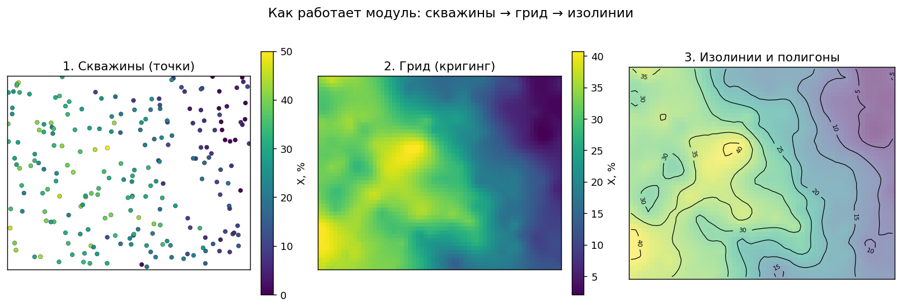{width=98%}

# 1.01 Declustering (weights)

The tool prepares data before interpolation. When samples are clustered unevenly, some blocks drilled denser than others, the naive global statistics shift toward the over-sampled areas. If rich zones were drilled denser, the mean and histogram are overstated, and that directly affects reserve calculation. Cell declustering (a port of GSLIB **declus**) gives each sample a weight inversely proportional to the local density: less in a cluster, more on its own. A representative declustered mean is computed from the weighted data.

A grid of cells is laid over the area, a sample weight is proportional to one divided by the number of samples in its cell, then the weights are normalized. The cell size is chosen automatically: a sweep over sizes, picking the minimum declustered mean (when clusters fall in rich zones) or the maximum. The size can be set manually. On a regular grid declustering changes nothing, all weights are equal.

| Parameter | Purpose | Default |
| --- | --- | --- |
| Points with values | Samples. | - |
| Value field (Z) | Numeric field. | - |
| Cell size | Auto (sweep) or manual. | Auto |
| Cell size for manual mode | Cell side in manual mode. | 0 |
| Sweep objective (Adv.) | Minimum or maximum mean. | Minimum |
| Number of sizes in the sweep (Adv.) | How many cells to try. | 24 |
| Cell Y/X ratio (Adv.) | Cell anisotropy. | 1 |
| Grid-origin offsets (Adv.) | Averaging over grid shifts. | 4 |
| Points with weights | Point layer with a **wt** field. | - |
| HTML report | Summary, histogram, mean curve. | default |

Outputs: a point layer with a **wt** field and an HTML report with a summary (naive vs declustered mean), a raw-vs-weighted histogram and a mean-vs-cell-size curve. The declustered mean from the log and report goes into **1.02**, the **Mean of simple kriging** field, and the **wt** field feeds **3.06 Gaussian simulation** for a weighted normal-score transform. Outlier samples are cut separately, by percentile capping in the kriging and cross-validation tools themselves.

# 1.02 2D Kriging (points → raster)

Ordinary (OK) or simple (SK) kriging over a point layer. Coincident points (the same XY) are averaged over Z. At grid nodes the values of the source points are reproduced exactly (with a zero nugget).

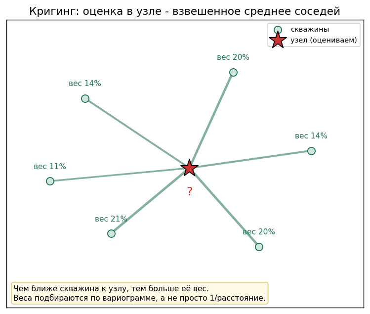{width=70%}

Main parameters:

| Parameter | What it sets | Default / advice |
|---|---|---|
| Point layer | Source points (wells) for interpolation. | - |
| Selected features only | Compute only over the layer's selected points. | off |
| Value field (Z) | The numeric attribute that is interpolated: roof elevation, thickness, geomechanical property, chemistry, etc. | remembered between runs |
| Value transform | ln for log-normal quantities (K, T, grades with a long tail): ln(Z) is kriged and the estimate is returned via exp. | none |
| Kriging type | Ordinary (OK) - estimates the mean locally itself. Simple (SK) - uses the specified **Mean**. | OK |
| Search radius | Radius of the search window for neighbouring points around a node. 0 = whole sample. | 0 (whole sample) |
| Min. number of points | If the window has fewer points, the node stays empty (nodata). | 1 |
| Max. number of points | How many nearest points enter the kriging system. | 24 |
| Cell size | Grid step. 0 = auto = min(extent)/50. | smaller = smoother, but slower |
| Raster extent | The computation rectangle. By layer by default. | by layer |
| Clip to well hull | The raster is clipped to the convex hull of all points - removes extrapolation in empty corners. | recommended on |
| Hull buffer | Expand the hull outward by N map units. | 0 |
| Clip mask | Your own polygon instead of the hull (takes priority) - handy for concave areas. | - |
| Load processing profile | Substitutes a saved profile (nugget, variogram structure, outliers) over the dialog fields. The list refreshes when the window opens. | (none) |

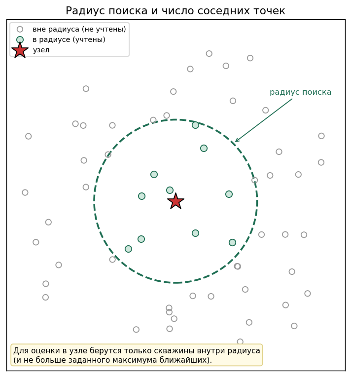{width=56%}

## Automatic values

Cell size = min(extent width, height) / 50.

Variogram correlation range = max(extent width, height) / 3.

Search radius (when 0) = the extent diagonal, i.e. the whole sample is taken.

## Clip to well hull

Kriging computes the whole rectangular extent, so outside the data area the values are extrapolation and produce artefacts (long "fan" isolines in empty corners). The **Clip to well hull** option builds the convex hull of all points (with an optional buffer) and clips the raster to it. The extrapolation disappears. If the actual boundary of the area is concave, set your own polygon in the **Clip mask** - it takes priority over the hull.

## Variogram and nugget

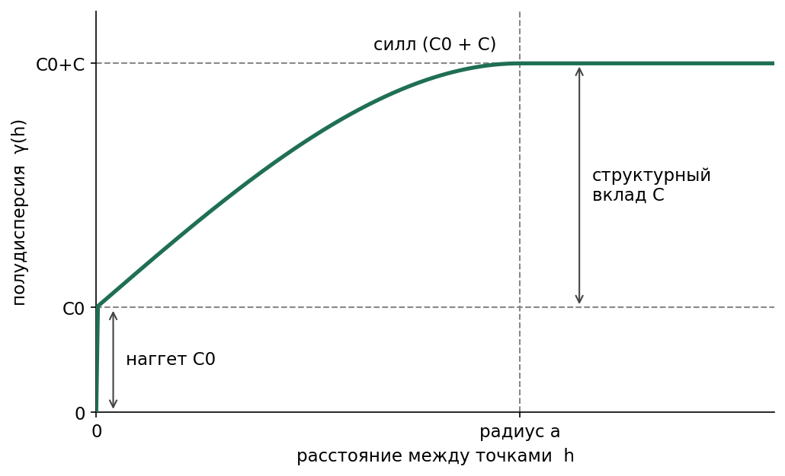{width=85%}

Kriging relies on a variogram model - it describes how strongly the Z values in two points differ depending on the distance between them. By this model a weight is assigned to each neighbouring well. The model is set in the **Advanced Parameters** section.

Variogram model: nugget C0, sill (C0 + C) and correlation range a.

### Nugget C0

The nugget is the value the variogram curve tends to as the distance tends to zero. In theory the discrepancy at zero distance should be zero (a point compared with itself), but in practice a step remains. It reflects the fact that the data at very small distances still do not match: measurement and digitizing error, microvariability at a scale finer than the well spacing, the discrepancy of duplicates at one point.

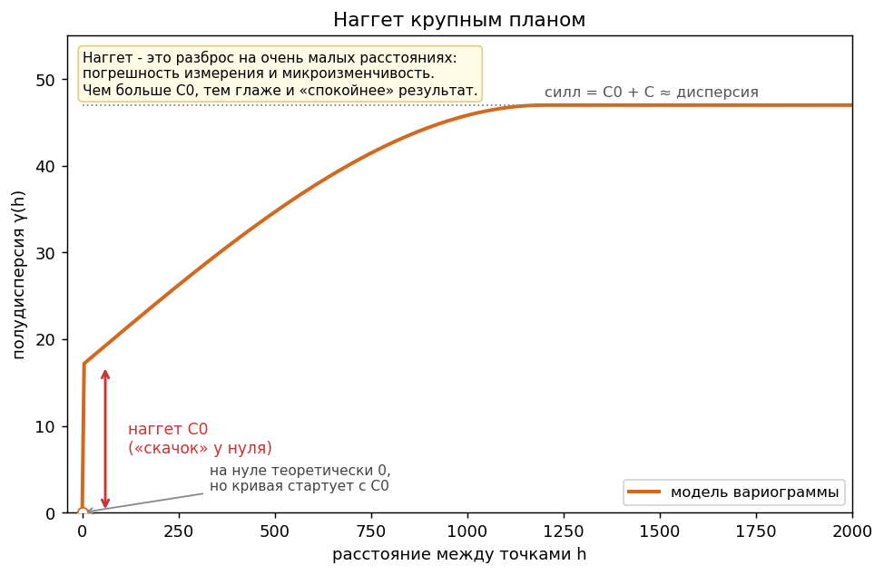{width=80%}

How the nugget affects the result:

C0 = 0 (default) - kriging is an exact interpolator: the surface must pass exactly through every well. An isolated well with a Z outlier turns into a cone (a "bull's eye").

C0 > 0 - kriging stops reproducing the value at the measurement point exactly and becomes a smoother: near a well the estimate is pulled toward the local mean. The larger the nugget fraction C0 / (C0 + C), the stronger the smoothing.

C0 = the whole sill (pure nugget) - the spatial link is lost, the surface degenerates into a plain mean. This is too much.

**Important - units.** Nugget C0 and sill are set in **absolute units of the data variance** (squared units of Z), not in 0-1 fractions. The default "1" for the sill is a placeholder that almost always needs changing: set the total sill (C0 + the structure contributions C) **close to the data variance**. The level of smoothing is determined not by the absolute nugget value but by its **fraction of the sill** C0 / (C0 + C). A practical order: take the total sill ≈ the variance, then the nugget = 0.2-0.4 of it (i.e. 0.2-0.4 × the variance - an absolute number, not 0.2-0.4 as such). The smaller the nugget, the more detail, but also more local peaks. The larger it is, the smoother the surface, but real structure may be smoothed away. The tool prints the data variance to the Log at start - that is your reference for choosing the sill.

### Structures, range and anisotropy

The sill (plateau) is the level the variogram reaches. It is the sum of the nugget C0 and the structure contribution C. A structure is set by a model (spherical, exponential, Gaussian or power), a contribution C, a range a, an azimuth and an anisotropy.

**Sill: meaning and order of magnitude.** The sill is the upper limit of the differences between points: how much, on average, distant wells differ. It is practically equal to the ordinary data variance. An example for KCl: mean ≈ 25 %, variance ≈ 47.6 (%²), i.e. σ ≈ 6.9 %. So the total sill is set ≈ 47.6. If the nugget C0 ≈ 17 (about 0.35 of the sill), then the structural contribution of the first structure C ≈ 47.6 − 17 ≈ 30. The absolute scale does not affect the grid itself - only the C0 : C ratio matters for the estimates. But it is needed so that the standard-error map and the MSDR in cross-validation are at the real scale (total sill ≈ variance → MSDR ≈ 1). So: do not leave the sill at the default 1, raise it to the data variance.

**Choosing a model.** The spherical and exponential models suit most tasks. The power model has no sill or range in the usual sense: it is used when variability grows with distance and does not reach a plateau (non-stationary increments), so the contribution and range fields for it are conditional. Use the Gaussian model with caution: at a zero or very small nugget it gives a numerically unstable system and artefacts (oscillations, negative weights). Therefore, when the Gaussian model is chosen, the tool enforces a small minimum nugget; set one yourself where possible.

**Data type and mode.** Different data need different settings. Smooth structural surfaces (roof and floor elevations, thicknesses) are better modelled with a long range or a power model under a wide (global, 0) search radius - then the surface comes out smooth. A short radius with local search on such data gives "bull's eyes" and discontinuities in the estimate when the set of neighbouring wells changes. For grades and chemistry (geomechanical properties, gas hazard) kriging works in its own right: here a correct nugget matters and, for a strongly skewed distribution, a data transform (see below on outliers).

The correlation range a is the distance at which the variogram reaches the plateau. Beyond it points practically do not influence each other. At 0 the automatic value max(extent)/3 is taken.

Anisotropy is set by the major-axis azimuth and the ratio of ranges (minor/major). A value of 1 is isotropic (the influence is the same in every direction). A value below 1 shortens the correlation across the major axis - useful for elongated geological structures.

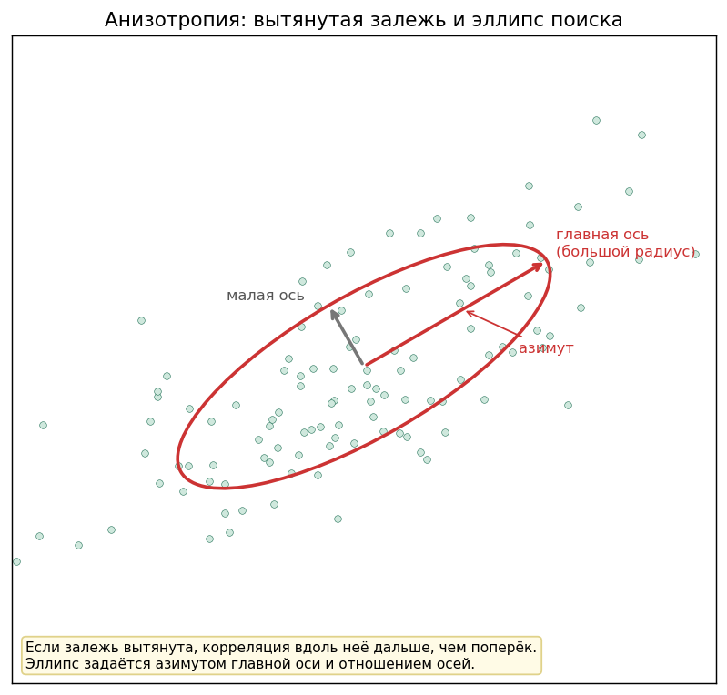{width=70%}

| Parameter | What it sets | Default / advice |
|---|---|---|
| Mean for simple kriging | Used only with the SK type. | 0 |
| Nugget C0 | The "noise"/jump of the variogram at zero. Suppresses local peaks. In absolute variance units. | 0. For smoothing 0.2-0.4 of the sill |
| Structure i · model | Variogram shape: spherical, exponential, Gaussian, power. | spherical |
| Structure i · sill/contribution C | The structure's contribution to the sill (abs. variance units). The sum C0+C ≈ the data variance. | str. 1 = 1 (replace with ≈ the variance) |
| Structure i · correlation range a | The distance to reach the plateau. 0 = auto = max(extent)/3. | 0 (auto) |
| Structure i · azimuth, ° | The direction of the anisotropy major axis. | 0 |
| Structure i · anisotropy (minor/major) | The ratio of ranges across/along the axis. 1 = isotropic. | 1 |

&nbsp;

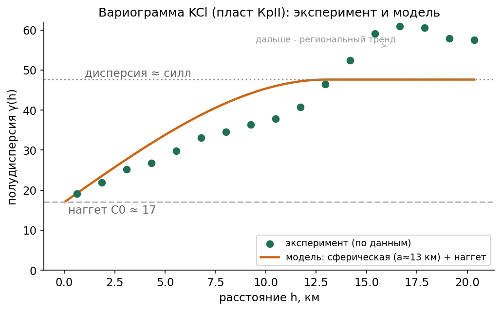{width=85%}

This is how the scheme looks on real data. A variogram is built from the wells: for pairs of points the semivariance is computed and averaged over distances - the result is a cloud (green points) under which a model (the curve) is fitted. From it the kriging parameters are set: the height of the "jump" at zero is the nugget C0, the plateau is the sill (usually close to the data variance), the distance to the plateau is the range a. If at large distances the points rise above the sill, as here, it is a regional trend (non-stationarity). It is either accounted for separately or the search radius is limited.

## Outlier removal

Outliers are anomalously high (or erroneous) values that distort the estimate: a few grade "bonanzas" can pull the whole grade map onto themselves, while clear errors (e.g. a negative thickness) spoil the surface. The **2D Kriging** tool lets you bound such samples right during the computation, without editing the source data. The parameters are in the **Advanced** section.

Removal and capping are a crude practical tool against clear errors. For grades and chemistry be careful: extreme values are often not noise but signal (e.g. contamination spots), and blindly clipping the distribution tails is not worth it. For strongly skewed data it is more correct not to clip the samples but to transform them to something close to normal (logarithm, Box-Cox) or to use indicator kriging - that is beyond removal, but that is exactly how heavy tails are handled in the geostatistics of ores and contamination.

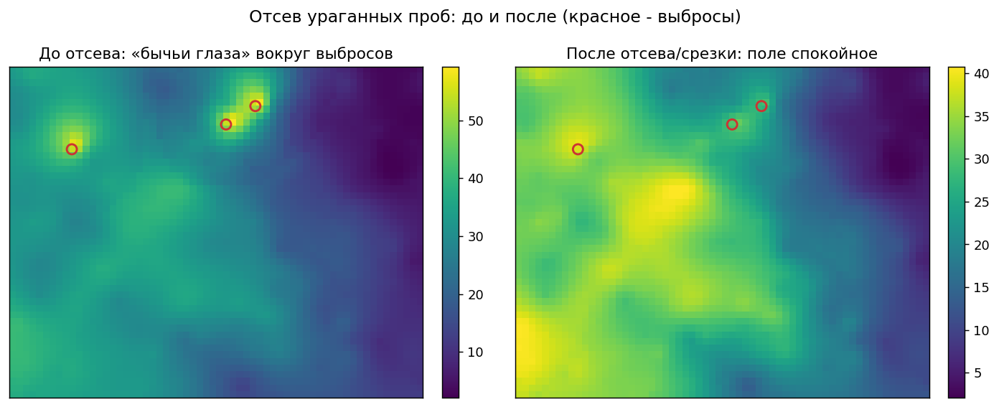{width=98%}

**Two modes.** **Remove** - samples outside the allowed range are discarded (for clearly broken records). **Cap (capping)** - values outside the range are clamped to the bound, while the point itself stays in the computation. Capping is the classic technique for grade outliers: the point's position is not lost, but its influence is limited. The mode is switched by the **Cap to bound (capping) instead of removing** checkbox.

**Absolute bounds.** The **Lower value bound** and **Upper value bound** set thresholds in Z units directly. An empty field means the bound is not set. They take priority over the percentile. Example: for thickness set the lower bound to 0 - negative values go away, and the upper, say, to 30 - a clear outlier at 122 m goes away.

**Percentile bounds.** The p-th percentile is the value below which p% of all samples lie. For example, the 5th percentile is the threshold below which only the 5% smallest values lie. The 95th is the threshold above which the 5% largest lie. The **Outliers: clip percentile, %** parameter sets the number p, and the bounds are taken symmetrically: from the p-th to the (100−p)-th percentile. So p = 2 means "treat as outliers the 2% lowest and 2% highest samples": everything below the 2nd and above the 98th percentile is either removed or capped. The larger p, the more aggressive the clipping. P = 0 disables the percentile mode. The convenience is that you do not need to know the absolute thresholds - they are computed from the data itself and suit any distribution and scale.

**Two-sidedness - important for chemistry.** The percentile mode cuts both tails - upper and lower. For grades this is dangerous: KCl = 0 in replacement zones is real geology, and clipping the lower tail would wrongly raise the "empty" areas. So for grade clip only from above: leave the **Lower value bound** empty and set the **Upper** as an absolute (or use the percentile, knowing the bottom will be affected too). For elevations and thicknesses two-sided clipping is usually appropriate.

**Order and Log.** The filter is applied before averaging coincident points. The tool's Log reports how many samples were removed or capped and within which bounds - handy for checking.

## Kriging standard error

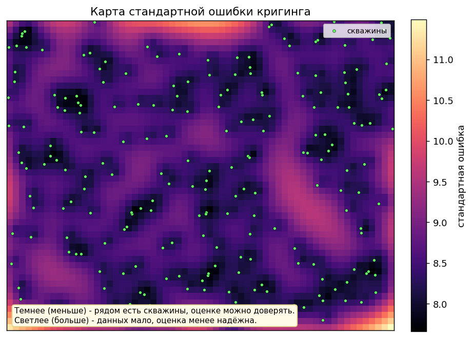{width=66%}

Besides the estimate itself, kriging gives at every node the error variance - a measure of uncertainty. Its square root, the standard error, is output as an optional second raster (the **Kriging standard error** parameter of the **2D Kriging** tool). The units are the same as the interpolated quantity Z.

A key property: the standard error depends on the geometry of the well layout and the variogram model, but not on the Z values themselves. So it is a map of the observation network's reliability, not of the data scatter. At a well point (with a zero nugget) the error equals zero - there the value is known exactly. As one moves away from wells it grows, and in areas without data it reaches a maximum (roughly the square root of the sill).

**How to read it.** Dark (small) values - the estimate is trustworthy: enough wells nearby. Light (large) - the estimate rests on distant points, effectively extrapolation. These are the first candidates for infill drilling. It is more convenient to compare relatively (where it is larger or smaller), because the absolute value depends on the variogram scale (the sill S1_SILL).

**Important.** This is a model estimate: it is as valid as the variogram you set (nugget, range, anisotropy). At a nugget above zero the error at wells is not zero - the nugget sets a lower "floor" of uncertainty. The standard error is not a strict confidence interval, but as a relative uncertainty map it is very useful.

**Styling.** Give the layer graduated symbology by value (e.g. from dark to red) - and it is immediately clear where the map is reliable and where not.

## Trend removal (regression kriging)

Ordinary kriging estimates the mean locally, within the search window, so it follows a smoothly varying mean on its own. The difficulty appears when the field has a pronounced regional component, such as a general dip of the seam across the area. Then the experimental variogram of the raw value gets inflated: the range is overstated, there is no sill, the shape resembles a power model, and a stable model is hard to fit.

The **Remove polynomial trend** checkbox removes the regional component by least squares before kriging. The residuals are then kriged and the trend is added back to the estimate. The residual variogram returns to its normal shape: it reaches a sill with a nugget, and the range reflects the true scale of correlation rather than the span of the trend. The **Trend degree** field selects a plane or a quadratic surface.

The **Value transform** list adds a logarithm for quantities spanning orders of magnitude, such as hydraulic conductivity or transmissivity. With **ln** selected, the natural logarithm of the value is kriged and the estimate is returned through the exponential. This is the median, geometric estimate, correct for log-normal fields. The standard error is converted back to the original units. The logarithm removes the need to build an ln field by hand in the calculator and applies to positive values only. Set the variogram and nugget in ln units when the logarithm is on.

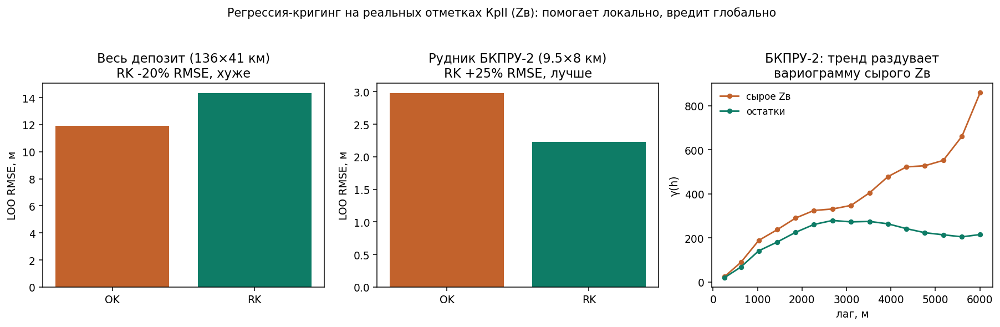{width=85%}

Trend removal helps where the dip is uniform, within a single mine district or a local area. It is not meant for the whole deposit at once. Neighbouring blocks are offset in height, a single polynomial describes them poorly, and local kriging already holds the varying mean, so removing a global trend there tends to hurt. The variogram shows whether it is warranted. If the raw value has a range comparable to the size of the area and no clear sill, a trend is present and worth removing. If the raw variogram already reaches a sill with a small nugget, there is nothing to remove.

Degree 1 is usually enough. Degree 2 captures curvature but can absorb part of the real structure into the trend, so after using it look at the residual variogram. If the sill and nugget become less defined, go back to degree 1. The same checkbox is in the **Variogram cross-validation** tool, where the trend is refit at each validation step, so the gain or loss from removing the trend is visible directly in the RMSE.

After trend removal, fit the variogram on the residuals. In this mode the standard-error raster is the kriging error of the residuals, the trend is treated as deterministic and adds no error of its own.

## Block kriging

Ordinary kriging estimates the value at a point, at the centre of a grid cell. In mining, however, what is usually needed is not a point value but the average over an area, over a mining block, a panel or a reserve-estimation cell. The grade of a useful component in a block is the average over its area, and estimating it as the value at a single point is not quite correct. This is what the **Block kriging** checkbox is for.

When enabled, the mode estimates the average over the grid cell rather than the value at its centre. The cell is conceptually split into an N×N grid of points, the count set by the **Block discretization, N×N per cell** field, and the covariances in the kriging system are averaged over those points. The system is thus solved not for one point but for the whole block at once. This is the classical GSLIB block-kriging scheme.

The block estimate has two consequences, both useful for reserve estimation. The surface comes out smoother than the point one, because averaging over the block damps small fluctuations. And the kriging standard error comes out lower than the point one, because an area average is estimated more reliably than a value at a single point. There is one price. Block kriging does not reproduce the samples at nodes exactly. The average over a block, even one centred on a borehole, does not equal the value at the borehole itself, and that is as it should be.

A 4×4 discretization is almost always enough. A larger N takes longer to compute while accuracy grows only slightly. At N equal to one block kriging degenerates into point kriging, so the minimum value of the field is two, and the mode itself is off by default.

Block kriging combines with trend removal. The residuals are kriged over the block and the trend is added back to the estimate. It also combines with grid smoothing, but block averaging alone is usually enough and extra smoothing is not needed.

# 1.03 Minimum curvature (points -> raster)

The tool builds a grid by minimum curvature. The surface behaves like a thin elastic plate passing through the data with the least bending, that is a solution of the biharmonic equation. The method is not exact: the data are honored approximately, but the surface comes out as smooth as possible, which is why it is traditionally used for maps of geophysical fields and any smooth quantity. It is a deterministic alternative to kriging without variogram fitting. Kriging, unlike it, gives an estimate with a standard-error map.

**Tension** mixes in a membrane term: 0 is pure minimum curvature, 1 is a taut membrane with fewer overshoots between samples. Boundary tension is set separately and helps remove edge overshoots. The solution is iterative, by successive over-relaxation (SOR) with a nine-colour sweep of the grid: nodes of one colour do not fall into each other's stencil, so they are updated at once and stably. The grid is recomputed until the largest node change drops below the **residual threshold** or the iterations run out.

Free nodes start from the nearest data value, so convergence is fast on dense data. On very sparse data more iterations are needed: raise their limit or the residual threshold. Faults and breaklines are not supported in this version; they are planned for the future.

| Parameter | Purpose | Default |
| --- | --- | --- |
| Point layer | Samples with a value. | - |
| Value field (Z) | Numeric field to interpolate. | - |
| Extent | Result rectangle. | from layer |
| Cell size | 0 = auto, min(extent)/50. | 0 |
| Tension | 0 = minimum curvature, 1 = membrane. | 0 |
| Residual threshold | 0 = auto, 0.01 percent of the data range. | 0 |
| Maximum iterations | Cap on the number of SOR passes. | 100000 |
| Boundary tension (Adv.) | Tension at the grid edge. | 0 |
| Relaxation factor (Adv.) | SOR acceleration, sensibly 1.5 - 1.9. | 1.85 |
| Anisotropy (Adv.) | Y/X axis ratio in the membrane term. | 1 |
| Grid (minimum curvature) | Output raster. | - |

The output is an ordinary grid ready for **1.04 Isolines from raster**. The log prints the grid size, the number of data nodes, the number of iterations and the final residual. If the iteration cap is reached while the residual is still above the threshold, the tool warns about it.

# 1.04 Isolines from raster

Builds isolines (lines) and, by default, contour polygons. Levels are set by a uniform step or by an explicit list. Parameters:

| Parameter | What it sets | Default / advice |
|---|---|---|
| Raster | The input raster (e.g. a kriging result). | - |
| Isoline step | A uniform step over Z. 0 = set **Explicit levels**. | - |
| Base level (offset) | Anchors the level grid (levels are multiples of the step from the offset). | 0 |
| Explicit levels | A space-separated list of levels. Takes priority over the step. The decimal separator is a comma or a dot. | - |
| Index isoline every N-th | Every N-th line is flagged is_index = 1 (for thickening). 0 = off. | 5 |
| Min. line length | Drop lines shorter than the threshold (map units). 0 = no filter. | - |
| Bicubic isoline smoothing | Densifies the grid (×2…×4) by bicubic interpolation before contouring - the main isoline-smoothing method, removes "octagons" from a coarse grid. Works for both lines and polygons. off = no densification. | off (×4 on a coarse grid) |
| Line rounding (Chaikin), iterations | An extra light line rounding (Chaikin). Weaker than bicubic smoothing; usually not needed if it is on. 0 = off. | 2 |
| Write the value into the geometry Z | The level is written into the Z of the line vertices. Needed for DXF export: otherwise AutoCAD and Credo place the contours at zero elevation. | off |
| Side of hachures and labels (adv.) | The downslope side for the depression-style hachures and the direction of the topographic labels, both at once. | automatic |
| Value field name | The name of the level attribute in the output lines. | ELEV |
| Band (adv.) | The band number of the input raster. | 1 |
| Isolines / Contour polygons | The output layers. Polygons are built by default into a temporary layer. | - |

Output fields:

| Layer | Field | Type | Holds |
|---|---|---|---|
| Isolines | ELEV | number | The level value of the line (name set by the **Value field name**). |
| Isolines | is_index | integer | 1 on index isolines (every Nth), otherwise 0 - for thickening. |
| Contour polygons | ELEV_MIN | number | Lower level of the band. |
| Contour polygons | ELEV_MAX | number | Upper level of the band. |

## The surface between structural lines

The **Cliffs** input sets a barrier: the drop along a line is not smeared, but the line does not set the drop either, because it carries no elevations. The pair of inputs **Top of forms** and **Bottom of forms** solves the opposite problem: to place exactly the surface that the two sides with known elevations define.

Why this is needed is best put in the industry requirements for digital plans: terrain created automatically has to be corrected by hand, agreeing it with the heights of retaining walls, slopes and fills. The tool replaces that prescribed manual correction with a rule. The second addressee is areal quarries, cuts, fills and dumps: contours inside them are not described at all by the standard, and there is nothing left to build the terrain from except crests and toes.

**A side is a set.** Any number of lines and points with one value of the link field goes into the top or the bottom, and the distance is measured to the union of the set. All the cases follow from this single rule: a slope is a crest and a toe, a pit is a closed crest and a point on the floor, a ditch is two crests and a floor line, a ring dam is two closed lines, a river bank is a crest and part of the water edge. Lines and points may be mixed within one side.

**Elevations** follow the priorities: vertices with Z, then the elevation field, then the object stays a barrier and is not assembled into a form. There is no significance threshold in the tool: give two sides and a surface is built, give one and it works as a barrier. The decision is made by the person who draws the second line.

**How it is computed.** No correspondence of points between the sides is sought. For every cell the exact distances to both sets are computed together with the elevation of the nearest source, the weight is the ratio of the distances and the elevation is linear in the weight. An overlap of the geometry is impossible by construction. The body of the form goes into the multigrid as hard nodes, and its border additionally works as a barrier so that outside data do not drag the surface across the bench. The relaxation scheme is not touched.

**The price of the method.** The nearest point and the corresponding point are different things. While the elevations are constant there is no difference. Once the crest elevation varies along a curved form, the surface departs slightly from the ruled one, and on concave corners a medial axis appears where the nearest source switches abruptly and the surface gains a kink. Both numbers are measured by tests on synthetic data: on a real survey there is nothing to measure them against, no analytic reference exists there.

**What goes into the log.** For every form: the number of body cells, the median width in cells, the elevation mismatch where the sides converge and the number of objects skipped for want of elevations. Separately a warning about forms narrower than two cells: such a form does not exist in a raster at any scale and the cell has to be refined. Lone sides and objects without a link go into the log with a reason.

## Isoline smoothing

The main way to smooth isolines in this tool is **bicubic smoothing**: before contouring, the grid is densified by bicubic interpolation (×2…×4), and the contours are built on the finer grid. On a coarse grid isolines otherwise look like "octagons" (vertices are placed at cell edges) - densification removes this angularity topologically cleanly. It is implemented in pure NumPy, with no external dependencies; nodata boundaries and internal data "windows" are preserved. Densification affects both lines and contour polygons - the band boundaries still coincide with the isolines. The cost is more cells (×4 = 16 times more), so on a very large grid start with ×2.

In addition there is a light line rounding by the **Chaikin** algorithm (number of iterations). It is weaker than the bicubic one and usually not needed if densification is on; it makes sense as a fast alternative on a coarse grid when you do not want to densify.

Smoothing of the field itself (Gaussian, over the raster) is a separate operation done not here but in the **2D Kriging** tool: there it goes over the grid before contouring and removes not angularity but field bumpiness (the "bull's eyes" around wells). Bicubic smoothing and Gaussian field smoothing complement each other: the first cures grid angularity, the second cures data bumpiness. The contoured kriging raster is not changed in the process - only a temporary copy is smoothed.

## Contour polygons (bands)

Contour polygons are filled bands between neighbouring isolines. They are built not by classifying raster "steps" but by polygonizing the smoothed isolines themselves together with the outline of the raster's valid area: line ends are snapped to the outline, the network is noded and polygonized. The level range of each band is determined by sampling the raster at a representative point of the polygon.

Thanks to this the polygon boundaries coincide with the isolines, and the coverage is continuous (no holes). The polygons carry the ELEV_MIN and ELEV_MAX fields. By default they are built into a temporary layer. To not build them, clear the **Contour polygons** field.

## Layer styling

Lines: set rule-based symbology on is_index - give the index isolines (is_index = 1) a larger width. Label by the level field (ELEV).

Polygons are created with a single symbol. For range fills set graduated symbology by ELEV_MIN (or ELEV_MAX).

The isoline layer is automatically placed above the polygon layer so the lines show over the fill.

## The value in the geometry Z

The **Write the value into the geometry Z** tick lifts the vertices of every line to its own elevation. A contour is a line of equal level, so the Z of all its vertices is the same and equals the field value.

This is needed to hand the contours over to AutoCAD and Credo. The standard QGIS export (**Project - Import/Export - Export project to DXF**) keeps the Z of the vertices, you only need to clear the **Force 2D** tick. Without Z in the geometry both programs place every contour at zero elevation, and the height has to be set by hand line by line.

The multipart structure of the layer is preserved: a contour of one level stays a single feature with all its branches, the feature count does not change and the labels do not multiply.

## Topographic labels

On a topographic map the top of the figure on a contour always faces up the slope. Reading the map, a single label tells you which way is higher without checking the neighbouring contours.

QGIS measures the top of a label from the direction of the line, so text rotation cannot achieve this. What is needed is to give the lines a single direction relative to the slope, and that is what the **Topographic labels** tick does. The layer keeps an **up_side** field: 1 means the line was left as it was, 0 that it was reversed.

The automatic choice of side is sometimes wrong, and then it is switched by hand with the **Side of hachures and labels** parameter. The switch acts on both halves of the picture at once: the side of the hachures and the direction of the labels. It is applied exactly once - reversing a line already swaps left and right, and with them the sign of the downslope side, so a second flip would return the hachures to where they were.

### It does not work unless upside-down labels are allowed

The labelling settings hold an option for showing upside-down labels, and by default it forbids them. Under that ban QGIS turns the text around by itself so that it reads left to right, and the direction of the line stops mattering.

A topographic label is upside down by definition on a slope facing south. So the showing of upside-down labels has to be allowed rather than fought.

In the **Structure / hypsometry** and **Depression (hachures down)** styles this is already set. If you label with a style of your own, enable the showing of upside-down labels in the rendering section, otherwise the tick gives nothing.

### The label sits on the line

In both styles the label is placed on the contour itself rather than above it, and breaks it. This is the familiar topographic device: the figure reads together with the line rather than beside it.

## Warning about flat levels

The tool checks by itself whether any level of the interval has landed on an area with a near-zero slope, and if it has, says so in the log: the level, the number of cells touched and the share of the data. Nothing is blocked, the isolines are built as usual.

Why this is needed. On an area where the surface changes by millimetres, the position of an isoline is set not by the relief but by the noise of the matrix. The line starts to wander, breaks into a multitude of small rings and looks like a single thickened one. The classic source of such an area is a water surface: on a matrix derived from a stereo pair it stands at one elevation to within centimetres and can cover half the area.

Telling this ailment from the normal work of the algorithm by eye is hard, because the algorithm did its job right and the data are at fault. That is why the check is reported in the log as numbers.

The practical remedy is usually simple: mask the water surface before building, or shift the levels. A shoreline is a map feature of its own, not a contour, and should not be drawn as one.

The check runs in a single pass over the array and is skipped on rasters larger than sixty million cells so as not to waste time. Any error inside it is suppressed, the build is never brought down by diagnostics.

## Contour confidence

A continuation of the same thought, but this time with something you can do about it. The **Contour confidence** parameter has three positions.

**Do not compute** is the default, nothing changes.

**drop_min and drop_mean fields only** leaves the lines whole but gives each one two fields: the smallest and the mean elevation drop per cell along it. The decision stays with you: suspect stretches show up with an expression such as `drop_min < 0.005`, and you decide whether to hide or to show them.

**Fields plus a break on suspect stretches** additionally breaks the line where the drop falls below the threshold and marks the parts with a **lowconf** field. Nothing is deleted, what is marked can be hidden with a layer filter.

### Why the threshold is a fraction of the interval

What is measured is not the slope but the elevation drop per cell. This quantity has the same dimension as the contour interval, so it can be compared with it directly, and a single threshold works the same way on different data.

An example. At an interval of 0.5 m and a threshold of one hundredth the boundary runs at 5 mm per cell. A gentle slope gives centimetres per cell and passes, a water surface gives millimetres and does not. Setting the threshold as an absolute slope would mean tuning it anew for every area.

The threshold is set in the advanced parameters, **Drop-per-cell threshold, fraction of the interval**, 0.01 by default.

### Why only runs are broken

A single suspect vertex does not break the line, and neither do two. A break happens only where three or more weak vertices follow one another. Otherwise one random noisy cell would crumble a contour on a perfectly normal slope, and the map would thin out for no reason.

The number three is built in and is not exposed as a parameter: there is nothing for the user to tune it against, and an extra parameter in the dialog costs more than it seems.

The parts share the boundary vertex, so no gap appears in the geometry: neighbouring pieces meet point to point.

### Order in the pipeline and the summary

The marking runs after the isolines are built and before the short-line filter. Otherwise the fragments left by the breaking would enter the length statistics and some lines would be dropped twice for different reasons.

A summary goes to the log: how many lines came in, how many parts came out, how many of them are below the noise and what share of the total length turned out weak.

### What the tool does not do

It does not smooth flat areas so that the line stops wandering. That would be a forgery of the data: the result would be a smooth and wrong contour instead of a ragged one that matches what the matrix actually holds. The decision whether to show a weak stretch stays with a human.

# 1.05 Variogram (experimental)

The tool builds an experimental semivariogram from points, fits a model to it if needed, and produces an HTML report with a chart. It does not compute a grid and is not part of the kriging computation chain directly. Its job is diagnostic: to show the structure of the data's spatial variability and to help set the variogram parameters deliberately, by the look of the cloud rather than by eye.

## Why the preview is needed

Kriging relies on a variogram model: nugget, sill and range. The interpolation weights and the standard-error map depend on them. It is tempting to hand the fitting of these numbers to automation and not think about them. On a clustered drilling grid this is dangerous. Clusters of close wells give a huge number of pairs at short distances and press down the near part of the variogram, so an auto-fit on such a cloud easily yields a confidently wrong nugget. The preview removes this problem: the geologist sees the pair cloud itself, understands where the data are dense and where sparse, and fits the model knowing what lies beneath it.

That is why model fitting in the tool is given as a recommendation, not a finished result. The numbers it suggests should be checked against the look of the chart and only then carried into kriging.

## A short theory

The semivariogram describes how statistically related the parameter values are in two points depending on the distance between them. For a pair of points separated by a distance h, half the squared difference of their values is taken (the semivariance of the increment). These quantities are averaged over distance intervals (lags), giving the curve γ(h). It is a measure not of the "average difference" of values but of the statistical reliability of predicting a value from a neighbour: the smaller γ, the closer the link.

A typical curve has three characteristics. The nugget C0 is the value γ tends to as the distance tends to zero. It reflects variability at a scale finer than the network step, plus measurement error. The sill is the level the curve reaches at large distances. The full sill equals the sum of the nugget and the structural contributions and is ideally close to the data variance. The range (a) is the distance at which the curve reaches the sill - i.e. at which the spatial correlation drops practically to zero. Beyond it points are statistically unrelated. For the exponential and Gaussian models the sill is reached asymptotically, so for them the range is effective.

The nugget and contributions in the tool are set in absolute units of the parameter variance, not as fractions of one. The reference for the full sill is the data variance, which is shown in the report summary.

## Parameters

| Parameter | What it sets | Default / hint |
|---|---|---|
| Points with values | Input point layer. | - |
| Z value field | Attribute the variogram is built on. | - |
| Grouping field (adv.) | Separate variograms by category (e.g. survey type). | - |
| Declustering weight field (adv.) | Weights from 1.01 for a weighted estimate. | - |
| Number of lags | Number of distance bins. | - |
| Maximum distance | Upper distance bound. 0 = half of the extent diagonal. | 0 |
| Fit model | Automatic model fitting to the experimental points (recommended). | on |
| Model to fit (adv.) | Model type: spherical, exponential, Gaussian, power. | - |
| Robust estimator (adv.) | Cressie-Hawkins estimator, less sensitive to outliers. | off |
| Outliers: clip percentile (adv.) | Removal of extreme values by percentile. 0 = off. | 0 |
| Cap to bound instead of removing (adv.) | Capping: an extreme is clipped to the threshold, not removed. | off |
| Save profile as | Name of the "variogram + outlier removal" profile to apply in kriging. Empty = do not save. | - |
| Variogram table | Output: lag, γ value, number of pairs. | - |
| Report (HTML) | Output: pair-cloud and model plot. | - |

| Parameter | What it sets | Default / advice |
|----------|-----------|----------------------|
| Points with values | A point layer of wells or samples. | - |
| Z value field | The numeric attribute to analyse: roof elevation, thickness, grade. | remembered between runs |
| Grouping field (optional) | Builds a separate curve for each field value (e.g. survey type) and overlays them on one chart. | off |
| Number of lags | Into how many distance intervals the pair cloud is split. | 15 |
| Maximum distance | The far edge of the variogram, in layer units (for metric coordinates - metres). 0 = half the extent diagonal. | 0 |
| Fit model (recommendation) | Auto-fit of the nugget, sill, range and model type; the result is remembered for substitution into **2D Kriging**. | on |
| Model to fit (adv.) | Fix the model type or leave the auto-pick of the best by R². | Auto |
| Minimum points per group, % (adv.) | Groups smaller than the threshold are not built and are listed in the Log. The floor is 30 points. | 2 |
| Robust estimator (Cressie-Hawkins) (adv.) | Reduces the influence of rare anomalous pairs. | off |
| Show pair cloud (adv.) | Adds the source pairs (before averaging) to the chart. | off |
| Overlay a given variogram model (adv.) | Draws a model with a manually set nugget, sill and range over the cloud - handy to compare your model with the data. | off |
| Outliers (adv.) | Clip percentile, lower and upper value bounds, capping-to-bound mode instead of removal. At the very end of the list. | off |
| Save profile as | If filled in - the fitted (isotropic) model and the current outlier settings are saved as a processing profile under this name. | empty |
| Variogram table | An output table layer with the variogram points (columns below). | temporary layer |
| Report (HTML) | A report with the cloud, the fitted curve and the data-variance line. | temporary file |

The parameters marked "adv." are in the collapsed **Advanced Parameters** section.

The output is a **Report (HTML)** with the chart, the fitted curve and the data-variance line, plus an optional **Variogram table** - the experimental variogram points as a geometry-less layer (one row per lag of each series). From it you can build your own chart in QGIS or export the values. Its columns:

| Field | Type | What it holds |
|------|-----|--------------|
| **series** | string | The series: "all points" or the grouping-field value, if set. |
| **lag** | double | The mean distance between points in the interval (lag), in layer units. |
| **gamma** | double | The semivariance γ(h): the mean of half the squared value differences over the pairs of this lag (or the robust Cressie-Hawkins estimate, if enabled). |
| **npairs** | integer | The number of point pairs that fell into the lag. A small number of pairs means the variogram point is unreliable. |

## The grouping field and a mixed-density survey

The optional **Grouping field** builds a separate variogram for each field value and overlays them on one chart. This is needed when the sample is collected by networks of different nature and density, for example surface and underground exploration. By feeding the survey type into the grouping, you can see whether these populations share a structure or each has its own.

Mixing mixed-density networks does not create artefacts by itself, but it distorts the overall variogram. A dense network gives many pairs at short lags and shapes the near part of the curve, a sparse network works on the far lags. A single model stretched over such a cloud turns out to be a mixture of two structures and describes neither correctly. The grouping shows this mixture, and the decision whether it is legitimate to combine the populations stays with the geologist. Declustering is not applied to the pair cloud here. Its weights are meant to correct the histogram and the mean, not the variogram pairs, where each pair is equally valid regardless of grid density.

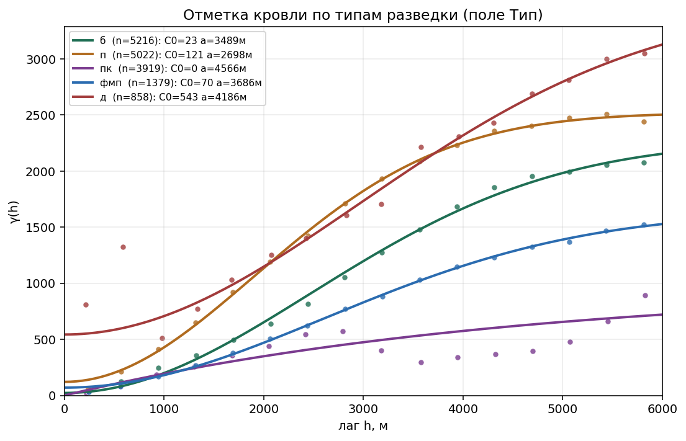{width=70%}

## Three typical geological situations

Seam elevations, thicknesses and component grades have different geostatistical characteristics, and it is useful to see them side by side. The illustration shows variograms of three parameters of one industrial seam, computed in a single distance window.

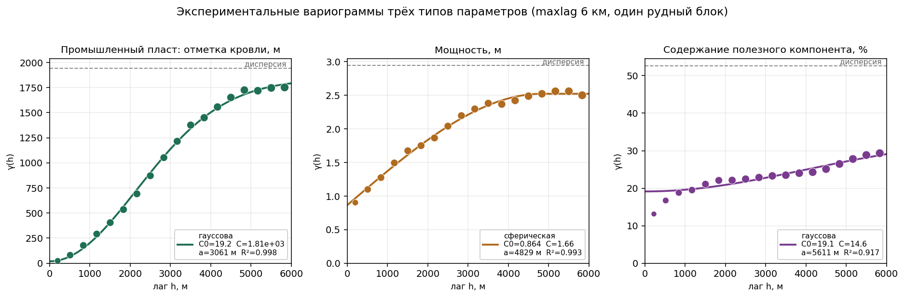{width=98%}

Roof elevation is a smooth surface. The nugget is almost zero, the range large, the model close to Gaussian, the fit quality very high. Neighbouring wells give almost the same elevation, the variability is large-scale. Kriging works confidently. There is a subtlety here: a Gaussian model with an almost zero nugget is numerically unstable and gives the characteristic "bull's eyes" on the map. A small nugget should be set by hand.

Thickness is an intermediate case. The nugget makes up a noticeable fraction of the sill, the range is medium, the model more often spherical. About half the variability is structural, half small-scale. This is a typical working variogram.

The component grade is the noisiest parameter. The nugget is comparable to the structural contribution or exceeds it, the curve rises slowly, the fit quality is lower, and the model is poorly distinguishable from neighbouring types. The main variability sits at a scale finer than the sampling grid. Kriging smooths such a parameter heavily, and cross-validation shows a large error. Grade is predictably worse than elevations and thicknesses, and that is normal.

## Maximum distance and reaching the plateau

The most common mistake is too large a maximum distance. If you leave the automatic value at half the diagonal, on an elongated deposit the window stretches over tens of kilometres. The lags begin to link points across barren gaps and inter-block breaks, the variogram catches the regional trend instead of the local structure, and the fit yields a range larger than the window itself and a sill several times the variance. The sign of trouble is simple: the fitted model's range is comparable to the window or exceeds it. This means the curve has not reached a plateau and the sill is obtained by extrapolation.

The cure is to reduce the maximum distance to the local scale and to check that the variogram has reached the plateau. On a grade example for one seam, with a 6-kilometre window the fit gave a range of about 9 kilometres and a sill below the variance, i.e. the curve had not yet reached the plateau. With a 12-kilometre window it did, giving a range of about 18 kilometres and a full sill close to the data variance. The real correlation range turned out larger than it looked in the narrow window, and the right answer came precisely from checking that the curve reaches the plateau.

At the same time the window must not step over large barren zones. On a drilling grid they are visible by the drop in point density, and the variogram should be built within a single ore block, otherwise the local geology mixes with regional tectonics.

## Where the nugget came from

On a sparse grid the nugget is almost always set by a handful of pairs of points rather than by a cloud. Two wells a few tens of metres apart with incomparable values lift the first lag above the sill, all that is left for the fit is to describe this with an almost pure nugget, and kriging with such a model returns the mean instead of a map.

The tool therefore prints a breakdown of the first lag to the log: the distance, the number of pairs in it and the value of gamma next to the data variance. If the gamma of the first lag already exceeds the overall variance, a separate warning says so - only a nugget can describe that.

The heaviest pairs inside the first lag are then named: the distance between the points, both values, the gamma contribution and the coordinates of both points. The coordinates find the pair on the map at once, and from there it is a question about the data. A mixed-up horizon, a sign, the units - or genuine micro-variability, in which case the nugget is honest.

## When the fit is good for nothing

Two failures of the fit are silent: the parameters are printed, kriging runs without a single error and produces a flat field around the mean. The tool pulls both out into warnings.

The first is a fit quality R2 below 0.1. The model explains next to nothing, and its parameters cannot be carried into kriging.

The second is a nugget above half of the total sill. Correlation at short distances is not resolved: either the grid is sparser than the structure someone is trying to see, or the data contain those very pairs. Kriging with such a model smooths the estimate towards the mean and produces bull's eyes on the map, tight concentric rings around individual samples.

## The workflow with cross-validation

The variogram gives a starting model, and **Variogram cross-validation** checks it. The order is as follows. First an experimental variogram is built with a maximum distance at which the curve reaches a plateau, and the fitted nugget, contribution, range and model are taken. Then these numbers are carried into cross-validation and the leave-one-out metrics are assessed. The fitted and validated model is conveniently saved as a **processing profile** (the **Save profile as** field) and substituted into **2D Kriging** via the **Load processing profile** field - see the section on the Processing profiles tool.

The mean error ME should be near zero, meaning there is no systematic error. The root-mean-square error RMSE shows the absolute accuracy. The MSDR deserves separate attention - the ratio of the squared error to the kriging variance. If it is noticeably above one, kriging underestimates the uncertainty and the standard-error map is understated.

Correcting the MSDR is done exactly, not by eye. In ordinary kriging, multiplying the whole variogram by a constant factor does not change the estimate, since the weights depend only on the shape of the curve, not on its scale. Only the kriging variance changes. So it is enough to multiply the nugget and contributions by the current MSDR value, leaving the range and model unchanged, and repeat cross-validation. The ME, MAE, RMSE and R metrics do not shift, while the MSDR comes to one, and the error map becomes honest.

After scaling, the full sill may turn out above the data variance. On a clustered grid this is not an error. The naive variance is understated because dense well clusters pull it down, while the true scatter over the area is larger. The excess of the sill over the variance here is a consequence of the uneven grid.

The finished and validated model then only needs to be carried into **2D Kriging** to compute the grid, and after that, if needed, into **Isolines from raster**.

If the data are clustered unevenly, set the optional **wt** weight field from tool **1.01 Declustering**. Each pair of points is then taken with a weight equal to the product of its endpoints' weights, and clusters do not inflate the near lags. The pair count in the report shows the raw number of pairs, while γ itself is computed with weights.

# 1.06 Variogram map (anisotropy)

The tool builds a variogram map - the semivariance surface γ as a function of the two-dimensional separation vector (h_x, h_y). An ordinary variogram averages all directions into one curve and loses directionality; the map, by contrast, shows how the continuity of the parameter depends on direction. From it you can see whether there is anisotropy in the data and where the axis of maximum continuity points. The tool is diagnostic: it does not compute a grid but helps to set the azimuth and anisotropy in the 2D Kriging variogram structure deliberately.

## What anisotropy is and why to see it

An isotropic variogram assumes the link between values depends only on the distance between points, not on direction. For folded and elongated geological bodies this is not so. Along strike the seam is sustained, across it it changes faster: the same difference in roof elevations is gained over kilometres along the fold but over hundreds of metres across it. If this is not accounted for, kriging smooths the field equally in all directions and blurs the real elongation of the structure.

A variogram map reveals the directionality directly. For each pair of points not only the distance is taken but also the direction of the vector between them, and the semivariance of the increment is spread over a two-dimensional grid of lags. Where γ grows slowly and the map stays dark far from the centre, continuity is high. Where γ grows fast, continuity is low. The low-γ area as a whole stretches into an ellipse whose long axis is the direction of maximum continuity - for folding this is the strike direction.

## How to read the map

At the centre of the map lies the zero lag: a value at a point always equals itself, so γ here is zero and the centre is the darkest. As one moves away from the centre the points are separated farther and γ grows. The h_x axis points east, the h_y axis north, the scale on both axes is the same. The map is point-symmetric: a pair and its mirror image give the same semivariance, so the picture is the same in opposite directions.

Anisotropy is read from the shape of the dark area. If it is round - the structure is isotropic, direction plays no role. If it is elongated - along its long axis γ grows more slowly, i.e. in this direction values are linked over a larger distance. Hints are drawn over the map: a white ellipse by the estimated ranges and a red dashed line along the major axis.

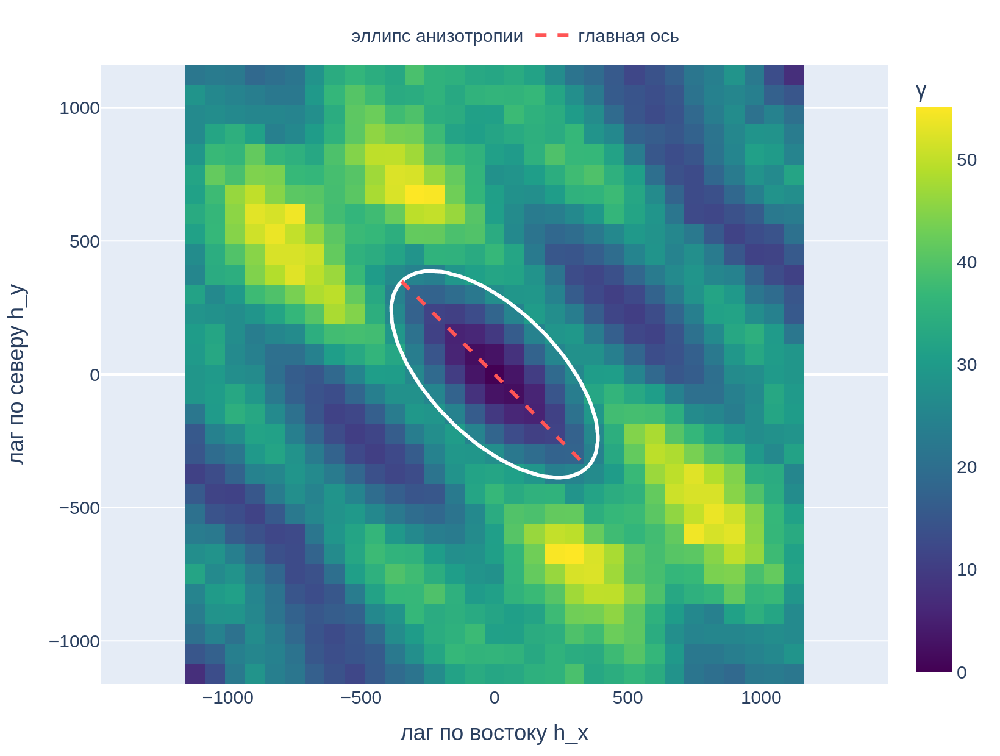{width=80%}

## Parameters

| Parameter | What it sets | Default / advice |
|----------|-----------|----------------------|
| Points with values | A point layer of wells or samples. | - |
| Z value field | The numeric attribute to analyse: roof elevation, thickness, grade. | remembered between runs |
| Bins per half-axis (map detail) | Into how many cells each lag half-axis is split. The map comes out (2N+1)×(2N+1) in size. More bins - a more detailed map, but fewer pairs per cell and more noise. | 15 |
| Max. lag, in layer units | The map window size, in layer units (for metric coordinates - metres). 0 = half the extent diagonal. | 0 |
| Min. number of pairs per cell (adv.) | Cells with fewer pairs are left empty. Cuts off noisy far lags where pairs are few. | 5 |
| Report (HTML) | A report with the heatmap, the ellipse, the major axis and a summary of estimates. | temporary file |
| Surface raster (opt.) | The γ surface as a raster in lag coordinates (see below). Not created by default. | off |

The parameter marked "adv." is in the collapsed **Advanced Parameters** section.

## Estimating the azimuth, anisotropy and range

Besides the map itself the tool outputs to the Log and the HTML report three numbers: the major-axis azimuth (geographic, 0 - north, clockwise), the anisotropy coefficient as the ratio of the minor axis to the major (1 - isotropic, less - more elongated) and the major-axis range. The estimate works like this: along each direction the lag at which γ reaches the plateau (close to the data variance) is found, the ranges are smoothed over azimuth, the major axis is taken at the largest range, and the minor perpendicular to it.

These three numbers are substituted into the 2D Kriging variogram structure: azimuth, anisotropy (minor/major) and range a. This is exactly how anisotropy enters kriging. The estimate is indicative: it should be checked against the shape of the heatmap itself, not transferred blindly. The azimuth the map determines most reliably; the range and the coefficient are cruder, especially on a sparse network.

To avoid transferring the numbers by hand, the dialog has a **Write anisotropy to a profile** field. Pick a previously saved profile, and the azimuth, the coefficient and the major-axis range are written into it on top of the model and nugget set in **Variogram**. The next time the profile is loaded in **2D Kriging**, these values are applied automatically and appear in the caption under the profile list. If the range hit the window, it is left unchanged and only the azimuth and the coefficient are updated.

If the structure is close to isotropic or the major-axis range turns out smaller than a few map cells, anisotropy is not estimated and is marked in the report as "not expressed". In this case the ranges lie at the grid level and the directionality is unreliable - it is more honest to report this than to give a random azimuth. It helps to reduce the max. lag or increase the number of bins to resolve the near structure.

## When the range hits the window

If along the major axis γ does not manage to reach the plateau within the window, the range is returned equal to the max. lag, and a warning appears in the report and the Log: the range hit the max. lag, this is a lower bound. This is the same situation as for an ordinary variogram (see "Maximum distance and reaching the plateau"): the curve did not reach the plateau, and the sill is obtained by extrapolation. On the map the sign is simple - the dark area along the major axis stretches to the very edge.

In this case the range a cannot be carried into kriging as is: the real correlation length is larger than the window, and the anisotropy coefficient is understated in strength (the field is in fact even more anisotropic). The azimuth, meanwhile, is usually determined normally. The cure is to increase the max. lag so the map captures the plateau. And if γ does not reach the plateau even in a wide window, a trend dominates the data - it is removed before interpolation or accounted for with the appropriate kriging type.

## The surface raster

If desired, the map is also saved as a raster (the **Surface raster** field). It is the same γ surface but in lag coordinates: the origin at (0, 0), the pixel size equal to the lag cell. The raster is not georeferenced - it lies in the separation space, not in the deposit plan - and is meant for those who want to spin the map on the QGIS canvas, apply their own colour scale or measure a lag with a ruler. The HTML report is enough for the anisotropy estimate itself.

If the data are clustered unevenly, set the optional **wt** weight field from tool **1.01 Declustering**. Each pair of points is then taken with a weight equal to the product of its endpoints' weights, and clusters do not inflate the near lags. The pair count in the report shows the raw number of pairs, while γ itself is computed with weights.

# 1.07 Variogram cross-validation

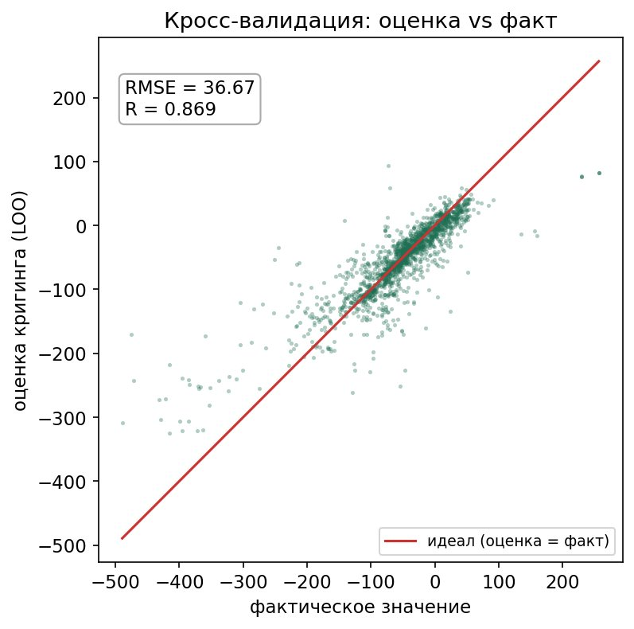{width=70%}

{width=98%}

The tool checks how well the variogram is fitted, by the leave-one-out method: each well in turn is excluded, its value is predicted by kriging from all the rest, and compared with the actual one. This way the parameters (nugget, range, model) are tuned by error rather than subjectively.

Parameters:

| Parameter | What it sets | Default / advice |
|---|---|---|
| Points with values | Source points (wells). | - |
| Value field Z | The numeric attribute being checked. | - |
| Well-number field | An ID field for labels in the report and residuals layer. | optional |
| Kriging type, radius, min/max points, nugget, structures | Kriging and variogram settings. The check runs kriging with exactly these, so a good set carries into "2D Kriging" unchanged. | as in "2D Kriging" |
| Remove polynomial trend | Regression kriging: the trend is refit at each LOO step, the gain shows in the RMSE. | off |
| Trend degree | A plane or a quadratic surface. | 1 (plane) |
| Load processing profile | Apply a saved model over the dialog fields. | (none) |
| Save profile as | Save the validated model to a profile (with anisotropy). | empty = do not save |
| Residuals layer (points) | Points with actual/estimate/error fields (see the field table below). | optional |
| Cross-validation report (HTML) | Interactive report: estimate vs actual, histogram, QQ-plot, metrics. | created by default |

The Log outputs the metrics:

**ME (mean error)** - the systematic error. Should be close to 0 (unbiasedness).

**MAE and RMSE** - the mean and root-mean-square prediction error. The smaller, the more accurate. But RMSE alone is not enough: it is minimal at a zero nugget (overfitting), although the uncertainty is then estimated wrongly.

**MSDR (standardized error)** - the mean square of the error divided by the kriging standard error. Should be close to 1. If MSDR is noticeably above 1 - the variance is underestimated (the nugget or sill are small). If below 1 - overestimated.

**R** - the "estimate - actual" correlation coefficient.

It is useful to distinguish two sides. The "estimate - actual" cloud and the RMSE speak of the **prediction accuracy**. How correct the **model** itself is - i.e. whether the variogram honestly describes the uncertainty - is shown by the standardized errors: an MSDR near 1 and the QQ-plot. For kriging both sides are valuable: a small RMSE with an MSDR near 1 means the model both predicts well and does not deceive itself about its own accuracy. Chasing RMSE alone is not allowed - it is minimal at a zero nugget, where the uncertainty is understated.

In practice try several variogram variants and compare. A good model gives ME near 0, a small RMSE and an MSDR near 1. If the RMSE pulls toward a zero nugget while the MSDR is huge - this is a sign of overfitting. A small nugget calibrates the uncertainty.

The optional residuals layer (points with fields: the actual value under the validated field's name, z_est, error, abs_error and std_resid, plus the well number if an ID field is set) shows where the model misses: large residuals by absolute value are problem areas, systematic residual signs are a local trend. The layer is automatically named after the validated field and the source, and the fields have aliases - readable names (visible in the attribute table and field properties). std_resid is the standardized residual (estimate − actual) / the kriging standard error, signed: minus - kriging underestimated, plus - overestimated (it is not a variance, a variance is always ≥ 0).

The residuals-layer fields:

| Field | Alias | Description |
|------|-----------|----------|
| `<well number>` | Well number | The value of the chosen ID field (if **Well number field** is set). |
| `<field name>` | Actual (field name) | The actual value of the validated field. |
| `z_est` | Kriging estimate (LOO) | The estimate from the other points (leave-one-out). |
| `error` | Error (estimate − actual) | Estimate minus actual. Minus - underestimated, plus - overestimated. |
| `abs_error` | \|Error\| | The absolute value of the error, \|error\|. |
| `std_resid` | Std. residual (signed) | (estimate − actual) / the kriging standard error, signed. Not a variance (which is ≥ 0). |

Besides the residuals layer the tool by default produces an HTML report (on plotly): an interactive "estimate vs actual" chart with two lines - a grey 1:1 diagonal (the ideal) and a blue Best-fit regression line, an error histogram, a residuals QQ-plot and a metrics table with a recommendations block. The Best-fit slope, intercept and angle are added to the metrics: this is a range-bias indicator. A slope near 1 means the method is equally accurate at low and high values, a slope below 1 means high values are underestimated and low ones overestimated (regression to the mean, the signature of smoothing methods). The data variance is added to the table - a reference for the total sill C0+C. Next to the metrics table a **Kriging parameters** block is shown: only the settings that differ from the defaults are listed (nugget, sill, range, outliers and so on), so you can see which parameters produced these metrics. On the "estimate vs actual" chart, hovering over a point shows the well number and the values, and the eight wells with the largest residuals by absolute value are labelled right on the chart - they are convenient to check first. The report opens in the QGIS result viewer (or in a browser). If plotly is unavailable in the QGIS build, the report is still created - with the metrics table but without charts.

**The residuals QQ-plot.** Shows the shape of the error distribution. The errors are normalized to their own variance (a z-score) and compared with the normal distribution, so the chart reads by shape at any calibration. The uncertainty scale is handled separately by the MSDR in the metrics table. The horizontal axis is the normal-distribution quantiles, the vertical is the normalized error. If the errors are normal, the points lie on the red diagonal. Deviations read at once. Curled ends (S-shaped) - heavy tails, i.e. more large misses than under normality. An overall arc - skew, worth considering a value transform. A separate group broken off the line - an alien population in the data, for example barren samples from replacement zones (where the component is practically absent). Normality matters because the MSDR and the standard-error map rest on it.

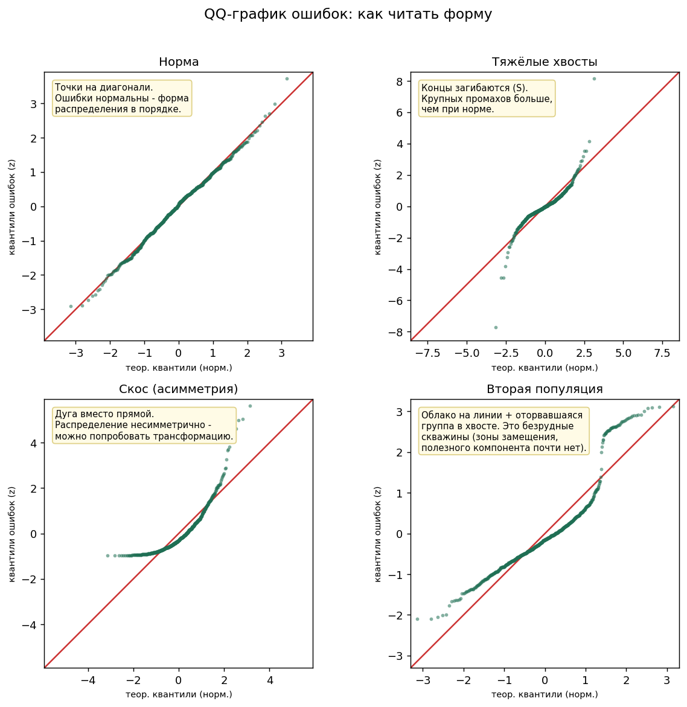{width=92%}

**The main thing - what to do with the results.** The point of the tool is, before building the grid, to approve or correct the whole set of parameters you will then set in **2D Kriging**. This is both the variogram (nugget, sill, range, model, anisotropy) and the kriging settings themselves (search radius, min/max points, type - ordinary or simple): cross-validation computes kriging with exactly the same settings, so a good set is carried into the **2D Kriging** tool unchanged. The order of decisions:

- ME near 0, MSDR near 1, the RMSE and R suit you - the set can be approved: carry these same parameters (the variogram and the search settings) into **2D Kriging** and build the surface.
- MSDR noticeably above 1 - kriging is too "sure of itself", the standard-error map will be understated: increase the nugget C0 or the sill and check again.
- MSDR below 1 - the uncertainty is overstated: reduce the nugget or the sill.
- ME noticeably different from 0 - a systematic shift: check the data and the kriging type (for simple kriging - the specified mean).
- A large RMSE and a low R - the model predicts poorly: try a different range, model or anisotropy (azimuth and axis ratio). If nothing helps - it is the data's limit: short-range variability the network does not catch (e.g. ore replacement zones - on the chart above this is the vertical band at an actual value near 0).

The residuals layer prompts pointwise: where the residuals are large - the network should be densified (add wells) or the samples checked. Where the residuals are systematically of one sign over the area - there is a local trend kriging did not account for.

In sum: this tool is the last step before the final kriging. First you calibrate the variogram here by error, then set the same parameters in **2D Kriging** - and the surface together with the standard-error map come out justified rather than fitted subjectively.

A note on speed: the check solves kriging as many times as there are points, so on large sets (tens of thousands of wells) it runs noticeably longer. Reduce the sample if needed.

If the data are clustered unevenly, set the optional **wt** weight field from tool **1.01 Declustering**. The ME, MAE, RMSE, MSDR and R metrics are then computed with weights, so a dense cluster of wells does not dominate the quality assessment. The leave-one-out estimate itself is unchanged, only the summary is weighted.

# 1.08 Method cross-validation (LOO)

Leave-one-out control for a gridding method: kriging or minimum curvature. Each validation point is removed in turn, its value is predicted by the method from the rest and compared with the fact. The errors give quality metrics - an objective measure of the method and a way to compare methods on your own data.

This differs from **1.07 Cross-validation of the variogram**: that one fits the variogram model for kriging, while this one compares gridding methods as such and works for minimum curvature too.

Metrics: **ME** (bias, closer to 0), **MAE** and **RMSE** (smaller is better), **R** (correlation of estimate and fact). For kriging there is also **MSDR** (closer to 1 when the standard-error scale is adequate). The estimate-vs-fact chart has two lines: a grey 1:1 diagonal (the ideal) and a blue **Best-fit** regression line. Its slope, intercept and angle go into the metrics as a range-bias indicator. A slope near 1 means the method is equally accurate at low and high values, a slope below 1 means high values are underestimated and low ones overestimated (regression to the mean, the signature of smoothing methods).

Three Surfer-style options are available. A **random subset** of N points speeds control on large data, while the whole sample still takes part in each estimate. An **area filter** restricts validation to a subarea by extent and by Z value, useful to avoid control at known anomalies. An **exclusion buffer** in X and Y drops points in a rectangle around the validation point, needed for dense clusters, otherwise the estimate just repeats the nearest neighbour.

| Parameter | Purpose | Default |
| --- | --- | --- |
| Points with values | Samples. | - |
| Value field (Z) | Numeric field. | - |
| Well id field | For labels in the report. | - |
| Method | Kriging or minimum curvature. | Kriging |
| Points to validate | 0 = auto, min(N, 100). | 0 |
| Exclusion buffer in X, Y | Rectangle around the point, neighbours in it are left out. | 0 |
| Kriging parameters | Variogram and search (as in 1.1). | - |
| Min curvature parameters (Adv.) | Extent, cell, tension, threshold, iterations. | auto |
| Validate only within the extent (Adv.) | Control area by X/Y. | everywhere |
| Validate where Z is in range (Adv.) | Control area by value. | none |
| RNG seed (Adv.) | For a reproducible subset. | 0 |
| Cross-validation errors | Point layer with fact, estimate and error fields. | - |
| HTML report | Estimate-vs-fact plot, histogram, metrics. | default |

For minimum curvature each point is re-estimated from a warm start off the full solution, so a single pass is fast. On very large samples reduce the number of validation points.

If the data are clustered unevenly, set the optional **wt** weight field from tool **1.01 Declustering**. The ME, MAE, RMSE, MSDR and R metrics are then computed with weights, so a dense cluster of wells does not dominate the quality assessment. The leave-one-out estimate itself is unchanged, only the summary is weighted.

# 1.09 Processing profiles

A profile is a named set of processing settings for one parameter: the variogram (nugget C0, model type, contribution C, range a, azimuth and anisotropy axes) plus outlier removal (percentile, bounds, capping mode). Profiles are handy when a project has several seams or zones of different variability: you fit a model for a seam once and reuse it in kriging without re-entering the numbers.

Profiles are stored globally in the QGIS settings, so they are available across all projects: build a seam's model once - apply it anywhere. A profile describes one variogram structure - exactly as much as kriging uses.

## Where profiles come from

- **Variogram** - the **Save profile as** field. The fitted model is saved. The curve is built isotropic, so the azimuth and axes are written as neutral (0 and 1) - anisotropy is set later.
- **Cross-validation** - the **Save profile as** field. The validated model is saved together with the set anisotropy. This is the main way to get a profile with an azimuth and axes.
- **Processing profiles** - the **Save manually** action: all profile values are entered in the fields of the **Advanced Parameters** section.

## Application

In the **2D Kriging** and **Cross-validation** tools the **Load processing profile** field substitutes the chosen profile over the dialog fields. What exactly is substituted is printed to the Log.

## Management

The **Processing profiles** tool itself manages the storage via the **Action** parameter:

| Action | What it does |
|----------|-----------|
| Show list | Outputs all profiles with their parameters to the Log. |
| Save manually | Saves a profile with the name from the **Profile name** field by the values of the fields in **Advanced**. |
| Delete selected | Deletes the profile chosen in the **Profile** field. |
| Clear all | Deletes all profiles. |

Saving under an existing name overwrites the profile. The profile lists in the drop-down fields (the choice for deletion, the load in kriging) refresh when the tool window opens: after saving a profile, reopen the tool so it appears in the list.

Below the profile drop-down, in the line beneath it, the parameters of the chosen profile are shown (nugget, type, contribution, range, azimuth, axes, outliers). In **2D Kriging** and **Cross-validation** a reminder is shown there as well that the computation will use the profile rather than the dialog fields. On QGIS builds without the old widget API the caption does not appear - an ordinary list remains (this does not affect the work).

# 1.10 Create sample wells (demo)

The **Create sample wells (demo)** tool builds a point layer with random coordinates and three structured fields: the absolute roof elevation (roof), the thickness (thick) and the grade of an abstract component X (%). The roof and thickness ranges are set after the model of an industrial seam (KrII). The tool is meant for learning and testing kriging, isolines and cross-validation without real data.

Parameters:

| Parameter | What it sets | Default / advice |
|---|---|---|
| Area (extent) | The generation rectangle (by layer, canvas, coordinates, drawing). | - |
| Number of wells | How many points to create. | 300 |
| Minimum / maximum of value X | The component grade range. | 0 / 50 |
| Smoothness (fraction of extent) | Correlation range as a fraction of the extent: larger - bigger "patches". | 0.15 |
| Roof, thickness: min/max (Adv.) | Ranges of the roof and thick fields. | as for KrII |
| Nugget fraction (Adv.) | Share of variance on short-range noise: larger - less predictable. | 0.35 |
| Add a categorical mineral-type field | A mintype field (silvinite, replacement) for indicator kriging. | off |
| Add a head field | A head field with a regional slope for the flow gradient. | off |
| Add K and T fields and head | Head plus log-normal K (m/day) and T = K·thickness for the specific discharge (Darcy). | off |
| RNG seed (Adv.) | Reproducibility of the generation. 0 = random. | 0 |
| Declustering weight field (Adv.) | **wt** weights from tool **1.01**, optional. | none |
| Sample wells (demo) | The output point layer. | - |
| Drift surface (raster) + dz field | Enable the output to get an s raster and a dz field for external drift. | off (skipped) |

At start the Log outputs the starting variogram (total sill ≈ the data variance, nugget, range). The generated data have a recoverable variogram, so it is convenient to learn the whole cycle on them: build a grid in **2D Kriging**, then isolines, and check the parameters with cross-validation.

Two checkboxes and a separate output add optional fields for learning the related tools. **Add a categorical mineral-type field** adds a mintype field with a silvinite background and replacement spots for categorical indicator kriging. **Add a head field** adds a head field with a pronounced regional slope for the hydraulic gradient: krige head, feed the raster to the flow tool, and the arrows follow the head downhill. Enabling the **Drift surface** output writes, as a separate raster, a smooth secondary surface s known everywhere, and adds a dz field linearly related to it. This pair is for learning external drift kriging: krige dz with the s raster as the drift and compare it with plain kriging of dz without the drift. If the drift-surface output is skipped, the dz field is not added. The **Add K and T fields and head** checkbox generates head and log-normal K (hydraulic conductivity, spanning orders of magnitude as in real pumping tests) and T = K·thickness. They are for learning the Darcy specific discharge: krige K and T in **2D Kriging** with the **ln** transform (or ln fields by hand), plus head, then feed the rasters into the **Specific discharge** tool.

Result fields:

| Field | Type | Holds |
|---|---|---|
| well | text | Well number, format SK-0001. |
| roof | number | Absolute roof elevation of the seam, m. |
| thick | number | Seam thickness, m. |
| X | number | Grade of the abstract component, %. |
| head | number | Head (piezometric level), m. With the head checkbox or the K and T checkbox. |
| K | number | Hydraulic conductivity, m/day (log-normal). Only with the K and T checkbox. |
| T | number | Transmissivity T = K·thickness, m²/day. Only with the K and T checkbox. |
| mintype | text | Mineral type (silvinite, partial replacement, rock salt). Only with the mineral-type checkbox. |
| dz | number | A value linearly related to the drift surface. Only when the drift-surface output is enabled. |

The full list of output-layer fields is in the **Sample wells (demo)** appendix section ("Demo-layer fields" at the end of the manual).

# 1.11 Create a geophysical-profiles example (demo)

The tool creates a point layer of geophysical profiles for learning and testing without real data. Several parallel profiles with pickets are built. There are two modes.

**Electrical prospecting.** Along the profiles apparent resistivity rho_k (Ohm*m), self-potential SP (mV) and induced polarisation IP (mV/V) are set. The data contains a low-resistivity anomaly - a water-bearing or replaced zone. There rho_k drops from a background of tens of Ohm*m to units, and SP shows a negative minimum. This matches field practice: the lowest resistivities are typical of sedimentary rocks, while salt, gypsum and anhydrite are high-resistivity, and water saturation or salinisation drives the resistivity down. The anomaly is set as a compact spot rather than a stripe, so the profiles are not synchronous and interpolation shows a local focus rather than a solid band.

**Subsidence (trough).** The value is settlement (mm) as a subsidence trough over a mined area, across several observation tours. The trough deepens from tour to tour and is capped at two metres in magnitude. The sign is uniform: down (negative) or magnitude (positive), by choice. The edges are strictly zero - away from the mined area there is no subsidence. At the same pickets you can compute the **settle** difference between tours to get the settlement rate.

The workflow repeats the main one: the **rho_k** (or **settle**) field is interpolated with **1.02 2D Kriging** or minimum curvature, isolines are built from the grid with **1.04**, and the anomaly is outlined. The **sp** field can be interpolated the same way and its SP minimum compared with the rho_k drop. The **rho_true** (or **settle_true**) field is the embedded noise-free value, a reference for checking interpolation accuracy.

## Kriging or minimum curvature

Geophysical profiles are a typical case where the choice of interpolation method matters more than its tuning. The data are dense along the profiles and sparse between them, while the quantity itself (resistivity, potential) is physically smooth and continuous.

Kriging faithfully reflects the uneven network: without tuning the variogram anisotropy it stretches the structure along the survey lines, and the field breaks into bands along the pickets. Minimum curvature (**1.03**) imposes a physically meaningful smoothness and stitches the separate profiles into a connected surface, so for profile surveys and potential fields it is usually preferable. The same holds for the **sp** field: the SP minimum appears as a single body rather than columns. It is most vivid on subsidence: the trough is a compact axisymmetric bowl, and kriging rolls it into a band along the profiles, while minimum curvature restores the bowl with a clear centre.

Practical takeaway: build fields from profiles with minimum curvature, and use kriging when the variogram anisotropy is tuned to the network geometry.

The area is set by an extent. The mode, ranges, number of tours and surface elevation can be changed under **Advanced**.

| Parameter | Purpose | Default |
|---|---|---|
| Extent | Generation bounds. | - |
| Mode | Electrical prospecting or subsidence. | Electrical prospecting |
| Number of profiles | How many parallel profiles. | 4 |
| Picket step, m | Distance between pickets. | 20 |
| Background rho_k, Ohm*m (Adv.) | Resistivity outside the anomaly. | 60 |
| Minimum rho_k, Ohm*m (Adv.) | Resistivity at the spot centre. | 10 |
| SP amplitude, mV (Adv.) | Depth of the SP minimum, usually below 0. | -100 |
| IP amplitude, mV/V (Adv.) | Height of the IP anomaly. | 15 |
| rho_k noise (Adv.) | Spread fraction in log scale. | 0.06 |
| Maximum subsidence, mm (Adv.) | Trough depth at the last tour. | 400 |
| Number of tours (Adv.) | How many cycles for subsidence mode. | 2 |
| Subsidence sign (Adv.) | Down (negative) or magnitude (positive). | Down |
| Elevation: base and amplitude, m (Adv.) | Smooth surface relief. | 120 and 15 |
| Geophysical profiles | Point layer with the fields. | - |

Electrical fields: **profile** (profile number), **picket_m** (picket in metres from the profile start), **pk** (a PK label, e.g. PK5+20), **z** (surface elevation, m), **rho_k** (rho_k, Ohm*m), **rho_true** (rho_k without noise), **sp** (SP, mV), **vp** (IP, mV/V).

Subsidence fields: **profile**, **picket_m**, **pk**, **tour** (tour number), **z** (elevation, m), **settle** (subsidence, mm), **settle_true** (subsidence without noise).

# Topography: terrain from open data

The **"2. Topography"** group answers a frequent request: the best possible terrain model from open data, out of the box. The front door is the DEM downloader by extent, next to it the vector base map from OpenStreetMap, the Topo2Raster core that builds terrain from points and contours, and the full hydrology set: depression filling, flow and accumulation, the river network, basins, slope with aspect, and peaks. All the analytics run on pure NumPy, without GRASS, SAGA or external modules.

Next to it stands the **"2. Topography: diagnostics and repair"** group. It holds the tools that check a finished relief: splitting contours into sets, the residual against the DEM and the search for terracing. A separate group is needed because Processing has no subgroups, and keeping the checks inside the working chain is awkward: they break the sequence of building. The tool numbering stays continuous with topography.

All output layers of the group land in the **Topography** group of the layer tree, so they do not drown among the working layers of the project. The tools of the group chain together. Downloader 2.01 delivers a ready metric DEM that goes straight into isolines (1.04) and any computation of the group. Watercourses from 2.02 and the river network from 2.06 fit Topo2Raster (2.03) as streamlines as is, because their vertices run downstream.

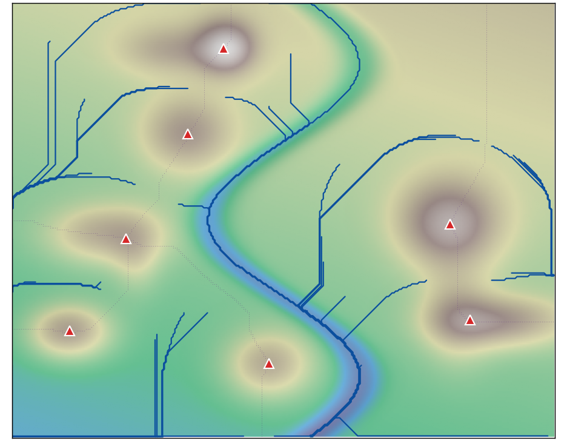{width=88%}

The full list of output-layer fields is in the **Electrical-prospecting / Subsidence profiles** appendix section ("Demo-layer fields" at the end of the manual).

# 2.01 Download DEM by extent

Downloads a DEM by extent from an open store, no registration or keys, from one of two sources. One-degree tiles are mosaicked seamlessly and reprojected into a metric coordinate system with cubic resampling. Raw degree tiles never enter the analysis, so the GLO-30 peculiarity north of latitude 50 (a coarser longitude step) is handled automatically.

| Parameter | What it sets | Default / hint |
|---|---|---|
| Terrain source | GLO-30 (Copernicus, DSM: heights over canopy and roofs) or GEDTM30 (DTM with forest and buildings removed, machine learning from ICESat-2/GEDI). | GLO-30 |
| Download extent | Extent in any CRS, converted to degrees automatically. | - |
| Target CRS | Metric output CRS. Empty = project CRS if metric, otherwise UTM by extent center. | empty |
| Cell size, m | Output grid step after reprojection. | 30 |
| Smooth terrain (FPDEMS) | Edge-preserving smoothing (see below). off = raw source raster. | off |
| Hydrological correction | Filling of false depressions so water flows down. Uncheck for karst and subsidence troughs. | on |
| Smoothing: normals window, cells (adv.) | Side of the normals filter window, odd. | 11 |
| Smoothing: normals difference threshold, deg (adv.) | Edge-preservation strictness: lower = more aggressive preservation. | 15 |
| Smoothing: number of passes (adv.) | Outer elevation-rebuild steps. | 2 |
| Slope epsilon for filling, m (adv.) | Minimum slope on flats. 0 = raise pits to the outlet only. | 0.001 |
| Limit of 1x1 degree tiles (adv.) | Guard against an oversized extent for GLO-30. | 25 |
| DEM (metric CRS) | Output float32 raster, layer in the Topography group. | - |

**Terrain source** is the key choice. **Copernicus GLO-30** is a digital surface model (DSM): heights are taken over the top of canopy and rooftops, distributed as one-degree tiles. **GEDTM30** is a digital terrain model (DTM) by OpenGeoHub under CC BY 4.0: forest and buildings are removed by machine learning from ICESat-2 and GEDI data, so under forest canopy GEDTM30 is markedly more accurate, confirmed by independent validation. It is distributed as a single global cloud-optimized GeoTIFF. For forested terrain the DTM is usually preferable, for open areas the difference is small.

Parameters:

- **Download extent** - the extent in any CRS, converted to degrees internally to pick the data.
- **Target CRS** - the metric CRS of the result. Leaving it empty enables the automatics: the project CRS is taken if it is metric, otherwise the UTM zone at the extent center. A degree target CRS is rejected with a clear message.
- **Cell size, m** - 30 by default, the native GLO-30 resolution.
- **Hydrological correction** - on by default: spurious depressions are filled right away (see 2.04) so water flows downhill on the model. For tasks where closed basins matter (karst, subsidence troughs) uncheck the box.
- Under **Advanced**: **Slope epsilon for filling** and **Tile limit** (a guard against an accidental extent covering half a country).

A network failure or an extent entirely in the ocean ends with a clear message rather than an empty raster. Data source: Copernicus DEM © ESA, the open license allows use with attribution.

# 2.02 Download base topography by extent

The vector twin of the DEM downloader: for the same extent it fetches terrain-related layers from OpenStreetMap.

| Parameter | What it sets | Default / hint |
|---|---|---|
| Download extent | Extent of the OSM Overpass request. Keep it modest - large requests are cut by the server. | - |
| Extent area limit, square degrees | Guard against an oversized request. | 0.5 |
| Request timeout, s | Overpass response wait; on failure the tool switches to a mirror. | 90 |

Output layers: watercourses, water bodies (planes), peaks with the **ele** field, cliffs (barriers). All land in the Topography group.

- **Watercourses** - rivers, streams and canals. In OSM watercourses are drawn downstream, so the layer fits 2.03 as streamlines without preparation.
- **Water bodies** - closed outlines of lakes and ponds, constant-elevation planes for 2.03. Compound multipolygons (large lakes assembled from several ways) are skipped by the first version.
- **Peaks with elevations** - natural=peak points with the ele elevation, ready summit marks for 2.03 and a control for 2.09.
- **Cliffs and embankments** - terrain breaklines for 2.03.
- **Coastline** - off by default, needed on coastal territories.

Output is in the project CRS, lines are clipped to the extent. Public Overpass servers have limits, on a failure of the main server the request goes to a mirror, for large territories shrink the extent or raise the area limit under **Advanced**. Data: © OpenStreetMap contributors, ODbL license.

# 2.03 Topo2Raster (terrain from vectors)

Builds terrain from vector data by multigrid interpolation from a coarse grid to a fine one, in the spirit of ANUDEM. The tool covers the classic task: digitized contour lines of a topographic plan, spot elevations, rivers and lakes are at hand, and a correct grid is needed.

| Parameter | What it sets | Default / hint |
|---|---|---|
| Elevation points | Layer of spot heights (e.g. peaks from 2.09). | - |
| Point elevation field | Z attribute of the points. | - |
| Isolines | Contour layer (digitized plan or 1.04 over a DEM). | - |
| Contour elevation field | Level attribute of the contours. | ELEV |
| Streamlines (downstream) | River lines, vertices pointing downstream. The 2.06 network and OSM fit as is. | - |
| Cliffs (smoothing barriers) | Lines along which the drop is not smeared. | - |
| Weight of measured elevations (adv.) | In a shared cell a measurement outweighs a digitized contour vertex. 1 = as before. | 1 |
| Top of forms, Bottom of forms | The sides of forms with elevations: crests and toes, ridges and bases, a summit as a point. See the section on the surface between structural lines. | - |
| Form link field | The same value on every object of one form. | link |
| Elevation field of form sides (adv.) | When the lines carry no Z. | - |
| Shape function across (adv.) | Linear is a design slope, smooth rounds the edges. | linear |
| Lakes and water edge | Water-body planes. | - |
| Water-edge elevation field | Water-edge elevation. Empty = node Z (slope) or shore minimum. | empty |
| Extent | Output extent. Empty = from input layers. | empty |
| Cell size, m | Output grid step. | 30 |
| Fill depressions in the result | Hydrological correction of the result. | on |
| Smoothing iterations per level (adv.) | Passes of internal field smoothing. | 60 |
| Minimum streamline drop, m/cell (adv.) | Guaranteed slope along rivers. | 0.01 |
| Slope epsilon for filling, m (adv.) | Minimum slope on flats during filling. | 0.001 |
| Terrain | Output float32 raster. | - |

Points or isolines are required (at least one elevation source). Water-edge priority: node Z (river slope) over the elevation field (plane), field over shore minimum.

Every input type works as its own constraint:

- **Elevation points** and **contours** - hard nodes, the surface passes through them exactly. At least one of these layers is required, each with a numeric elevation field.
- **Streamlines** - a forced monotonic drop downstream. Line vertices must run downstream: OSM watercourses (2.02) and the river network (2.06) fit as is. The minimum drop per cell is set under **Advanced**.
- **Cliffs** - smoothing barriers. The surfaces on the two sides of a cliff are independent, the step is not smeared. The line itself, one cell wide, gets an intermediate elevation, a limitation of the first version.
- **Water edge** - three height priorities per feature, and a layer may mix types. If a polygon has three-dimensional vertices (Z at nodes), the edge is interpolated from their heights and sloped along the channel - this is how a river's falling level from source to mouth is set. If there is no Z but an elevation field is filled, the feature is held as a horizontal plane. With neither, the level is taken automatically from the minimum of the adjacent shore. Mixed feature types in one layer are handled each by its own branch: a lake as a plane, a river as a slope.

Inside, a two-stroke cycle runs at every grid level: membrane smoothing sets the frame and holds the constraints, then minimum-curvature polishing (the Briggs stencil) removes the membrane bias between curved contours. On a round-trip test (demo relief, contours every 4 m, reconstruction, comparison with the original) the polishing cuts the error by roughly a third. The residual maximum error lives on summits above the last contour, so summit marks in the input visibly improve the tops - exactly why topographers label them on maps.

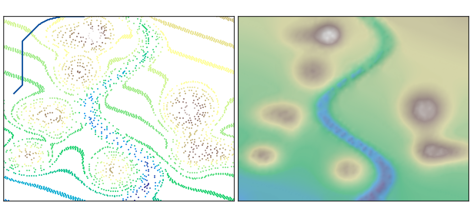{width=92%}

The default extent is taken from the layers with a two-cell margin. All layers are brought to the CRS of the first given layer, which must be metric. The final **depression filling** is on by default, its logic is described in 2.04.

## Three-dimensional thalwegs

A thalweg without elevations works as a condition: a downstream fall is maintained along it, while the actual height is decided by the interpolator from the surrounding data. When the line carries vertex elevations, they become hard nodes, and a survey along the channel starts setting the bed rather than hinting at the direction.

The elevations are then brought once to a downstream fall. The reason is not tidiness but the way the computation works: a channel survey is noisy, some vertices go uphill, and such a node would fight the fall enforcement on every iteration. Relaxation pins the cell to the elevation, the enforcement pushes it lower, and round it goes. After the correction the enforcement becomes a no-op and there is nothing left to fight.

The correction only goes downwards: the tool never invents an elevation above the measured one. Its largest value is printed to the log, and it shows how noisy the survey was.

Cells where a thalweg elevation disagrees with another node by more than five centimetres are counted separately. Usually this is a channel crossing a contour, and the thalweg wins there. The number of such places is reported as a warning: such a disagreement must not be resolved silently.

A line without elevations behaves as before, and a mixed layer is handled object by object.

## The boundary of the build area

A polygon limits the surface the same way an outer boundary does in design systems: beyond it no raster is output, there is nodata.

What matters is not the clipping itself but the moment it is applied. The mask goes on **after** the interpolation rather than by clipping the input data. Points, contours and thalwegs beyond the boundary keep shaping the surface right at it, so the edges do not curl. Had we clipped the input instead, an artificial break would appear at the boundary: the interpolator would have nothing to lean on from the outside.

Supply the boundary layer in any coordinate system, the geometry is transformed automatically. The log prints how many cells fell inside and what share of the area that is. If none did, the run stops with a note to check the coordinate system: that is almost always the reason.

# 2.04 Terrain preparation

Prepares a DEM for analysis with two independent modifications, each toggled by its own checkbox, in a fixed order: smoothing first, then filling.

| Parameter | What it sets | Default / hint |
|---|---|---|
| Input DEM | Terrain raster to prepare. | - |
| Smooth terrain (FPDEMS) | Edge-preserving smoothing (see below). | off |
| Fill depressions | Filling of false pits (Planchon-Darboux). | on |
| Slope epsilon, m (0: pits only) | Minimum slope on flats. 0 = raise pits to the outlet, above zero = a through slope for D8. | 0.001 |
| Smoothing: normals window, cells (adv.) | Side of the normals filter window, odd. | 11 |
| Smoothing: normals difference threshold, deg (adv.) | Edge-preservation strictness: lower = more aggressive. | 15 |
| Smoothing: number of passes (adv.) | Outer elevation-rebuild steps. | 2 |
| Prepared DEM | Output float32 raster. | - |

Order: smoothing first, then filling. Both modifications are independent, each with its own checkbox.

**Smooth terrain (FPDEMS)** removes the excessive roughness of satellite models. Satellite DEMs are noisy, and ordinary filters - mean, median, Gaussian - cut the noise together with edges, terrace walls and banks: the breaks get flattened. FPDEMS (Lindsay, Francioni, Cockburn, 2019) works differently. It operates on the field of surface normals rather than heights directly: it first computes each cell's normal, then smooths the normal field so that a neighbour enters the average with a weight the larger the closer its normal is to the central one. At an edge the neighbours' normals diverge sharply, the weight drops, the edge is preserved. After that the heights are pulled towards the smoothed normal field. As a result flat areas are smoothed while structural lines stand. The **normals-difference threshold** (in **Advanced**) controls the strictness: a smaller value preserves edges more aggressively, a larger one smooths more overall. The method was originally proposed for lidar DEMs but is equally useful for satellite ones.

**Fill depressions** with the Planchon-Darboux method raises spurious pits so flow does not stop. Depressions in raster models are most often interpolation and noise artifacts, and hydrological analysis without filling breaks at the first pit. **Slope epsilon** controls the mode: with zero only true pits are raised exactly to the spill level, flat areas stay flat. With a positive value (0.001 m by default) a through slope is additionally built across flats, and D8 becomes defined on them. Flow and accumulation need a positive epsilon. Cells on the grid border and next to nodata are treated as outlets. The report prints the number of raised cells and the maximum raise - a handy indicator of the source DEM quality.

The same smoothing checkbox is present in DEM download (2.01) for a quick path right at download time. The standalone tool 2.04 is needed when the terrain came not from 2.01 but from your own data.

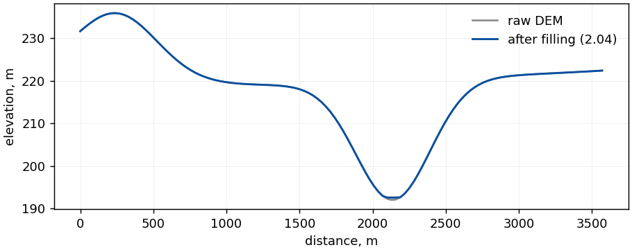{width=85%}

# 2.05 Flow and accumulation (D8)

Computes flow directions over eight neighbors (D8, Jenson-Domingue) and accumulation: how many cells drain into each one, itself included. Directions are coded as in ArcGIS: E=1, SE=2, S=4, SW=8, W=16, NW=32, N=64, NE=128, sink=0, nodata=255.

| Parameter | What it sets | Default / hint |
|---|---|---|
| Input DEM | Terrain raster. | - |
| Fill depressions before computing | Hydrological correction before D8, otherwise flow stalls in pits. | on |
| Slope epsilon for filling, m (adv.) | Minimum slope on flats. | 0.001 |
| Flow directions (ESRI codes) | Output: byte direction raster. E=1, SE=2, S=4, SW=8, W=16, NW=32, N=64, NE=128, sink=0. | - |
| Accumulation, cells | Output: float32, number of upstream cells. | - |

The border semantics are deliberate. A cell on the grid frame leaves the grid only when it has no lower neighbor inside, otherwise flows running along the edge would break. A shore cell, on the contrary, pours into an adjacent nodata (the sea, a cutout) even when a lower land neighbor exists.

The **Fill depressions before computing** checkbox is on by default: on a raw DEM flow stops in pits and accumulation breaks. The computation is fully vectorized, a 2000×2000 grid takes seconds.

# 2.06 River network

Extracts the river network from a DEM: cells with accumulation at or above the threshold are linked from heads and junctions downstream.

| Parameter | What it sets | Default / hint |
|---|---|---|
| Input DEM | Terrain raster. | - |
| Accumulation threshold, cells | Minimum catchment cells to start a channel. A denser network = a lower threshold. 1000 at 30 m is about 0.9 sq km. | 1000 |
| Fill depressions before computing | Hydrological correction before tracing. | on |
| Slope epsilon for filling, m (adv.) | Minimum slope on flats. | 0.001 |
| River network | Output: lines with order (Strahler), acc_out, length_m. Vertices point downstream. | - |

The **accumulation threshold** is set in cells and means the catchment area where a river starts: the head catchment area divided by the cell area. For a 30 m DEM a threshold of 1000 starts rivers at a catchment of about 0.9 sq. km. A smaller threshold gives a denser network.

Output fields: **order** - the Strahler order (1 at heads, growing where two equal orders merge), **acc_out** - accumulation at the link outlet, **length_m** - the length. Line vertices run downstream, so the layer fits 2.03 as streamlines without preparation and compares against OSM watercourses from 2.02: overlaying the extracted network on the real one is a quick DEM quality check.

# 2.07 Basins and watersheds

Divides the territory into drainage basins, polygon boundaries are the watersheds.

| Parameter | What it sets | Default / hint |
|---|---|---|
| Input DEM | Terrain raster. | - |
| Pour points | Basin outlet points. Empty = basins from mouths by threshold. | empty |
| Mouth accumulation threshold, cells | Threshold for mouths when no points are given. | 1000 |
| Fill depressions before computing | Hydrological correction before the computation. | on |
| Point snap radius, m (adv.) | An outlet point snaps to the accumulation maximum within this radius. | 150 |
| Slope epsilon for filling, m (adv.) | Minimum slope on flats. | 0.001 |
| Basins (polygons) | Output: polygons with basin, area_m2. | - |
| Basins (label raster) | Output: integer basin-label raster. | - |

Two modes. With **pour points** every point snaps to the cell with the highest accumulation within the snap radius (otherwise a point placed by eye next to a river would collect a tiny hillslope basin) and gathers the whole catchment above itself. Without points the basins are built automatically from mouths: cells where flow leaves the grid with accumulation at or above the threshold. Cells outside every basin get label 0 and are not exported to polygons.

Output fields: **basin** - the basin number, **area_m2** - the area by cell count. A label raster can be written additionally. Labeling runs by pointer jumping over the flow graph, so even long winding catchments take a fraction of a second.

# 2.08 Slope and aspect

Slope in degrees and aspect with the Horn 3×3 kernel, as in gdaldem. Aspect is the downslope azimuth in degrees from north clockwise: north 0, east 90. Flat cells get an aspect of -1 so they are not confused with north-facing ones. Nodata cells and their neighbors get nodata: the 3×3 kernel is not computed across holes.

| Parameter | What it sets | Default / hint |
|---|---|---|
| Input DEM | Terrain raster. | - |
| Slope, degrees | Output: slope raster (Horn 3x3, as gdaldem). | - |
| Aspect, degrees | Output: downslope azimuth, flats = -1. | - |

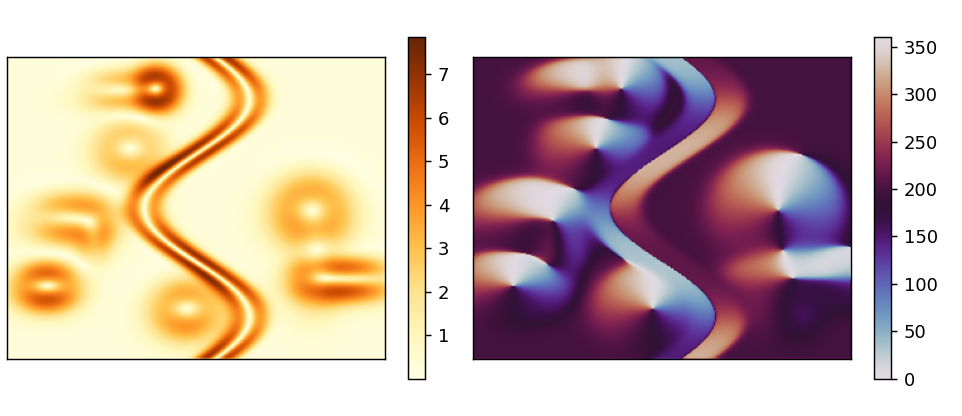{width=92%}

# 2.09 Peaks

Finds peaks: cells that are the highest in a square window of the given radius, with a drop over the window minimum at or above the threshold.

| Parameter | What it sets | Default / hint |
|---|---|---|
| Input DEM | Terrain raster. | - |
| Window radius, m | Suppression of secondary peaks within this radius. | 500 |
| Minimum drop, m | Cuts small bumps below the threshold above their surroundings. | 20 |
| Peaks (points) | Output: points with z, drop. The cure for tops above the last closed contour. | - |

The two filters work as a pair. The **window radius** suppresses secondary tops next to the main one: of two peaks closer than the radius the higher one remains. The **minimum drop** suppresses bumps on a plain: a local maximum rising a meter above its surroundings does not count as a peak. Flat tops give a single peak rather than a scatter.

Output fields: **z** - the elevation, **drop** - the drop over the window minimum. The layer compares against OSM peaks from 2.02: matching the ele marks with the DEM elevations is one more quick data check.

# 2.10 Demo relief

A utility generator: synthetic terrain from a tilted plain, hills and a winding valley with a constant fall. The relief is deterministic by seed, and local depressions are left between the hills on purpose so the filling tool has something to show. All figures of this chapter are built on it.

| Parameter | What it sets | Default / hint |
|---|---|---|
| Width, cells | Demo grid size along X. | 300 |
| Height, cells | Demo grid size along Y. | 300 |
| Cell size, m | Demo grid step. | 30 |
| Generator seed | Reproducibility of the random relief. | 42 |
| Output CRS (metric) | Coordinate system of the demo raster. | EPSG:32640 |
| Compact int16 (adv.) | Integer output for demo shipping. | off |
| Demo relief | Output raster. | - |
| Gauge points (demo) | Three points near the thalwegs for tool 2.15. | created |
| Ditch traces (demo) | Two polylines across the thalwegs for tool 2.16. | created |
| Fraction of the area for the works (Adv.) | Size of the area under the design pad. | 0.4 |
| Pad elevation offset, m (Adv.) | Moves the balance into imported or exported soil. | 0 |
| Design surface (demo) | The pair to the relief for tool 2.18. | off |
| Work areas (demo) | Three polygons for the 2.18 breakdown. | off |

The tool exists for the manual examples, tests and offline work. Live data comes from 2.01. The **Compact int16** checkbox outputs the raster in whole meters for shipping demo fragments.

## A pair of surfaces for volumes

Two outputs, off by default, give a ready pair for tool **2.18 Cut and fill**: a design pad and work area polygons. The pad is horizontal, and outside the work area the natural relief remains.

The pad elevation is the mean of the relief inside the area, and that is not a matter of taste but the exact answer. Volume is a sum of differences multiplied by the cell area, and the net turns to zero exactly when the elevation equals the mean. The median splits cells in half, not cubic metres, and the balance does not close with it. So the demo comes out with a balance that closes, while the elevation offset in the advanced parameters moves it into imported or exported soil: all three verdicts of 2.18 are checked in two runs.

Three demo gauge points and two demo ditch traces are produced along with the relief: a hillside ditch above the strongest thalweg and a gutter further downslope, both polylines with a bend, so that the rasterisation of a turning trace is exercised as well. They are placed at the strongest thalwegs, spread across the grid, and deliberately shifted a few cells aside from the stream, so that the snapping in tool 2.15 can be seen bringing the gauge back onto the stream. The points are deterministic from the same seed as the relief.

## The gully and ravine network

The **Gully and ravine network** tick cuts thalwegs with steep sides into the relief, with tributaries entering at an acute angle. The cut deepens downstream, as in a real gully: shallow at the head, deep at the mouth.

This mode exists for validation sets. A narrow cut between adjacent contours is the hardest place for any interpolation: the contours barely describe it, and a surface built from them shaves the gully off. On a profile across it this shows at once, and tools 2.11 and 2.12 put a number on it.

## Where the demo lands

When no extent is given, the demo lands next to the project layers: their combined extent is brought into the chosen coordinate system and used as the placement. In an empty project there is nothing to go by, so the demo is created at a conventional spot, always the same one, so that the examples in the manual reproduce. In a local coordinate system, a mine grid for instance, that conventional spot turns out far from the working data, so in an empty project set the **Where to place it (extent)** parameter: the relief will land there, with the grid size computed from the extent and the cell size.

# 2.11 Split contours for validation

The tool splits a set of contours into two: one is used to build the relief, the other to check the result. Its purpose is to produce a figure that can be shown to somebody.

## Why split at all

The tempting way to check a relief is simple: take the source contours, read the built DEM at their points and compute the residual. The figure will look good, but it measures something other than it seems. The interpolator has seen those points, they were the input data, and it is almost bound to reproduce them. That is a check of input reproduction, not of predictive accuracy.

A real check needs data the model has not seen. This tool creates them.

## Why the split is by elevation, not by feature

Holding out individual pieces of a single contour is pointless: the neighbouring pieces of the same level give the answer away and the check comes out flattering. So a held-out level disappears entirely, with all of its pieces. The interpolator can restore it only from the neighbouring levels, and that is what prediction means.

The extreme levels of the set always stay in the building set. Beyond the range of the set the interpolator extrapolates, and a residual there would measure something other than what the check is for.

## Outputs

Two layers, **Contours for building** and **Contours for validation**. Both get a **hold** field: 0 for building, 1 for validation. The **Contour residuals against the DEM** tool recognises this field by itself and prints the two figures separately, so feeding it the combined set is easier than running it twice.

## Working order

Split the contours. Build the relief from the building set, with **Topo2Raster** for instance. Measure the residual over both sets at once. Compare the two figures.

## Parameters

| Parameter | What it sets | Default / advice |
|---|---|---|
| Contours (lines) | The source set. | - |
| Elevation field | Numeric field of the contour elevation. | - |
| Hold out every Nth elevation | Thinning step over levels. 4 sends about a quarter to validation. | 4 |
| Selection offset (Adv.) | Shifts the choice of levels so the check can be run over different subsets. | 0 |

# 2.12 Contour residuals against the DEM

The tool measures how well the built DEM reproduces the source contours. At points along a contour the raster value is taken and compared with the elevation of the contour itself. The residual is positive where the DEM lies below the contour.

## The numbers it reports

The mean is the bias: a non-zero value means the surface as a whole is shifted in elevation. SD and RMSE are the spread. The median absolute value resists single outliers, the maximum shows the worst place on the area.

Separately it reports the share of points that miss by more than half the contour interval. This is a practical quantity: if it is noticeable, a contour drawn from such a DEM will not sit where the original one was, and the map stops agreeing with itself.

The tool detects the contour interval from the set of elevations as the smallest difference between adjacent levels. If the set is assembled from different sources, set the interval by hand.

## Two figures instead of one

If the layer carries a **hold** field from tool 2.11, the residual is computed separately for building and for validation, and both lines go to the log. The first says how the model reproduces the input, the second how it predicts. The second is always worse than the first, and that is normal. What matters is the gap between them: if it is large, the model memorises well and generalises poorly, that is, the shape of the relief between the contours is restored wrongly.

Without a **hold** field the tool reports a single figure and warns in the log that this is reproduction of the input.

## The report

The HTML report holds a table of numbers per set, a histogram of residuals with the half-interval bounds marked, the spread of the mean residual by elevation, and a short reading: whether there is a systematic bias, whether the spread is large relative to the interval, whether the share of misses is noticeable, whether there is a gap between reproduction and prediction.

The breakdown by elevation is worth a close look. If the residual grows towards the summits or towards the thalwegs, it speaks of forms being cut off rather than of random noise.

## The point layer

A point layer of residuals is produced with the fields: **fid_src** (the source contour feature), **elev** (elevation), **z_dem** (the DEM value), **resid** and **abs_resid**, **hold**. Colour it by **resid** with a diverging ramp and the places where the surface systematically runs low or high show up at once, without any statistics.

## Parameters

| Parameter | What it sets | Default / advice |
|---|---|---|
| Contours (lines) | The layer with elevations. A combined set with a hold field works. | - |
| Elevation field | Numeric elevation field. | - |
| DEM (the built relief) | The raster being checked. | - |
| DEM band (Adv.) | Raster band. | 1 |
| Sampling step along the contour | 0 means vertices only. Above zero it adds points on long straight legs. | 0 |
| Raster sampling (Adv.) | Bilinear or nearest. Bilinear is fairer for a smooth surface. | bilinear |
| Contour interval (Adv.) | 0 means detect from the elevations. | 0 |
| Residual points | The output point layer. | created |
| Residual report (HTML) | Table, histogram, reading. | created |

# 2.13 Terracing check of a DEM

The tool looks for terracing, the characteristic ailment of a relief built from contours. The slope goes in steps, with a bench near a contour level and an abrupt drop between levels. On a hillshade it looks like a wedding cake, on a profile like a staircase. Slopes in such a relief are wrong, and flow computations over it break down.

## Two independent signs

**Vertical curvature** is the second derivative along the slope. On a stepped surface it spikes at the drops and is close to zero on the benches, and the whole picture repeats the pattern of the contours in bands. The curvature raster is produced as an output, and terracing is visible on it by eye, without any statistics.

**Attraction of elevations to the levels** is a direct check on the values themselves, without derivatives. On a healthy surface the elevations between adjacent levels are spread more or less evenly, so the share of cells in a narrow band around a level is close to the width of that band and the ratio comes out near one. On a terraced surface the elevations stick to the levels and the ratio grows.

The ratio reads like this. Near one means no signs. One and a half is a reason to look at the curvature raster by eye. Two and above means terracing.

The two signs are worth looking at together. Curvature is visually convincing, but its spikes also come from real landforms, from breaks of slope for instance. Attraction to the levels gives a number but does not show where the trouble is. Together they answer both "is there any" and "where".

## The contour interval

The tool computes the phase of an elevation within the interval, so the interval is required. It can be set by hand or taken from a contour layer: then both the interval and the base elevation come from the real set. The second way is safer if the elevations do not start at a round number.

## Flat areas are kept out of the count

Cells with a near-zero slope are excluded from the attraction index. The threshold is a fraction of the interval: a cell is ignored when the elevation drop across it is smaller than a hundredth of the interval. At an interval of 0.5 m that is 5 mm per cell. The **Ignore cells with a drop below, fraction of the interval** parameter sits in the advanced ones, zero turns it off.

Without this screening the index lies on any real matrix that holds a water body. The elevations of a water surface stand still and all fall into one phase within the interval, which skews the distribution, and the index drifts down and reports false health. On a matrix where a reservoir covered 44.5 percent of the area, the index without screening gave 0.50 instead of 0.97, while over land alone it came out at 1.00.

The share of excluded cells is printed to the log and goes into the report. This is worth seeing: if the tool has thrown away half the area, you should know about it rather than wonder why the figure changed.

## The report

The HTML report holds a table of numbers and a histogram of the phase, that is, the distribution of elevations within the interval. A flat histogram means there is no terracing. A peak at zero means the elevations gather at the levels and the surface is stepped.

## The cure

Terracing is cured by breaklines (thalwegs, breaks of slope, ridges) and by denser source data, not by smoothing. Smoothing removes the steps together with the landforms, and the numbers improve while the map gets worse.

## Parameters

| Parameter | What it sets | Default / advice |
|---|---|---|
| DEM (the relief being checked) | The raster being checked. | - |
| DEM band (Adv.) | Raster band. | 1 |
| Contour interval | 0 means take it from a contour layer. | 0 |
| Contours to detect the interval | Optional layer, the interval and base elevation are taken from it. | - |
| Contour elevation field | Numeric elevation field. | - |
| Base elevation of the levels (Adv.) | The datum of the levels when the interval is set by hand. | 0 |
| Half-width of the band around a level (Adv.) | Fraction of the interval. The expected share equals twice this value. | 0.1 |
| Vertical curvature | The output raster. | created |
| Terracing report (HTML) | Table, phase histogram, reading. | created |

# 2.14 Remove steps (clamped smoothing)

The tool treats terracing: it removes the steps from slopes without moving the contours themselves.

## How that is possible

The surface is smoothed iteratively, but every point is forbidden to move away from its original value by more than a set fraction of the interval. By default that is half the interval, which is exactly the quantisation error: a surface built from contours of that spacing is known no better anyway.

Two properties follow. The method cannot invent forms finer than the source interval allows, because the amplitude of the correction is bounded from above. And it cannot throw a point across a contour, since the shift is smaller than half the step between levels.

On a reference stepped relief the attraction index falls from 5.00 to 1.13, and the mean error against the true surface from 1.25 m to 0.12 m.

## The treatment checks itself

The index of attraction to the levels is computed before and after the correction, and both figures go to the log together with the largest actual shift of the surface. If the index stays above two after the treatment, the tool says outright that the steps have not gone and advises adding iterations or checking the interval.

The HTML report holds a table of numbers before and after, two phase histograms side by side and a reading. It is a ready document for a client or a reviewer: what was, what became and at what cost.

## What the tool does not do

It does not bring back what is not in the data. If a narrow cut was shaved off when the relief was built, smoothing will not restore it: the correction is bounded by half the interval and the cut is deeper. Nor does it help on a water surface, where a mask is needed rather than smoothing.

## Parameters

| Parameter | What it sets | Default / advice |
|---|---|---|
| DEM with steps | The raster being treated. | - |
| DEM band (Adv.) | Raster band. | 1 |
| Contour interval | 0 means take it from a contour layer. | 0 |
| Contours for the interval | Optional layer the step is taken from. | - |
| Contour elevation field | Numeric elevation field. | - |
| Smoothing iterations | More means smoother. Fifty is almost always enough. | 50 |
| Allowed shift, fraction of the interval (Adv.) | Zero forbids any correction. | 0.5 |
| Relief without steps | The output raster. | created |
| Before and after report (HTML) | Table, histograms, reading. | created |

# 2.15 Gauge point report

The tool computes watershed morphometry from a **gauge** - a closure point on a stream. This is a classic task of engineering hydrology and site surveys: basin characteristics from a given point. Tools 2.05 - 2.07 give flow, the river network and basins over the territory as a whole, while 2.15 answers the question about one specific gauge.

## How it works

Every gauge point is snapped to the cell of highest accumulation within the snapping radius, so the gauge can be placed by eye next to the thalweg instead of hitting a stream cell with the mouse. The full watershed is collected from the snapped cell, zonal statistics are computed over it, and the main stream is traced upstream cell by cell towards the highest accumulation until a cell without inflows.

Watersheds of neighbouring gauges on one stream nest into each other: every gauge gets its full basin rather than a remainder below the upper one. This is what sets 2.15 apart from 2.07, where the territory is split into non-overlapping basins.

## What is computed

| Value | Field | Units |
|---|---|---|
| Basin area | area_km2 | sq. km |
| Mean elevation | z_mean | m |
| Minimum elevation | z_min | m |
| Maximum elevation | z_max | m |
| Mean basin slope | slope_deg | degrees (Horn 3x3) |
| Gauge elevation | z_gauge | m |
| Main stream length | stream_km | km |
| Stream fall | fall_m | m |
| Mean stream slope | slope_ppm | permille |
| Cells in the basin | cells | count |

A value that cannot be computed is written as null rather than zero: zero is a measurement, null is the absence of one.

## Parameters

| Parameter | What it sets | Default / hint |
|---|---|---|
| Input DEM | Relief in metres in a metric CRS. | - |
| Gauge points | A point layer, one point per gauge. | - |
| Snapping radius, m (adv.) | Search window for maximum accumulation. | 150 |
| Fill depressions | Relief preparation before the flow routing. | on |
| Slope epsilon, m (adv.) | Fill slope, as in 2.04. | as in 2.04 |
| Gauge watersheds (polygons) | Polygons with the attributes listed above. | created |
| Gauge report (HTML) | A table per gauge. | created |

The key numbers for every gauge are echoed to the Processing log in two lines, so the result can be read without opening the attribute table.

## A quick check on the demo

Run **2.10 Demo relief**: besides the raster it outputs the **Gauge points (demo)** layer, three points near the thalwegs shifted aside from the stream. Feed the relief and those points into 2.15 with the default snapping radius. The polygons will follow the watersheds, and in the report the gauges on one stream will share the fall while the slope grows upstream.

## Scope

The tool computes basin morphometry and nothing else. Discharges, runoff moduli, hydraulics and snowmelt are deliberately out of scope: that is computational hydrology by the codes of practice, a separate topic. Units are assumed metric, a DEM in metres in a metric coordinate system.

Catchments are built from the topology of the relief. On terrain without clear flow boundaries - flat floodplains, hydraulic transfers and backwater - the result should be verified by hydrodynamic modelling.

# 2.16 Catchment. Lines and outlines (ditches, open pits)

The tool computes the catchment area of an intake: a hillside ditch, a chute, a road gutter or the outline of an open pit. The question is how much area the intake intercepts when the intake itself is not on the DEM yet.

## How it works

Burning the trace into the relief is not needed for that. The trace is rasterised into grid cells, all of them are taken as intakes, and the catchment is collected as the set of cells whose flow path arrives at any cell of the trace. The trace may be a polyline, may cross a divide and may run outside the DEM frame - the outside part simply does not take part.

Rasterisation steps along the segments by half a cell, so there are no gaps at bends and diagonals through which water could slip past the intake.

Catchments of neighbouring traces nest into each other: the ditch further downslope also gets what the upper one intercepts. This is the same behaviour as for gauges in 2.15, and it is the right one - every trace gets its full catchment rather than a remainder.

## An outline instead of a line

Both lines and polygons are accepted as input. A polygon is treated as an intake in its entirety: the outline and the whole area inside it.

For an open pit this is essential. Inside it the pit is a depression, and once the depressions are filled the flow directions there become arbitrary - the traversal order of a flat filled surface assigns them at random. If only the line of the pit wall is taken as the intake, some of the inner cells will flow past it along those arbitrary directions and drag the outer ones with them. Relying on the whole interior removes the question: whatever happens to the directions inside the pit, its entire area is already in the catchment, while outside the water is traced along the real relief.

The holes of a polygon enter the intake on equal terms with the rest of the area - there is no external relief inside the outline. A multipolygon is processed part by part. There is no longer any need to trace the wall with a line, the ready outline is supplied instead.

## Burning the trace

The separate **Burn the trace into the relief** checkbox answers a different question: will the ditch hold the flow if it is shallower than the local landforms. Burning lowers the relief along the trace by a given depth, and the flow is then computed on the changed relief.

Burning changes the hydrology deliberately, so it is off by default and the result depends on the depth. The fact of burning and the depth are printed to the log and go into the HTML report, so that the figure cannot be taken for a computation on the original relief.

## What is computed

| Value | Field | Units |
|---|---|---|
| Catchment area | area_km2 | sq. km |
| Mean elevation | z_mean | m |
| Minimum elevation | z_min | m |
| Maximum elevation | z_max | m |
| Mean catchment slope | slope_deg | degrees (Horn 3x3) |
| Trace or outline length | trace_km | km |
| Intake area | seed_km2 | sq. km |
| Intake cells | trace_cells | count |
| Cells in the catchment | cells | count |

## Parameters

| Parameter | What it sets | Default / hint |
|---|---|---|
| Input DEM | Relief in metres in a metric CRS. | - |
| Traces and outlines | Lines or polygons, one feature per intake. | - |
| All features as one catchment | A joint catchment instead of separate ones. | off |
| Burn the trace into the relief | The flow-holding check. | off |
| Burn depth, m (adv.) | How far to lower the relief along the trace. | 2.0 |
| Fill depressions | Relief preparation before the flow routing. | on |
| Slope epsilon, m (adv.) | Fill slope, as in 2.04. | as in 2.04 |
| Trace catchments (polygons) | Polygons with the attributes listed above. | created |
| Trace report (HTML) | A table per trace. | created |

## A quick check on the demo

**2.10 Demo relief** outputs the **Ditch traces (demo)** layer: a hillside ditch above a strong thalweg and a gutter further downslope, both polylines with a bend. Feed the relief and that layer into 2.16. The catchment should lie upslope of the traces and stop at the divides rather than at the grid frame.

## Scope

The tool answers the question about area, not about discharge. Discharges, runoff moduli and the capacity of the ditch belong to computational hydrology by the codes of practice and are out of scope. Units are assumed metric.

Catchments are built from the topology of the relief. On terrain without clear flow boundaries - flat floodplains, hydraulic transfers and backwater - the result should be verified by hydrodynamic modelling.

# 2.18 Cut and fill (earthwork volumes)

The tool computes earthwork volumes between two surfaces: what was filled, what was removed and whether the balance closes. It is needed wherever there is a before-and-after survey or a design surface: a pad to be graded, a spoil heap, an open pit, the silting of a pond, ground subsidence.

The formula is plain to the point of embarrassment: the difference of elevations per cell multiplied by the cell area. All the difficulty lies not in it but around it, which is what the rest of this section is about.

## The sign and the reference surface

The difference is taken as "after minus before". A positive difference is fill, material was added. A negative one is cut, material was removed. ArcGIS uses the opposite sign in its Cut/Fill tool, which is worth remembering when cross-checking figures.

The reference surface is given either as a raster or, when there is none, as a single elevation. An elevation is handy for a pad to be graded and for counting from a water line: there is no need to make a raster of constant height for that.

## Bringing both to one grid

Two matrices almost never sit on the same grid. The first surface owns the grid and the second is resampled onto it bilinearly. Nearest neighbour will not do here: it brings back the very steps that the terracing check looks for. Beyond the data no volume is computed and elevations are not extrapolated.

The log prints the origin, the step and the cell count of both matrices, and whether any resampling took place. This is not decoration but a working instrument, see the next section.

## Why figures differ from other programs

Almost never because of the formula. Bilinear resampling preserves the volume: the bilinear weights sum to one, so a grid shift on its own changes nothing. This is locked down by a test.

The difference comes from which cells took part: a slightly different clip, another mask, half a step at the boundary of a work area. So when reconciling with Civil, Credo or any other program, first compare the grid description from the log and the number of cells counted, and only then the volumes. Nine times out of ten the investigation ends there.

## The dead band

Two surfaces produced by different means always rustle by centimetres. Without a cut-off all that background lands in fill or in cut and inflates both figures without changing the net.

The dead band is set in metres: cells whose absolute difference is smaller count as unchanged. By default there is no cut-off. Set it deliberately and state it in the report: it appears in the statement as a separate row precisely for that.

## Work areas and the balance

Work area polygons are counted separately, each with its own figures. The area name field may be numeric or text. The per-area table has a total row, and it must agree with the header: that is a simple and reliable check that the rasterisation of the areas neither lost nor duplicated cells.

The balance verdict looks at the share of the net in the turnover, not at its magnitude. A hundred cubic metres of imbalance against a turnover of a hundred thousand is a balance, while against a turnover of two hundred it is hauling away half of it. The tolerance is set as a fraction of the turnover, five percent by default.

## Outputs

A difference raster in metres, positive is fill. An HTML statement with the total, the per-area breakdown and the grid description. The **Work areas with volumes** layer: the same polygons that were supplied, plus the volumes in the attributes (`fill_vol`, `cut_vol`, `net_vol`, the areas, the largest elevations, the cell count and the verdict). The statement is for approval, while labelling the areas straight on the map is only possible from attributes, so it is a separate output.

The **Clip the difference raster to the work areas** checkbox blanks the difference outside the outline of the works. Outside it the difference is made of survey noise, and a colour ramp stretched over it hides the very thing the raster is looked at for. Clipping does not affect the figures: the statistics are computed before it, and both totals stay in the statement, over the whole area and per work area.

The line of zero works is not built by a separate tool, and that is deliberate: it is the zero contour over the difference raster, build it with **1.04 Contours from a raster**.

## Parameters

| Parameter | What it sets | Default / advice |
|---|---|---|
| Surface "after" | The design surface or the new survey. Owns the grid. | required |
| Surface "before" | The original survey. Empty - compare against an elevation. | empty |
| Reference elevation, m | Used when there is no "before" raster. | 0 |
| Work areas (polygons) | Splits the statement by area. | empty |
| Area name field | Numeric or text. | empty |
| Dead band in elevation, m | Cuts the background noise off. | 0 |
| Clip the difference raster to the work areas | Blanks the difference outside the outline. Does not affect the figures. | off |
| Work areas with volumes (polygons) | The area polygons with volumes in the attributes. | created |
| Balance tolerance (Adv.) | Fraction of the turnover for the verdict. | 0.05 |
| Difference raster | The output raster, fill is positive. | created |
| Earthwork volume report (HTML) | The report with the total and the areas. | created |

## A quick check on the demo

**2.10 Demo relief** produces a ready pair: switch on the **Design surface (demo)** and **Work areas (demo)** outputs. Feed the pad as "after", the relief as "before" and the areas as polygons. Fill and cut must come out equal figure for figure, the net zero and the verdict about a balance that closes. The pad elevation offset in the advanced parameters of 2.10 moves the balance into imported or exported soil, so all three verdicts are checked in two runs.

Fill matching cut at a zero offset is also an independent check of the tool itself: an error in the formula or in the grid alignment would show up right here.

## Scope

The volume is geometric. Bulking, compaction and layered soils are not applied here, that is the designer's work.

The accuracy at the boundary of the works is set by the cell size: the volume along the outline is always biased by about half a cell per running metre of boundary. On a small outline with a coarse cell that bias can exceed the volume itself, so compute small pads on a grid commensurate with their size.

The tool does not build side slopes, benches or layered statements, and it does not fit a design surface onto the terrain. That is the work of computer-aided design systems.

# 2.19 Crest and toe candidates

Finds the places where the slope changes fastest and traces them into lines: the crests and toes of benches, pit walls, the edges of fills and cuts.

| Parameter | What it sets | Default / advice |
|---|---|---|
| Input DEM | A ground raster, not a DSM. The cell follows the survey density: 20-25 cm at 20 points per square metre. | - |
| Minimum drop, m | The noise cut-off: a ridge of the evidence must gain this relief drop within the probe base. | 0.5 |
| Minimum line length, cells | Removes fragments. | 10 |
| Drop probe base, cells (Adv.) | The half-width of the window in which the drop across the line is measured. | 8 |

**The evidence of a break is the gradient of the slope, not the slope.** On an even face, however steep, the slope is constant and the evidence is small. The evidence is large where the slope changes, that is on the crest itself and on the toe itself. The sign of the profile curvature splits the lines found: a convex break gives a crest, a concave one a toe, and this goes into the **kind** field as brow and toe.

**A break without a drop is not a break.** A ridge of the evidence is discarded before any thresholds if its neighbourhood holds no relief drop of the given size. Centimetre noise of a dense survey never gains it, the neighbourhood of a real crest always does. This is the main filter, and it is physical rather than statistical: the thresholds of the internal mathematics are fitted automatically and are not exposed.

**The drop is measured within the probe base, not across the whole width of the bench.** This is the first thing people stumble over: on a ten-metre bench with a three-cell base the **drop** field will read three metres rather than ten. The base is 8 cells to each side by default, which on a metre cell is ±8 m and covers a quarry bench. The width of the face is known to you and not to the tool, so set the base by it. The base is printed to the log both in cells and in metres.

Output fields: **kind**, **drop** (m), **length_m**, **slope_deg** (the mean side slope). The layer arrives coloured by the drop, crests warm and toes cool. Classes appear only when the drop really varies: on a pit with equal benches the spread is a few per cent and splitting it into classes would cut noise, so one class per kind remains there.

**The significance threshold stays with the human.** A formal definition of a crest does not exist, recognition rests on the surveyor's experience. What exists is the drop you are prepared to call a bench, and it differs on a quarry, a road embankment and a river bank. The tool therefore deliberately returns more than needed, together with the numbers for the selection, and prints the percentiles of the drop to the log as a ready hint where to cut. Select with a layer filter over the drop field while watching the map: nothing has to be recomputed.

# 2.20 Crests and toes into work

Turns crest and toe lines into working structural lines: takes the elevations off the DEM, assembles crest-toe forms and lays them into two layers.

**There are two scenarios, and the second matters more.** The first is obvious: the lines came from 2.19 over a dense survey. In the second the lines are already in a topographic deliverable, where crests are described as a matter of course and carry their own classifier codes. No detector is needed there, and what is needed is exactly what this tool does: the kind of a line is coded, but which crest goes with which toe is not, and the link has to be assembled. There are many such deliverables and few dense surveys.

| Parameter | What it sets | Default / advice |
|---|---|---|
| Candidates (output of 2.19) | A line layer with a kind field. A layer of crests and toes from a topographic deliverable will do as well. | - |
| DEM | The same one supplied to 2.19. | optional |
| Kind field | The field holding brow and toe. | kind |
| Drop cut-off, m | Repeats the filter of 2.19 so that no separate filtered layer is needed. | 0 (take everything) |
| Descent path limit, m | Beyond this the descent stops and the crest goes to the unpaired. | 50 |
| Share of agreeing probes (Adv.) | Below this share a form is not assembled. | 0.4 |

**Forms are assembled by descending the slope, not by proximity.** From the probe vertices of a crest a descent follows the flow directions until a toe is met, and the toes vote. This is how a bench works physically: water from the crest runs down the face exactly to its toe. On a curved wall with narrow berms the nearest toe by distance often belongs to the neighbouring bench, and the choice by proximity errs where the descent is right. Keep the path limit close to the width of the face: too large a limit lets a crest run to a foreign toe and form a plausible false pair with it.

**The DEM is optional, and that matters more than it seems.** The descent answers a single question: which way is down. When the lines carry elevations of their own (the output of 2.22) the answer is already in the data and no terrain is needed: the toe is the nearest line lying below the crest.

Without this the topographic scenario went in a circle. To build the terrain from forms you need pairs; to assemble pairs by descent you need terrain, which does not exist yet and is the very thing being built. A draft pass of 2.03 over the contours alone had to be made, knowing it was wrong inside the quarry. Now the order is straight: 2.22 gives the elevations, 2.20 without a DEM assembles the pairs, 2.03 builds the surface.

With a DEM the former descent is used, and on a curved wall with narrow berms it is more accurate: there the nearest toe by distance often belongs to the neighbouring bench.

**A form is one toe with a set of crests at it.** The tracing cuts a long crest into pieces: a ramp breaks the outline, the evidence is interrupted on gentle stretches. All the pieces honestly descend to the same toe, so the result is grouped by the toe rather than written out as pairs: the toe goes into the output once and its crests share the **link** field. This is the same view as in building a surface between structural lines, where the sides are sets rather than single lines.

**Unpaired lines do not vanish silently.** A third layer gathers them with the reason in an attribute: the descent did not reach a toe (the path limit is too small or the crest is false) or the descent scattered over different toes (the line has glued two benches together). The lowest share of agreeing probes is printed to the log and points at such a gluing.

The **Top** and **Bottom** outputs are LineStringZ with the kind and link fields, the elevations taken off the DEM into the geometry. These are ready inputs for surface building and for an export as 3D lines into AutoCAD and Credo.

# 2.21 Create a demo open pit

Builds a demo pit and, more importantly, the true structural lines for it. The raster-lines pair serves as a reference for 2.19, as an input for surface building and as a teaching example, all without closed data.

| Parameter | What it sets | Default / advice |
|---|---|---|
| Width, Height, cells | The size of the grid. | 400 x 300 |
| Cell size, m | The grid step. | 1 |
| Seed | Repeatability: one seed, one and the same pit. | 7 |
| Output CRS | Metric. With a local project CRS choose the same one. | EPSG:32640 |
| Number of benches | How many benches the wall holds. | 3 |
| Bench height, m (Adv.) | The rise of a single bench. | 10 |
| Survey noise, m (Adv.) | An imitation of the error of a dense survey. | 0.03 |
| Dump, Converging ditch (Adv.) | Additional shapes. | on |
| Where to place (extent) | Places the demo, does not change its size. | by the project layers |

The composition of the terrain is chosen so that every shape tests its own side of the detector. The elliptical pit with benches and berms gives correct pairs. The ramp cutting through the benches gives an **honest break**: on its arc the true lines stop, and the candidates must stop there too. The flat-top dump gives a closed pair. The converging perimeter ditch gives three lines meeting at a point, the case where the weight of a surface between lines degenerates while the elevation stays correct.

**The extent places the demo and does not change its size.** The shapes of the pit are physical: a 10 m bench on a 7 m face. A pit stretched to kilometres turns into a blot with nothing for the detector to find, so the size is set by the width and the height alone. And separately about the coordinate system: if the project uses a local or an unknown one, choose the same in the output CRS. Reprojecting an extent out of an unknown system into UTM gives nonsense and the demo lands nowhere.

The second output, the **true lines**, carries the kind (brow, toe, thalweg) and link fields, with the elevations in the Z geometry. Against it the completeness and the precision of the detector are measured as numbers rather than by eye: put the candidates of 2.19 over the true lines and see where they diverge.

# 2.22 Elevations from adjoining contours

Gives mute lines a profile from the contours that adjoin them.

| Parameter | What it sets | Default / advice |
|---|---|---|
| Lines without elevations | Crests and toes from a deliverable or from 2.20. | - |
| Contours | The contour layer of the same deliverable. | - |
| Contour elevation field | The elevation attribute. Empty - Z of the vertices. | ELEV |
| Adjoining tolerance, m | How far a contour end may stop short of the line. | 0.5 |

**Where the elevations come from.** A crest in a topographic drawing carries no elevation of its own, and for a long time that looked like a dead end. But the standard requires contours to be brought up to the object line **with node points formed**, and every such point carries the elevation of its contour. From them comes the profile of the whole line: a varying elevation out of the data itself rather than one value per object.

An important correction, worth one redaction of the specification: a contour **does not run along the crest**. Contours are cut by the slope, and the single one that lies along a crest does so only when its level happens to match the crest, that is by chance. What works is the adjoining, not the coincidence.

**What counts as a meeting.** A through intersection of the line with a contour, and a contour end within the tolerance. Between the meetings the elevation is interpolated along the arc of the line, beyond the extreme ones it is held constant: extrapolating the gradient along a crest is unsafe, it often breaks at the turns.

**Honesty of the result.** The method works exactly as far as the deliverable is topologically consistent. If the contours are not brought up to the line, the line stays mute and goes into a separate layer with the reason. The number of support points is written into the `n_samples` attribute and into the log as a median and a minimum: one point means a constant elevation along the whole line, and that is visible at once.

**Place in the pipeline.** The output is LineStringZ, a ready form side for the **Top of forms** and **Bottom of forms** inputs of 2.03. Together with 2.20, which assembles the pairs and fills the link field, this closes the topographic scenario: areal quarries, cuts, fills and dumps, where contours inside are not described by the standard, receive a surface out of crests and toes alone.

# 3.01 Categorical indicator kriging

The **Categorical indicator kriging** tool builds a probability map from a categorical field: mineral type, lithotype, any text class. Unlike ordinary kriging, which interpolates a number, here it estimates how likely each class is at every point of the area. This is what you need where the type matters rather than the magnitude: where to expect replacement, where the seam composition changes, where the boundary between varieties runs.

Parameters:

| Parameter | What it sets | Default / advice |
|---|---|---|
| Point layer | Source points. | - |
| Categorical field (class) | The class field (mineral type, lithotype). Empty and NULL are excluded. | - |
| Search radius, min/max points, cell size, extent | Search and grid - as in "2D Kriging". | as in "2D Kriging" |
| Nugget share | The share of the nugget in the fitted variogram, from 0 to 1. Empty means as fitted. | empty |
| Class probabilities (multiband) | Raster: one band per class, the class name in the band description. | - |
| Zone map (most likely class) | Raster of the most-likely class code; the code mapping goes to the Log. | - |
| Confidence (max probability) | Raster of the maximum probability: where the class is firm, where it is contested. | optional |
| Probability levels | Levels for the vector boundaries, fractions from 0 to 1. | 0.25 0.5 0.75 |
| Class for the contours | The class name exactly as in the class field. Empty = all classes. | empty |
| Bicubic smoothing of the boundaries (adv.) | Grid densification before contouring, as in 1.04. | ×2 |
| Boundary rounding (Chaikin), iterations (adv.) | An extra light rounding. | 2 |
| Probability level boundaries (lines) | Level lines carrying the class and the level. | optional |
| Probability bands (polygons) | Bands between the levels with a ready colouring. | optional |

## How it is computed

Coding the classes as numbers 1, 2, 3 and interpolating that code is not allowed. Categories have no order, class 3 is not "farther" than class 1, and a mean between them is meaningless. So the tool takes the indicator route. For each class an indicator is built: one where the borehole is of that class, zero everywhere else. Each indicator is kriged separately by ordinary kriging, like an ordinary field, and yields a surface from zero to one, which is the class probability. The indicator variogram is fitted automatically with a spherical model from the experimental one.

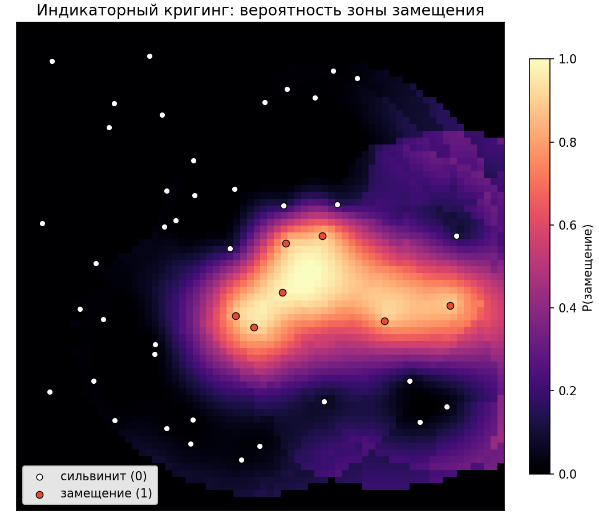{width=74%}

Separate indicators do not sum to exactly one and may go slightly out of range, a known property of the method. So the estimate of each class is clipped to zero-one, and then the class probabilities are normalised so that in every cell they sum to one.

## When a borehole misses its own zone

A common complaint: a borehole of the hazardous class is drawn outside the hazardous zone. This is not a failure of the fit but a property of the nugget, and it is worth understanding before touching the other parameters.

Exactly at the measured point the kriging is exact whatever the nugget: the estimate at a node that lands on the collar equals the indicator itself. But a grid node almost never lands on a collar. With a non-zero nugget the surface has a discontinuity around the point, and a few metres away the estimate already drops to the local mean. On a synthetic example with a nugget of 0.5, five metres from a lone borehole of the hazardous class the probability falls to 0.47, that is below the 0.5 threshold, while with the nugget set to zero it stays at 0.97.

Hence the **Nugget share** parameter. An empty field leaves the automatic fit as it is. Zero makes the surface smooth next to the data, and a borehole keeps its class in its own cell. The total variance is preserved when the share is moved, only the smoothness changes, so the scale of the probabilities does not drift. The fitted shares per class are printed to the Log, so it makes sense to simply look at them first: a large nugget means the classes are mixed at short distances, and that is a meaningful fact about the data rather than an obstacle.

The nugget should be zeroed with open eyes. It is not an invention of the fit: it measures how much neighbouring boreholes disagree on the class. Zero means a decision to treat every measurement as exact and binding. For hazard maps that is often right, because the cost of a miss and the cost of a false alarm are not symmetric, but the map becomes harsher and patchier afterwards.

The second thing the hit depends on is the cell. The estimate is computed at the cell centre, and if boreholes of different classes fall into one cell, no nugget will separate them. Set the cell finer than the spacing between neighbouring boreholes. The third is the polygon boundary: the probability bands are built from the raster with smoothing and rounding, and both move the level line slightly relative to the cells. If a point is outside a band by a hair, check this first by turning both smoothings off.

## What you get

Three results. A multiband probability raster, one band per class, the class name written into the band description. A zone map, the code of the most likely class in the cell, with the code to class mapping printed to the log. An optional confidence raster, the maximum probability in the cell, which shows where the class is firm and where zones compete and the boundary runs.

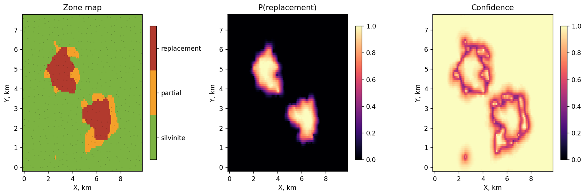{width=85%}

Another virtue shows itself on data with outliers. Ordinary kriging has to interpolate a magnitude, and a single anomalous sample breaks the variogram: a pair of nearby points with incomparable values lifts the nugget, and the map degenerates into the mean. An indicator works not with the magnitude but with the fact of belonging to a class, so an anomalous value in it is indistinguishable from any other on the same side of the threshold. Where the parameter behaves wildly and the question is binary in essence, the indicator path is more reliable than direct interpolation.

The categorical approach is convenient because it needs no boundary drawn in advance. There is no need to decide whether partial replacement counts as dangerous. All types are mapped as they are, and the required combination of classes is assembled later from the probabilities. Rare classes with few boreholes give a noisy variogram, the tool warns about this in the log, so read the probability of such a class with caution.

To learn the tool without real data, switch on **Add a categorical mineral-type field** in **Create sample wells (demo)**. A mintype field is added to the layer with a silvinite background and replacement spots after a mine, ready to run the tool on.

With an uneven network you can set the optional **wt** weight field from tool **1.01 Declustering**. Each class indicator is then kriged toward its declustered proportion rather than zero, so far from the data the probability tends to the representative class proportion. Without weights the behaviour is unchanged.

## Vector boundaries from the probabilities

The zone map answers the question of who wins in a cell, and that is often not enough. Planning needs the transition band instead: where the class is firm, where it is contested, where the other class is firm. Two optional vector outputs give exactly that, both off by default.

The levels are set by a parameter, by default 0.25, 0.5 and 0.75, which gives four bands: firmly no, two contested ones and firmly yes. The lines carry the class and the level. The polygons carry the class, the band bounds in the **P_MIN** and **P_MAX** fields, and a ready band label in the **band** field of the form "0.25 - 0.5". That label colours the layer by categories from green to red straight away, with no legend to set up by hand.

One band may arrive as several features if it is split into separate patches of area. This is normal and convenient: the areas are computed patch by patch. The legend still has exactly as many rows as there are bands, because the colouring follows the band rather than one of its bounds.

The boundaries are built from the probability channel rather than from the zone map, and this is not a detail. The zone map holds only the winner in a cell, whereas the position of the boundary inside the cell is already lost in it, so a contour of such a map runs in steps along the cell edges. Smoothing that staircase means inventing the position of the boundary. The probability field keeps this information, and a contour of it falls exactly where the model itself puts it.

With two classes the level 0.5 coincides with the zone boundary: a class wins exactly where its probability exceeds one half. A single level of 0.5 therefore gives the usual binary map, only with a smooth boundary instead of a stepped one. With three or more classes these are different things, a class can win with 0.4, and what is built here is the probability of being that class, not the boundary of the winner.

With two classes enter the one you care about into **Class for the contours**. The probabilities complement each other to one, so the second set would be a mirror duplicate of the first.

# 3.02 External Drift Kriging

The **External Drift Kriging** tool estimates a field from points when that field is systematically related to a quantity already known everywhere as a raster. Such a raster is called the drift. It can be the structural surface of an adjacent seam, a coarse regional model, a surface built on a sparse grid, or a seismic attribute. Ordinary kriging sees only the wells themselves, whereas here knowledge of the shape of the field between them is added, and the estimate leans on that shape where there are no wells.

The tool sits in the **Additional analysis tools** group and rests on the same engine as **2D Kriging**. The kriging mathematics does not change. What changes is only what the regional component is removed against.

Parameters:

| Parameter | What it sets | Default / advice |
|---|---|---|
| Point layer | Source points. | - |
| Value field (Z) | The attribute being interpolated. | - |
| External drift raster | A secondary surface s known everywhere. Same CRS as the points, covers the area. | - |
| Drift raster band (Adv.) | The band of a multiband drift raster. | 1 |
| Drift degree | A linear (a0+a1·s) or quadratic relation. | 1 (linear) |
| Kriging type, radius, min/max, nugget, structures | Kriging of the residuals - as in "2D Kriging". | as in "2D Kriging" |
| Smooth grid (Gaussian), smoothing radius | Optional smoothing of the result. | off / 1 |
| Drift kriging raster | The output estimate (drift + kriged residuals). | - |
| Kriging standard error | An optional raster of the residual standard error. | skipped |

## How it differs from trend removal

The **Remove polynomial trend** option of **2D Kriging** describes the regional component with a polynomial in the coordinates, that is with a tilted or curved plane. This works when the dip of the seam is uniform and its shape is simple. But if the field has a pronounced structure that follows a known surface, a plane will not describe it.

External drift removes the regional component not against the coordinates but against an external raster. If, for example, the roof of the seam of interest follows the relief of the underlying one, for which a surface already exists, that relation is removed by regressing on the underlying surface, and the departures from it are what gets kriged. The drift here is not a function of the position on the map but a function of the external raster value at the same point. Everything else matches trend removal. It is the same regression-kriging scheme.

## How it is computed

First the drift raster is sampled at each well, bilinearly over the four neighbouring cells. Then the field value is regressed on this sampled value by least squares. The **Drift degree** sets the form of the relation. Degree 1 is the linear drift, value equals a0 plus a1 times the drift, the usual choice for external drift. Degree 2 describes a curved relation with the square of the drift, but it may absorb part of the real structure, so after using it you should look at the residual variogram.

Next the regression residuals are kriged, exactly like an ordinary field in **2D Kriging**, with their own variogram, search and anisotropy. At the last step the drift raster is resampled onto the kriging grid and the drift is added back to the kriged residual estimate. The final estimate in each cell equals the drift plus the kriged residual. Because the drift is known everywhere, between the wells the estimate is drawn not towards a local mean but towards the shape of the external surface.

{width=98%}

Wells that fall outside the drift raster do not enter the fit, and the tool reports to the Log how many were dropped. Grid cells not covered by the drift raster cannot be completed, so they are left empty together with the standard error in them.

## Attributes of the generated layer

| Field | Type | What it holds |
|---|---|---|
| well | text | Borehole name. |
| roof | number | Roof elevation, m. |
| thick | number | Bed thickness, m. |
| X | number | Useful-component content, percent. |
| head | number | Head (the hydrogeological data variant), m. |
| K | number | Hydraulic conductivity, m/day. |
| T | number | Transmissivity, m²/day. |
| mintype | text | Mineral type (a class for indicator kriging). |
| dz | number | Elevation error - for weighting and experiments. |

The field set covers all the plugin tools: interpolate roof and thick with ordinary kriging, X with a trend, mintype with indicator kriging, head/K/T with the hydrogeology tools.

## Parameters

The **point layer** and the **value field Z** are set as in **2D Kriging**. The **External drift raster** parameter is the secondary surface known everywhere. The optional **drift raster band** selects the band of a multi-band raster. Search, cell size, extent, clipping to the well hull, the nugget and variogram structures, outlier removal and grid smoothing all work and are described as in **2D Kriging**, with the same defaults.

An important condition. The drift raster and the point layer must share the coordinate system, otherwise the drift value will be sampled at the wrong point. When the CRS does not match the tool warns in the Log. The drift raster must cover the whole estimation area, otherwise empty cells will appear along the edges.

## The variogram on residuals

As with trend removal, the variogram here is fitted on the regression residuals, not on the raw value. After the drift is removed the residual variogram returns to its normal form, reaches a sill with a nugget, and the range reflects the true scale of the local correlation. The standard-error raster in this mode is the error of kriging the residuals. The drift is treated as deterministic and adds no error of its own.

A convenient way to fit the residual variogram without leaving the tool is not yet provided, so the residuals are judged by the share of variance removed, which the tool prints to the Log. If the drift took out a noticeable part of the spread, the relation with the external surface is real and the drift is appropriate. If it took out almost nothing, the field is not related to that raster, and plain **2D Kriging** will give the same result more simply.

# 3.03 Exceedance probability map

The **Exceedance probability map** tool answers not "how much" but "how likely the value exceeds a threshold". From the kriging estimate raster and its standard-error raster it builds a probability raster from 0 to 1: in each cell the probability that the true value is above a given threshold.

The tool sits in the **Additional analysis tools** group and works as a post-processing step, like the hydraulic gradient. It runs no kriging of its own and does not touch the **2D Kriging** window, it takes ready rasters. So it works equally with the output of ordinary kriging and of external drift kriging.

## How it is computed

Kriging gives, in each cell, an estimate and its standard error. If the local distribution of the value is taken as normal, that is the value in the cell is treated as normal with the mean equal to the estimate and the standard deviation equal to the kriging error, the exceedance probability is one formula through the normal distribution function. Where the estimate is well above the threshold the probability is close to one, where it is below it is close to zero, and at the threshold itself it equals one half. The larger the standard error, the smoother the transition: away from the wells there is less certainty and the probability is drawn towards 0.5.

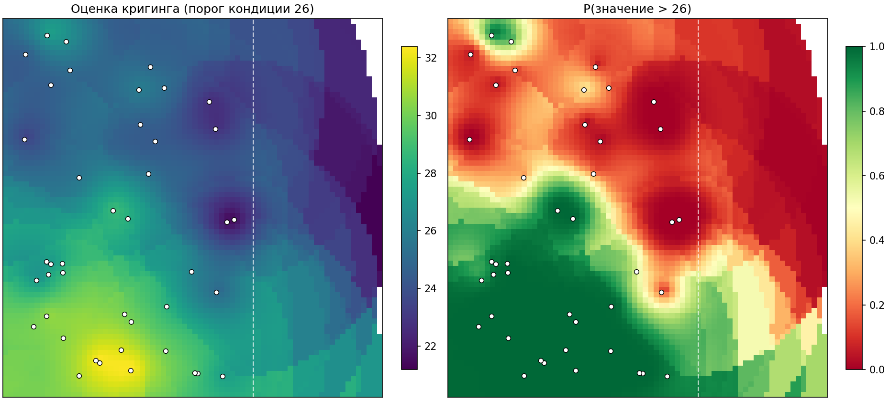{width=92%}

No separate kriging is needed for this, so the map is built instantly. The normality assumption is rough in places, especially for strongly skewed fields such as grades with a long right tail. Where that matters, indicator kriging by thresholds, which does not rely on the shape of the distribution, is more accurate.

## How to get the inputs

Run **2D Kriging** (or **External Drift Kriging**) on your field and enable the optional **Kriging standard error** output. You get two rasters, the estimate and the error, and you feed them here. Their grids match, since they come from one run, but if rasters with different grids are supplied, the error is resampled onto the estimate grid bilinearly.

## Parameters

| Parameter | What it sets | Default / advice |
|---|---|---|
| Estimate raster (kriging) | The field estimate raster (a kriging result). | - |
| Kriging standard-error raster | The standard-error raster of the same run. | - |
| Side | Probability above the threshold P(Z>t) or below P(Z<t). | above |
| Threshold | The value the probability is computed against. | 0 |
| Estimate raster band, error raster band (Adv.) | Bands of multiband rasters. | 1 |
| Probability raster (0…1) | The output probability raster. | - |

## Use

Cut-off grades: the threshold is the cut-off, and the map shows the probability that the grade is above the cut-off. This is more honest than a single line drawn on the estimate, because near the edge of the ore body the certainty drops and the probability map shows it. Risk zones for any threshold: thickness below a critical value, an elevation above or below a hazardous one. The probability map complements the estimate map where not only the value matters but the confidence in it.

{width=70%}

# 3.04 Hydraulic gradient and flow direction

The **Hydraulic gradient and flow direction** tool works with the head field, that is the piezometric surface, and shows where and how steeply groundwater flows. The input is a head raster, usually the result of **2D Kriging** on borehole water levels. For a hydrogeologist this is as natural a step after building the head surface as isolines are after kriging.

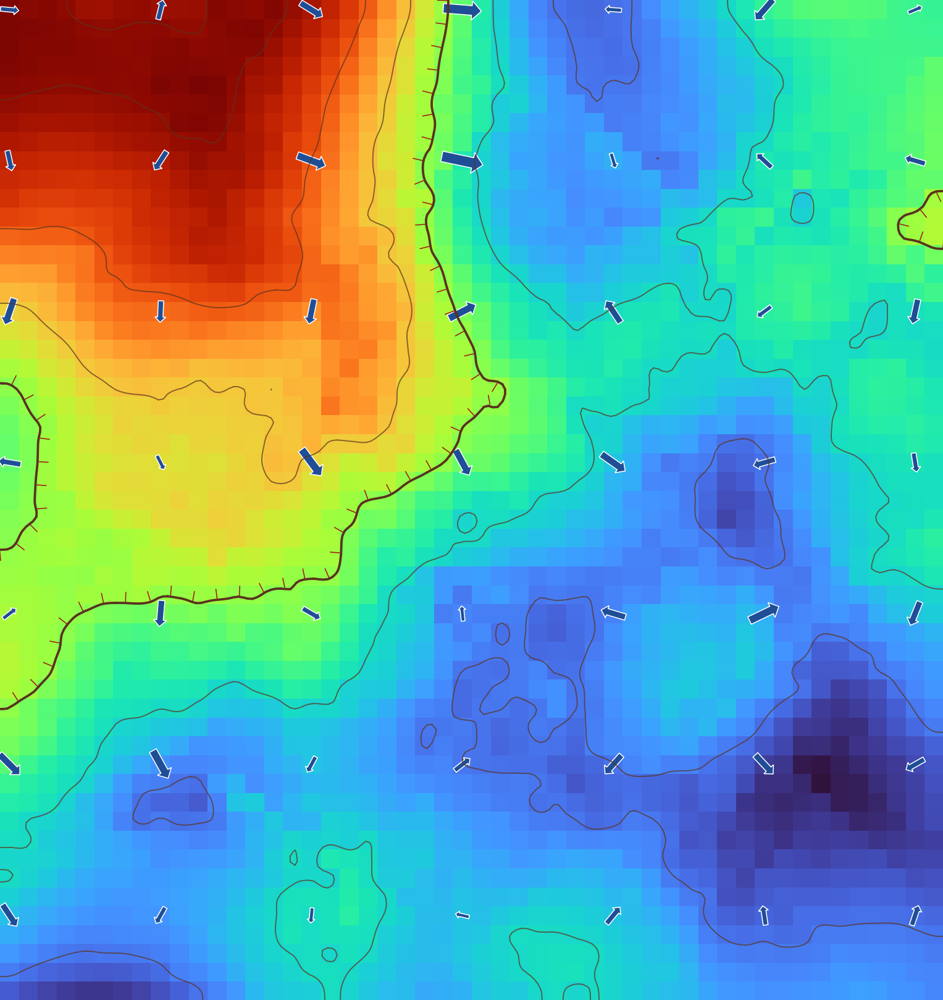{width=78%}

There are three outputs. The **gradient-magnitude raster** shows the steepness of the head surface, the hydraulic gradient i equals the magnitude of ∇h and is dimensionless. The **azimuth raster** holds the flow direction in degrees, where zero is north and the count goes clockwise. The point layer of **flow vectors** is thinned over the grid and styled as arrows right away, so the flow pattern is visible without touching the symbology.

The direction is computed strictly. Water flows down-gradient, from higher head to lower, so the arrow points towards the falling surface. On flat areas, where the head is almost constant, the direction is undefined and the azimuth there is left empty.

## Without permeability

The tool describes the geometry of the head field, not the flow velocity. The Darcy filtration velocity equals minus the hydraulic conductivity K times the gradient, and it needs K itself, which the tool neither asks for nor computes. In other words, the map answers where and how steeply, but not how fast. Once K (or transmissivity T) is available over the area, the specific discharge and the flow are computed by the neighbouring tool **Specific discharge (Darcy law)**, which multiplies this gradient by the aquifer properties.

## Parameters and smoothing

The input is the **head raster** and its **band**. The **flow vectors, thinning step** parameter sets how many cells apart to place an arrow so they do not merge, eight by default. The **smooth head before computing** parameter removes fine grid ripple, set in cells, off by default.

| Parameter | What it sets | Default / advice |
|---|---|---|
| Head raster | The input piezometric surface (usually a "2D Kriging" result). | - |
| Band (Adv.) | The band of the input raster. | 1 |
| Smooth head before computing, cells | Damps grid noise before differentiation. 0 = none. | 0 |
| Flow vectors: thinning step, cells | How many cells apart to place an arrow. | 8 |
| Hydraulic gradient (magnitude) | The output \|∇h\| raster. | - |
| Flow direction (azimuth) | The output azimuth raster (down-gradient). | created by default |
| Flow vectors (points) | The point layer of arrows (fields az, grad). | created by default |

Smoothing is switched on for substance, not for looks. Differentiation amplifies noise, so even a clean kriging grid can give a patchy gradient field with jittery arrows. A light smoothing brings the picture back to a readable form. The same effect can be had by smoothing the head itself back in **2D Kriging**.

## Arrows from points

The vector layer is points, and the arrows are drawn by the symbology. The preset is applied automatically. The arrow marker is rotated by the **az** field, so it shows the flow direction, and its size is scaled by the **grad** field, so the arrow is longer where the gradient is steeper. The size is set in millimetres and does not depend on the map scale. The symbology can be changed in the layer properties. If you need a classic quiver diagram, where the arrow length is laid out in map units, the marker is replaced with a geometry generator, the recipe is in the styles folder next to the preset.

Fields of the flow-vector layer:

| Field | Type | Holds |
|---|---|---|
| az | number | Flow-direction azimuth, degrees (0 = north, clockwise, down-gradient). |
| grad | number | Magnitude of the hydraulic gradient \|∇h\| at the point, dimensionless. |

## The learning cycle

To walk the whole path without real data, switch on **Add a head field** in **Create sample wells (demo)**. A head field with a pronounced regional slope is added to the layer. Build a grid from it in **2D Kriging**, feed the raster here, and the arrows follow the head downhill. The same end-to-end scenario as for the other tools, only about hydrogeology.

# 3.05 Specific discharge (Darcy law)

The **Specific discharge** tool adds permeability to the flow geometry. The hydraulic gradient shows where and how steeply the head falls, but not how much water flows. Darcy's law links these through the aquifer properties: the higher the permeability and the steeper the gradient, the larger the flux. From a head raster and aquifer-property rasters the tool builds a physical flux rather than a dimensionless gradient.

The tool sits in the **Additional analysis tools** group and works as a post-processing step. It runs no kriging of its own: the property rasters are prepared separately by kriging from test points.

## What is computed

The specific discharge (Darcy flux) equals the hydraulic conductivity times the hydraulic gradient: q = K·|∇h|, in metres per day. It is the volume of water through a unit cross-section area per unit time. If a transmissivity raster is supplied instead of conductivity, the tool computes the flow per unit width of the flow Q = T·|∇h|, in square metres per day. Transmissivity is conductivity times thickness, so the flow per width already accounts for the aquifer thickness and does not need it separately. The direction of both fluxes is the same as the gradient direction, down the head slope.

The true water velocity is the specific discharge divided by the effective porosity, v = q/n. Porosity is usually absent from the data, so the tool does not ask for it and does not compute the true velocity: if needed, divide the q raster by the porosity in the raster calculator.

## How to get the K and T rasters

The aquifer properties are known at the test points (pumping, injection) but are needed everywhere. They are interpolated by kriging, like any field. An important subtlety: hydraulic conductivity and transmissivity are almost always log-normal, their values span orders of magnitude. Kriging the raw values distorts the result, so the logarithm is kriged. The simplest way is to enable the **ln** transform in **2D Kriging**: then ln is kriged and the raster is returned already in the original units, and the ln checkbox here is not needed. If instead you krige an already-logged field, tick **K and T rasters are given as ln** in this tool and the values are recovered by exponentiation. Confined and unconfined aquifers are better kriged separately, their thickness physics differs.

## Parameters

| Parameter | What it sets | Default / advice |
|---|---|---|
| Head raster | The piezometric surface (a kriging result over the levels). | - |
| Hydraulic conductivity raster K (m/day) | The aquifer property for the specific discharge. Optional, but at least one of K, T is needed. | - |
| Transmissivity raster T (m²/day) | The aquifer property for the flow per width. | - |
| K and T rasters are given as ln | Apply exp to the input rasters (for log-kriged K and T). | off |
| Smooth head, cells | Damps head noise before differentiation. | 0 |
| Flow vectors: thinning step | How many cells apart to place an arrow. | 8 |
| Raster bands (Adv.) | Bands of the multiband head, K, T rasters. | 1 |
| Specific discharge q (m/day) | The output raster q = K·\|∇h\|. | created if K is given |
| Flow per width Q (m²/day) | The output raster Q = T·\|∇h\|. | created if T is given |
| Flow direction (azimuth) | The output azimuth raster. | optional |
| Flow vectors (points) | The arrow layer (rotated by az, sized by the specific discharge). | created by default |

## Use

Where water moves faster and where slower, estimating inflows to workings, zones of higher seepage along permeable beds. Together with the exceedance probability map you can show not only the expected flux but also the confidence in it where test points are sparse.

# 3.06 Gaussian simulation (SGS)

Kriging gives a single smoothed surface and an estimation variance. Sequential Gaussian simulation answers a different question - how large is the uncertainty. It builds an ensemble of equally probable realizations: each one reproduces the data histogram and variogram, passes through the boreholes and therefore stays rough rather than smoothed. Across the realizations every node accumulates a distribution of values, which shows where the estimate is reliable and where the data are silent.

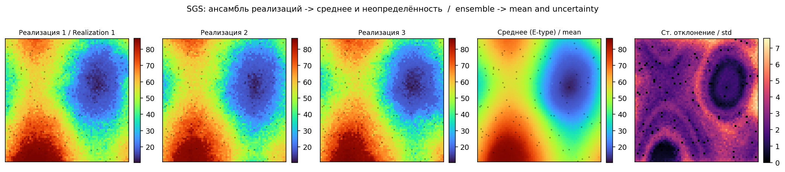

How it works. The values are mapped to normal scores and the simulation runs in Gaussian space. The grid nodes are visited in random order; at each node simple kriging on the neighbours and already-simulated points gives a local mean and variance, a value is drawn from that normal distribution and immediately becomes conditioning for the next nodes. Boreholes are snapped to the nearest nodes and frozen across all realizations. At the end each realization is back-transformed to the original units. The normal-score variogram is fitted automatically with a sill close to one.

## Parameters

| Parameter | What it sets | Default / hint |
|---|---|---|
| Points (boreholes) | The point layer with the data. | - |
| Value field | The numeric attribute to simulate. | - |
| Cell size | The grid step. 0 means auto, min(extent)/50. | 0 |
| Number of realizations | How many runs to average. | 60 (50-100) |
| Cut-off threshold | Enables the exceedance-probability map. | not set |
| Probability ABOVE the threshold | The probability direction. | yes |
| Raster extent | The output rectangle. | by layer |
| Score variogram model (Adv.) | The model for the normal scores. | auto |
| Max neighbours per node (Adv.) | How many points in the node's simple kriging. | 16 |
| Search radius (Adv.) | 0 means auto, 3 variogram ranges. | 0 |
| RNG seed (Adv.) | For reproducibility. 0 means random. | 0 |

The outputs are ensemble rasters. **Mean (E-type)** resembles kriging. **Standard deviation** shows the uncertainty, small at the boreholes and large away from them. The **P10**, **P50**, **P90** quantiles outline the likely range, and **Exceedance probability** for a given threshold offers a non-parametric alternative to the map from the probability tool. Runtime grows with grid size and the number of realizations, so start with a coarse cell.

If the data are clustered unevenly, supply the **wt** weight field from tool **1.01 Declustering**. The normal-score transform then builds the distribution with weights, and the ensemble histogram is not skewed toward over-sampled rich areas.

# Kriging kinds: which one to pick

Behind the word "kriging" the plugin hosts a family of methods, and the choice between them affects the result more than fine-tuning the variogram. All the kinds solve the same system of equations with covariances from the variogram; they differ in what is assumed known about the field mean and in what exactly is estimated - a point, a block or a probability. This chapter is a navigator; the parameters of each tool live in their own chapters.

**Simple kriging (SK)** assumes the mean of the field is known in advance and constant over the area. Near the wells the estimate follows the data, away from them it is pulled to the given mean. Take it when the mean is backed by statistics over a representative sample of the same domain, an eyeballed mean drags all the underdrilled margins towards the error. Switched by the type in **2D Kriging**.

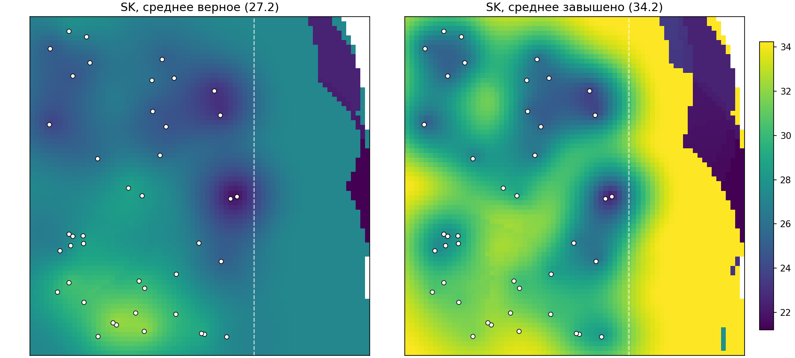{width=92%}

**Ordinary kriging (OK)** does not know the mean and estimates it locally in every neighbourhood - an extra equation with the "weights sum to one" condition takes care of that. Away from the wells the estimate tends to the mean of the nearest neighbourhood, not to the global one. This is the default choice: if unsure where to start - start with OK.

**Kriging with a trend** (the detrend checkbox in **2D Kriging**) is for fields with a regular regional slope: a roof on a monocline, a fold limb. A 1st- or 2nd-degree polynomial is removed by least squares, the residuals are kriged, the trend is added back. Two rules: define the variogram over the residuals (the plugin prints the share of the removed variance - if it is small, the trend is not needed), and do not extrapolate a quadratic trend far beyond the well cloud.

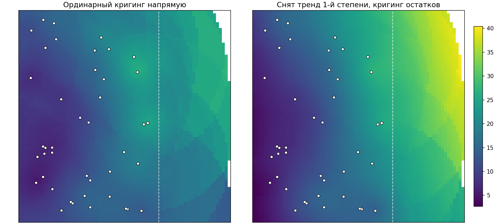{width=92%}

**Kriging with an external drift** (chapter 3.02) - when the trend is known not as a formula but as a field: a structural surface of a neighbouring bed, a regional model, a seismic attribute. The scheme is the same - a regression on the drift, kriging of the residuals, the regression returned.

**Block kriging** (the discretisation parameter in **2D Kriging**) estimates the mean over a block rather than a point value: the right-hand side of the system is averaged over the discretisation, the error variance drops, outliers are damped. Take it for reserves over a block grid and mind the support effect: a block-kriging grid is regularly smoother than a point one, a sample grade and a block grade cannot be compared directly.

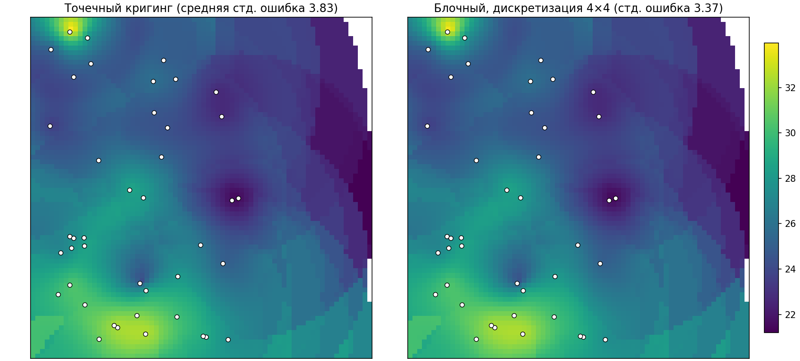{width=92%}

**Indicator kriging** (chapter 3.01) is for categories: mineral type, facies, a replacement zone. The category becomes a 0/1 indicator, it is kriged with plain OK, the result is the class probability at a point, domains are cut from it by a threshold. The indicator variogram is its own and usually shorter than the grade one.

**Gaussian simulation** (chapter 3.06) is not kriging but its complement: instead of one smooth surface, an ensemble of equally probable rough realisations from which the uncertainty is seen directly.

## Cheat sheet

| Task | Kind | Where it lives |
|---|---|---|
| The universal case, the start of any task | Ordinary (OK) | 2D Kriging, the default type |
| Plenty of data, the domain mean is justified | Simple (SK) | 2D Kriging, the SK type + mean |
| A roof or a bottom with a regional slope | With a trend | 2D Kriging, detrend |
| The trend is known as a raster | With an external drift | chapter 3.02 |
| Reserves over a block grid | Block | 2D Kriging, discretisation |
| Mineral type, replacement, categories | Indicator | chapter 3.01 |
| Uncertainty assessment | SGS simulation | chapter 3.06 |

The search neighbourhood is common to all the kinds, and three rules remove most problems: the radius of the order of the variogram range, 12-16 neighbours at most, the neighbourhood anisotropy consistent with the variogram anisotropy from the variogram map.

# 3.07 Density from measurements (variable support)

The tool builds a density map where a measurement is given not by a point but by a finite-size support: a point with an uncertainty sigma, a line segment (a corridor of half-width) or a polygon. The unit mass of a measurement is spread over its support. Mass is conserved and density is inverse to the support area, so coarse georeferencing self-attenuates geometrically, without thresholds or filters. This is density estimation (how much and where), not value interpolation - kriging remains for values.

One geometry type per run. Points, lines and polygons are mixed by a series of runs into one raster (append mode). Each type spreads its mass in its own way:

- **Point** - a Gaussian spot with a sigma from the precision field, truncated at three sigmas. A sigma below the half-cell is raised to the half-cell.
- **Line** - a soft-edged corridor: the polyline is densified, mass is split by length, each subpoint is a Gaussian profile with the half-width sigma. The from_m/to_m fields cut an interval by linear referencing.
- **Polygon** - mass is split by area uniformly or, in dasymetric mode, proportionally to an auxiliary raster (population, built-up area). If the raster is empty inside the polygon, it falls back to uniform.

## Output and invariant

The main output is a three-band raster. Band 1 is density in mass per km2 (independent of cell size). Bands 2 and 3 are service (sum m*sigma and sum m) so that append series and the effective-sigma map stay exact. The optional second raster is the mass-weighted sigma per cell, an effective-precision map: it separates density backed by precise georeferences from the smeared one. This is an analogue of kriging variance for the density floor.

Invariant: the density integral over the raster equals the sum of input masses. It is always computed and written to the log. A discrepancy means supports left the area; the behaviour is set by the edge switch (renormalise inside or lose mass with a warning).

## How to read

Density shows where measurements cluster, weighted by their reliability. A precise georeference gives a compact spot, a coarse one a diffuse and low one. The effective-sigma map shows where density is gathered from precise supports and where from smeared ones - there the trust is lower.

| Parameter | Purpose | Default |
|---|---|---|
| Measurements | Points, lines or polygons (one type). | - |
| Mass field | Object mass. | 1 |
| Precision field | Point sigma or line half-width. | default sigma |
| Cell size, m | Grid step. | 50 |
| Area | Extent. | by layer |
| Support beyond edge | Renormalise inside or lose mass. | renormalise |
| Default sigma (Adv.) | When the precision field is empty. | half-cell |
| from_m / to_m (Adv.) | Line interval cut. | whole line |
| Auxiliary raster (Adv.) | Dasymetry for polygons. | - |
| Append to raster (Adv.) | An existing three-band raster. | - |
| Density | Three-band raster (density, sum m*sigma, sum m). | - |
| Effective sigma | Effective-precision map (optional). | - |

## The "Density map" window (live preview)

The face of the tool is a separate **Density map** window on the **Isoliner** toolbar. The layer and fields are set on the left, while a preview on a coarse grid runs on the right: it takes milliseconds, so the sigma and the cell size change the picture at once rather than after a run. The invariant is always visible at the bottom: input mass, mass on the grid and the share lost at the edge.

The **Demo** button creates a training set with tool 3.08. The **Write raster** button runs the full computation with the same algorithm 3.07 and puts the result on the map already dressed: pseudocolour with transparent zeros, density isolines and an effective-sigma layer as a trust map. The Processing form remains for models and batch runs; the computation core is shared.

# 3.08 Create a density example (demo)

The tool creates a synthetic set for 3.07 with a known total mass, to check the invariant by eye. Ten points with different sigmas (from fractions of a cell to large, mass 500), two lines (mass 200, one with a from_m/to_m interval cut), two polygons (mass 300, one for dasymetry) and an auxiliary raster. Total mass 1000.

Run 3.07 on the point layer - the density integral in the log should give 500, on lines 200, on polygons 300. Layer fields: **mass**, **prec**, **from_m**, **to_m**.

| Parameter | Purpose | Default |
|---|---|---|
| Extent | Generation bounds. | - |
| Auxiliary raster cell, m | Step of the auxiliary raster. | 50 |
| RNG seed (Adv.) | Example reproducibility. | 1 |
| Demo points / lines / polygons | Three measurement layers. | - |
| Auxiliary raster | Raster for dasymetry. | - |

The full list of output-layer fields is in the **Density (demo)** appendix section ("Demo-layer fields" at the end of the manual).

# 4.01 Cross-section along a line

The **Cross-section along a line** tool builds a geological section from a set of surfaces. It is not just a profile curve but beds as filled bands between a roof and a floor. The surfaces are usually obtained by kriging, and the tool assembles them into a section along a given line.

The tool sits in the **Cross-sections** group and works as a post-processing step over ready rasters. It runs no kriging of its own.

## How beds are defined

The surfaces are supplied as a list and ordered top to bottom: roof, floor, then the next roof, and so on. Beds are built as bands between adjacent surfaces, so N surfaces give N minus one beds. Two surfaces, a roof and a floor, are enough for one bed. For a sequence of beds, add the surfaces in stratigraphic order. A single surface is allowed as well, that is a section over the terrain without beds, see the next section.

## A section over a single surface

A single surface is a legitimate case, not an error. There will be no beds by definition, but the terrain line, the frame, the axes with ticks, the corner points and the section definition are all built. A geological section usually starts exactly there: first a profile over the DEM, then intersections with the mapped geology plotted on it by tool **4.05**, and the geology drawn downwards by hand.

Bed bands and the 3D fence are not built in such a run, and no layers are created for them at all. An empty layer in a project looks like a breakage even though everything was built correctly, so it is better not to create it than to create it and hide it.

The terrain comes out as the **Surface lines on the drawing** layer. Give it your own line style and labels: the drawing is finished on top of that layer.

Set the frame bottom by elevation in the advanced parameters for such a section. Without it the frame hugs the data with a small margin and there is no room to draw below the terrain. The elevation is taken into account before the vertical scale is computed, so in the aspect ratio mode the drawing comes out at the scale of exactly the frame you will see. An elevation above the data is ignored: this is the bottom of the frame, not a clip from above.

## The layer tree sets the order of the surfaces

This is the main thing to know about the tool. The order of the surfaces is not a detail of presentation but input data on a par with the grids themselves. It is what decides which band belongs to which bed.

By default the order is taken from the project layer tree, top to bottom, exactly as shown in the **Layers** panel. What you see in the panel is what you get on the drawing. The ticks in the multi-select decide which surfaces take part, not in what order they go.

Hence a simple working rule. Before building a section, arrange the surfaces in the Layers panel by stratigraphy: the roof of the upper host bed at the top, the bottom of the lower one at the bottom. Drag the layers with the mouse if they arrived in a jumble. It takes half a minute and saves an investigation.

If the order is broken, the tool raises no error. It builds bands between the pairs you gave it. Some pairs turn out inverted, with the floor above the roof, and such bands are dropped silently. What you see is this: fewer beds on the drawing than expected, or beds in an implausible sequence. When that happens, check the order in the Layers panel first, not the kriging parameters.

When the tree order is not suitable for some reason, uncheck **Surface order from the project layer tree**. The order is then taken from the sequence of ticks in the list, as in earlier versions. Layers absent from the project tree (added as files right in the widget) go to the end of the list, keeping their relative order.

The demo generator (4.10) arranges its six surfaces in the tree by stratigraphy itself, so nothing needs rearranging on the demo data.

## Outputs

The section drawing is polygons in axes of distance along the line and elevation. The elevation can be stretched by a vertical exaggeration so thin beds read well. This layer goes into a print layout as a ready section. Its coordinate system is conventional, with distance and elevation in map units.

Surface lines is every supplied surface as a separate line in the drawing axes, with the **sec**, **sec_id**, **num** and **name** fields. Breaks over missing data are preserved. When working with beds the layer is optional, the roof and the floor are already visible as band edges, but it lets you label and style the roof line separately from the fill. With a single surface it is the only layer carrying the terrain.

The 3D fence is the same bands but as vertical PolygonZ walls in real coordinates. They are viewed in the 3D Map View next to the kriging surfaces: the grid is set as terrain, and the section walls show the beds in space.

## Vertical scale

The horizontal extent of a section (the line length) and the vertical extent (tens of metres of beds) are not comparable, so without a vertical stretch the drawing looks flat. The scale is set in three ways.

The **scale ratio H:V (1:N)** mode is the usual drawing notation. A value of 50 means H:V = 1:50, that is, the vertical scale is fifty times larger than the horizontal one. This is how the scale is set on potash sections, where the horizontal runs for kilometres while thicknesses are measured in metres. The stretch factor equals N.

The **exaggeration** mode is the same number given directly, without the drawing notation.

The **H:V ratio (drawing width:height)** mode works from the extents: you set the desired ratio of sheet width to height (say 10), and the tool computes the factor itself from the line length and the elevation span. It is handy when fitting the section to a sheet matters more than holding a given scale.

The effective exaggeration is printed to the log. For an exact overlay of layers it must match across the section, the boreholes and the composition. In H:V mode the section (4.01) spans the whole section in height. The boreholes (4.02) take the factor from the definition and line up by themselves. The composition (4.03) computes the ratio over a single bed, so to overlay it take the exaggeration printed by 4.01 and set it in 4.03 in the **exaggeration** mode.

## Several sections in one run

By default the tool builds a section for every line of the layer. This is the normal mode of work: a line layer of profiles is processed as a whole, and there is no need to run the tool once per line. If you do not need all of them, select the lines you want on the map and tick **Selected features only** on the line parameter. Unchecking **A section for every line of the layer** restores the earlier behaviour, a section along the first line.

All the sections go into one set of layers and are told apart by attributes rather than by a separate layer per trace. That way they are easy to label and filter by an expression, and styles do not have to be reassigned. The section name comes from a field of the line layer if one is given in **Section name field**, otherwise the sections are numbered in order.

On the drawing the sections are separated by a layout in the common drawing coordinate system. **Stacked top to bottom** places them one under another with a shared zero of distance, so the left edge is the same for all. **In a row, left to right** places them side by side with a shared elevation datum, so the elevation scale runs through the whole sheet. **In a grid** combines both rules: a row keeps the elevation datum, a column keeps the zero of distance, and the number of columns is set in the advanced parameters. The lattice pitch comes from the largest drawing plus the gap, so the drawings never overlap however much the trace lengths differ. The gap is a fraction of the extent, 0.15 by default.

The vertical scale is common to the whole run. Otherwise a short trace and a long one would come out at different stretches and would not be comparable on one sheet. In the scale ratio and exaggeration modes it is simply the number you set. In the extent ratio mode the factor is computed from the longest line and the elevation span of the whole set, so the widest drawing gets exactly the requested proportion while the others come out taller but at the same scale.

The 3D fence is not moved by the layout. It stands in real coordinates, each wall on its own trace, and in the 3D Map View a set of sections looks like a real fence across the area.

The first section always gets a zero offset, so a run over a single line gives exactly the same drawing as before.

## Band colours: the bed reference

The bed bands are coloured by the roof name. Without a reference the colour is computed from the name itself: it does not jump between runs, but it is arbitrary.

The optional **Bed reference (table)** input makes the colour meaningful. The reference is an ordinary project layer, a GeoPackage or an Excel table, with one row per bed and per interbed, top to bottom down the section. Three columns are required: the body code, the number from the top, and the body kind. The colour is optional, but it is usually the very reason the reference is supplied.

The **body** column holds the word bed or interbed, and this is a law rather than a guess. The body cannot be derived from the code. The bed **АБ** looks like "А plus Б" by its spelling, yet it is a single bed containing А, Б, the А-А' parting and А'. The interbed **Б-В** cannot be derived from the code at all, because there is no bed Б in the list, there is АБ. The body is decided by the geologist, and the machine does not recompute it.

The top-to-bottom order gives the reference a second ability: finding the body between two boundaries. If the section runs the roofs of КрII and КрIIIа, then by order the interbed КрII-КрIII lies between them, and the band takes its name and colour. Beds that did not make it onto the section are marked grey and listed in the log, which shows at once what is missing from the set of surfaces.

Layer names rarely match the codes word for word, so the lookup is a ladder from strict to tolerant: the exact code, then ignoring case and outer spaces, then a normalised form (the role suffix `_top`, `_bottom`, `_кровля`, `_подошва` is stripped and Latin look-alike letters are folded into Cyrillic), and finally the same form without apostrophes. This is how `KpII_top` finds the code `КрII` and `A'Б_top` finds `АБ`. The strict steps come first, so if the reference holds both `АБ` and `А'Б` as different bodies, each keeps its own.

The same reference goes into 4.02, and then the bands and the borehole columns speak one language of codes and match in colour.

A ready sample for the Verkhnekamskoye deposit lives in the **templates** folder inside the plugin directory: 36 rows from the cover deposits down to the lower rock salt, with colours and bodies. The file comes in two forms, `plast_reference_vkmks.xlsx` and `plast_reference_vkmks.csv`. Take it as a starting point and edit it for your own deposit: the **strata** and **note** columns are optional, they are read but not used yet, and are left for future development.

## Attributes of the output layers

All the section layers carry two common fields: **sec** with the section name and **sec_id** with the feature id of the source line. Use them to label the drawings, filter the layer down to one trace and colour the sections differently.

**Section definition** - one line per section, with the original trace geometry and the fields read by the downstream tools of the group:

| Field | What it holds |
|---|---|
| sec, sec_id | Section name and source line id. |
| vex | Vertical exaggeration of the drawing. |
| step | Stationing step, m (the polyline vertices are always included). |
| zmin, zmax | The elevation range of the drawing. |
| ox, oy | Offset of the drawing in the layout. Zero for a single section. |

**Section (3D fence)** - vertical PolygonZ polygons along the trace, one per bed:

| Field | What it holds |
|---|---|
| sec, sec_id | Section name and source line id. |
| bed | Bed number from top to bottom. |
| top, bot | Names of the roof and bottom surfaces. |
| t_mean | Mean bed thickness along the trace, m. |
| seclen | Trace length, m. |

**Section corner points**: sec and sec_id, num (corner number), name (УГ-1, УГ-2, …), pos (top or bottom), d (station, m), x and y (map coordinates), az (azimuth of the next leg), label (a ready-made label). **Horizontal axes**: sec, sec_id, elev (axis elevation, m) and label. **Corner table**: sec, sec_id, kind (row type) and text (cell content).

## Parameters

| Parameter | What it sets | Default / advice |
|---|---|---|
| Section line | A line layer. The **Selected features only** tick works here. | - |
| Surfaces top to bottom | A list of surface rasters. At least two are needed. | - |
| Surface order from the project layer tree | The order comes from the **Layers** panel, top to bottom. Unchecked, it comes from the ticks in the list. | on |
| A section for every line of the layer | Batch mode. Unchecked, a section is built along the first line. | on |
| Section name field | The field of the line layer the name comes from. Empty means numbering in order. | - |
| Layout of multiple sections | Stacked, in a row or in a grid. | stacked |
| Sampling step along the line | How many map units between samples. 0 means by cell size. | 0 |
| Vertical scale | Mode: extent ratio, exaggeration or scale ratio H:V. | extent ratio |
| Scale value | Width:height ratio, exaggeration, or N from the 1:N notation. | 10 |
| Columns in the grid (Adv.) | Number of columns for the grid layout. | 2 |
| Gap between sections (Adv.) | A fraction of the drawing extent. | 0.15 |
| Raster sampling (Adv.) | Bilinear or nearest. | bilinear |
| Bed reference (table) | Colour, body and order from data. | empty |
| Frame bottom, elevation (Adv.) | Lowers the frame so there is room to draw. Empty - from the data. | empty |
| Surface lines on the drawing | The output line layer, one line per surface. | created |
| Section drawing (distance × elevation) | The output polygon layer for a layout. Not created with a single surface. | created |
| 3D fence (PolygonZ) | The output layer of vertical walls in real coordinates. Not created with a single surface. | created |

Each bed gets attributes: a number, the roof and floor names, the mean thickness and the section length. Colour the layer by bed number or by thickness. Where a surface is undefined (nodata), the band breaks and the bed splits into several polygons.

## Trying it on a demo

A ready training set is produced by the **Create a section example** tool (4.10): six surfaces top to bottom, three section lines, a pair of drilling-model layers collar and interval, and multiband bed grids. It arranges the surfaces in the tree by stratigraphy itself, and the three lines of different length and with different numbers of bends are handy for looking at the layout and the common vertical scale. Run it, then feed the surfaces and the line here, the collar and interval pair with the definition into **Boreholes on the section**, and the bed grid (bands 1/2/3) into **Bed composition on the section**. The full contents of the set are in section 4.10.

## Relation to QGIS

A plain profile curve over a single grid is built by the native **Elevation Profile** panel, no separate tool is needed for that. The section instead shows the beds between surfaces, which the native tools do not do. A kriging surface can also be viewed in 3D without a section: set the grid as terrain in the 3D Map View.

# 4.02 Boreholes on the section (drilling model)

The **Boreholes on the section** tool places boreholes onto section drawings from a pair of drilling-model layers. It sits in the **Cross-sections** group and works in batch: one run serves every section of the definition.

## The drilling model

Boreholes are described by two tables following the minimal model of the mining packages (Leapfrog, Micromine, Datamine, Surpac). **collar** is a point layer of collars with the **hole_id** (identifier, string), **z** (collar elevation) and **eoh** (end-of-hole depth downhole) fields. **interval** is a plain interval table with the **hole_id**, **from**, **to** and **code** fields (code is what we colour by: a bed index, a lithotype, a class). Depths are measured downhole from the collar, positive downwards, not as elevations, so inclined holes do not break the model. Any other columns of the interval table travel into the drawing attributes as they are.

Such a pair is produced by **Create a section example** (4.10) and by a corporate export. The tool finds the fields of both tables by the contract names and common synonyms (Hole_ID, elev, depth_from, litho) itself, case does not matter. The field pickers are hidden under the advanced parameters and are needed only for non-standard layers. What was found is printed to the log in one line.

## The tolerant reader

The data is read without prior cleaning. Empty and non-numeric depths are skipped, swapped from and to are exchanged, intervals beyond the end of hole are drawn as they are, overlaps are neither resolved nor hidden, gaps between neighbouring intervals are not filled, intervals without a collar are skipped. Everything skipped or accepted with a note is counted and reported to the log as a short summary. On clean data the summary is a single line.

## Batch operation and alignment

The lines, the vertical scale and the layout come from the section definition produced by **Cross-section along a line**. Every borehole is projected onto every line and lands on the drawings it is closer to than the corridor (0 means all). Depths become elevations by subtraction from z, the vex factor is shared from the definition, so the columns sit on the beds by height without fitting.

The collar layer may live in a different coordinate system than the definition, for example when exported from a corporate database in the working system of the enterprise. The tool reprojects the collars into the definition system itself and prints a line about it to the log together with the coordinates of the first collar. If the corridor turns out empty, the log reports the distance of the nearest collar from the line, and this number immediately tells whether the corridor is narrow or the layers live in different places.

## Colours and the legend

The interval layer comes out coloured right away: a category per code in the order of first appearance top to bottom, the colour is deterministic from the code itself and does not change between runs and machines. The code-to-colour legend appears in the layer tree by itself. The last entry is the grey **other** category, everything that did not match a known code falls into it, so nothing disappears silently. The columns carry a thin black outline and read on top of the section bands. The bed bands in **Cross-section along a line** are coloured by the same mechanism from the roof name, so a bed named with the same code as in the interval table matches the borehole columns in colour by itself. The traces are drawn as a thin grey line from the collar to the end of hole, the collars as points with a short label. The label comes from the **number** field of the collar layer (name and label are synonyms), and without it from hole_id, while the composite identifier stays in the attributes for joins.

## Clipping by the drawing and the frame

By default the columns are clipped by the drawing frame - the zmin and zmax elevation range from the definition. An interval on the edge is trimmed to it, an interval entirely beyond the frame is skipped, the trace and the label are clamped by the frame, and a borehole entirely beyond the frame drops out of the drawing. The checkbox turns clipping off entirely.

The frame is one for the whole drawing, while the roof of the uppermost sequence differs from point to point, so for a cut along the beds feed the optional **Section drawing** input - the band polygons from **Cross-section along a line**. The columns are cut by the upper and lower envelope of the bands at their own position, so boreholes do not stick out of the drawing, as in the mining packages. Beyond the bands this input has no effect, the frame keeps working there.

The tolerance under the advanced parameters widens the frame and the bands outwards, in elevation units. Only the geometry is clipped, the ztop and zbot attributes keep the true interval elevations. A clipping summary is printed to the log per section.

## Column colours: the bed reference

By default the interval colour is computed from its code and does not change between runs. The optional **Bed reference (table)** input replaces those colours with the reference ones: codes found in it are painted from it, the order of the legend categories follows the bedding from top to bottom, and codes outside it keep their previous colour. The log gets the reading summary and a line on how many codes were found.

The reference for 4.01 and 4.02 may be one and the same, and that is its strength. The drawing bands carry a bed code while the borehole intervals often carry a rock type. If the interval table does have a bed index field, set it as the code field and supply the same reference as in 4.01 - the columns will then merge with the bands in colour, and only the disagreement between the borehole and the built surface will stand out. If the intervals carry lithology instead, a bed reference will not help there, that needs a legend of its own.

## Parameters

| Parameter | What it sets | Default |
|---|---|---|
| Section definition | The lines, vex and layout from **Cross-section along a line**. | - |
| Borehole collars (collar) | The collar point layer. | - |
| Borehole intervals (interval) | The interval table. | - |
| Corridor from the line | A buffer, map units. 0 puts every borehole on every section. | 0 |
| Clip intervals by the drawing frame | The zmin and zmax frame from the definition. | on |
| Section drawing (for clipping) | The band polygons from 4.01, a cut by the envelopes. | empty |
| collar and interval fields (Adv.) | Overrides of the automatic field search. | found automatically |
| Collar label field (Adv.) | Where the short collar label comes from. | number |
| Clipping tolerance (Adv.) | Widening of the frame and the bands, elevation units. | 0 |
| Bed reference (table) | Colour and code order from data. | empty |
| Borehole intervals (drawing) | Vertical segments coloured by code. | created |
| Borehole traces (drawing) | Lines from the collar to the end of hole. | created |
| Collars on the drawing | Points labelled from number. | created |
| Borehole intervals (3D) | LineStringZ in real coordinates, depth goes into Z. | on request |

The chosen layers and the corridor are remembered, the next run in the same project opens with the inputs already in place.

# 4.03 Bed composition on the section

The **Bed composition on the section** tool colours the band of one bed by a composition grid along the line. It takes a roof, a floor and a composition grid, runs no kriging of its own, and works one bed at a time. It sits in the **Cross-sections** group.

This is how the lithological composition change inside an industrial bed is shown along the section. The composition grid is prepared separately: the content by ordinary kriging, the mineral type by indicator kriging (the **Categorical indicator kriging** tool).

## Two modes

Continuous content (KCl, insoluble residue): the band is cut into thin vertical slices, each with a mean value. Set a graduated style for the layer (by the **value** field), and a smooth content transition is visible along the band.

Categorical mineral type or facies (sylvinite, replacement, halite): adjacent slices of the same class merge into facies zones. Set a categorized style (by the **class** field). Replacement zones show as a colour change along the line.

## Parameters

| Parameter | What it sets | Default |
|---|---|---|
| Section line | The same line as for the section. | - |
| Bed roof | The roof raster. | - |
| Bed floor | The floor raster. | - |
| 1st industrial bed | A multiband grid: roof, bottom, content, mineral type. | on request |
| 2nd industrial bed | The same for the second industrial bed, independent fields. | on request |
| Sampling step along the line | How many units between samples. 0 means by cell. | 0 |
| Vertical scale | Mode: H:V ratio or exaggeration. | H:V |
| Scale value | H:V ratio or exaggeration. | 10 |
| Raster sampling (Adv.) | Bilinear or nearest (always nearest for a class). | bilinear |
| Bed composition (drawing) | Output polygons in distance × elevation axes. | created |
| Bed composition (3D) | PolygonZ polygons in real coordinates. | on request |

Run the tool for each industrial bed separately, with its own composition grid. Place the composition band on top of the section drawing. For an exact overlay take the exaggeration printed by **Cross-section along a line** and set it here in the **exaggeration** mode (the H:V ratio is computed over a single bed and is not suitable for overlay).

# The section definition and shared parameters

Geometrically a section is set by two things - a line in the real coordinate system and a vertical scale vex. The **Cross-section along a line** tool outputs them together as a **Section definition** layer: one line per section, with the sec, sec_id, vex, step, zmin, zmax, ox and oy fields. This is the shared source of truth.

The intersect, project and unproject tools read the line and vex from this definition, so their results match the section without manual scale fitting. Build the section once, the definition travels with the project and feeds the other tools of the group.

When there are several sections, the definition carries them all. The **Intersect surfaces with the section** (4.04), **Intersect vectors with the section** (4.05) and **Intersect a TIN with the section** (4.06) tools handle the whole set in one run: every result lands on its own drawing by the offset from the ox and oy fields and gets the sec and sec_id fields. If you need a single section, filter the definition layer or select the line you want, the feature order is preserved. If the definition happens to hold sections with different vex (which occurs when definitions from separate runs are merged), the tool warns that the drawings are not comparable and advises rebuilding them in one run.

The **Bed composition on the section** (4.03) tool and the beta tools 4.07 and 4.08 still work over a single section and take the first one from the definition. **Boreholes on the section** (4.02) handles the whole set in batch. With several sections, feed them a definition filtered down to the trace you need.

The **Bed composition on the section** tool accepts the section definition as an optional input: when given, the vertical scale is taken from it, so the composition band sits exactly on the beds by height. **Boreholes on the section** works from the definition only, it has no scale choice of its own.

Definition layers made by earlier versions of the plugin are read as before. They have no sec or ox fields, so the name comes out empty and the offset zero, and the result lands exactly as it used to.

The section also clips pinch-outs: where the roof drops to the floor, the bed disappears and no band is built. In the demo the second industrial bed pinches out to the east.

For a polyline the Cross-section along a line tool optionally outputs three helper layers in the drawing axes. Corner points are placed at every polyline node, at the top and at the bottom of the section. A point carries fields: number, name (УГ-1, УГ-2 ...), side (top or bottom), distance along the line, plan X and Y, segment azimuth and a ready label. The top is labelled with the name, the bottom with the plan coordinates X and Y, rounded to two decimals. The azimuth and distance stay as layer fields - handy to place into a layout table. A style is supplied: an upward triangle on top, a shelf at the bottom.

A corner table is produced optionally - a polygon layer below the section. The cells lie between the corner verticals with borders under them, two rows: the length and azimuth of the segment between adjacent corners, with a centred label and a white fill. It renders on the canvas and travels into a layout with the section. Corner verticals are lines at the nodes spanning the full section height. Horizontal axes are equal-elevation lines with ticks (five by default, with nice rounding) for an elevation scale. The drawing margins are extended by five percent up and down, and the corner points sit on these edges.

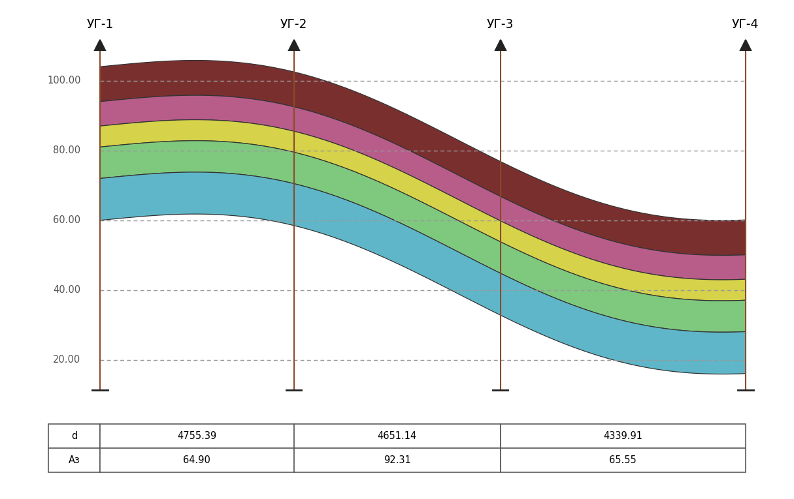

# 4.04 Intersect surfaces with the section

The **Intersect surfaces with the section** tool places surface grids onto the section as lines in distance-elevation axes. Each grid is sampled along the definition line, and its trace lies on the drawing next to the beds. The line and vex come from the section definition, so the match with the section is automatic.

This is how water tables, marker surfaces, the salt roof and anomaly surfaces are placed on the section. The inputs are the section definition and a list of grids, the output is lines in the section axes (and optionally 3D lines in real coordinates).

Projection and unprojection have been proved on real data and no longer carry the **(beta)** mark. The shaft wall unwrap stays marked: it works, but its interface and example set are still being refined.

## Parameters

| Parameter | What it sets | Default / hint |
|---|---|---|
| Section definition | The definition layer from 4.01: a line with vex and step fields. Sets the line, the scale and the frame height. | - |
| Surface grids | The list of rasters whose traces are drawn on the section as lines. | - |
| Sampling step along the line (Adv.) | How many map units between samples. 0 means by cell size. | 0 |
| Raster sampling (Adv.) | Bilinear or nearest. | bilinear |
| Surface lines on the section (drawing) | The output lines in distance × elevation axes. | created |
| Surface lines (3D) | The output 3D lines in real coordinates. | on request |

# 4.05 Vector intersection with the section

While 4.04 places surfaces as grids, this tool places **vector** objects on the section by exact intersection with the section line. The result type depends on the object.

A line **without an elevation** (flat in plan - a fault, a boundary, a contour) gives a **full-height vertical** at the crossing station. Where the section crosses it horizontally is known, the depth is not, so the mark spans the whole frame. A line **with a Z elevation** (a 3D object, an inclined one, a surface contour) gives a **point** at the real elevation of the crossing - a roof contour with an elevation, for instance, lands as a point exactly on the bed. A polygon (a plan zone - replacement, a mine field, a licence) gives a **vertical band** over the interval where the section runs through the zone.

The line, vex and frame height come from the section definition - written by **Cross-section along a line**, which now stores the vertical extent. So nothing needs to be supplied for objects without Z. For older definitions without the height a fallback remains: the **section drawing** as the optional input, or a Z range in the advanced parameters. When the object has Z, no height is needed - the point is placed at the elevation. Empty outputs are not created: a fault yields only verticals, a marker only points, a zone only bands.

Unlike **Project objects onto the section** (approximate, corridor-based) this is an exact intersection - a mark appears only where the geometry truly cuts the section line. Several layers can be fed at once (lines and polygons mixed) - all are processed in a single run, like the list of surfaces in 4.04, and in the outputs the **src** field keeps the source layer of each mark. The demo generator outputs a fault, a Z marker and a replacement zone that cross the demo section, so the tool can be tried at once.

## Parameters

| Parameter | What it sets | Default / hint |
|---|---|---|
| Section definition | The definition layer from 4.01: the line, vex and frame height. Enough for objects without Z. | - |
| Layers to intersect | Lines and polygons mixed, in a single run. The src field in the outputs keeps the source layer. | - |
| Section drawing | A fallback source of frame height for older definitions without zmin/zmax. | optional |
| Carry the feature attributes onto the section | The fields of the source features go into the outputs, so the marks can be coloured and labelled by your own data. | on |
| Keep the name of the source layer | The output is named after the source layer when a single one is supplied. | off |
| Keep the style of the source layer | The appearance is taken from the source layer rather than from the standard style of the module. | off |
| Terrain line on the drawing | The surface line layer from 4.01. The top of zones and faults follows the terrain rather than the frame. | optional |
| Bottom line on the drawing | The same layer or a part of it. The bottom of zones and faults follows the sole rather than the frame. | optional |
| Field with the bottom elevation of bands and verticals | The bottom of each feature from its own attribute. | optional |
| The bottom value is a depth from the top (Adv.) | Switches the field from an absolute elevation to a depth. | off |
| Bottom of Z range (Adv.) | The lower frame elevation when neither a definition with height nor a drawing is given. | 0 |
| Top of Z range (Adv.) | The upper frame elevation in the same case. | 0 |
| Verticals on the section | Output for lines without Z (a fault, a boundary): a full-height vertical. | created |
| Intersection points | Output for lines with Z (a contour with elevation): a point at the real elevation. | created |
| Zone bands on the section | Output for polygons (a plan zone): a vertical band over the interval. | created |

Empty outputs are not created: each object type goes only into its own layer.

## The name and the style of the source layer

Two checkboxes for the case of a single supplied layer. Both are off by default, so earlier runs reproduce unchanged.

**Keep the name of the source layer.** The output is named after the source: a geology layer gives "Geology on the section" instead of the generic "Zone bands on the section". If a single layer produced several kinds of features at once, the kind is appended to the name, otherwise three layers in the tree would carry the same one.

**Keep the style of the source layer.** The appearance is taken from the layer itself rather than from the standard style of the module. Together with carrying the attributes this removes the main piece of manual work on the section: a categorised geology colouring by a field lands on the bands as it is, with no need to repeat the palette by hand. The style is carried over when the geometry type matches: polygons into bands, lines without an elevation into verticals. A line with a Z elevation gives a point, a line style will not fit it, and the standard one stays there.

If several layers are supplied, both checkboxes stay silent, because the outputs merge all the sources into one layer, and a line explaining why goes to the log.

## Clipping by the terrain and by the bottom line

Zones and faults are drawn over the full height of the frame by default: it is known where the feature crosses the line and unknown how deep it goes. Three optional parameters remove that limitation at the edges.

**The terrain line on the drawing** clips the features from above. Supply the terrain line layer that **4.01 Cross-section along a line** outputs. The top of zones and faults will follow the terrain, and the upper edge of a band will repeat its breaks rather than stay straight.

The clipping follows the line from the drawing rather than the DEM raster, and that is deliberate. The section may have been built over a different surface, and then the raster and the drawing would diverge. Clipping must follow what the person has in front of them. Sections are matched by the **sec_id** field, so in a batch run each drawing is clipped by its own profile.

**The bottom line on the drawing** clips the features from below and works the same way. Supply the sole, the floor of a seam or any lower surface from the same drawing. With no line supplied the bottom stays on the frame.

If the layer holds several surfaces, clipping follows the envelope: the highest one above, the lowest one below. The **Surface lines on the drawing** output therefore fits as it is and can go into both inputs at once. When one particular surface is needed, supply the layer filtered by the **name** field.

Both edges are computed at the same stations, the nodes of both lines being merged into one set. Otherwise the top and the bottom, each computed at its own stations, would cross between the nodes and the band would come out inverted. The bottom is never raised above the top: where the bottom line runs over the terrain, the band collapses and the feature is not output at all. The count of features cut away entirely is printed to the log, and these are usually zones lying above the terrain.

**The bottom elevation field** sets the bottom of bands and verticals per feature, from the attribute of the feature itself. By default the value is read as an absolute elevation. A checkbox in the advanced parameters switches it to a depth from the top of the feature, which is handy when the data holds the thickness of a zone rather than its floor. The bottom is never taken below the frame.

## Feature attributes on the section

The **Carry the feature attributes onto the section** checkbox is on by default. The point is simple: the bands and verticals on the drawing are coloured and labelled by your own fields, without joining back to the source layer by hand.

Several layers are supplied and their schemas differ, so the columns are merged into one common set. A field a layer does not have stays empty. The same name in different layers counts as one column, and the type is taken from the first layer where it occurred.

Names that clash with the service ones (**sec**, **src**, **label**, **d**, **z**, **d1**, **d2**) are renamed with a suffix. This is not cosmetic: the **d** column carries the distance along the section, and a feature attribute with the same name would silently replace the coordinate, which you would only notice on the drawing.

The number of merged columns is printed to the log.

**Dip and dip direction.** A line without an elevation gives a vertical by default: the position is known, the angle is not. When the dip and the dip direction are given - by field name or as constants for the layer - a dip trace is drawn from the surface downwards instead of the vertical, and a zone band becomes a parallelogram.

What reaches the drawing is not the true angle but the **apparent** one:

`tan(apparent) = tan(true) · cos(dip direction − section azimuth)`

A section across the strike gives the true angle, a section along the strike gives zero and the object honestly lies flat. The azimuth of the section is taken from the segment carrying the intersection, so on a bent profile the inclination differs from place to place.

The dip direction is required and does not follow from the geometry: one and the same object may dip either way. Without it the objects stay vertical - the silent assumption that the plane is perpendicular to the section is a common error of construction. The side of the inclination needs no parameter, the sign of the cosine decides it.

The trace length is set horizontally in metres, zero means down to the frame. A short pointer trace is usually taken as one and a half to two centimetres on the sheet: at 1:2000 that is 30-40 m.

Three numbers go into the attributes: **dip** (true), **dip_az** and **app_dip** (apparent). The angle must not be measured with a protractor on the drawing - the vertical exaggeration distorts the drawn inclination, as it distorts everything else on a section.

# 4.06 Intersect a TIN with the section

A raster grid (4.04) is `z = f(x, y)`, one elevation per plan point. It cannot represent an overturned fold at all: above one point such a fold has several elevations of the same surface. This tool cuts the section through a **TIN** - a surface of true 3D triangles that can overhang.

The mechanics are pure geometry. The section is a vertical curtain along the polyline. Each TIN triangle is intersected with the vertical plane of its segment, giving a segment (station along the line, real elevation), and all segments are assembled into the surface trace. Overhang comes out naturally: several segments at different elevations above one station, and the trace folds - the limbs of an overturned fold come out as they are.

The inputs are layers of **3D polygons** (PolygonZ, TIN faces; non-triangles are fan-split into triangles) and optionally a **mesh layer**. The line and vex come from the section definition, the height from the faces themselves, so nothing needs to be set for a TIN. Besides the drawing trace you can also get it in real 3D coordinates.

An important limit: **a QGIS mesh is 2.5D**, its height is a scalar per vertex, one value above a point again, so overturning is not preserved in a mesh. Overhangs therefore come only from true 3D faces from a geomodeller (Leapfrog, Micromine and the like). A mesh is accepted for generality, on single-valued surfaces. The demo generator outputs an overturned TIN fold - the folding trace is visible on it at once.

## Parameters

| Parameter | What it sets | Default / hint |
|---|---|---|
| Section definition | The definition layer from 4.01: the line and vex. The height comes from the faces themselves. | - |
| TIN faces (PolygonZ) | Layers of 3D polygons - TIN faces from a geomodeller. Overhang and overturning are reproduced. | optional |
| Mesh layer (2.5D) | A QGIS mesh, for generality. One value above a point, overturning is not preserved in a mesh. | optional |
| TIN trace on the section (drawing) | The output 2D trace in the section axes, may fold. | created |
| TIN trace (3D) | The output trace in real 3D coordinates. | on request |

Supply at least one of the two inputs - TIN faces or a mesh.

# 4.07 Project objects onto the section

The **Project objects onto the section** tool projects points, lines and polygons onto the section line. For each vertex the horizontal coordinate is the distance along the line to its projection, the height is the elevation from the 3D geometry or from a chosen field. Distant objects are cut off by a corridor.

| Parameter | What it sets | Default / hint |
|---|---|---|
| Section definition | Section line with the vex field (vertical exaggeration). | - |
| Objects to project | Layer whose objects are projected onto the section plane. | - |
| Elevation field | Z attribute if the object geometry has no Z. | - |
| Corridor from the line | Width of the capture band from the section line. 0 = all objects. | 0 |
| Objects on the section (drawing) | Output: objects in section-drawing coordinates. | - |

This generalises the borehole projection to any objects: anomalies, sampling points, traces, outlines. The result is in the section axes, placed on top of the drawing.

# 4.08 Unproject from the section

The **Unproject from the section** tool does the reverse: objects drawn on the section drawing are returned to real coordinates. The horizontal coordinate of a vertex is read as the distance along the line (giving the plan), the height as the elevation Z = height / vex. The line and vex come from the same definition the drawing was built with.

| Parameter | What it sets | Default / hint |
|---|---|---|
| Section definition | Section line with the vex field. | - |
| Objects from the section drawing | Objects in drawing coordinates to return to plan. | - |
| Objects in plan (with Z elevation) | Output: objects in plan coordinates with restored elevation. | - |

So an object drawn by hand on the section - an ore outline, a fault, a boundary - gets back into the plan and into 3D with a Z elevation.

# 4.09 Shaft wall unwrap (beta)

The **Shaft wall unwrap** tool builds a cylindrical section. Around the shaft axis at a given radius a circle is taken with an angular step (1 degree by default), and the surface grids are sampled along it. The unwrap lies in axes of arc length along the circle and elevation.

| Parameter | What it sets | Default / hint |
|---|---|---|
| Shaft axis (collar point) | Collar point of the shaft. | - |
| Shaft radius, map units | Radius of the wall unwrap. | 4 |
| Surface grids (markers) | Surface grids whose elevations are drawn on the unwrap. | - |
| Angular step, degrees | Step of the wall traversal by azimuth. | 1 |
| Vertical scale | Vertical-exaggeration mode (H:V ratio or multiplier). | ratio |
| Scale value | Exaggeration number for the chosen mode. | 10 |
| Raster sampling (adv.) | How the value is sampled from the surface grid. | - |
| Wall unwrap (arc × elevation) | Output: shaft-wall unwrap. | - |

Each marker surface gives the line of its intersection with the shaft wall - where the beds dip the lines are tilted and wavy. The axis is set by a collar point layer, the radius is in map units, the vertical scale is as in the section.

# 4.10 Create a section example

The **Create a section example** tool prepares a complete training set for the **Cross-sections** group, so its tools can be tried without kriging real data. In the panel it stands last in the **Cross-sections** group.

A single run outputs six stacked surfaces with a dip and variable thickness (five interbedded beds, the 2nd and 4th industrial and thin), three section lines across the area (a polyline with two bends, a short straight one and a slanted one), a ready pair of drilling-model layers, and a multiband grid per industrial bed. The bed-grid band convention: band 1 - the roof, band 2 - the bottom, bands 3 and further - parameters (here the content and the mineral type with a replacement zone; the content fields of the beds are independent, stochastic). One file describes the whole bed - like a block model where new parameters are added as bands. For the intersection tools it adds demo vectors: a fault without an elevation, a marker contour with Z, a replacement zone, and an overturned TIN fold from PolygonZ 3D faces.

## Boreholes with sampling intervals

The pair of drilling-model layers is produced ready, by the same contract Geoconstructor exports by. Along with it a **demo bed reference** is produced: the very codes that stand in the intervals, with the bedding order, the body kind and the colour. The bundled reference from 4.11 is built for the Verkhnekamskoye deposit and does not know the demo codes, so without its own reference the demo columns had no colour.

The demo reference does not colour the bed bands in 4.01, and that is how the lookup works rather than an omission. There a bed is determined by the names of the roof and floor layers: the role is stripped from a layer named **KpII_top**, the code **КрII** remains, and the reference is queried by it. The demo surfaces are named by plain numbers and carry no bed code, so the bands keep their default colours. On your own data, where the layers are named by bed codes, the same reference colours both the bands and the columns. **Collars** is a point layer with the collar elevation and the end of hole, **intervals** is an ordinary table with depths along the hole from the collar and the bed code.

So tool **4.02 Boreholes on the section** can be tried without your own data and without touching a database: run 4.10, then 4.01 along any of the three lines, then 4.02 with that pair, the section definition and the demo reference. The borehole columns get their colour and legend order. The boreholes stand along all three lines, so the columns land on any drawing. The same pair suits three-dimensional viewing unchanged: there the depth goes straight into Z, without a vertical scale or a layout offset.

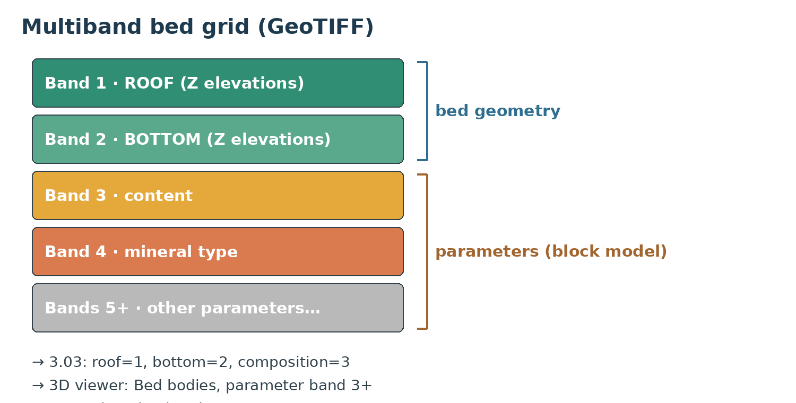{width=70%}

## Demo layers and their attributes

| Layer | Geometry | Attributes |
|---|---|---|
| Section lines (demo) | line | name (Section 1, 2, 3). Three traces of different length: a polyline with two bends (the vertices test the stationing), a short straight one and a slanted one with a single bend. |
| Collars (demo) | points | hole_id, z (collar elevation), eoh (end of hole), number for the label. |
| Intervals (demo) | table | hole_id, from, to (depths along the hole from the collar), code (bed index). |
| Bed reference (demo) | table | code, order, body, color, strata. Matching the demo interval codes. |
| Zone (demo, polygon) | polygon | name. For the vector-intersection tool 4.05. |
| Fault (demo, 2D) | line | name. Crosses the trace, moved off the line bend. |
| Marker with Z (demo, 3D) | line Z | name. Tests 3D geometries in 4.05. |
| Overturned TIN (demo) | polygons Z | name. An overturned fold for 4.06. |
| Surface 1…6 | raster | A single elevation band. |
| 1st/2nd industrial bed | raster | Bands: 1 roof, 2 bottom, 3 content, 4 mineral type. |

The workflow is shown in section 4.01: the surfaces go into **Cross-section along a line**, the collar and interval pair into **Boreholes on the section**, the composition grid into **Bed composition on the section**, and the demo vectors and TIN into the intersection tools 4.05 and 4.06. The whole cross-section group then runs on consistent data.

## Parameters

| Parameter | What it sets | Default / hint |
|---|---|---|
| Area (extent) | The rectangle in which the set is generated. | set per project |
| Generator seed (Adv.) | The RNG seed for reproducibility. 0 means random on each run. | 0 |
| Surface 1...6 | Six rasters top to bottom: the roofs and floors of the host beds and the two industrial beds. | created |
| Section lines (3) | Three traces across the area to feed into 4.01. By default the tool builds a section along each of them. | created |
| Borehole collars collar | The drilling-model point layer (hole_id, z, eoh, PointZ). | created |
| Borehole intervals interval | The drilling-model table (hole_id, from, to, code, kcl). | created |
| Composition: content | A content grid of the industrial beds for 4.03. | on request |
| Composition: type/facies | A mineral-type grid (1 sylvinite, 2 replacement) for 4.03. | on request |
| Fault, Z marker, zone | Demo vectors for 4.05: a line without Z, a contour with Z, a zone polygon. | on request |
| Overturned TIN | 3D faces of an overturned fold for 4.06. | on request |

The full list of output-layer fields is in the **Section data** appendix section ("Demo-layer fields" at the end of the manual).

# 4.11 Bed reference template

The tool adds the bundled bed reference template to the project - the very one read by **4.01** and **4.02**. The reason is simple: the template lives as a file inside the plugin directory, where a user does not normally look. Without this step the reference has to be hunted for by hand, and failing that, the first table at hand gets fed into the section and the drawing comes out without colour.

The tool has no parameters. One run, and the **Bed reference (template)** layer appears in the project and is immediately visible in the drop-down of the section tools.

## What is inside

A table without geometry, one row per bed or interbed, top to bottom down the section. The columns are the body code, the number from the top, the body kind (bed or interbed) and the colour, plus the optional strata and note columns, which are read but not used yet.

The template is built for the Verkhnekamskoye deposit: 37 rows from the cover deposits down to the lower rock salt. For another deposit it serves as a skeleton. Save the layer to a file by the standard QGIS means and edit the codes, the order and the colours for your own stratigraphy.

## The body is filled in by the geologist

This is the main thing to understand about the reference, which is why it is repeated here. The body cannot be derived from the code. The bed **АБ** looks like "А plus Б" by its spelling, yet it is a single bed containing А, Б, the А-А' parting and А'. The interbed **Б-В** cannot be derived from the code at all, because there is no bed Б in the list, there is АБ. The tool does not recompute the body values and in that sense is no wiser than the person who entered them.

## Composite bodies are grey

The template holds **КрIIIа+б**, a composite body: the sum of КрIIIа, the КрIIIа-б interbed and КрIIIб. Such conglomerates are painted grey in the reference, the same shade the plugin uses to mark the unrecognised. The reason is that the colour of a composite body does not follow from the colours of its parts: the parts may differ, and any choice would be arbitrary. Grey reads as "colour not set", and it is the person who sets it.

Holding the whole next to its parts in one list has a price worth knowing. The top-to-bottom order is single, so between **КрIIIб** and **КрIIIв** there are now two bodies rather than one, and such a pair of boundaries on a section yields a grey band with a list instead of the interbed name. At the coarse granularity, between **КрIIIа+б** and **КрIIIв**, everything works out as usual.

## The same file outside QGIS

The template lives in the **templates** folder inside the plugin directory in two forms, `plast_reference_vkmks.xlsx` and `plast_reference_vkmks.csv`. The Excel workbook has a second sheet with the filling rules. Edit it any way you find convenient, the section tools accept a project table, a GeoPackage and a CSV alike.

# 4.12 Attitude from an outcrop trace

Computes the dip and the dip direction from a three-dimensional trace of an outcrop.

| Parameter | What it sets | Default / advice |
|---|---|---|
| Outcrop traces | Lines with elevations (Z in the vertices). | - |
| Window, vertices | 0 - one attitude per trace, otherwise a sliding window. | 0 |
| Minimum curvature (adv.) | The conditioning threshold below which a refusal follows. | 0.15 |

**Where the attitude comes from.** When the boundary of a bed or a fault is digitized with elevations, the plane through it is defined uniquely and both elements of the attitude follow from it. The three-point rule is the minimal case, here the computation runs over all the vertices at once.

The method follows Allmendinger: the normal to the plane is the eigenvector of the orientation matrix belonging to the smallest eigenvalue. A fit of the form `z = a·x + b·y + c` is simpler but falls apart on steep attitudes, where the coefficients run to infinity. Through the eigenvectors steepness stops being a special case.

**A trace straight in plan does not define an attitude.** Infinitely many planes pass through one straight line in space: they rotate about it like pages about a spine. The tool sees this through the ratio of the eigenvalues and refuses with a reason instead of a confident number out of rounding noise. The measure goes into the **planar** field: zero for points on a line, one for a spread in two directions.

**A fold is caught by the residual.** The method assumes the trace lies on one plane, and a long boundary rarely does: a flexure, a displacement by a fault, an inflection. The mean residual goes into the **rms** field, and a large value means that no single attitude exists for the whole trace. Then turn on the window: the attitude is computed over a sliding stretch and the output carries its change along the boundary.

**Place in the chain.** The output feeds straight into 4.05, which expects exactly the dip and dip_az fields. If the terrain is given by contours and the trace is flat, put it through 2.22 first - the elevations will be taken off the adjoining contours.

# Geological model

The group brings together tools that work not with a single surface but with a stack: the roofs and floors of neighbouring bodies are tied to one another, and that tie is either kept or broken. Checking it is the first task. The second is to have at hand material whose answer is known in advance, on which it is visible where the grid representation works and where it stops working.

# 5.01 Consistency of a bed stack

Roofs and floors are usually built separately: every surface is interpolated from its own measurements and knows nothing about the neighbouring ones. While the beds are persistent this gets away with it. In a pinch-out zone, where the thickness goes to zero, two independently built surfaces almost inevitably intersect, and after that the arithmetic over such a stack gives negative thicknesses and volumes, while the section shows inverted bands.

The tool answers whether such places exist and where exactly.

## What is counted

**Pinch-out** - a thickness within the tolerance of zero. This is geology rather than a defect, and it goes into a separate count.

**Negative thickness** - the roof of a bed lies below its floor.

**Overlap of neighbours** - the floor of the upper bed has dropped below the roof of the lower one. This check is separate and does not reduce to the previous one: every bed on its own may be sound while together they overlap.

**The smallest gap** between neighbours is produced as a map, not only as a number. The number says how much, the map says where, and the second matters more: that is where the overlap will appear at the next recomputation of the surfaces.

**The sign of a reversed order** fires when the overlap has taken almost the whole area while the beds themselves are clean. Geology does not look like that: a real overlap is local and sits next to a pinch-out. Almost certainly the beds have been supplied bottom up.

The pinch-out tolerance is set by a parameter and by meaning equals the accuracy of the surfaces. With a zero tolerance the numerical noise in the zone of convergence will spill into errors.

## Where the order of beds comes from

The order of occurrence from top to bottom is taken from the layer tree of the project, and if a bed reference is supplied, from it. The order in which the files were picked in the dialog means nothing: QGIS does not preserve it, and it cannot be relied upon. Where the order came from is printed to the log.

The reference is applied only if it describes the supplied beds. A foreign reference that matches no code is ignored with a message instead of imposing a random order.

## What comes out

A raster of zones with codes: consistent, pinch-out, negative thickness, overlap. A map of the smallest gap to the neighbouring bed. For every bed the log gets the range of thickness and the areas of the zones, for every pair of neighbours the smallest gap and the area of the overlap.

Areas are printed in hectares rather than in cells: a thousand cells on a one-metre grid and on a thirty-metre one differ by a factor of nine hundred.

## What the tool does not settle

A negative thickness comes from two origins, and arithmetic cannot tell them apart: an error of interpolation or an overturned bed on a fold. The tool marks the places and prints the numbers but passes no verdict. It is the drilling data that tells them apart: if the codes along the hole do not follow the stratigraphic order, that is the sign of overturning, and it is computed directly from the drilling model.

Telling an erosional truncation from a pinch-out is likewise impossible without the dissolution surface on the input: at a truncation the thickness breaks off on the mirror, at a pinch-out the roof and the floor converge on each other, but on the map of zones both look the same.

# 5.02 Create an example section (demo)

The tool builds a teaching section of the Verkhnekamskoye type with all the cases for whose sake the rest of the group exists. It is useful because the answer is known in advance: any disagreement with it is an error of the tool rather than of the data.

## What is in the example

**The column** is taken from the bed reference in full, thirty-six bodies from top to bottom: the cover deposits, the variegated and the terrigenous-carbonate sequences, the salt-marl sequence, then the salt with the transition unit, the cover rock salt, the carnallite zone with its interbeds, the sylvinite beds, the underlying salt, the marker clay and the lower salt. Interbeds here are bodies just like beds.

**A recumbent fold** in the middle of the area. At its hinge a vertical borehole crosses one and the same body three times: in the horizontal limb, in the upper arc and in the lower one, while the neighbouring body is penetrated twice. Above a point in plan there are several roofs, and the elevation ceases to be a function of two coordinates. No density of the network will fix that.

**A pinch-out** brings the thickness of one bed to zero by a smoothed step between two boundaries. The boundaries are produced as lines - the very input needed to build a thickness trend.

**A salt dome with a dissolved top** stands aside from the fold. The dome lifts the salt as a whole, the dissolution surface cuts away what has been lifted, and it is not one body that is cut but the whole column down to the level of dissolution. The mirror is the roof not of an appointed body but of the one that survived: aside from the dome the transition unit, over the crest the cover salt.

The salt-marl sequence settled on the dissolved salt and fills everything up to the base of the terrigenous-carbonate one, so over the dome it is thin while aside from it full.

## The grids in the fold zone are wrong on purpose

The surfaces are built from the first penetration from the top, that is exactly as a person would assemble them from borehole measurements without noticing the overturning. In the fold zone they are invalid by construction, and this is deliberate: 5.01 must show overlaps and negative thicknesses on such grids. The outline of the zone is produced as a separate layer so that it is not mistaken for an error of the tool.

## What comes out

The surfaces are written into a folder, one file per contact, and are loaded into a group in the order of the column. Thirty-seven separate rows in the dialog would be unopenable, so the parameters carry a single folder.

Besides the surfaces the tool produces the dissolution mirror, the map of what comes out under the mirror, the thickness of the water-protective sequence from the roof of bed B to the mirror, the collars and intervals of the drilling model with the number of the penetration in the entry field, the pinch-out boundaries as lines, the outline of the fold zone and the bed reference with codes, order, kind of body and colour.

Everything is deterministic: the same parameters give the same section.

## How to use it

Build the example, feed its surfaces into **5.01** and make sure that the overlap is found in the fold zone and the pinch-out where the boundaries are set. Then run a section line across the crest of the dome with **4.01**, supplying the bed reference: the bands break off on the mirror, over the crest the upper body is absent altogether and the next one is truncated. This is the picture an erosional contact gives, and it is convenient for checking how sections behave on real data.

# River hydrology

The group answers the question by which flooding is justified: how high the water rises at a given discharge, and what discharge passes at a given level. The link between discharge and level is built for a cross-section and is called a rating curve.

The task came from practice: hydrologists build such curves in programs with manual entry, where the distance and elevation pairs are typed in as a table for every section, and the coefficients and slopes are written out by hand. Meanwhile all of that is data already present in GIS: the distances sit in the geometry of the section, the elevations in the soundings, the slope between sections is computed from the chainage.

The branch stands on its own and does not overlap with the geological model, the only thing they share is the machinery of profiles.

# 6.01 Cross-sections and rating curves

The main tool of the group. From a section and its elevations it builds a table and a graph of the dependence of discharge on level.

## How it is computed

The profile is taken along the vertices of the section, the elevation from the vertex Z. A surveyed elevation is more accurate than any terrain model, so the source is the geometry of the section itself rather than a DEM sample.

The profile is divided into the left bank, the channel and the right bank. Counting them separately is mandatory: the roughness of the floodplain and of the channel differ several times over, and a single count understates the channel part. On every part the flow area, the top width, the wetted perimeter and the hydraulic radius are computed, then the discharge by the Manning formula. The total discharge is the sum over the parts.

The wetted perimeter is taken along solid boundaries, that is along the bed and the slopes, without the vertical planes of the division. The methodologies differ here, and the simplest of the conventions has been adopted.

## The division

It is set in one of two ways. Either the section arrives as a single line and the boundaries stand in fields as distances along the profile. Or as three lines with a role field and a common name - then the division lives in the geometry, the way hydrologists draw profiles. The second way is preferable: no distances by hand.

## Roughness and slope

They are taken from the fields of the section rather than from the parameters of the tool. The reason is not convenience: there are many sections, each has its own values, and the parameters cannot express that, while with fields the calibration comes down to editing a table. The parameters serve as a default for sections without fields, the accepted values are printed to the log.

The slope can be computed **from the chain of sections**: if the chainage and the bed elevations are set, the slope of each is taken to its neighbour from the difference of elevations and the distance along the river. In existing practice it is written out relative to the previous section by hand, here the same value comes out of the attributes on its own.

### Fields and units

Sections on input:

| field | what | units |
|---|---|---|
| `sec` | section name, the lines are grouped by it | text |
| `km` | chainage from the mouth | km |
| `role` | role of the line when supplied as three lines | text: left, channel, right |
| `div_l`, `div_r` | part boundaries, distances along the profile from the start of the line | m |
| `n_left`, `n_channel`, `n_right` | Manning roughness by part | dimensionless |
| `slope` | slope of the water surface | m/m |

The table of soundings on input of **6.03**: `sec`, `dist` - the distance along the section in metres, `elev` - the absolute elevation in metres, `km`, and the same computation fields if they are present.

The table of probability discharges: `prob` in percent, `q` in cubic metres per second. The table of observed levels: `level` in metres, `label` as text.

The curve on output: `level` m, `area` m2, `width` m, `perim` m, `radius` m, `v` m/s, `q` m3/s, `n` dimensionless, `slope` m/m.

The drawing footer: the same plus `depth_avg` the mean depth in metres, `slope_ppm` the slope in per mille, `n_inv` the inverse of the roughness, `q_pct` the share of the total discharge in percent, `part_no` the number of the part.

Ground elevations: `dist` the distance along the section in metres, `elev` the elevation in metres, `step` the distance to the previous point in metres.

Levels: `level` m, `q` m3/s, `prob` percent, `label` the caption, `kind` the kind of level - `prob` computed, `obs` observed.

### In what units

The slope is dimensionless: the ratio of the fall to the length, metre per metre. In the fields and the parameters it is set exactly so, 0.0004 rather than in per mille. In the drawing footer the same slope is output as a separate field in per mille, because that is how report tables are written: 15.30 per mille in the footer is 0.0153 in the field of the section.

The roughness is set as the Manning coefficient: 0.030 for a clean channel, 0.070 for an overgrown floodplain. Strictly speaking the coefficient is not dimensionless, the dimension hides inside the formula, and that is why the formula is metric: the discharge comes out in cubic metres per second at an area in square metres and a radius in metres. For feet the formula would require its own factor.

In the footer the inverse of the coefficient goes next to it, because that is what is printed on a gauging section: 10.00 in the footer corresponds to 0.100 in the field of the section.

Fields with the names of the contract - sec, km, div_l, div_r, n_left, n_channel, n_right, slope - are picked up without the user, and the picked ones are printed to the log. An explicit choice is always senior to what has been found.

## Levels

Probability discharges - 1, 5, 10 percent - are supplied as a table of probability and discharge pairs. The tool does not compute them from observation series, that is hydrological statistics. For every discharge a level is found along the curve, and the levels come out as lines in drawing coordinates with ready labels of the UVV1% kind, the way they are put on a gauging section. A discharge above the curve gives a warning rather than an extrapolation.

Observed levels are supplied by their own table: an elevation and a label. This is a measurement rather than a computation, it does not rely on the curve and lies next to the computed ones, in the manner of UV 472.90 X/2021. In the layer of levels such rows are marked kind=obs, the computed ones kind=prob, and the field gives them different styling.

## The drawing footer

For the sheet of a gauging section a footer is produced separately - a row per part with the width, mean depth, flow area, wetted perimeter, hydraulic radius, slope in per mille, roughness coefficient and its inverse, velocity, discharge and the share of the total. The level is set by a parameter, without it the first one by probability is taken.

Next to it go the ground elevations and distances as points - the bottom rows of the same drawing. The sheet is assembled by a print layout: the tool gives the data, the design lives in the template.

## What matters about the method

The Manning formula describes steady uniform flow. The curve is a hydraulic characteristic of the section rather than a computation of a release wave, and the tool promises no more.

The slope enters the discharge under a square root, so an error in it tells directly. On lowland rivers it is small, and the value is always printed to the log so that the accepted one is visible.

## What comes out

A table of the curve by parts and in total with the area, width, perimeter, radius, velocity and discharge at every level. The section profiles, the levels, the footer and the ground elevations as separate layers in drawing coordinates.

An HTML report for every section: the profile with the levels and the division boundaries drawn on it, a graph of discharge against level with the probability lines, a table of levels and the table of the curve. The pictures are embedded into the page itself, so the report stays one file that can be forwarded.

# 6.02 Flood extent polygon

Cuts the surface by a water level and produces the flood extent and a raster of depth.

The level can be set directly or by a discharge: then it is taken backwards along the curve from 6.01 - the very move drawn as a red arrow on manual constructions. The curve is supplied as a table, the discharge as a number, the accepted level is printed to the log.

The tool is deliberately separate from 6.01: it has a different input and a different consumer, and there is no point in running the whole curve computation for the sake of one polygon.

Small patches are dropped by area: on a flat floodplain single cells below the water line give speckle that has nothing to do with the flood. Connectivity with the channel is not checked, and the log says so: closed depressions away from the river will stay in the extent, and that is visible on the map.

# 6.03 Import section tables

Turns a table of soundings into sections with elevations in the vertices.

Existing programs keep the profile as pairs of a distance from the start of the section and an absolute elevation, and over years of work many such tables accumulate. There is no point in retyping them by hand for the sake of moving into GIS.

If the sections are already digitized on the map, supply them as a layer: the soundings will lie along the real lines, and the distance along the section becomes the distance along the line. A section for which no line was found is built by the scheme with a warning, soundings longer than the line are pressed to its end also with a warning.

Without a line layer the geometry is built as straight sections by an azimuth and the chainage. This is a scheme rather than a survey, and it does not affect the computation of the curve at all: the curve needs the distances along the section and the elevations.

Computation properties are carried along with the profile if the table holds them: the division boundaries, the roughness values and the slope. Without them the geometry would come back but not the computation, and the curve over the restored sections would part from the original one.

# 6.04 Create an example river (demo)

A teaching chain of sections with a known answer: a valley with a channel and two floodplains, elevations in the vertex Z, the fields of division, roughness, slope and chainage filled in.

The channel and the floodplains have different roughness, so the curve shows how the floodplain comes in: up to the banks the discharge grows steeply, above the break the floodplain adds area but adds little discharge.

Besides the sections it produces a table of soundings - the input for 6.03 - and a valley surface as a raster, the input for 6.02: there is nothing for the flooding to cut while the valley exists as lines only. The surface is built from the same sections as the curves, so the flood extent and the rating curve speak of one valley rather than of two similar ones.

A separate output is a reference curve computed by the core directly. A discrepancy with what 6.01 gives on the same sections is an error of the tool rather than of the data: the answer is known in advance.

## How to check the group

Build the example, feed the sections into 6.01 and compare the table of the curve with the reference one - they must coincide. Then feed the table of soundings into 6.03 together with the layer of the demo sections: the restored sections will lie over the originals and give the same curve. Finally feed the valley surface, the rating curve and a discharge into 6.02 - you get the flood extent and the depth.

# What the group does not have yet

Soundings as a separate point layer and sampling of the profile from a DEM for sections without Z. Bathymetry: the restoration of the bed between surveyed sections along the channel is a separate task with its own anisotropy, and until then the curves are computed over surfaces where the bed is present.

# 7.01 Fractal dimension

The tool computes a fractal-dimension map of a surface by the variogram method, native to the plugin: a log-log variogram over lags of one to N cells is built in a sliding window, its slope gives the Hurst exponent H, and the dimension D = 3 - H. Smooth differentiable areas give D near 2, rugged and noisy ones tend to 3; the values themselves matter less than their steps - they highlight zones of tectonic disturbance, block boundaries and changes of the roof relief character.

The output is a D grid that feeds straight into **1.04 Isolines from a raster** for dimension isolines; an advanced checkbox adds H as band 2. The global D and H over the whole surface are printed to the log.

## Reading the map

The absolute D values matter less than their steps: a linear step across the area is a lineament, a candidate tectonic disturbance; a patch of a raised D is a zone of intense folding or a rugged roof relief; wide even fields of a low D are quiet blocks. For reading, apply a singleband pseudocolour symbology with a contrast palette and quantile classification, and for a report plan build isolines with belts over the D grid with tool 1.04 - the disturbance zones get outlined like contour lines.

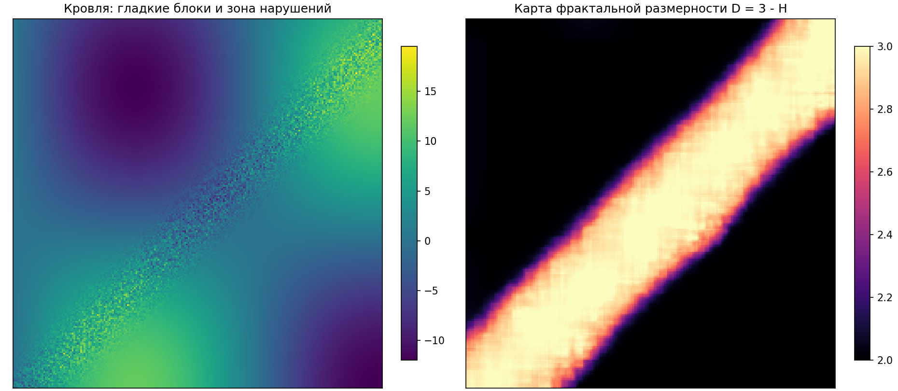{width=92%}

## Picking the window and the lags

A small window (5-8 cells) reveals the microstructure and local disturbances, a large one (12-20) - regional zones; in doubt compute both and compare. Four lags fit almost always: more lags - a steadier slope but a coarser minimal scale the method can resolve. The window and the lags are limited by the grid size, the tool checks that itself.

## Workflow

A bed roof from kriging → **7.01** with a window of 8 → the D grid → **1.04 Isolines from a raster** (band 1) → dimension isolines with belts over the structural plan. The global D from the log is one number per surface to compare areas or beds with each other. The raster must be in a metric CRS; the demo surfaces fit as they are.

## Parameters

| Parameter | What it sets | Default / advice |
|---|---|---|
| Surface (raster) | A relief grid or any surface. | - |
| Window half-radius, cells | The sliding-window size. | 8 |
| Number of lags (Adv.) | Variogram lags 1..N cells. | 4 |
| Elevation band (Adv.) | The band with elevations. | 1 |
| Write H (Adv.) | Add H as band 2. | off |
| Fractal dimension | A D grid (and H if checked). | - |

# 7.02 Mask box-counting

Classic box-counting for binary masks: the raster is binarised by a threshold (the object - values above it), the mask is covered by cells of a decreasing size, the slope of log N versus log(1/size) gives one dimension D for the whole mask. A linear object gives D near 1, a blob - near 2, rugged outlines of replacement zones or mined-out areas fall in between. The accuracy on finite masks is about ±0.1, so the method is good for comparing masks with each other rather than as an absolute measure. The result is printed to the log with a table of sizes and counts and returned as the number D - usable further in Processing models.

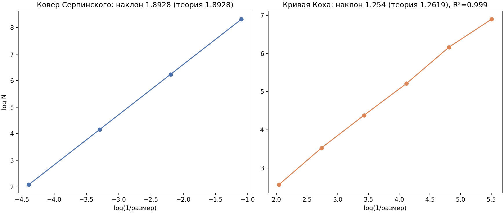{width=92%}

## Where the mask comes from

The mineral-type band of a bed grid with a threshold between the class codes, an indicator-kriging probability grid with a 0.5 threshold, an exceedance-probability map with a cut-off threshold, vector outlines of workings or zones - rasterised beforehand with the standard "Rasterize (vector to raster)". Compare the D of masks of the same nature on the same grid: a growth of the replacement-outline ruggedness from bed to bed or from year to year is a meaningful signal.

| Parameter | What it sets | Default |
|---|---|---|
| Mask raster | Any raster; the mask - values above the threshold. | - |
| Threshold | The object/background boundary. | 0.5 |
| Band (Adv.) | The raster band. | 1 |

# 7.03 Line and boundary dimension

The dimension of every line by the divider (Richardson) method: the line is walked with chords of a decreasing span, the slope of log N versus log r gives D. A straight line gives one, a rugged line - more. Polygons are accepted alongside lines - the exterior ring of the boundary is measured, so the ruggedness of zone and basin outlines is computed without a prior conversion. The output is the same features with the D and steps fields, the mean D is printed to the log; short lines get an empty D. The method is checked on references: the Koch curve gives 1.262 against the theoretical 1.2619.

## An isoline-smoothing diagnostic

Oversmoothed isolines lose their ruggedness and D drops towards one. The workflow: build the isolines twice - without smoothing and with the working parameters, run both layers through the tool and compare the mean D from the log. A drop by hundredths is cosmetics, the shape is kept; a drop by tenths means the smoothing eats the field geometry - weaken the rounding or keep the densification only. The D field in the attributes lets you find the specific lines that suffered most.

## Other uses

The ruggedness of zone outlines in plan, comparing the digitising detail of boundaries from different sources, generalisation control when preparing small-scale plans - anywhere "how winding the line is" must become a number.

| Parameter | What it sets | Default |
|---|---|---|
| Lines | A line layer (isolines, outlines). | - |
| Lines with the dimension | The same lines with the D and steps fields. | - |

# 7.04 Minkowski dimension (vectors)

Box-counting directly over vectors, no rasterisation: lines and polygon boundaries are covered by a grid of a decreasing size, the slope of log N versus log(1/size) gives the Minkowski dimension. A straight line and a smooth boundary give D near one, a river network - 1.1-1.5, a heavily rugged coastline - up to 1.3 and above. Every feature gets the D_mink and D_r2 fields (the log-log fit quality: below 0.85 the estimate cannot be trusted), and separately the D of the layer as one set is computed and printed to the log: for a river network that is the dimension of the network as a whole, regularly higher than that of the individual branches.

The method complements the divider of 7.03: the divider measures the sinuosity of one line, Minkowski - the plane filling by a set of features. The dimension is also returned as a number output for Processing models.

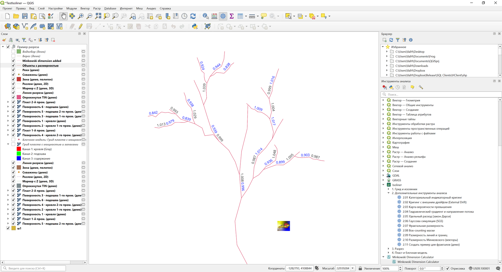{width=88%}

| Parameter | What it sets | Default |
|---|---|---|
| Lines or polygons | A vector layer; for polygons the boundary rings are taken. | - |
| Number of grid sizes, K (Adv.) | Ladder steps; a too large K takes the cells below the line detail and lowers D. | 8 |
| Grid offsets per size (Adv.) | Random shifts, the minimal cover is taken - removes the grid alignment. | 3 |
| Densify factor (Adv.) | The sampling step along segments as a cell fraction; 0 - vertices only. | 0.5 |

# 7.05 Create a fractal example (demo)

A generator of study features for the whole fractal five: a branching river network with an order field (the tributary order), a basin polygon with a rugged boundary and a separate coastline built by midpoint displacements. Feed the rivers into 7.04 - you get the network dimension; the coast and the basin boundary - into 7.03 and 7.04 and compare the divider with Minkowski; rasterise the basin with the standard tool - and it doubles as an example for 7.02.

| Parameter | What it sets | Default |
|---|---|---|
| Extent | The generation area. | - |
| Seed (Adv.) | The example repeatability. | 1 |

# Typical situations and solutions

| What you see | Cause | Solution |
|---|---|---|
| Concentric "bull's eyes", cones | Kriging pulls the value exactly through outlier wells (nugget 0). | Set a nugget C0 (0.2-0.4 of the sill, in absolute variance units). And/or enable grid smoothing in **2D Kriging**. |
| Angular isolines ("octagons") | A coarse grid: vertices are placed at cell edges. | Increase **Line rounding** to 3 or reduce the cell size in kriging. |
| Radial/fan lines in empty corners | Extrapolation beyond the data. | Enable **Clip to well hull** or set a clip mask. |
| Isolines cross in dense areas | Formerly - a consequence of smoothing each line. | Smoothing is done over the field (in **2D Kriging**). Increase the grid-smoothing radius there. |
| Polygons of one colour | By default the layer is created with a single symbol. | Set graduated symbology by ELEV_MIN. |

# Appendix. Isoliner in 15 minutes

You need no data of your own. In every scenario the first step creates or downloads the data itself, so the route can be walked on an empty project.

The module holds 48 tools, and that is daunting at first sight. Start with five: **1.02**, **1.04**, **2.03**, **2.13** and **4.01**. The rest will find you when a task calls for it.

After every step there is a line saying what should come out. If something else came out, that is the place to stop and look into it rather than to move on.

---

## Scenario 1. I have points

Five minutes. Boreholes, samples, measurements, any irregular network of observations.

**Step 1.** **1.10 Create sample boreholes (demo)**
Minimum: nothing to set, defaults are fine. If you have points of your own, skip the step.
*You get:* a point layer in the project.

**Step 2.** **1.02 2D Kriging (points to raster)**
Minimum: **Points**, **Value field**, **Cell size**. The rest by default.
*You get:* a raster and a layer of standard error. The error grows where the points are sparse, and that is the first thing worth looking at.

**Step 3.** **1.04 Isolines from raster**
Minimum: **Raster**, **Interval**, **Isoline style** = Structure / hypsometry. Choose the interval so that the lines are visible but do not merge into solid hatching.
*You get:* isolines with labels and contour bands whose borders coincide with the lines.

Further at will: **1.05** and **1.06** show whether the data hold anisotropy, **1.08** rates the method by cross-validation.

---

## Scenario 2. I need a relief

Fifteen minutes. The main scenario: we build a relief, check it with numbers and treat what is found.

**Step 1.** **2.01 Download DEM by extent**
Minimum: **Relief source** = GEDTM30, **Download extent** over the area of interest. GEDTM30 is a terrain model without forest and buildings, and for building contours it suits better than Copernicus GLO-30, where the height is taken off the treetops.
*You get:* a relief raster in the project coordinate system.

**Step 2.** **1.04 Isolines from raster**
Minimum: **Raster**, **Interval** of 5 or 10 m. The rest by default.
*You get:* a contour layer. From here on it plays the part of source data, as if it had been handed to you.

**Step 3.** **2.05 Flow and accumulation (D8)**
Minimum: the **DEM** from step 1. Leave the filling of depressions on.
*You get:* rasters of flow direction and accumulated area.

**Step 4.** **2.06 River network**
Minimum: the accumulation raster from step 3, **Catchment threshold** in cells. Start with a thousand and tune it until the network looks plausible.
*You get:* watercourse lines directed downstream, that is, ready-made streamlines.

**Step 5.** **2.09 Peaks**
Minimum: the **DEM** from step 1, **Search radius** in cells.
*You get:* points of local maxima with elevations.

**Step 6.** **2.02 Download topographic base by extent**
Minimum: the same **Extent**. From OSM take areal water bodies and dry channels, but not rivers and peaks: those are already computed from the relief in steps 4 and 5 and agree with it, whereas from OSM they come from another source and may not match the matrix.
*You get:* up to five layers in the Topography group.

**Step 7.** **2.03 Topo2Raster (relief from vectors)**
Minimum: **Contours** from step 2 and the **elevation field**, **Streamlines** from step 4, **Spot heights** from step 5 and the elevation field, **Lakes and shoreline** from step 6 and the shoreline elevation field, **Cell size**. Supply cliffs if the topographic base holds any.
*You get:* a new relief raster built from typed vectors rather than from contours alone.

**Step 8.** **2.12 Contour residuals against the DEM**
Minimum: **Contours** from step 2, the **elevation field**, the **DEM** from step 7.
*You get:* a point layer of residuals and an HTML report. Look at the mean offset and at the share of points that missed by more than half the interval.

**Step 9.** **2.13 DEM terracing check**
Minimum: the **DEM** from step 7 and the **Contour interval**, the same as in step 2.
*You get:* the index of attraction of elevations to the levels. Near one means there are no steps, two and above means terracing.

**Step 10.** **2.14 Remove steps (clamped smoothing)**
Needed only if the previous step found terracing. Minimum: **DEM with steps**, **Contour interval**, **Iterations** 50.
*You get:* a corrected relief and a before and after report. The index should come down towards one.

If you want to test the method rather than your data, replace the first step with **2.10 Demo relief** and its **Gully network** tick. Then the true surface is known in advance and it is plain to see what gets lost in the building. Gullies are lost first.

There are two ways to check against the truth. By eye: build isolines over the restored relief with the same interval and lay them over the contours of step 2 in another colour, the lines should coincide and part only on the summits above the last contour. By number: the raster calculator, the expression "restored minus truth", and the statistics of the difference in the layer properties. At an interval of 5 m expect a mean near zero and a spread of about a metre, with the largest discrepancies on the peaks. Adding the peak points from step 5 into step 7 shrinks those summit discrepancies noticeably, and that is exactly the answer to why topographers write peak elevations on maps.

---

## Scenario 3. I need a section

Three minutes.

**Step 1.** **4.10 Create a sample for the section**
Minimum: nothing to set, defaults are fine.
*You get:* a set of layers in the Section sample group.

**Step 2.** **4.01 Section along a line**
Minimum: **Section line**, **Surfaces top to bottom**, **Vertical scale**.
*You get:* a section drawing in engineering coordinates, with axes, elevations and bands of the beds.

---

## Where to go next

The manual describes every tool in detail, with parameters and caveats. This page holds neither options nor theory on purpose: its job is to walk you through the module once, not to replace the documentation.

OpenStreetMap data: © OpenStreetMap contributors, ODbL. The Copernicus GLO-30 and GEDTM30 matrices are distributed freely.

# Appendix. Demo layer fields

A summary of the fields of all demo-data generators with units. The values are demonstrational: where a quantity is abstract, the units are nominal.

## Topography group outputs

Line layer **River network** (tool 2.06):

| Field | Type | Meaning, units |
|---|---|---|
| order | integer | Strahler order |
| acc_out | real | accumulation at the link outlet, cells |
| length_m | real | link length, m |

Polygon layer **Basins** (2.07): **basin** - the basin number (integer), **area_m2** - the area, m². Point layer **Peaks** (2.09): **z** - the elevation, m, **drop** - the drop over the window minimum, m. Base topography layers (2.02) carry **name** and **osm_id**, watercourses also **waterway**, water bodies **water**, peaks **ele** (elevation, m), cliffs **kind**. The demo relief (2.10) is a raster without fields.

## Sample wells (demo) - tool 1.10

Point layer **Sample wells (demo)**:

| Field | Type | Meaning, units |
|---|---|---|
| well | string | well name or number |
| roof | double | absolute bed roof elevation, m |
| thick | double | bed thickness, m |
| X | double | content of a nominal component, percent (demo) |
| head | double | head, m (optional) |
| K | double | hydraulic conductivity, m/day (demo, optional) |
| T | double | transmissivity, m²/day, T = K·thickness (optional) |
| mintype | string | mineral type, category (demo replacement, optional) |
| dz | double | value linearly related to the drift, nominal (optional) |

Optional raster **Drift surface (demo)** - an external surface for external-drift kriging, nominal units.

## Electrical-prospecting profiles - tool 1.11, electrical mode

Point layer **Electrical-prospecting profiles (rho_k, SP, IP)**:

| Field | Type | Meaning, units |
|---|---|---|
| profile | integer | profile number |
| picket_m | double | picket from the profile start, m |
| pk | string | picket as a PK label (e.g. PK5+20) |
| z | double | surface elevation, m |
| rho_k | double | apparent resistivity rho_k, Ohm*m |
| rho_true | double | rho_k without noise, Ohm*m (reference) |
| sp | double | self-potential SP, mV |
| vp | double | induced polarisation IP, mV/V |

## Subsidence profiles - tool 1.11, subsidence mode

Point layer **Subsidence profiles (trough, tours: N)**:

| Field | Type | Meaning, units |
|---|---|---|
| profile | integer | profile number |
| picket_m | double | picket from the profile start, m |
| pk | string | picket as a PK label |
| tour | integer | observation tour number |
| z | double | surface elevation, m |
| settle | double | subsidence, mm |
| settle_true | double | subsidence without noise, mm (reference) |

## Section data - tool 4.10

- **Surface 1…6** (rasters) - elevations of six stacked surfaces, m. Top to bottom: 1 roof of the upper host, 2 roof and 3 floor of the 1st productive, 4 roof and 5 floor of the 2nd productive, 6 floor of the lower host.
- **Section lines (demo)** (line): field **name** - line name (Section 1, 2, 3).
- **Collars (demo)** (points): **hole_id**, **z** - collar elevation, **eoh** - end of hole, **number** - label.
- **Intervals (demo)** (table): **hole_id**, **from**, **to** - depths along the hole from the collar, **code** - bed index.
- **1st productive bed (demo)** and **2nd productive bed (demo)** (multiband rasters): band 1 roof (m), band 2 floor (m), band 3 content (percent), band 4 mineral type (category 1 or 2).
- **Fault (demo, 2D)** (line): **name**.
- **Marker with Z (demo, 3D)** (line with Z): **name**.
- **Zone (demo, polygon)** (polygon): **name**.
- **Overturned TIN (demo)** (3D faces): **name**.

## Fractal data - tool 7.05

- **Rivers (demo)** (lines): field **order** (integer) - tributary order in the network hierarchy.
- **Basin (demo)** (polygon): field **name**.
- **Coast (demo)** (line): field **name**.

## Density (demo) - tool 3.08

Point layer **Demo points**:

| Field | Type | Meaning, units |
|---|---|---|
| mass | double | measurement mass (demo, 50 per point) |
| prec | double | uncertainty sigma, m |

Line layer **Demo lines**:

| Field | Type | Meaning, units |
|---|---|---|
| mass | double | measurement mass (demo, 100 per line) |
| prec | double | corridor half-width, m |
| from_m | double | interval start along the line, m (may be empty) |
| to_m | double | interval end along the line, m (may be empty) |

Polygon layer **Demo polygons**:

| Field | Type | Meaning, units |
|---|---|---|
| mass | double | measurement mass (demo, 150 per polygon) |
| dasy | integer | 1 - polygon for dasymetry, 0 - uniform |

Auxiliary raster **Auxiliary raster (dasymetry)** - a value gradient for the dasymetric mode of 3.07, nominal units.

# Appendix. Variable-support density: step by step

A walkthrough of tools 3.07 and 3.08 from demo generation to a finished result, with an explanation of each parameter. The example shows how to check the mass invariant by eye.

## Step 1. Generate the demo (3.08)

Run **3.08 Create a density example (demo)**.

- **Extent** - the generation bounds. Set a rectangle on the map or by a layer. Any metric extent works, for example a square a few kilometres across.
- **Auxiliary raster cell, m** - the step of the auxiliary raster for dasymetry. Default 50, enough for the demo.
- **RNG seed** (Adv.) - example reproducibility. With one seed the set is identical.

The output is four layers: **Demo points**, **Demo lines**, **Demo polygons** and **Auxiliary raster**. The log states the embedded mass: points 500, lines 200, polygons 300, total 1000.

## Step 2. Density from points (3.07)

Run **3.07 Density from measurements** on the **Demo points** layer.

- **Measurements** - the Demo points layer.
- **Mass field** - **mass**. If left empty, each object mass is 1.
- **Precision field** - **prec**. For points this is the Gaussian spot sigma in metres. The larger the sigma, the more diffuse and lower the point contribution.
- **Cell size, m** - the result grid step. A smaller cell means a more detailed map and a longer computation. The density in mass per km2 does not depend on the cell size, only the detail does.
- **Area** - leave empty, taken by the layer.
- **Support beyond edge** - **Renormalise inside** keeps all mass in the area, **Lose mass** discards the part beyond the edge with a warning. To check the invariant use renormalise.
- **Default sigma** (Adv.) - used when the precision field is empty. Zero means the half-cell.

Check the log: the line **Input mass: 500. Mass on grid: 500. Discrepancy: 0**. This is the invariant - the density integral equals the sum of masses.

## Step 3. Density from lines

Run 3.07 on the **Demo lines** layer.

- **Precision field** - **prec** - here it is the corridor half-width in metres. The line is spread into a soft-edged strip.
- **from_m / to_m** (Adv.) - the **from_m** and **to_m** fields. One demo line has an interval set, and only its part is spread in the result. Empty fields mean the whole line.

In the log the mass on grid is 200. If the lose-mass mode is on and the corridor left the edge, the discrepancy shows how much mass was lost.

## Step 4. Density from polygons and dasymetry

Run 3.07 on the **Demo polygons** layer.

- Without an auxiliary raster the polygon mass is spread uniformly over its area.
- **Auxiliary raster** (Adv.) - feed the demo **Auxiliary raster**. Then dasymetry turns on for polygons: mass is distributed proportionally to the raster values inside the polygon rather than evenly. If the raster is empty inside the polygon, the tool falls back to uniform and writes this to the log.

The mass on grid is 300 in both modes; only the distribution shape inside the polygons changes.

## Step 5. Mix types by appending

To gather points, lines and polygons into one raster, run 3.07 three times in a row.

- The first run is as usual, you get a three-band raster.
- On the second and third, in the **Append to an existing raster** parameter (Adv.) point to the raster from the previous run. The tool reads the three bands, adds the new mass and returns the updated raster.

After three appends the total mass on grid is 1000. Bands 2 and 3 (sum m*sigma and sum m) are service for exactly this - they let you append in series and keep the effective-sigma map exact.

## Step 6. Effective sigma

Set the optional **Effective sigma** output. This is the mass-weighted sigma per cell, an effective-precision map. Where density is gathered from precise supports the sigma is small. Where from smeared coarse georeferences it is large. An analogue of kriging variance for the density floor: it shows where the result can be trusted and where it rests on coarse supports.

## Reading the result

Band 1 of the result is density in mass per km2. Open it with a single-band pseudocolour style. Density spots are where reliable measurements cluster. The invariant in the log confirms that mass is conserved and the result is correct. The layer must be in a metric coordinate system, otherwise the tool refuses to run.

# For enterprises

Isoliner grows on the tasks of real mining operations. We implement custom features to match production regulations, provide guaranteed technical support contracts and integrate the module into the production cycle, including corporate database connections. Details: https://www.informpp.ru/главная-страница/предприятиям

## Log and toolbar

Isoliner keeps a work log in the **isoliner.log** file next to the QGIS profile. At the start of a session it records the versions of the plugin, QGIS, NumPy and GDAL, then the name of the launched tool, its parameters, the run time, and on a failure the full traceback. The computation window closes but the file remains, so it is enough to attach it when reporting.

Open the log via **Plugins - Isoliner - Log** or with the **Log** button in the **About** window. The **Isoliner** toolbar holds the density map and the About window.

# License and support

The plugin is distributed under the GNU GPL v2 or later (GPL-2.0-or-later) - the same as QGIS itself. The full text is in the bundled LICENSE file. © Inform++ LLC, www.informpp.ru.
