# Introduction

Isoliner is a Processing provider for interpolating point data and building isolines. The kriging core is the KB2D algorithm from GSLIB. The tools are split into three groups: **Grid and isolines** - seven tools of the main processing flow, **Additional analysis tools** - five specialised computations, and **Cross-sections** - building geological sections.

**2D Kriging (points → raster)** - ordinary or simple kriging over a point layer.

**Isolines from raster** - isolines (lines) and contour polygons (bands between isolines) whose boundaries coincide with the lines.

**Variogram map (anisotropy)** - the γ(h_x, h_y) surface with an azimuth and anisotropy estimate, to account for directionality in kriging.

**Variogram cross-validation** - leave-one-out checking to validate and tune kriging parameters by error rather than by eye.

**Create sample wells (demo)** - generates a training point layer with a spatial structure (roof, thickness, component grade) for learning and testing without real data.

The **Additional analysis tools** group holds specialised computations, for example:

**Categorical indicator kriging** - a class-probability map from a categorical field (mineral type, lithotype): an indicator is built per class and kriged separately, giving a probability raster, a zone map and a confidence raster.

**Hydraulic gradient and flow direction** - from a head raster it builds the hydraulic gradient magnitude, the flow-direction azimuth (down-gradient) and a point layer of flow vectors styled as arrows right away. Hydrogeology without permeability.

Suitable for roof elevations, thicknesses, geomechanical properties, chemistry and any numeric well attribute.

A few terms used below. A variogram describes how much more strongly values differ as the distance between points grows. The sill is the level it reaches (close to the data variance). The nugget (from the "nugget effect") is the jump of the variogram at zero - the scatter at arbitrarily small distances caused by measurement noise and microvariability.

## Installation and location

The main way is from the official QGIS repository. Open Plugins → Manage and Install Plugins → the **All** tab, type "Isoliner" in the search, select the plugin and click **Install**. When installed from the repository, QGIS itself reports new versions and updates the plugin at the press of a button.

Raster band choice in all the tools is a drop-down with band names: a bed assembled by tool 4.01 shows roof, bottom and the parameter layer names in the lists.

{width=52%}

The alternative way is from a ZIP file. Plugins → Manage and Install Plugins → Install from ZIP. This is handy for offline installation and pre-release builds.

After installation the tools appear in the **Processing** panel: provider **Isoliner**, groups **Grid and isolines**, **Additional analysis tools** and **Cross-sections**. Requirements: QGIS 3.16+. There are no external dependencies - only NumPy, GDAL and the built-in Processing algorithms shipped with QGIS are used.

## Updating

When installed from the repository, QGIS shows a notification about a new version - an icon in the status bar and a list on the **Upgradeable** tab of the plugin manager. Updating is a single click. When installed from ZIP, the new version is installed the same way, over the old one.

The plugin reloads cleanly on the fly, no QGIS restart is required. For a quick code reload during development the Plugin Reloader plugin is convenient ("Reload a plugin…" button). Pick Isoliner - the provider and all tools re-register immediately.

## Opening the help

Each tool's dialog has a **Help** button that opens this manual (the PDF bundled with the plugin; on an English interface the English manual opens). The right-hand panel of the dialog additionally shows a short hint for the tool. The manual and the version details are also available without opening a tool: the **Plugins** menu holds an **Isoliner** submenu with **About** (version, links, changelog) and **Manual (PDF)**.

# General workflow

A typical scenario has two steps:

2D Kriging: from a point layer and a numeric Z field a raster is built (a regular grid of values).

Isolines from raster: from the resulting raster, isolines and, if needed, filled contour polygons are built.

The steps are independent: **Isolines from raster** works with any raster, not only with a kriging result.

The tools are grouped into three Processing groups. The "Grid and isolines" group is the main processing flow, from kriging to isolines. The "Additional analysis tools" group holds the specialised computations, categorical indicator kriging, external drift kriging, the hydraulic gradient with flow direction, the exceedance probability map, and the Darcy specific discharge. The "Cross-sections" group builds geological sections along a line and prepares demo data for them.

{width=98%}

# 1.1 2D Kriging (points → raster)

Ordinary (OK) or simple (SK) kriging over a point layer. Coincident points (the same XY) are averaged over Z. At grid nodes the values of the source points are reproduced exactly (with a zero nugget).

{width=70%}

Main parameters:

| Parameter | What it sets | Default / advice |
|---|---|---|
| Point layer | Source points (wells) for interpolation. | - |
| Selected features only | Compute only over the layer's selected points. | off |
| Value field (Z) | The numeric attribute that is interpolated: roof elevation, thickness, geomechanical property, chemistry, etc. | remembered between runs |
| Value transform | ln for log-normal quantities (K, T, grades with a long tail): ln(Z) is kriged and the estimate is returned via exp. | none |
| Kriging type | Ordinary (OK) - estimates the mean locally itself. Simple (SK) - uses the specified **Mean**. | OK |
| Search radius | Radius of the search window for neighbouring points around a node. 0 = whole sample. | 0 (whole sample) |
| Min. number of points | If the window has fewer points, the node stays empty (nodata). | 1 |
| Max. number of points | How many nearest points enter the kriging system. | 24 |
| Cell size | Grid step. 0 = auto = min(extent)/50. | smaller = smoother, but slower |
| Raster extent | The computation rectangle. By layer by default. | by layer |
| Clip to well hull | The raster is clipped to the convex hull of all points - removes extrapolation in empty corners. | recommended on |
| Hull buffer | Expand the hull outward by N map units. | 0 |
| Clip mask | Your own polygon instead of the hull (takes priority) - handy for concave areas. | - |
| Load processing profile | Substitutes a saved profile (nugget, variogram structure, outliers) over the dialog fields. The list refreshes when the window opens. | (none) |

{width=82%}

{width=56%}

## Automatic values

Cell size = min(extent width, height) / 50.

Variogram correlation range = max(extent width, height) / 3.

Search radius (when 0) = the extent diagonal, i.e. the whole sample is taken.

## Clip to well hull

Kriging computes the whole rectangular extent, so outside the data area the values are extrapolation and produce artefacts (long "fan" isolines in empty corners). The **Clip to well hull** option builds the convex hull of all points (with an optional buffer) and clips the raster to it. The extrapolation disappears. If the actual boundary of the area is concave, set your own polygon in the **Clip mask** - it takes priority over the hull.

## Variogram and nugget

{width=85%}

Kriging relies on a variogram model - it describes how strongly the Z values in two points differ depending on the distance between them. By this model a weight is assigned to each neighbouring well. The model is set in the **Advanced Parameters** section.

{width=82%}

Variogram model: nugget C0, sill (C0 + C) and correlation range a.

### Nugget C0

The nugget is the value the variogram curve tends to as the distance tends to zero. In theory the discrepancy at zero distance should be zero (a point compared with itself), but in practice a step remains. It reflects the fact that the data at very small distances still do not match: measurement and digitizing error, microvariability at a scale finer than the well spacing, the discrepancy of duplicates at one point.

{width=80%}

How the nugget affects the result:

C0 = 0 (default) - kriging is an exact interpolator: the surface must pass exactly through every well. An isolated well with a Z outlier turns into a cone (a "bull's eye").

C0 > 0 - kriging stops reproducing the value at the measurement point exactly and becomes a smoother: near a well the estimate is pulled toward the local mean. The larger the nugget fraction C0 / (C0 + C), the stronger the smoothing.

C0 = the whole sill (pure nugget) - the spatial link is lost, the surface degenerates into a plain mean. This is too much.

**Important - units.** Nugget C0 and sill are set in **absolute units of the data variance** (squared units of Z), not in 0-1 fractions. The default "1" for the sill is a placeholder that almost always needs changing: set the total sill (C0 + the structure contributions C) **close to the data variance**. The level of smoothing is determined not by the absolute nugget value but by its **fraction of the sill** C0 / (C0 + C). A practical order: take the total sill ≈ the variance, then the nugget = 0.2-0.4 of it (i.e. 0.2-0.4 × the variance - an absolute number, not 0.2-0.4 as such). The smaller the nugget, the more detail, but also more local peaks. The larger it is, the smoother the surface, but real structure may be smoothed away. The tool prints the data variance to the Log at start - that is your reference for choosing the sill.

### Structures, range and anisotropy

The sill (plateau) is the level the variogram reaches. It is the sum of the nugget C0 and the structure contribution C. A structure is set by a model (spherical, exponential, Gaussian or power), a contribution C, a range a, an azimuth and an anisotropy.

**Sill: meaning and order of magnitude.** The sill is the upper limit of the differences between points: how much, on average, distant wells differ. It is practically equal to the ordinary data variance. An example for KCl: mean ≈ 25 %, variance ≈ 47.6 (%²), i.e. σ ≈ 6.9 %. So the total sill is set ≈ 47.6. If the nugget C0 ≈ 17 (about 0.35 of the sill), then the structural contribution of the first structure C ≈ 47.6 − 17 ≈ 30. The absolute scale does not affect the grid itself - only the C0 : C ratio matters for the estimates. But it is needed so that the standard-error map and the MSDR in cross-validation are at the real scale (total sill ≈ variance → MSDR ≈ 1). So: do not leave the sill at the default 1, raise it to the data variance.

**Choosing a model.** The spherical and exponential models suit most tasks. The power model has no sill or range in the usual sense: it is used when variability grows with distance and does not reach a plateau (non-stationary increments), so the contribution and range fields for it are conditional. Use the Gaussian model with caution: at a zero or very small nugget it gives a numerically unstable system and artefacts (oscillations, negative weights). Therefore, when the Gaussian model is chosen, the tool enforces a small minimum nugget; set one yourself where possible.

**Data type and mode.** Different data need different settings. Smooth structural surfaces (roof and floor elevations, thicknesses) are better modelled with a long range or a power model under a wide (global, 0) search radius - then the surface comes out smooth. A short radius with local search on such data gives "bull's eyes" and discontinuities in the estimate when the set of neighbouring wells changes. For grades and chemistry (geomechanical properties, gas hazard) kriging works in its own right: here a correct nugget matters and, for a strongly skewed distribution, a data transform (see below on outliers).

The correlation range a is the distance at which the variogram reaches the plateau. Beyond it points practically do not influence each other. At 0 the automatic value max(extent)/3 is taken.

Anisotropy is set by the major-axis azimuth and the ratio of ranges (minor/major). A value of 1 is isotropic (the influence is the same in every direction). A value below 1 shortens the correlation across the major axis - useful for elongated geological structures.

{width=70%}

| Parameter | What it sets | Default / advice |
|---|---|---|
| Mean for simple kriging | Used only with the SK type. | 0 |
| Nugget C0 | The "noise"/jump of the variogram at zero. Suppresses local peaks. In absolute variance units. | 0. For smoothing 0.2-0.4 of the sill |
| Structure i · model | Variogram shape: spherical, exponential, Gaussian, power. | spherical |
| Structure i · sill/contribution C | The structure's contribution to the sill (abs. variance units). The sum C0+C ≈ the data variance. | str. 1 = 1 (replace with ≈ the variance) |
| Structure i · correlation range a | The distance to reach the plateau. 0 = auto = max(extent)/3. | 0 (auto) |
| Structure i · azimuth, ° | The direction of the anisotropy major axis. | 0 |
| Structure i · anisotropy (minor/major) | The ratio of ranges across/along the axis. 1 = isotropic. | 1 |

&nbsp;

{width=85%}

This is how the scheme looks on real data. A variogram is built from the wells: for pairs of points the semivariance is computed and averaged over distances - the result is a cloud (green points) under which a model (the curve) is fitted. From it the kriging parameters are set: the height of the "jump" at zero is the nugget C0, the plateau is the sill (usually close to the data variance), the distance to the plateau is the range a. If at large distances the points rise above the sill, as here, it is a regional trend (non-stationarity). It is either accounted for separately or the search radius is limited.

## Outlier removal

Outliers are anomalously high (or erroneous) values that distort the estimate: a few grade "bonanzas" can pull the whole grade map onto themselves, while clear errors (e.g. a negative thickness) spoil the surface. The **2D Kriging** tool lets you bound such samples right during the computation, without editing the source data. The parameters are in the **Advanced** section.

Removal and capping are a crude practical tool against clear errors. For grades and chemistry be careful: extreme values are often not noise but signal (e.g. contamination spots), and blindly clipping the distribution tails is not worth it. For strongly skewed data it is more correct not to clip the samples but to transform them to something close to normal (logarithm, Box-Cox) or to use indicator kriging - that is beyond removal, but that is exactly how heavy tails are handled in the geostatistics of ores and contamination.

{width=98%}

**Two modes.** **Remove** - samples outside the allowed range are discarded (for clearly broken records). **Cap (capping)** - values outside the range are clamped to the bound, while the point itself stays in the computation. Capping is the classic technique for grade outliers: the point's position is not lost, but its influence is limited. The mode is switched by the **Cap to bound (capping) instead of removing** checkbox.

**Absolute bounds.** The **Lower value bound** and **Upper value bound** set thresholds in Z units directly. An empty field means the bound is not set. They take priority over the percentile. Example: for thickness set the lower bound to 0 - negative values go away, and the upper, say, to 30 - a clear outlier at 122 m goes away.

**Percentile bounds.** The p-th percentile is the value below which p% of all samples lie. For example, the 5th percentile is the threshold below which only the 5% smallest values lie. The 95th is the threshold above which the 5% largest lie. The **Outliers: clip percentile, %** parameter sets the number p, and the bounds are taken symmetrically: from the p-th to the (100−p)-th percentile. So p = 2 means "treat as outliers the 2% lowest and 2% highest samples": everything below the 2nd and above the 98th percentile is either removed or capped. The larger p, the more aggressive the clipping. P = 0 disables the percentile mode. The convenience is that you do not need to know the absolute thresholds - they are computed from the data itself and suit any distribution and scale.

**Two-sidedness - important for chemistry.** The percentile mode cuts both tails - upper and lower. For grades this is dangerous: KCl = 0 in replacement zones is real geology, and clipping the lower tail would wrongly raise the "empty" areas. So for grade clip only from above: leave the **Lower value bound** empty and set the **Upper** as an absolute (or use the percentile, knowing the bottom will be affected too). For elevations and thicknesses two-sided clipping is usually appropriate.

**Order and Log.** The filter is applied before averaging coincident points. The tool's Log reports how many samples were removed or capped and within which bounds - handy for checking.

## Kriging standard error

{width=66%}

Besides the estimate itself, kriging gives at every node the error variance - a measure of uncertainty. Its square root, the standard error, is output as an optional second raster (the **Kriging standard error** parameter of the **2D Kriging** tool). The units are the same as the interpolated quantity Z.

A key property: the standard error depends on the geometry of the well layout and the variogram model, but not on the Z values themselves. So it is a map of the observation network's reliability, not of the data scatter. At a well point (with a zero nugget) the error equals zero - there the value is known exactly. As one moves away from wells it grows, and in areas without data it reaches a maximum (roughly the square root of the sill).

**How to read it.** Dark (small) values - the estimate is trustworthy: enough wells nearby. Light (large) - the estimate rests on distant points, effectively extrapolation. These are the first candidates for infill drilling. It is more convenient to compare relatively (where it is larger or smaller), because the absolute value depends on the variogram scale (the sill S1_SILL).

**Important.** This is a model estimate: it is as valid as the variogram you set (nugget, range, anisotropy). At a nugget above zero the error at wells is not zero - the nugget sets a lower "floor" of uncertainty. The standard error is not a strict confidence interval, but as a relative uncertainty map it is very useful.

**Styling.** Give the layer graduated symbology by value (e.g. from dark to red) - and it is immediately clear where the map is reliable and where not.

## Trend removal (regression kriging)

Ordinary kriging estimates the mean locally, within the search window, so it follows a smoothly varying mean on its own. The difficulty appears when the field has a pronounced regional component, such as a general dip of the seam across the area. Then the experimental variogram of the raw value gets inflated: the range is overstated, there is no sill, the shape resembles a power model, and a stable model is hard to fit.

The **Remove polynomial trend** checkbox removes the regional component by least squares before kriging. The residuals are then kriged and the trend is added back to the estimate. The residual variogram returns to its normal shape: it reaches a sill with a nugget, and the range reflects the true scale of correlation rather than the span of the trend. The **Trend degree** field selects a plane or a quadratic surface.

The **Value transform** list adds a logarithm for quantities spanning orders of magnitude, such as hydraulic conductivity or transmissivity. With **ln** selected, the natural logarithm of the value is kriged and the estimate is returned through the exponential. This is the median, geometric estimate, correct for log-normal fields. The standard error is converted back to the original units. The logarithm removes the need to build an ln field by hand in the calculator and applies to positive values only. Set the variogram and nugget in ln units when the logarithm is on.

{width=85%}

Trend removal helps where the dip is uniform, within a single mine district or a local area. It is not meant for the whole deposit at once. Neighbouring blocks are offset in height, a single polynomial describes them poorly, and local kriging already holds the varying mean, so removing a global trend there tends to hurt. The variogram shows whether it is warranted. If the raw value has a range comparable to the size of the area and no clear sill, a trend is present and worth removing. If the raw variogram already reaches a sill with a small nugget, there is nothing to remove.

Degree 1 is usually enough. Degree 2 captures curvature but can absorb part of the real structure into the trend, so after using it look at the residual variogram. If the sill and nugget become less defined, go back to degree 1. The same checkbox is in the **Variogram cross-validation** tool, where the trend is refit at each validation step, so the gain or loss from removing the trend is visible directly in the RMSE.

After trend removal, fit the variogram on the residuals. In this mode the standard-error raster is the kriging error of the residuals, the trend is treated as deterministic and adds no error of its own.

## Block kriging

Ordinary kriging estimates the value at a point, at the centre of a grid cell. In mining, however, what is usually needed is not a point value but the average over an area, over a mining block, a panel or a reserve-estimation cell. The grade of a useful component in a block is the average over its area, and estimating it as the value at a single point is not quite correct. This is what the **Block kriging** checkbox is for.

When enabled, the mode estimates the average over the grid cell rather than the value at its centre. The cell is conceptually split into an N×N grid of points, the count set by the **Block discretization, N×N per cell** field, and the covariances in the kriging system are averaged over those points. The system is thus solved not for one point but for the whole block at once. This is the classical GSLIB block-kriging scheme.

The block estimate has two consequences, both useful for reserve estimation. The surface comes out smoother than the point one, because averaging over the block damps small fluctuations. And the kriging standard error comes out lower than the point one, because an area average is estimated more reliably than a value at a single point. There is one price. Block kriging does not reproduce the samples at nodes exactly. The average over a block, even one centred on a borehole, does not equal the value at the borehole itself, and that is as it should be.

A 4×4 discretization is almost always enough. A larger N takes longer to compute while accuracy grows only slightly. At N equal to one block kriging degenerates into point kriging, so the minimum value of the field is two, and the mode itself is off by default.

Block kriging combines with trend removal. The residuals are kriged over the block and the trend is added back to the estimate. It also combines with grid smoothing, but block averaging alone is usually enough and extra smoothing is not needed.

# 1.2 Isolines from raster

Builds isolines (lines) and, by default, contour polygons. Levels are set by a uniform step or by an explicit list. Parameters:

{width=82%}

| Parameter | What it sets | Default / advice |
|---|---|---|
| Raster | The input raster (e.g. a kriging result). | - |
| Isoline step | A uniform step over Z. 0 = set **Explicit levels**. | - |
| Base level (offset) | Anchors the level grid (levels are multiples of the step from the offset). | 0 |
| Explicit levels | A space-separated list of levels. Takes priority over the step. The decimal separator is a comma or a dot. | - |
| Index isoline every N-th | Every N-th line is flagged is_index = 1 (for thickening). 0 = off. | 5 |
| Min. line length | Drop lines shorter than the threshold (map units). 0 = no filter. | - |
| Bicubic isoline smoothing | Densifies the grid (×2…×4) by bicubic interpolation before contouring - the main isoline-smoothing method, removes "octagons" from a coarse grid. Works for both lines and polygons. off = no densification. | off (×4 on a coarse grid) |
| Line rounding (Chaikin), iterations | An extra light line rounding (Chaikin). Weaker than bicubic smoothing; usually not needed if it is on. 0 = off. | 2 |
| Value field name | The name of the level attribute in the output lines. | ELEV |
| Band (adv.) | The band number of the input raster. | 1 |
| Isolines / Contour polygons | The output layers. Polygons are built by default into a temporary layer. | - |

Output fields:

| Layer | Field | Type | Holds |
|---|---|---|---|
| Isolines | ELEV | number | The level value of the line (name set by the **Value field name**). |
| Isolines | is_index | integer | 1 on index isolines (every Nth), otherwise 0 - for thickening. |
| Contour polygons | ELEV_MIN | number | Lower level of the band. |
| Contour polygons | ELEV_MAX | number | Upper level of the band. |

## Isoline smoothing

The main way to smooth isolines in this tool is **bicubic smoothing**: before contouring, the grid is densified by bicubic interpolation (×2…×4), and the contours are built on the finer grid. On a coarse grid isolines otherwise look like "octagons" (vertices are placed at cell edges) - densification removes this angularity topologically cleanly. It is implemented in pure NumPy, with no external dependencies; nodata boundaries and internal data "windows" are preserved. Densification affects both lines and contour polygons - the band boundaries still coincide with the isolines. The cost is more cells (×4 = 16 times more), so on a very large grid start with ×2.

In addition there is a light line rounding by the **Chaikin** algorithm (number of iterations). It is weaker than the bicubic one and usually not needed if densification is on; it makes sense as a fast alternative on a coarse grid when you do not want to densify.

Smoothing of the field itself (Gaussian, over the raster) is a separate operation done not here but in the **2D Kriging** tool: there it goes over the grid before contouring and removes not angularity but field bumpiness (the "bull's eyes" around wells). Bicubic smoothing and Gaussian field smoothing complement each other: the first cures grid angularity, the second cures data bumpiness. The contoured kriging raster is not changed in the process - only a temporary copy is smoothed.

## Contour polygons (bands)

Contour polygons are filled bands between neighbouring isolines. They are built not by classifying raster "steps" but by polygonizing the smoothed isolines themselves together with the outline of the raster's valid area: line ends are snapped to the outline, the network is noded and polygonized. The level range of each band is determined by sampling the raster at a representative point of the polygon.

Thanks to this the polygon boundaries coincide with the isolines, and the coverage is continuous (no holes). The polygons carry the ELEV_MIN and ELEV_MAX fields. By default they are built into a temporary layer. To not build them, clear the **Contour polygons** field.

## Layer styling

Lines: set rule-based symbology on is_index - give the index isolines (is_index = 1) a larger width. Label by the level field (ELEV).

Polygons are created with a single symbol. For range fills set graduated symbology by ELEV_MIN (or ELEV_MAX).

The isoline layer is automatically placed above the polygon layer so the lines show over the fill.

# 1.3 Variogram (experimental)

The tool builds an experimental semivariogram from points, fits a model to it if needed, and produces an HTML report with a chart. It does not compute a grid and is not part of the kriging computation chain directly. Its job is diagnostic: to show the structure of the data's spatial variability and to help set the variogram parameters deliberately, by the look of the cloud rather than by eye.

## Why the preview is needed

Kriging relies on a variogram model: nugget, sill and range. The interpolation weights and the standard-error map depend on them. It is tempting to hand the fitting of these numbers to automation and not think about them. On a clustered drilling grid this is dangerous. Clusters of close wells give a huge number of pairs at short distances and press down the near part of the variogram, so an auto-fit on such a cloud easily yields a confidently wrong nugget. The preview removes this problem: the geologist sees the pair cloud itself, understands where the data are dense and where sparse, and fits the model knowing what lies beneath it.

That is why model fitting in the tool is given as a recommendation, not a finished result. The numbers it suggests should be checked against the look of the chart and only then carried into kriging.

## A short theory

The semivariogram describes how statistically related the parameter values are in two points depending on the distance between them. For a pair of points separated by a distance h, half the squared difference of their values is taken (the semivariance of the increment). These quantities are averaged over distance intervals (lags), giving the curve γ(h). It is a measure not of the "average difference" of values but of the statistical reliability of predicting a value from a neighbour: the smaller γ, the closer the link.

A typical curve has three characteristics. The nugget C0 is the value γ tends to as the distance tends to zero. It reflects variability at a scale finer than the network step, plus measurement error. The sill is the level the curve reaches at large distances. The full sill equals the sum of the nugget and the structural contributions and is ideally close to the data variance. The range (a) is the distance at which the curve reaches the sill - i.e. at which the spatial correlation drops practically to zero. Beyond it points are statistically unrelated. For the exponential and Gaussian models the sill is reached asymptotically, so for them the range is effective.

The nugget and contributions in the tool are set in absolute units of the parameter variance, not as fractions of one. The reference for the full sill is the data variance, which is shown in the report summary.

## Parameters

{width=82%}

| Parameter | What it sets | Default / advice |
|----------|-----------|----------------------|
| Points with values | A point layer of wells or samples. | - |
| Z value field | The numeric attribute to analyse: roof elevation, thickness, grade. | remembered between runs |
| Grouping field (optional) | Builds a separate curve for each field value (e.g. survey type) and overlays them on one chart. | off |
| Number of lags | Into how many distance intervals the pair cloud is split. | 15 |
| Maximum distance | The far edge of the variogram, in layer units (for metric coordinates - metres). 0 = half the extent diagonal. | 0 |
| Fit model (recommendation) | Auto-fit of the nugget, sill, range and model type; the result is remembered for substitution into **2D Kriging**. | on |
| Model to fit (adv.) | Fix the model type or leave the auto-pick of the best by R². | Auto |
| Minimum points per group, % (adv.) | Groups smaller than the threshold are not built and are listed in the Log. The floor is 30 points. | 2 |
| Robust estimator (Cressie-Hawkins) (adv.) | Reduces the influence of rare anomalous pairs. | off |
| Show pair cloud (adv.) | Adds the source pairs (before averaging) to the chart. | off |
| Overlay a given variogram model (adv.) | Draws a model with a manually set nugget, sill and range over the cloud - handy to compare your model with the data. | off |
| Outliers (adv.) | Clip percentile, lower and upper value bounds, capping-to-bound mode instead of removal. At the very end of the list. | off |
| Save profile as | If filled in - the fitted (isotropic) model and the current outlier settings are saved as a processing profile under this name. | empty |
| Variogram table | An output table layer with the variogram points (columns below). | temporary layer |
| Report (HTML) | A report with the cloud, the fitted curve and the data-variance line. | temporary file |

The parameters marked "adv." are in the collapsed **Advanced Parameters** section.

The output is a **Report (HTML)** with the chart, the fitted curve and the data-variance line, plus an optional **Variogram table** - the experimental variogram points as a geometry-less layer (one row per lag of each series). From it you can build your own chart in QGIS or export the values. Its columns:

| Field | Type | What it holds |
|------|-----|--------------|
| **series** | string | The series: "all points" or the grouping-field value, if set. |
| **lag** | double | The mean distance between points in the interval (lag), in layer units. |
| **gamma** | double | The semivariance γ(h): the mean of half the squared value differences over the pairs of this lag (or the robust Cressie-Hawkins estimate, if enabled). |
| **npairs** | integer | The number of point pairs that fell into the lag. A small number of pairs means the variogram point is unreliable. |

## The grouping field and a mixed-density survey

The optional **Grouping field** builds a separate variogram for each field value and overlays them on one chart. This is needed when the sample is collected by networks of different nature and density, for example surface and underground exploration. By feeding the survey type into the grouping, you can see whether these populations share a structure or each has its own.

Mixing mixed-density networks does not create artefacts by itself, but it distorts the overall variogram. A dense network gives many pairs at short lags and shapes the near part of the curve, a sparse network works on the far lags. A single model stretched over such a cloud turns out to be a mixture of two structures and describes neither correctly. The grouping shows this mixture, and the decision whether it is legitimate to combine the populations stays with the geologist. Declustering is not applied to the pair cloud here. Its weights are meant to correct the histogram and the mean, not the variogram pairs, where each pair is equally valid regardless of grid density.

{width=70%}

## Three typical geological situations

Seam elevations, thicknesses and component grades have different geostatistical characteristics, and it is useful to see them side by side. The illustration shows variograms of three parameters of one industrial seam, computed in a single distance window.

{width=98%}

Roof elevation is a smooth surface. The nugget is almost zero, the range large, the model close to Gaussian, the fit quality very high. Neighbouring wells give almost the same elevation, the variability is large-scale. Kriging works confidently. There is a subtlety here: a Gaussian model with an almost zero nugget is numerically unstable and gives the characteristic "bull's eyes" on the map. A small nugget should be set by hand.

Thickness is an intermediate case. The nugget makes up a noticeable fraction of the sill, the range is medium, the model more often spherical. About half the variability is structural, half small-scale. This is a typical working variogram.

The component grade is the noisiest parameter. The nugget is comparable to the structural contribution or exceeds it, the curve rises slowly, the fit quality is lower, and the model is poorly distinguishable from neighbouring types. The main variability sits at a scale finer than the sampling grid. Kriging smooths such a parameter heavily, and cross-validation shows a large error. Grade is predictably worse than elevations and thicknesses, and that is normal.

## Maximum distance and reaching the plateau

The most common mistake is too large a maximum distance. If you leave the automatic value at half the diagonal, on an elongated deposit the window stretches over tens of kilometres. The lags begin to link points across barren gaps and inter-block breaks, the variogram catches the regional trend instead of the local structure, and the fit yields a range larger than the window itself and a sill several times the variance. The sign of trouble is simple: the fitted model's range is comparable to the window or exceeds it. This means the curve has not reached a plateau and the sill is obtained by extrapolation.

The cure is to reduce the maximum distance to the local scale and to check that the variogram has reached the plateau. On a grade example for one seam, with a 6-kilometre window the fit gave a range of about 9 kilometres and a sill below the variance, i.e. the curve had not yet reached the plateau. With a 12-kilometre window it did, giving a range of about 18 kilometres and a full sill close to the data variance. The real correlation range turned out larger than it looked in the narrow window, and the right answer came precisely from checking that the curve reaches the plateau.

At the same time the window must not step over large barren zones. On a drilling grid they are visible by the drop in point density, and the variogram should be built within a single ore block, otherwise the local geology mixes with regional tectonics.

## The workflow with cross-validation

The variogram gives a starting model, and **Variogram cross-validation** checks it. The order is as follows. First an experimental variogram is built with a maximum distance at which the curve reaches a plateau, and the fitted nugget, contribution, range and model are taken. Then these numbers are carried into cross-validation and the leave-one-out metrics are assessed. The fitted and validated model is conveniently saved as a **processing profile** (the **Save profile as** field) and substituted into **2D Kriging** via the **Load processing profile** field - see the section on the Processing profiles tool.

The mean error ME should be near zero, meaning there is no systematic error. The root-mean-square error RMSE shows the absolute accuracy. The MSDR deserves separate attention - the ratio of the squared error to the kriging variance. If it is noticeably above one, kriging underestimates the uncertainty and the standard-error map is understated.

Correcting the MSDR is done exactly, not by eye. In ordinary kriging, multiplying the whole variogram by a constant factor does not change the estimate, since the weights depend only on the shape of the curve, not on its scale. Only the kriging variance changes. So it is enough to multiply the nugget and contributions by the current MSDR value, leaving the range and model unchanged, and repeat cross-validation. The ME, MAE, RMSE and R metrics do not shift, while the MSDR comes to one, and the error map becomes honest.

After scaling, the full sill may turn out above the data variance. On a clustered grid this is not an error. The naive variance is understated because dense well clusters pull it down, while the true scatter over the area is larger. The excess of the sill over the variance here is a consequence of the uneven grid.

The finished and validated model then only needs to be carried into **2D Kriging** to compute the grid, and after that, if needed, into **Isolines from raster**.

# 1.4 Variogram map (anisotropy)

The tool builds a variogram map - the semivariance surface γ as a function of the two-dimensional separation vector (h_x, h_y). An ordinary variogram averages all directions into one curve and loses directionality; the map, by contrast, shows how the continuity of the parameter depends on direction. From it you can see whether there is anisotropy in the data and where the axis of maximum continuity points. The tool is diagnostic: it does not compute a grid but helps to set the azimuth and anisotropy in the 2D Kriging variogram structure deliberately.

## What anisotropy is and why to see it

An isotropic variogram assumes the link between values depends only on the distance between points, not on direction. For folded and elongated geological bodies this is not so. Along strike the seam is sustained, across it it changes faster: the same difference in roof elevations is gained over kilometres along the fold but over hundreds of metres across it. If this is not accounted for, kriging smooths the field equally in all directions and blurs the real elongation of the structure.

A variogram map reveals the directionality directly. For each pair of points not only the distance is taken but also the direction of the vector between them, and the semivariance of the increment is spread over a two-dimensional grid of lags. Where γ grows slowly and the map stays dark far from the centre, continuity is high. Where γ grows fast, continuity is low. The low-γ area as a whole stretches into an ellipse whose long axis is the direction of maximum continuity - for folding this is the strike direction.

## How to read the map

At the centre of the map lies the zero lag: a value at a point always equals itself, so γ here is zero and the centre is the darkest. As one moves away from the centre the points are separated farther and γ grows. The h_x axis points east, the h_y axis north, the scale on both axes is the same. The map is point-symmetric: a pair and its mirror image give the same semivariance, so the picture is the same in opposite directions.

Anisotropy is read from the shape of the dark area. If it is round - the structure is isotropic, direction plays no role. If it is elongated - along its long axis γ grows more slowly, i.e. in this direction values are linked over a larger distance. Hints are drawn over the map: a white ellipse by the estimated ranges and a red dashed line along the major axis.

{width=80%}

## Parameters

{width=58%}

| Parameter | What it sets | Default / advice |
|----------|-----------|----------------------|
| Points with values | A point layer of wells or samples. | - |
| Z value field | The numeric attribute to analyse: roof elevation, thickness, grade. | remembered between runs |
| Bins per half-axis (map detail) | Into how many cells each lag half-axis is split. The map comes out (2N+1)×(2N+1) in size. More bins - a more detailed map, but fewer pairs per cell and more noise. | 15 |
| Max. lag, in layer units | The map window size, in layer units (for metric coordinates - metres). 0 = half the extent diagonal. | 0 |
| Min. number of pairs per cell (adv.) | Cells with fewer pairs are left empty. Cuts off noisy far lags where pairs are few. | 5 |
| Report (HTML) | A report with the heatmap, the ellipse, the major axis and a summary of estimates. | temporary file |
| Surface raster (opt.) | The γ surface as a raster in lag coordinates (see below). Not created by default. | off |

The parameter marked "adv." is in the collapsed **Advanced Parameters** section.

## Estimating the azimuth, anisotropy and range

Besides the map itself the tool outputs to the Log and the HTML report three numbers: the major-axis azimuth (geographic, 0 - north, clockwise), the anisotropy coefficient as the ratio of the minor axis to the major (1 - isotropic, less - more elongated) and the major-axis range. The estimate works like this: along each direction the lag at which γ reaches the plateau (close to the data variance) is found, the ranges are smoothed over azimuth, the major axis is taken at the largest range, and the minor perpendicular to it.

These three numbers are substituted into the 2D Kriging variogram structure: azimuth, anisotropy (minor/major) and range a. This is exactly how anisotropy enters kriging. The estimate is indicative: it should be checked against the shape of the heatmap itself, not transferred blindly. The azimuth the map determines most reliably; the range and the coefficient are cruder, especially on a sparse network.

To avoid transferring the numbers by hand, the dialog has a **Write anisotropy to a profile** field. Pick a previously saved profile, and the azimuth, the coefficient and the major-axis range are written into it on top of the model and nugget set in **Variogram**. The next time the profile is loaded in **2D Kriging**, these values are applied automatically and appear in the caption under the profile list. If the range hit the window, it is left unchanged and only the azimuth and the coefficient are updated.

If the structure is close to isotropic or the major-axis range turns out smaller than a few map cells, anisotropy is not estimated and is marked in the report as "not expressed". In this case the ranges lie at the grid level and the directionality is unreliable - it is more honest to report this than to give a random azimuth. It helps to reduce the max. lag or increase the number of bins to resolve the near structure.

## When the range hits the window

If along the major axis γ does not manage to reach the plateau within the window, the range is returned equal to the max. lag, and a warning appears in the report and the Log: the range hit the max. lag, this is a lower bound. This is the same situation as for an ordinary variogram (see "Maximum distance and reaching the plateau"): the curve did not reach the plateau, and the sill is obtained by extrapolation. On the map the sign is simple - the dark area along the major axis stretches to the very edge.

In this case the range a cannot be carried into kriging as is: the real correlation length is larger than the window, and the anisotropy coefficient is understated in strength (the field is in fact even more anisotropic). The azimuth, meanwhile, is usually determined normally. The cure is to increase the max. lag so the map captures the plateau. And if γ does not reach the plateau even in a wide window, a trend dominates the data - it is removed before interpolation or accounted for with the appropriate kriging type.

## The surface raster

If desired, the map is also saved as a raster (the **Surface raster** field). It is the same γ surface but in lag coordinates: the origin at (0, 0), the pixel size equal to the lag cell. The raster is not georeferenced - it lies in the separation space, not in the deposit plan - and is meant for those who want to spin the map on the QGIS canvas, apply their own colour scale or measure a lag with a ruler. The HTML report is enough for the anisotropy estimate itself.

# 1.5 Variogram cross-validation

{width=70%}

{width=98%}

The tool checks how well the variogram is fitted, by the leave-one-out method: each well in turn is excluded, its value is predicted by kriging from all the rest, and compared with the actual one. This way the parameters (nugget, range, model) are tuned by error rather than subjectively.

{width=82%}

Parameters:

| Parameter | What it sets | Default / advice |
|---|---|---|
| Points with values | Source points (wells). | - |
| Value field Z | The numeric attribute being checked. | - |
| Well-number field | An ID field for labels in the report and residuals layer. | optional |
| Kriging type, radius, min/max points, nugget, structures | Kriging and variogram settings. The check runs kriging with exactly these, so a good set carries into "2D Kriging" unchanged. | as in "2D Kriging" |
| Remove polynomial trend | Regression kriging: the trend is refit at each LOO step, the gain shows in the RMSE. | off |
| Trend degree | A plane or a quadratic surface. | 1 (plane) |
| Load processing profile | Apply a saved model over the dialog fields. | (none) |
| Save profile as | Save the validated model to a profile (with anisotropy). | empty = do not save |
| Residuals layer (points) | Points with actual/estimate/error fields (see the field table below). | optional |
| Cross-validation report (HTML) | Interactive report: estimate vs actual, histogram, QQ-plot, metrics. | created by default |

The Log outputs the metrics:

**ME (mean error)** - the systematic error. Should be close to 0 (unbiasedness).

**MAE and RMSE** - the mean and root-mean-square prediction error. The smaller, the more accurate. But RMSE alone is not enough: it is minimal at a zero nugget (overfitting), although the uncertainty is then estimated wrongly.

**MSDR (standardized error)** - the mean square of the error divided by the kriging standard error. Should be close to 1. If MSDR is noticeably above 1 - the variance is underestimated (the nugget or sill are small). If below 1 - overestimated.

**R** - the "estimate - actual" correlation coefficient.

It is useful to distinguish two sides. The "estimate - actual" cloud and the RMSE speak of the **prediction accuracy**. How correct the **model** itself is - i.e. whether the variogram honestly describes the uncertainty - is shown by the standardized errors: an MSDR near 1 and the QQ-plot. For kriging both sides are valuable: a small RMSE with an MSDR near 1 means the model both predicts well and does not deceive itself about its own accuracy. Chasing RMSE alone is not allowed - it is minimal at a zero nugget, where the uncertainty is understated.

In practice try several variogram variants and compare. A good model gives ME near 0, a small RMSE and an MSDR near 1. If the RMSE pulls toward a zero nugget while the MSDR is huge - this is a sign of overfitting. A small nugget calibrates the uncertainty.

The optional residuals layer (points with fields: the actual value under the validated field's name, z_est, error, abs_error and std_resid, plus the well number if an ID field is set) shows where the model misses: large residuals by absolute value are problem areas, systematic residual signs are a local trend. The layer is automatically named after the validated field and the source, and the fields have aliases - readable names (visible in the attribute table and field properties). std_resid is the standardized residual (estimate − actual) / the kriging standard error, signed: minus - kriging underestimated, plus - overestimated (it is not a variance, a variance is always ≥ 0).

The residuals-layer fields:

| Field | Alias | Description |
|------|-----------|----------|
| `<well number>` | Well number | The value of the chosen ID field (if **Well number field** is set). |
| `<field name>` | Actual (field name) | The actual value of the validated field. |
| `z_est` | Kriging estimate (LOO) | The estimate from the other points (leave-one-out). |
| `error` | Error (estimate − actual) | Estimate minus actual. Minus - underestimated, plus - overestimated. |
| `abs_error` | \|Error\| | The absolute value of the error, \|error\|. |
| `std_resid` | Std. residual (signed) | (estimate − actual) / the kriging standard error, signed. Not a variance (which is ≥ 0). |

Besides the residuals layer the tool by default produces an HTML report (on plotly): an interactive "estimate vs actual" chart with the diagonal, an error histogram, a residuals QQ-plot and a metrics table with a recommendations block. The data variance is added to the table - a reference for the total sill C0+C. Next to the metrics table a **Kriging parameters** block is shown: only the settings that differ from the defaults are listed (nugget, sill, range, outliers and so on), so you can see which parameters produced these metrics. On the "estimate vs actual" chart, hovering over a point shows the well number and the values, and the eight wells with the largest residuals by absolute value are labelled right on the chart - they are convenient to check first. The report opens in the QGIS result viewer (or in a browser). If plotly is unavailable in the QGIS build, the report is still created - with the metrics table but without charts.

**The residuals QQ-plot.** Shows the shape of the error distribution. The errors are normalized to their own variance (a z-score) and compared with the normal distribution, so the chart reads by shape at any calibration. The uncertainty scale is handled separately by the MSDR in the metrics table. The horizontal axis is the normal-distribution quantiles, the vertical is the normalized error. If the errors are normal, the points lie on the red diagonal. Deviations read at once. Curled ends (S-shaped) - heavy tails, i.e. more large misses than under normality. An overall arc - skew, worth considering a value transform. A separate group broken off the line - an alien population in the data, for example barren samples from replacement zones (where the component is practically absent). Normality matters because the MSDR and the standard-error map rest on it.

{width=92%}

**The main thing - what to do with the results.** The point of the tool is, before building the grid, to approve or correct the whole set of parameters you will then set in **2D Kriging**. This is both the variogram (nugget, sill, range, model, anisotropy) and the kriging settings themselves (search radius, min/max points, type - ordinary or simple): cross-validation computes kriging with exactly the same settings, so a good set is carried into the **2D Kriging** tool unchanged. The order of decisions:

- ME near 0, MSDR near 1, the RMSE and R suit you - the set can be approved: carry these same parameters (the variogram and the search settings) into **2D Kriging** and build the surface.
- MSDR noticeably above 1 - kriging is too "sure of itself", the standard-error map will be understated: increase the nugget C0 or the sill and check again.
- MSDR below 1 - the uncertainty is overstated: reduce the nugget or the sill.
- ME noticeably different from 0 - a systematic shift: check the data and the kriging type (for simple kriging - the specified mean).
- A large RMSE and a low R - the model predicts poorly: try a different range, model or anisotropy (azimuth and axis ratio). If nothing helps - it is the data's limit: short-range variability the network does not catch (e.g. ore replacement zones - on the chart above this is the vertical band at an actual value near 0).

The residuals layer prompts pointwise: where the residuals are large - the network should be densified (add wells) or the samples checked. Where the residuals are systematically of one sign over the area - there is a local trend kriging did not account for.

In sum: this tool is the last step before the final kriging. First you calibrate the variogram here by error, then set the same parameters in **2D Kriging** - and the surface together with the standard-error map come out justified rather than fitted subjectively.

A note on speed: the check solves kriging as many times as there are points, so on large sets (tens of thousands of wells) it runs noticeably longer. Reduce the sample if needed.

# 1.6 Processing profiles

A profile is a named set of processing settings for one parameter: the variogram (nugget C0, model type, contribution C, range a, azimuth and anisotropy axes) plus outlier removal (percentile, bounds, capping mode). Profiles are handy when a project has several seams or zones of different variability: you fit a model for a seam once and reuse it in kriging without re-entering the numbers.

Profiles are stored globally in the QGIS settings, so they are available across all projects: build a seam's model once - apply it anywhere. A profile describes one variogram structure - exactly as much as kriging uses.

{width=82%}

## Where profiles come from

- **Variogram** - the **Save profile as** field. The fitted model is saved. The curve is built isotropic, so the azimuth and axes are written as neutral (0 and 1) - anisotropy is set later.
- **Cross-validation** - the **Save profile as** field. The validated model is saved together with the set anisotropy. This is the main way to get a profile with an azimuth and axes.
- **Processing profiles** - the **Save manually** action: all profile values are entered in the fields of the **Advanced Parameters** section.

## Application

In the **2D Kriging** and **Cross-validation** tools the **Load processing profile** field substitutes the chosen profile over the dialog fields. What exactly is substituted is printed to the Log.

## Management

The **Processing profiles** tool itself manages the storage via the **Action** parameter:

| Action | What it does |
|----------|-----------|
| Show list | Outputs all profiles with their parameters to the Log. |
| Save manually | Saves a profile with the name from the **Profile name** field by the values of the fields in **Advanced**. |
| Delete selected | Deletes the profile chosen in the **Profile** field. |
| Clear all | Deletes all profiles. |

Saving under an existing name overwrites the profile. The profile lists in the drop-down fields (the choice for deletion, the load in kriging) refresh when the tool window opens: after saving a profile, reopen the tool so it appears in the list.

Below the profile drop-down, in the line beneath it, the parameters of the chosen profile are shown (nugget, type, contribution, range, azimuth, axes, outliers). In **2D Kriging** and **Cross-validation** a reminder is shown there as well that the computation will use the profile rather than the dialog fields. On QGIS builds without the old widget API the caption does not appear - an ordinary list remains (this does not affect the work).
# 1.7 Create sample wells (demo)

The **Create sample wells (demo)** tool builds a point layer with random coordinates and three structured fields: the absolute roof elevation (roof), the thickness (thick) and the grade of an abstract component X (%). The roof and thickness ranges are set after the model of an industrial seam (KrII). The tool is meant for learning and testing kriging, isolines and cross-validation without real data.

{width=82%}

Parameters:

| Parameter | What it sets | Default / advice |
|---|---|---|
| Area (extent) | The generation rectangle (by layer, canvas, coordinates, drawing). | - |
| Number of wells | How many points to create. | 300 |
| Minimum / maximum of value X | The component grade range. | 0 / 50 |
| Smoothness (fraction of extent) | Correlation range as a fraction of the extent: larger - bigger "patches". | 0.15 |
| Roof, thickness: min/max (Adv.) | Ranges of the roof and thick fields. | as for KrII |
| Nugget fraction (Adv.) | Share of variance on short-range noise: larger - less predictable. | 0.35 |
| Add a categorical mineral-type field | A mintype field (silvinite, replacement) for indicator kriging. | off |
| Add a head field | A head field with a regional slope for the flow gradient. | off |
| Add K and T fields and head | Head plus log-normal K (m/day) and T = K·thickness for the specific discharge (Darcy). | off |
| RNG seed (Adv.) | Reproducibility of the generation. 0 = random. | 0 |
| Sample wells (demo) | The output point layer. | - |
| Drift surface (raster) + dz field | Enable the output to get an s raster and a dz field for external drift. | off (skipped) |

At start the Log outputs the starting variogram (total sill ≈ the data variance, nugget, range). The generated data have a recoverable variogram, so it is convenient to learn the whole cycle on them: build a grid in **2D Kriging**, then isolines, and check the parameters with cross-validation.

Two checkboxes and a separate output add optional fields for learning the related tools. **Add a categorical mineral-type field** adds a mintype field with a silvinite background and replacement spots for categorical indicator kriging. **Add a head field** adds a head field with a pronounced regional slope for the hydraulic gradient: krige head, feed the raster to the flow tool, and the arrows follow the head downhill. Enabling the **Drift surface** output writes, as a separate raster, a smooth secondary surface s known everywhere, and adds a dz field linearly related to it. This pair is for learning external drift kriging: krige dz with the s raster as the drift and compare it with plain kriging of dz without the drift. If the drift-surface output is skipped, the dz field is not added. The **Add K and T fields and head** checkbox generates head and log-normal K (hydraulic conductivity, spanning orders of magnitude as in real pumping tests) and T = K·thickness. They are for learning the Darcy specific discharge: krige K and T in **2D Kriging** with the **ln** transform (or ln fields by hand), plus head, then feed the rasters into the **Specific discharge** tool.

Result fields:

| Field | Type | Holds |
|---|---|---|
| well | text | Well number, format SK-0001. |
| roof | number | Absolute roof elevation of the seam, m. |
| thick | number | Seam thickness, m. |
| X | number | Grade of the abstract component, %. |
| head | number | Head (piezometric level), m. With the head checkbox or the K and T checkbox. |
| K | number | Hydraulic conductivity, m/day (log-normal). Only with the K and T checkbox. |
| T | number | Transmissivity T = K·thickness, m²/day. Only with the K and T checkbox. |
| mintype | text | Mineral type (silvinite, partial replacement, rock salt). Only with the mineral-type checkbox. |
| dz | number | A value linearly related to the drift surface. Only when the drift-surface output is enabled. |

# 1.8 Minimum curvature (points -> raster)

The tool builds a grid by minimum curvature. The surface behaves like a thin elastic plate passing through the data with the least bending, that is a solution of the biharmonic equation. The method is not exact: the data are honored approximately, but the surface comes out as smooth as possible, which is why it is traditionally used for maps of geophysical fields and any smooth quantity. It is a deterministic alternative to kriging without variogram fitting. Kriging, unlike it, gives an estimate with a standard-error map.

**Tension** mixes in a membrane term: 0 is pure minimum curvature, 1 is a taut membrane with fewer overshoots between samples. Boundary tension is set separately and helps remove edge overshoots. The solution is iterative, by successive over-relaxation (SOR) with a nine-colour sweep of the grid: nodes of one colour do not fall into each other's stencil, so they are updated at once and stably. The grid is recomputed until the largest node change drops below the **residual threshold** or the iterations run out.

Free nodes start from the nearest data value, so convergence is fast on dense data. On very sparse data more iterations are needed: raise their limit or the residual threshold. Faults and breaklines are not supported in this version; they are planned for the future.

| Parameter | Purpose | Default |
| --- | --- | --- |
| Point layer | Samples with a value. | - |
| Value field (Z) | Numeric field to interpolate. | - |
| Extent | Result rectangle. | from layer |
| Cell size | 0 = auto, min(extent)/50. | 0 |
| Tension | 0 = minimum curvature, 1 = membrane. | 0 |
| Residual threshold | 0 = auto, 0.01 percent of the data range. | 0 |
| Maximum iterations | Cap on the number of SOR passes. | 100000 |
| Boundary tension (Adv.) | Tension at the grid edge. | 0 |
| Relaxation factor (Adv.) | SOR acceleration, sensibly 1.5 - 1.9. | 1.85 |
| Anisotropy (Adv.) | Y/X axis ratio in the membrane term. | 1 |
| Grid (minimum curvature) | Output raster. | - |

The output is an ordinary grid ready for **1.2 Isolines from raster**. The log prints the grid size, the number of data nodes, the number of iterations and the final residual. If the iteration cap is reached while the residual is still above the threshold, the tool warns about it.

# 1.9 Method cross-validation (LOO)

Leave-one-out control for a gridding method: kriging or minimum curvature. Each validation point is removed in turn, its value is predicted by the method from the rest and compared with the fact. The errors give quality metrics - an objective measure of the method and a way to compare methods on your own data.

This differs from **1.5 Cross-validation of the variogram**: that one fits the variogram model for kriging, while this one compares gridding methods as such and works for minimum curvature too.

Metrics: **ME** (bias, closer to 0), **MAE** and **RMSE** (smaller is better), **R** (correlation of estimate and fact). For kriging there is also **MSDR** (closer to 1 when the standard-error scale is adequate).

Three Surfer-style options are available. A **random subset** of N points speeds control on large data, while the whole sample still takes part in each estimate. An **area filter** restricts validation to a subarea by extent and by Z value, useful to avoid control at known anomalies. An **exclusion buffer** in X and Y drops points in a rectangle around the validation point, needed for dense clusters, otherwise the estimate just repeats the nearest neighbour.

| Parameter | Purpose | Default |
| --- | --- | --- |
| Points with values | Samples. | - |
| Value field (Z) | Numeric field. | - |
| Well id field | For labels in the report. | - |
| Method | Kriging or minimum curvature. | Kriging |
| Points to validate | 0 = auto, min(N, 100). | 0 |
| Exclusion buffer in X, Y | Rectangle around the point, neighbours in it are left out. | 0 |
| Kriging parameters | Variogram and search (as in 1.1). | - |
| Min curvature parameters (Adv.) | Extent, cell, tension, threshold, iterations. | auto |
| Validate only within the extent (Adv.) | Control area by X/Y. | everywhere |
| Validate where Z is in range (Adv.) | Control area by value. | none |
| RNG seed (Adv.) | For a reproducible subset. | 0 |
| Cross-validation errors | Point layer with fact, estimate and error fields. | - |
| HTML report | Estimate-vs-fact plot, histogram, metrics. | default |

For minimum curvature each point is re-estimated from a warm start off the full solution, so a single pass is fast. On very large samples reduce the number of validation points.

# 2.01 Categorical indicator kriging

The **Categorical indicator kriging** tool builds a probability map from a categorical field: mineral type, lithotype, any text class. Unlike ordinary kriging, which interpolates a number, here it estimates how likely each class is at every point of the area. This is what you need where the type matters rather than the magnitude: where to expect replacement, where the seam composition changes, where the boundary between varieties runs.

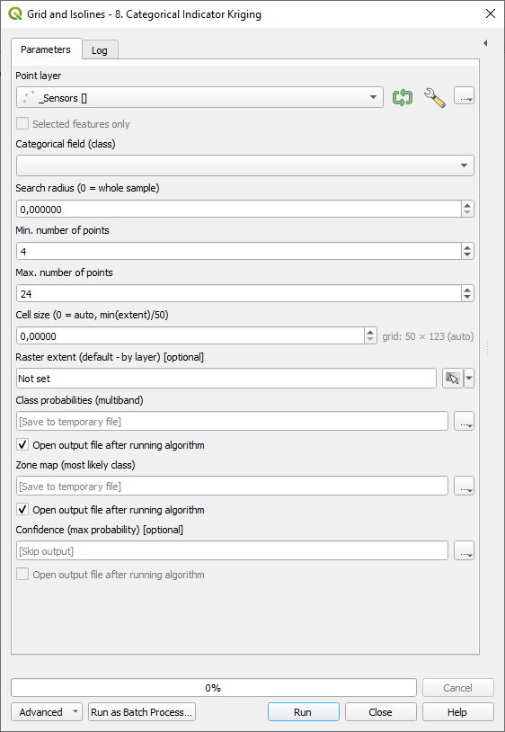{width=80%}

Parameters:

| Parameter | What it sets | Default / advice |
|---|---|---|
| Point layer | Source points. | - |
| Categorical field (class) | The class field (mineral type, lithotype). Empty and NULL are excluded. | - |
| Search radius, min/max points, cell size, extent | Search and grid - as in "2D Kriging". | as in "2D Kriging" |
| Class probabilities (multiband) | Raster: one band per class, the class name in the band description. | - |
| Zone map (most likely class) | Raster of the most-likely class code; the code mapping goes to the Log. | - |
| Confidence (max probability) | Raster of the maximum probability: where the class is firm, where it is contested. | optional |

## How it is computed

Coding the classes as numbers 1, 2, 3 and interpolating that code is not allowed. Categories have no order, class 3 is not "farther" than class 1, and a mean between them is meaningless. So the tool takes the indicator route. For each class an indicator is built: one where the borehole is of that class, zero everywhere else. Each indicator is kriged separately by ordinary kriging, like an ordinary field, and yields a surface from zero to one, which is the class probability. The indicator variogram is fitted automatically with a spherical model from the experimental one.

{width=74%}

Separate indicators do not sum to exactly one and may go slightly out of range, a known property of the method. So the estimate of each class is clipped to zero-one, and then the class probabilities are normalised so that in every cell they sum to one.

## What you get

Three results. A multiband probability raster, one band per class, the class name written into the band description. A zone map, the code of the most likely class in the cell, with the code to class mapping printed to the log. An optional confidence raster, the maximum probability in the cell, which shows where the class is firm and where zones compete and the boundary runs.

{width=85%}

The categorical approach is convenient because it needs no boundary drawn in advance. There is no need to decide whether partial replacement counts as dangerous. All types are mapped as they are, and the required combination of classes is assembled later from the probabilities. Rare classes with few boreholes give a noisy variogram, the tool warns about this in the log, so read the probability of such a class with caution.

To learn the tool without real data, switch on **Add a categorical mineral-type field** in **Create sample wells (demo)**. A mintype field is added to the layer with a silvinite background and replacement spots after a mine, ready to run the tool on.

# 2.02 External Drift Kriging

The **External Drift Kriging** tool estimates a field from points when that field is systematically related to a quantity already known everywhere as a raster. Such a raster is called the drift. It can be the structural surface of an adjacent seam, a coarse regional model, a surface built on a sparse grid, or a seismic attribute. Ordinary kriging sees only the wells themselves, whereas here knowledge of the shape of the field between them is added, and the estimate leans on that shape where there are no wells.

The tool sits in the **Additional analysis tools** group and rests on the same engine as **2D Kriging**. The kriging mathematics does not change. What changes is only what the regional component is removed against.

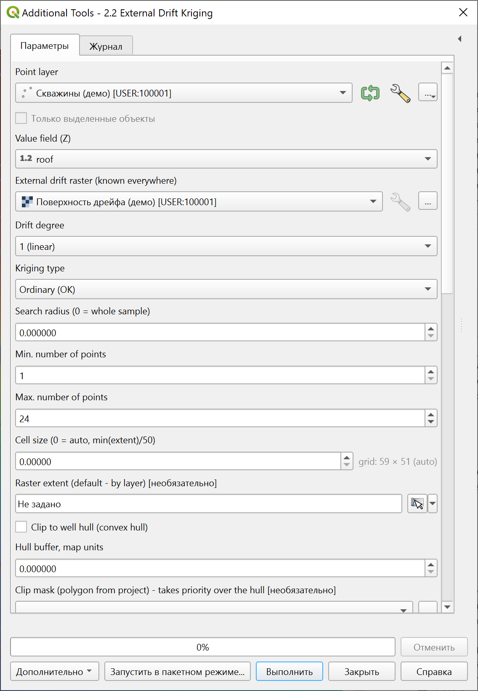{width=82%}

Parameters:

| Parameter | What it sets | Default / advice |
|---|---|---|
| Point layer | Source points. | - |
| Value field (Z) | The attribute being interpolated. | - |
| External drift raster | A secondary surface s known everywhere. Same CRS as the points, covers the area. | - |
| Drift raster band (Adv.) | The band of a multiband drift raster. | 1 |
| Drift degree | A linear (a0+a1·s) or quadratic relation. | 1 (linear) |
| Kriging type, radius, min/max, nugget, structures | Kriging of the residuals - as in "2D Kriging". | as in "2D Kriging" |
| Smooth grid (Gaussian), smoothing radius | Optional smoothing of the result. | off / 1 |
| Drift kriging raster | The output estimate (drift + kriged residuals). | - |
| Kriging standard error | An optional raster of the residual standard error. | skipped |

## How it differs from trend removal

The **Remove polynomial trend** option of **2D Kriging** describes the regional component with a polynomial in the coordinates, that is with a tilted or curved plane. This works when the dip of the seam is uniform and its shape is simple. But if the field has a pronounced structure that follows a known surface, a plane will not describe it.

External drift removes the regional component not against the coordinates but against an external raster. If, for example, the roof of the seam of interest follows the relief of the underlying one, for which a surface already exists, that relation is removed by regressing on the underlying surface, and the departures from it are what gets kriged. The drift here is not a function of the position on the map but a function of the external raster value at the same point. Everything else matches trend removal. It is the same regression-kriging scheme.

## How it is computed

First the drift raster is sampled at each well, bilinearly over the four neighbouring cells. Then the field value is regressed on this sampled value by least squares. The **Drift degree** sets the form of the relation. Degree 1 is the linear drift, value equals a0 plus a1 times the drift, the usual choice for external drift. Degree 2 describes a curved relation with the square of the drift, but it may absorb part of the real structure, so after using it you should look at the residual variogram.

Next the regression residuals are kriged, exactly like an ordinary field in **2D Kriging**, with their own variogram, search and anisotropy. At the last step the drift raster is resampled onto the kriging grid and the drift is added back to the kriged residual estimate. The final estimate in each cell equals the drift plus the kriged residual. Because the drift is known everywhere, between the wells the estimate is drawn not towards a local mean but towards the shape of the external surface.

{width=98%}

Wells that fall outside the drift raster do not enter the fit, and the tool reports to the Log how many were dropped. Grid cells not covered by the drift raster cannot be completed, so they are left empty together with the standard error in them.

## Attributes of the generated layer

| Field | Type | What it holds |
|---|---|---|
| well | text | Borehole name. |
| roof | number | Roof elevation, m. |
| thick | number | Bed thickness, m. |
| X | number | Useful-component content, percent. |
| head | number | Head (the hydrogeological data variant), m. |
| K | number | Hydraulic conductivity, m/day. |
| T | number | Transmissivity, m²/day. |
| mintype | text | Mineral type (a class for indicator kriging). |
| dz | number | Elevation error - for weighting and experiments. |

The field set covers all the plugin tools: interpolate roof and thick with ordinary kriging, X with a trend, mintype with indicator kriging, head/K/T with the hydrogeology tools.

## Parameters

The **point layer** and the **value field Z** are set as in **2D Kriging**. The **External drift raster** parameter is the secondary surface known everywhere. The optional **drift raster band** selects the band of a multi-band raster. Search, cell size, extent, clipping to the well hull, the nugget and variogram structures, outlier removal and grid smoothing all work and are described as in **2D Kriging**, with the same defaults.

An important condition. The drift raster and the point layer must share the coordinate system, otherwise the drift value will be sampled at the wrong point. When the CRS does not match the tool warns in the Log. The drift raster must cover the whole estimation area, otherwise empty cells will appear along the edges.

## The variogram on residuals

As with trend removal, the variogram here is fitted on the regression residuals, not on the raw value. After the drift is removed the residual variogram returns to its normal form, reaches a sill with a nugget, and the range reflects the true scale of the local correlation. The standard-error raster in this mode is the error of kriging the residuals. The drift is treated as deterministic and adds no error of its own.

A convenient way to fit the residual variogram without leaving the tool is not yet provided, so the residuals are judged by the share of variance removed, which the tool prints to the Log. If the drift took out a noticeable part of the spread, the relation with the external surface is real and the drift is appropriate. If it took out almost nothing, the field is not related to that raster, and plain **2D Kriging** will give the same result more simply.

# 2.03 Exceedance probability map

The **Exceedance probability map** tool answers not "how much" but "how likely the value exceeds a threshold". From the kriging estimate raster and its standard-error raster it builds a probability raster from 0 to 1: in each cell the probability that the true value is above a given threshold.

The tool sits in the **Additional analysis tools** group and works as a post-processing step, like the hydraulic gradient. It runs no kriging of its own and does not touch the **2D Kriging** window, it takes ready rasters. So it works equally with the output of ordinary kriging and of external drift kriging.

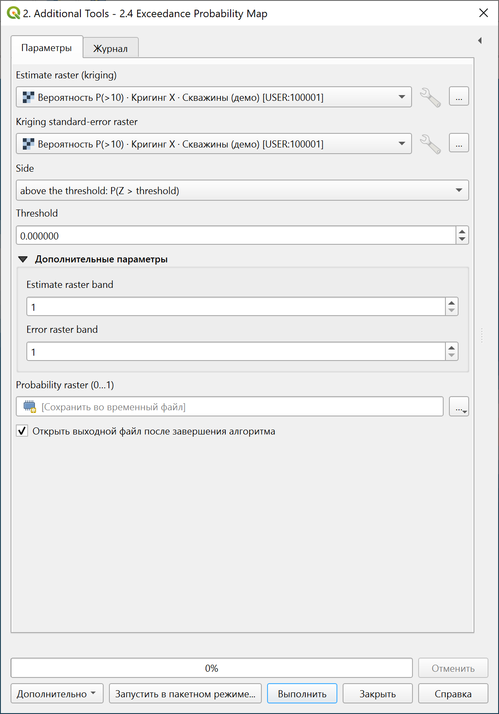{width=82%}

## How it is computed

Kriging gives, in each cell, an estimate and its standard error. If the local distribution of the value is taken as normal, that is the value in the cell is treated as normal with the mean equal to the estimate and the standard deviation equal to the kriging error, the exceedance probability is one formula through the normal distribution function. Where the estimate is well above the threshold the probability is close to one, where it is below it is close to zero, and at the threshold itself it equals one half. The larger the standard error, the smoother the transition: away from the wells there is less certainty and the probability is drawn towards 0.5.

{width=92%}

No separate kriging is needed for this, so the map is built instantly. The normality assumption is rough in places, especially for strongly skewed fields such as grades with a long right tail. Where that matters, indicator kriging by thresholds, which does not rely on the shape of the distribution, is more accurate.

## How to get the inputs

Run **2D Kriging** (or **External Drift Kriging**) on your field and enable the optional **Kriging standard error** output. You get two rasters, the estimate and the error, and you feed them here. Their grids match, since they come from one run, but if rasters with different grids are supplied, the error is resampled onto the estimate grid bilinearly.

## Parameters

| Parameter | What it sets | Default / advice |
|---|---|---|
| Estimate raster (kriging) | The field estimate raster (a kriging result). | - |
| Kriging standard-error raster | The standard-error raster of the same run. | - |
| Side | Probability above the threshold P(Z>t) or below P(Z<t). | above |
| Threshold | The value the probability is computed against. | 0 |
| Estimate raster band, error raster band (Adv.) | Bands of multiband rasters. | 1 |
| Probability raster (0…1) | The output probability raster. | - |

## Use

Cut-off grades: the threshold is the cut-off, and the map shows the probability that the grade is above the cut-off. This is more honest than a single line drawn on the estimate, because near the edge of the ore body the certainty drops and the probability map shows it. Risk zones for any threshold: thickness below a critical value, an elevation above or below a hazardous one. The probability map complements the estimate map where not only the value matters but the confidence in it.

{width=70%}

# 2.04 Hydraulic gradient and flow direction

The **Hydraulic gradient and flow direction** tool works with the head field, that is the piezometric surface, and shows where and how steeply groundwater flows. The input is a head raster, usually the result of **2D Kriging** on borehole water levels. For a hydrogeologist this is as natural a step after building the head surface as isolines are after kriging.

{width=78%}

There are three outputs. The **gradient-magnitude raster** shows the steepness of the head surface, the hydraulic gradient i equals the magnitude of ∇h and is dimensionless. The **azimuth raster** holds the flow direction in degrees, where zero is north and the count goes clockwise. The point layer of **flow vectors** is thinned over the grid and styled as arrows right away, so the flow pattern is visible without touching the symbology.

The direction is computed strictly. Water flows down-gradient, from higher head to lower, so the arrow points towards the falling surface. On flat areas, where the head is almost constant, the direction is undefined and the azimuth there is left empty.

## Without permeability

The tool describes the geometry of the head field, not the flow velocity. The Darcy filtration velocity equals minus the hydraulic conductivity K times the gradient, and it needs K itself, which the tool neither asks for nor computes. In other words, the map answers where and how steeply, but not how fast. Once K (or transmissivity T) is available over the area, the specific discharge and the flow are computed by the neighbouring tool **Specific discharge (Darcy law)**, which multiplies this gradient by the aquifer properties.

## Parameters and smoothing

The input is the **head raster** and its **band**. The **flow vectors, thinning step** parameter sets how many cells apart to place an arrow so they do not merge, eight by default. The **smooth head before computing** parameter removes fine grid ripple, set in cells, off by default.

| Parameter | What it sets | Default / advice |
|---|---|---|
| Head raster | The input piezometric surface (usually a "2D Kriging" result). | - |
| Band (Adv.) | The band of the input raster. | 1 |
| Smooth head before computing, cells | Damps grid noise before differentiation. 0 = none. | 0 |
| Flow vectors: thinning step, cells | How many cells apart to place an arrow. | 8 |
| Hydraulic gradient (magnitude) | The output \|∇h\| raster. | - |
| Flow direction (azimuth) | The output azimuth raster (down-gradient). | created by default |
| Flow vectors (points) | The point layer of arrows (fields az, grad). | created by default |

Smoothing is switched on for substance, not for looks. Differentiation amplifies noise, so even a clean kriging grid can give a patchy gradient field with jittery arrows. A light smoothing brings the picture back to a readable form. The same effect can be had by smoothing the head itself back in **2D Kriging**.

## Arrows from points

The vector layer is points, and the arrows are drawn by the symbology. The preset is applied automatically. The arrow marker is rotated by the **az** field, so it shows the flow direction, and its size is scaled by the **grad** field, so the arrow is longer where the gradient is steeper. The size is set in millimetres and does not depend on the map scale. The symbology can be changed in the layer properties. If you need a classic quiver diagram, where the arrow length is laid out in map units, the marker is replaced with a geometry generator, the recipe is in the styles folder next to the preset.

Fields of the flow-vector layer:

| Field | Type | Holds |
|---|---|---|
| az | number | Flow-direction azimuth, degrees (0 = north, clockwise, down-gradient). |
| grad | number | Magnitude of the hydraulic gradient \|∇h\| at the point, dimensionless. |

## The learning cycle

To walk the whole path without real data, switch on **Add a head field** in **Create sample wells (demo)**. A head field with a pronounced regional slope is added to the layer. Build a grid from it in **2D Kriging**, feed the raster here, and the arrows follow the head downhill. The same end-to-end scenario as for the other tools, only about hydrogeology.

# 2.05 Specific discharge (Darcy law)

The **Specific discharge** tool adds permeability to the flow geometry. The hydraulic gradient shows where and how steeply the head falls, but not how much water flows. Darcy's law links these through the aquifer properties: the higher the permeability and the steeper the gradient, the larger the flux. From a head raster and aquifer-property rasters the tool builds a physical flux rather than a dimensionless gradient.

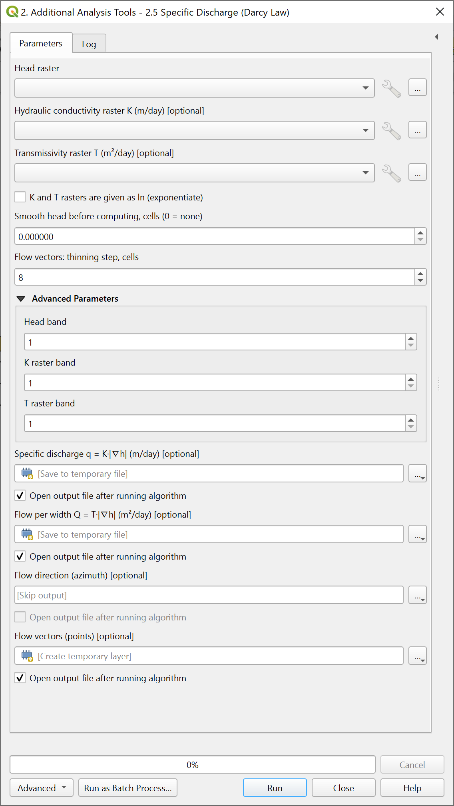{width=55%}

The tool sits in the **Additional analysis tools** group and works as a post-processing step. It runs no kriging of its own: the property rasters are prepared separately by kriging from test points.

## What is computed

The specific discharge (Darcy flux) equals the hydraulic conductivity times the hydraulic gradient: q = K·|∇h|, in metres per day. It is the volume of water through a unit cross-section area per unit time. If a transmissivity raster is supplied instead of conductivity, the tool computes the flow per unit width of the flow Q = T·|∇h|, in square metres per day. Transmissivity is conductivity times thickness, so the flow per width already accounts for the aquifer thickness and does not need it separately. The direction of both fluxes is the same as the gradient direction, down the head slope.

The true water velocity is the specific discharge divided by the effective porosity, v = q/n. Porosity is usually absent from the data, so the tool does not ask for it and does not compute the true velocity: if needed, divide the q raster by the porosity in the raster calculator.

## How to get the K and T rasters

The aquifer properties are known at the test points (pumping, injection) but are needed everywhere. They are interpolated by kriging, like any field. An important subtlety: hydraulic conductivity and transmissivity are almost always log-normal, their values span orders of magnitude. Kriging the raw values distorts the result, so the logarithm is kriged. The simplest way is to enable the **ln** transform in **2D Kriging**: then ln is kriged and the raster is returned already in the original units, and the ln checkbox here is not needed. If instead you krige an already-logged field, tick **K and T rasters are given as ln** in this tool and the values are recovered by exponentiation. Confined and unconfined aquifers are better kriged separately, their thickness physics differs.

## Parameters

| Parameter | What it sets | Default / advice |
|---|---|---|
| Head raster | The piezometric surface (a kriging result over the levels). | - |
| Hydraulic conductivity raster K (m/day) | The aquifer property for the specific discharge. Optional, but at least one of K, T is needed. | - |
| Transmissivity raster T (m²/day) | The aquifer property for the flow per width. | - |
| K and T rasters are given as ln | Apply exp to the input rasters (for log-kriged K and T). | off |
| Smooth head, cells | Damps head noise before differentiation. | 0 |
| Flow vectors: thinning step | How many cells apart to place an arrow. | 8 |
| Raster bands (Adv.) | Bands of the multiband head, K, T rasters. | 1 |
| Specific discharge q (m/day) | The output raster q = K·\|∇h\|. | created if K is given |
| Flow per width Q (m²/day) | The output raster Q = T·\|∇h\|. | created if T is given |
| Flow direction (azimuth) | The output azimuth raster. | optional |
| Flow vectors (points) | The arrow layer (rotated by az, sized by the specific discharge). | created by default |

## Use

Where water moves faster and where slower, estimating inflows to workings, zones of higher seepage along permeable beds. Together with the exceedance probability map you can show not only the expected flux but also the confidence in it where test points are sparse.

# 2.06 Gaussian simulation (SGS)

Kriging gives a single smoothed surface and an estimation variance. Sequential Gaussian simulation answers a different question - how large is the uncertainty. It builds an ensemble of equally probable realizations: each one reproduces the data histogram and variogram, passes through the boreholes and therefore stays rough rather than smoothed. Across the realizations every node accumulates a distribution of values, which shows where the estimate is reliable and where the data are silent.

How it works. The values are mapped to normal scores and the simulation runs in Gaussian space. The grid nodes are visited in random order; at each node simple kriging on the neighbours and already-simulated points gives a local mean and variance, a value is drawn from that normal distribution and immediately becomes conditioning for the next nodes. Boreholes are snapped to the nearest nodes and frozen across all realizations. At the end each realization is back-transformed to the original units. The normal-score variogram is fitted automatically with a sill close to one.

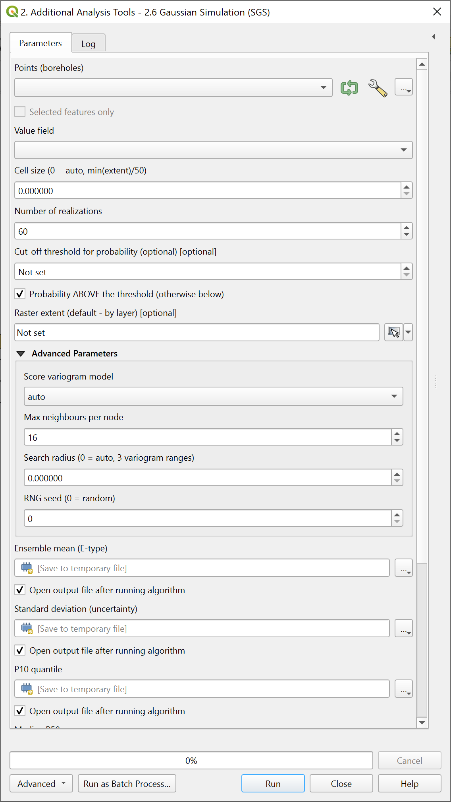{width=52%}

## Parameters

| Parameter | What it sets | Default / hint |
|---|---|---|
| Points (boreholes) | The point layer with the data. | - |
| Value field | The numeric attribute to simulate. | - |
| Cell size | The grid step. 0 means auto, min(extent)/50. | 0 |
| Number of realizations | How many runs to average. | 60 (50-100) |
| Cut-off threshold | Enables the exceedance-probability map. | not set |
| Probability ABOVE the threshold | The probability direction. | yes |
| Raster extent | The output rectangle. | by layer |
| Score variogram model (Adv.) | The model for the normal scores. | auto |
| Max neighbours per node (Adv.) | How many points in the node's simple kriging. | 16 |
| Search radius (Adv.) | 0 means auto, 3 variogram ranges. | 0 |
| RNG seed (Adv.) | For reproducibility. 0 means random. | 0 |

The outputs are ensemble rasters. **Mean (E-type)** resembles kriging. **Standard deviation** shows the uncertainty, small at the boreholes and large away from them. The **P10**, **P50**, **P90** quantiles outline the likely range, and **Exceedance probability** for a given threshold offers a non-parametric alternative to the map from the probability tool. Runtime grows with grid size and the number of realizations, so start with a coarse cell.

# 2.07 Fractal dimension

The tool computes a fractal-dimension map of a surface by the variogram method, native to the plugin: a log-log variogram over lags of one to N cells is built in a sliding window, its slope gives the Hurst exponent H, and the dimension D = 3 - H. Smooth differentiable areas give D near 2, rugged and noisy ones tend to 3; the values themselves matter less than their steps - they highlight zones of tectonic disturbance, block boundaries and changes of the roof relief character.

The output is a D grid that feeds straight into **1.2 Isolines from a raster** for dimension isolines; an advanced checkbox adds H as band 2. The global D and H over the whole surface are printed to the log.

## Reading the map

The absolute D values matter less than their steps: a linear step across the area is a lineament, a candidate tectonic disturbance; a patch of a raised D is a zone of intense folding or a rugged roof relief; wide even fields of a low D are quiet blocks. For reading, apply a singleband pseudocolour symbology with a contrast palette and quantile classification, and for a report plan build isolines with belts over the D grid with tool 1.2 - the disturbance zones get outlined like contour lines.

{width=92%}

## Picking the window and the lags

A small window (5-8 cells) reveals the microstructure and local disturbances, a large one (12-20) - regional zones; in doubt compute both and compare. Four lags fit almost always: more lags - a steadier slope but a coarser minimal scale the method can resolve. The window and the lags are limited by the grid size, the tool checks that itself.

## Workflow

A bed roof from kriging → **2.7** with a window of 8 → the D grid → **1.2 Isolines from a raster** (band 1) → dimension isolines with belts over the structural plan. The global D from the log is one number per surface to compare areas or beds with each other. The raster must be in a metric CRS; the demo surfaces fit as they are.

## Parameters

| Parameter | What it sets | Default / advice |
|---|---|---|
| Surface (raster) | A relief grid or any surface. | - |
| Window half-radius, cells | The sliding-window size. | 8 |
| Number of lags (Adv.) | Variogram lags 1..N cells. | 4 |
| Elevation band (Adv.) | The band with elevations. | 1 |
| Write H (Adv.) | Add H as band 2. | off |
| Fractal dimension | A D grid (and H if checked). | - |

# 2.08 Mask box-counting

Classic box-counting for binary masks: the raster is binarised by a threshold (the object - values above it), the mask is covered by cells of a decreasing size, the slope of log N versus log(1/size) gives one dimension D for the whole mask. A linear object gives D near 1, a blob - near 2, rugged outlines of replacement zones or mined-out areas fall in between. The accuracy on finite masks is about ±0.1, so the method is good for comparing masks with each other rather than as an absolute measure. The result is printed to the log with a table of sizes and counts and returned as the number D - usable further in Processing models.

{width=92%}

## Where the mask comes from

The mineral-type band of a bed grid with a threshold between the class codes, an indicator-kriging probability grid with a 0.5 threshold, an exceedance-probability map with a cut-off threshold, vector outlines of workings or zones - rasterised beforehand with the standard "Rasterize (vector to raster)". Compare the D of masks of the same nature on the same grid: a growth of the replacement-outline ruggedness from bed to bed or from year to year is a meaningful signal.

| Parameter | What it sets | Default |
|---|---|---|
| Mask raster | Any raster; the mask - values above the threshold. | - |
| Threshold | The object/background boundary. | 0.5 |
| Band (Adv.) | The raster band. | 1 |

# 2.09 Line and boundary dimension

The dimension of every line by the divider (Richardson) method: the line is walked with chords of a decreasing span, the slope of log N versus log r gives D. A straight line gives one, a rugged line - more. Polygons are accepted alongside lines - the exterior ring of the boundary is measured, so the ruggedness of zone and basin outlines is computed without a prior conversion. The output is the same features with the D and steps fields, the mean D is printed to the log; short lines get an empty D. The method is checked on references: the Koch curve gives 1.262 against the theoretical 1.2619.

## An isoline-smoothing diagnostic

Oversmoothed isolines lose their ruggedness and D drops towards one. The workflow: build the isolines twice - without smoothing and with the working parameters, run both layers through the tool and compare the mean D from the log. A drop by hundredths is cosmetics, the shape is kept; a drop by tenths means the smoothing eats the field geometry - weaken the rounding or keep the densification only. The D field in the attributes lets you find the specific lines that suffered most.

## Other uses

The ruggedness of zone outlines in plan, comparing the digitising detail of boundaries from different sources, generalisation control when preparing small-scale plans - anywhere "how winding the line is" must become a number.

| Parameter | What it sets | Default |
|---|---|---|
| Lines | A line layer (isolines, outlines). | - |
| Lines with the dimension | The same lines with the D and steps fields. | - |

# 2.10 Minkowski dimension (vectors)

Box-counting directly over vectors, no rasterisation: lines and polygon boundaries are covered by a grid of a decreasing size, the slope of log N versus log(1/size) gives the Minkowski dimension. A straight line and a smooth boundary give D near one, a river network - 1.1-1.5, a heavily rugged coastline - up to 1.3 and above. Every feature gets the D_mink and D_r2 fields (the log-log fit quality: below 0.85 the estimate cannot be trusted), and separately the D of the layer as one set is computed and printed to the log: for a river network that is the dimension of the network as a whole, regularly higher than that of the individual branches.

The method complements the divider of 2.09: the divider measures the sinuosity of one line, Minkowski - the plane filling by a set of features. The dimension is also returned as a number output for Processing models.

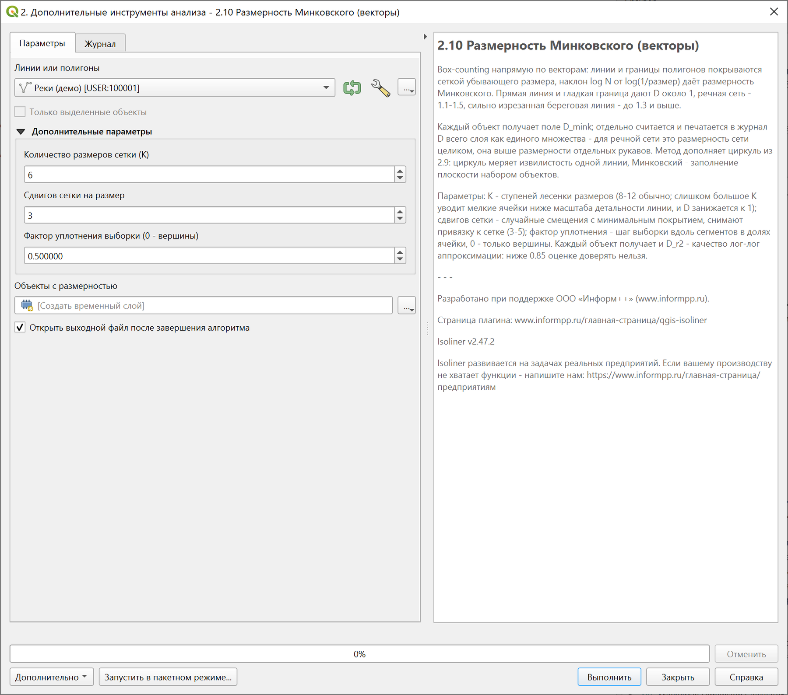{width=74%}

{width=88%}

| Parameter | What it sets | Default |
|---|---|---|
| Lines or polygons | A vector layer; for polygons the boundary rings are taken. | - |
| Number of grid sizes, K (Adv.) | Ladder steps; a too large K takes the cells below the line detail and lowers D. | 8 |
| Grid offsets per size (Adv.) | Random shifts, the minimal cover is taken - removes the grid alignment. | 3 |
| Densify factor (Adv.) | The sampling step along segments as a cell fraction; 0 - vertices only. | 0.5 |

# 2.11 Create a fractal example (demo)

A generator of study features for the whole fractal five: a branching river network with an order field (the tributary order), a basin polygon with a rugged boundary and a separate coastline built by midpoint displacements. Feed the rivers into 2.10 - you get the network dimension; the coast and the basin boundary - into 2.09 and 2.10 and compare the divider with Minkowski; rasterise the basin with the standard tool - and it doubles as an example for 2.08.

| Parameter | What it sets | Default |
|---|---|---|
| Extent | The generation area. | - |
| Seed (Adv.) | The example repeatability. | 1 |

# Kriging kinds: which one to pick

Behind the word "kriging" the plugin hosts a family of methods, and the choice between them affects the result more than fine-tuning the variogram. All the kinds solve the same system of equations with covariances from the variogram; they differ in what is assumed known about the field mean and in what exactly is estimated - a point, a block or a probability. This chapter is a navigator; the parameters of each tool live in their own chapters.

**Simple kriging (SK)** assumes the mean of the field is known in advance and constant over the area. Near the wells the estimate follows the data, away from them it is pulled to the given mean. Take it when the mean is backed by statistics over a representative sample of the same domain, an eyeballed mean drags all the underdrilled margins towards the error. Switched by the type in **2D Kriging**.

{width=92%}

**Ordinary kriging (OK)** does not know the mean and estimates it locally in every neighbourhood - an extra equation with the "weights sum to one" condition takes care of that. Away from the wells the estimate tends to the mean of the nearest neighbourhood, not to the global one. This is the default choice: if unsure where to start - start with OK.

**Kriging with a trend** (the detrend checkbox in **2D Kriging**) is for fields with a regular regional slope: a roof on a monocline, a fold limb. A 1st- or 2nd-degree polynomial is removed by least squares, the residuals are kriged, the trend is added back. Two rules: define the variogram over the residuals (the plugin prints the share of the removed variance - if it is small, the trend is not needed), and do not extrapolate a quadratic trend far beyond the well cloud.

{width=92%}

**Kriging with an external drift** (chapter 2.02) - when the trend is known not as a formula but as a field: a structural surface of a neighbouring bed, a regional model, a seismic attribute. The scheme is the same - a regression on the drift, kriging of the residuals, the regression returned.

**Block kriging** (the discretisation parameter in **2D Kriging**) estimates the mean over a block rather than a point value: the right-hand side of the system is averaged over the discretisation, the error variance drops, outliers are damped. Take it for reserves over a block grid and mind the support effect: a block-kriging grid is regularly smoother than a point one, a sample grade and a block grade cannot be compared directly.

{width=92%}

**Indicator kriging** (chapter 2.01) is for categories: mineral type, facies, a replacement zone. The category becomes a 0/1 indicator, it is kriged with plain OK, the result is the class probability at a point, domains are cut from it by a threshold. The indicator variogram is its own and usually shorter than the grade one.

**Gaussian simulation** (chapter 2.06) is not kriging but its complement: instead of one smooth surface, an ensemble of equally probable rough realisations from which the uncertainty is seen directly.

## Cheat sheet

| Task | Kind | Where it lives |
|---|---|---|
| The universal case, the start of any task | Ordinary (OK) | 2D Kriging, the default type |
| Plenty of data, the domain mean is justified | Simple (SK) | 2D Kriging, the SK type + mean |
| A roof or a bottom with a regional slope | With a trend | 2D Kriging, detrend |
| The trend is known as a raster | With an external drift | chapter 2.02 |
| Reserves over a block grid | Block | 2D Kriging, discretisation |
| Mineral type, replacement, categories | Indicator | chapter 2.01 |
| Uncertainty assessment | SGS simulation | chapter 2.06 |

The search neighbourhood is common to all the kinds, and three rules remove most problems: the radius of the order of the variogram range, 12-16 neighbours at most, the neighbourhood anisotropy consistent with the variogram anisotropy from the variogram map.

# 3.01 Cross-section along a line

The **Cross-section along a line** tool builds a geological section from a set of surfaces. It is not just a profile curve but beds as filled bands between a roof and a floor. The surfaces are usually obtained by kriging, and the tool assembles them into a section along a given line.

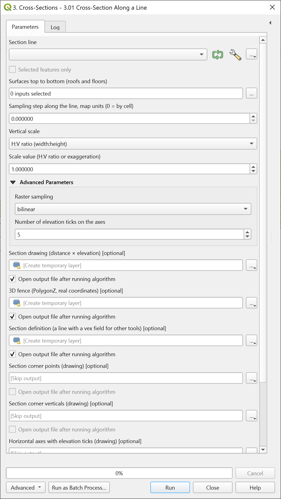{width=52%}

The tool sits in the **Cross-sections** group and works as a post-processing step over ready rasters. It runs no kriging of its own.

## How beds are defined

The surfaces are supplied as a list and ordered top to bottom: roof, floor, then the next roof, and so on. Beds are built as bands between adjacent surfaces, so N surfaces give N minus one beds. Two surfaces, a roof and a floor, are enough for one bed. For a sequence of beds, add the surfaces in stratigraphic order.

## Two outputs

The section drawing is polygons in axes of distance along the line and elevation. The elevation can be stretched by a vertical exaggeration so thin beds read well. This layer goes into a print layout as a ready section. Its coordinate system is conventional, with distance and elevation in map units.

The 3D fence is the same bands but as vertical PolygonZ walls in real coordinates. They are viewed in the 3D Map View next to the kriging surfaces: the grid is set as terrain, and the section walls show the beds in space.

## Vertical scale

The horizontal extent of a section (the line length) and the vertical extent (tens of metres of beds) are not comparable, so without a vertical stretch the drawing looks flat. The scale is set in two ways. In the **H:V ratio** mode you set the desired width:height ratio of the drawing (say 10), and the tool computes the exaggeration itself from the line length and the elevation span. In the **exaggeration** mode the value is a direct vertical stretch factor.

The effective exaggeration is printed to the log. For an exact overlay of layers it must match across the section, the boreholes and the composition. In H:V mode the section (3.1) and the boreholes (3.2) span the whole section in height and line up. The composition (3.3) computes the ratio over a single bed, so to overlay it take the exaggeration printed by 3.1 and set it in 3.3 in the **exaggeration** mode.

## Attributes of the output layers

**Section definition** - a single line with the original trace geometry and the fields read by all the downstream tools of the group:

| Field | What it holds |
|---|---|
| vex | Vertical exaggeration of the drawing. |
| step | Stationing step, m (the polyline vertices are always included). |
| zmin, zmax | The elevation range of the drawing - the section plane in the 3D viewer uses it too. |

**Section (3D fence)** - vertical PolygonZ polygons along the trace, one per bed:

| Field | What it holds |
|---|---|
| bed | Bed number from top to bottom. |
| top, bot | Names of the roof and bottom surfaces. |
| t_mean | Mean bed thickness along the trace, m. |
| seclen | Trace length, m. |

**Section corner points**: num (corner number), name (УГ-1, УГ-2, …), pos (top or bottom), d (station, m), x and y (map coordinates), az (azimuth of the next leg), label (a ready-made label). **Horizontal axes**: elev (axis elevation, m) and label. **Corner table**: kind (row type) and text (cell content).

## Parameters

| Parameter | What it sets | Default / advice |
|---|---|---|
| Section line | A line layer. The first line is used. | - |
| Surfaces top to bottom | A list of surface rasters in stratigraphic order. At least two are needed. | - |
| Sampling step along the line | How many map units between samples. 0 means by cell size. | 0 |
| Vertical scale | Mode: H:V ratio or exaggeration. | H:V |
| Scale value | Width:height ratio (e.g. 10) or exaggeration. | 10 |
| Raster sampling (Adv.) | Bilinear or nearest. | bilinear |
| Section drawing (distance × elevation) | The output polygon layer for a layout. | created |
| 3D fence (PolygonZ) | The output layer of vertical walls in real coordinates. | created |

Each bed gets attributes: a number, the roof and floor names, the mean thickness and the section length. Colour the layer by bed number or by thickness. Where a surface is undefined (nodata), the band breaks and the bed splits into several polygons.

## Trying it on a demo

A ready training set is produced by the **Create a section example** tool (3.10): six surfaces top to bottom, the line, boreholes with the h1...h6 fields, and multiband bed grids. Run it, then feed the surfaces and the line here, the boreholes into **Boreholes on the section**, and the bed grid (bands 1/2/3) into **Bed composition on the section**. The full contents of the set are in section 3.10.

## Relation to QGIS

A plain profile curve over a single grid is built by the native **Elevation Profile** panel, no separate tool is needed for that. The section instead shows the beds between surfaces, which the native tools do not do. A kriging surface can also be viewed in 3D without a section: set the grid as terrain in the 3D Map View.

# 3.02 Boreholes on the section

The **Boreholes on the section** tool projects boreholes onto the section line and shows them as columns of bed intervals on top of the drawing from **Cross-section along a line**. It sits in the **Cross-sections** group.

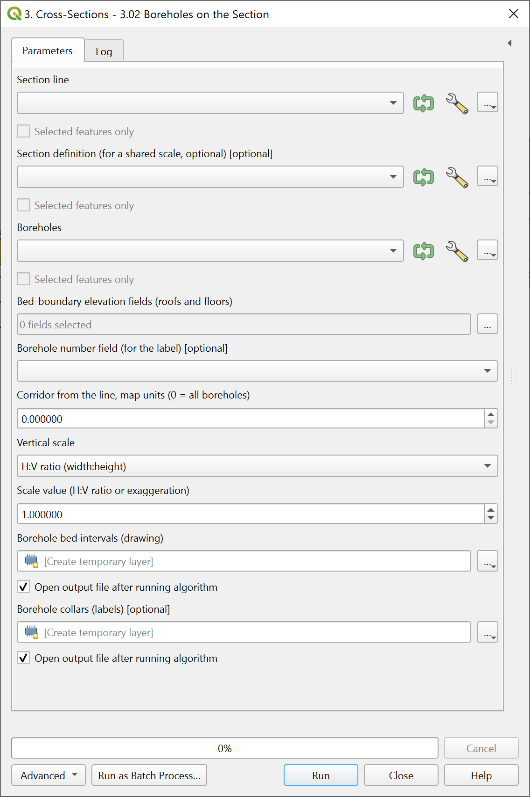{width=58%}

Each borehole is placed at the distance along the line where its projection falls. The bed boundaries are taken from the chosen elevation fields: on each borehole their values are sorted in descending order, and adjacent pairs give the bed intervals. So the order of field selection and gaps (NULL) do not matter. Each interval gets a bed number, and the column gets the borehole number from the label field.

## Corridor and exaggeration

The corridor is a buffer around the line: boreholes farther than it are not shown (0 shows all). Set the vertical scale the same as in **Cross-section along a line** - in H:V mode the columns line up with the bands automatically, or take the exaggeration printed by 3.1.

## Parameters

| Parameter | What it sets | Default |
|---|---|---|
| Section line | The same line as for the section. | - |
| Boreholes | A borehole point layer. | - |
| Bed-boundary elevation fields | Numeric roof and floor fields. At least two. | - |
| Borehole number field | The column label. | no label |
| Corridor from the line | A buffer, map units. 0 shows all. | 0 |
| Vertical scale | Mode: H:V ratio or exaggeration. | H:V |
| Scale value | H:V ratio or exaggeration. | 10 |
| Borehole bed intervals | The output vertical segments (drawing). | created |
| Borehole collars | Points at the top of the columns for labels. | created |

Colour the intervals by bed number to match the section bands, and label the collars by borehole number.

# 3.03 Bed composition on the section

The **Bed composition on the section** tool colours the band of one bed by a composition grid along the line. It takes a roof, a floor and a composition grid, runs no kriging of its own, and works one bed at a time. It sits in the **Cross-sections** group.

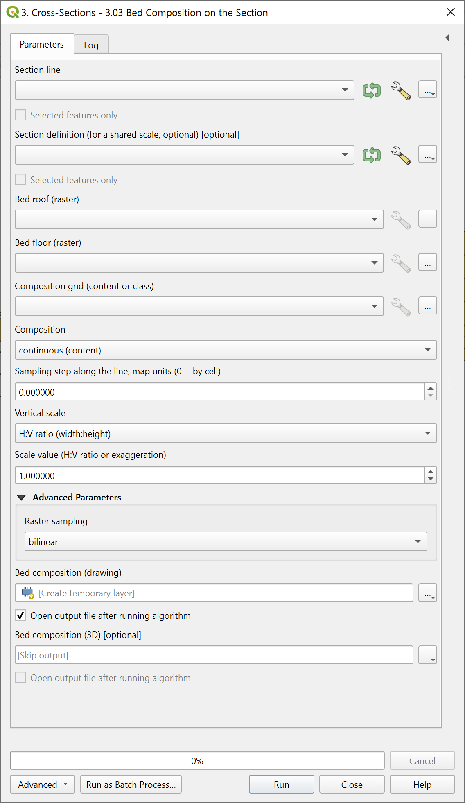{width=55%}

This is how the lithological composition change inside an industrial bed is shown along the section. The composition grid is prepared separately: the content by ordinary kriging, the mineral type by indicator kriging (the **Categorical indicator kriging** tool).

## Two modes

Continuous content (KCl, insoluble residue): the band is cut into thin vertical slices, each with a mean value. Set a graduated style for the layer (by the **value** field), and a smooth content transition is visible along the band.

Categorical mineral type or facies (sylvinite, replacement, halite): adjacent slices of the same class merge into facies zones. Set a categorized style (by the **class** field). Replacement zones show as a colour change along the line.

## Parameters

| Parameter | What it sets | Default |
|---|---|---|
| Section line | The same line as for the section. | - |
| Bed roof | The roof raster. | - |
| Bed floor | The floor raster. | - |
| 1st industrial bed | A multiband grid: roof, bottom, content, mineral type. | on request |
| 2nd industrial bed | The same for the second industrial bed, independent fields. | on request |
| Sampling step along the line | How many units between samples. 0 means by cell. | 0 |
| Vertical scale | Mode: H:V ratio or exaggeration. | H:V |
| Scale value | H:V ratio or exaggeration. | 10 |
| Raster sampling (Adv.) | Bilinear or nearest (always nearest for a class). | bilinear |
| Bed composition (drawing) | Output polygons in distance × elevation axes. | created |
| Bed composition (3D) | PolygonZ polygons in real coordinates. | on request |

Run the tool for each industrial bed separately, with its own composition grid. Place the composition band on top of the section drawing. For an exact overlay take the exaggeration printed by **Cross-section along a line** and set it here in the **exaggeration** mode (the H:V ratio is computed over a single bed and is not suitable for overlay).

# The section definition and shared parameters

Geometrically a section is set by two things - a line in the real coordinate system and a vertical scale vex. The **Cross-section along a line** tool outputs them together as a **Section definition** layer: one line with vex and step fields. This is the shared source of truth.

The intersect, project and unproject tools read the line and vex from this definition, so their results match the section without manual scale fitting. Build the section once, the definition travels with the project and feeds the other tools of the group.

The **Boreholes on the section** and **Bed composition on the section** tools also accept the section definition as an optional input: when given, the vertical scale is taken from it, so the borehole columns and the composition band sit exactly on the beds by height.

The section also clips pinch-outs: where the roof drops to the floor, the bed disappears and no band is built. In the demo the second industrial bed pinches out to the east.

For a polyline the Cross-section along a line tool optionally outputs three helper layers in the drawing axes. Corner points are placed at every polyline node, at the top and at the bottom of the section. A point carries fields: number, name (УГ-1, УГ-2 ...), side (top or bottom), distance along the line, plan X and Y, segment azimuth and a ready label. The top is labelled with the name, the bottom with the plan coordinates X and Y, rounded to two decimals. The azimuth and distance stay as layer fields - handy to place into a layout table. A style is supplied: an upward triangle on top, a shelf at the bottom.

A corner table is produced optionally - a polygon layer below the section. The cells lie between the corner verticals with borders under them, two rows: the length and azimuth of the segment between adjacent corners, with a centred label and a white fill. It renders on the canvas and travels into a layout with the section. Corner verticals are lines at the nodes spanning the full section height. Horizontal axes are equal-elevation lines with ticks (five by default, with nice rounding) for an elevation scale. The drawing margins are extended by five percent up and down, and the corner points sit on these edges.

# 3.04 Intersect surfaces with the section

The **Intersect surfaces with the section** tool places surface grids onto the section as lines in distance-elevation axes. Each grid is sampled along the definition line, and its trace lies on the drawing next to the beds. The line and vex come from the section definition, so the match with the section is automatic.

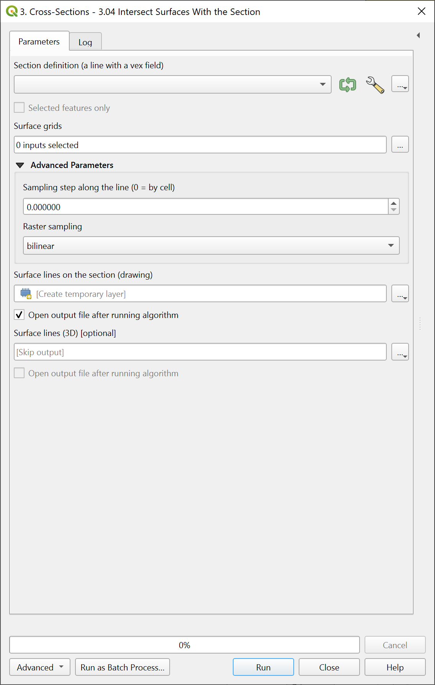{width=58%}

This is how water tables, marker surfaces, the salt roof and anomaly surfaces are placed on the section. The inputs are the section definition and a list of grids, the output is lines in the section axes (and optionally 3D lines in real coordinates).

The object-projection, unprojection and shaft-unwrap tools are marked **(beta)**: they work, but their interface and example set are still being refined.

## Parameters

| Parameter | What it sets | Default / hint |
|---|---|---|
| Section definition | The definition layer from 3.01: a line with vex and step fields. Sets the line, the scale and the frame height. | - |
| Surface grids | The list of rasters whose traces are drawn on the section as lines. | - |
| Sampling step along the line (Adv.) | How many map units between samples. 0 means by cell size. | 0 |
| Raster sampling (Adv.) | Bilinear or nearest. | bilinear |
| Surface lines on the section (drawing) | The output lines in distance × elevation axes. | created |
| Surface lines (3D) | The output 3D lines in real coordinates. | on request |

# 3.05 Vector intersection with the section

While 3.04 places surfaces as grids, this tool places **vector** objects on the section by exact intersection with the section line. The result type depends on the object.

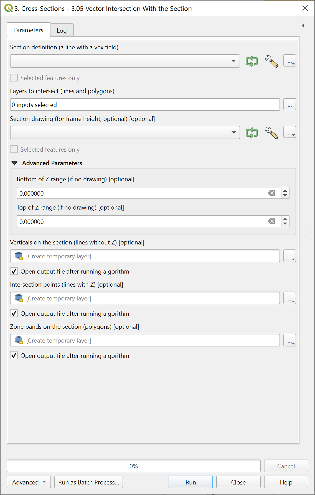{width=58%}

A line **without an elevation** (flat in plan - a fault, a boundary, a contour) gives a **full-height vertical** at the crossing station. Where the section crosses it horizontally is known, the depth is not, so the mark spans the whole frame. A line **with a Z elevation** (a 3D object, an inclined one, a surface contour) gives a **point** at the real elevation of the crossing - a roof contour with an elevation, for instance, lands as a point exactly on the bed. A polygon (a plan zone - replacement, a mine field, a licence) gives a **vertical band** over the interval where the section runs through the zone.

The line, vex and frame height come from the section definition - written by **Cross-section along a line**, which now stores the vertical extent. So nothing needs to be supplied for objects without Z. For older definitions without the height a fallback remains: the **section drawing** as the optional input, or a Z range in the advanced parameters. When the object has Z, no height is needed - the point is placed at the elevation. Empty outputs are not created: a fault yields only verticals, a marker only points, a zone only bands.

Unlike **Project objects onto the section** (approximate, corridor-based) this is an exact intersection - a mark appears only where the geometry truly cuts the section line. Several layers can be fed at once (lines and polygons mixed) - all are processed in a single run, like the list of surfaces in 3.04, and in the outputs the **src** field keeps the source layer of each mark. The demo generator outputs a fault, a Z marker and a replacement zone that cross the demo section, so the tool can be tried at once.

## Parameters

| Parameter | What it sets | Default / hint |
|---|---|---|
| Section definition | The definition layer from 3.01: the line, vex and frame height. Enough for objects without Z. | - |
| Layers to intersect | Lines and polygons mixed, in a single run. The src field in the outputs keeps the source layer. | - |
| Section drawing | A fallback source of frame height for older definitions without zmin/zmax. | optional |
| Bottom of Z range (Adv.) | The lower frame elevation when neither a definition with height nor a drawing is given. | 0 |
| Top of Z range (Adv.) | The upper frame elevation in the same case. | 0 |
| Verticals on the section | Output for lines without Z (a fault, a boundary): a full-height vertical. | created |
| Intersection points | Output for lines with Z (a contour with elevation): a point at the real elevation. | created |
| Zone bands on the section | Output for polygons (a plan zone): a vertical band over the interval. | created |

Empty outputs are not created: each object type goes only into its own layer.

# 3.06 Intersect a TIN with the section

A raster grid (3.04) is `z = f(x, y)`, one elevation per plan point. It cannot represent an overturned fold at all: above one point such a fold has several elevations of the same surface. This tool cuts the section through a **TIN** - a surface of true 3D triangles that can overhang.

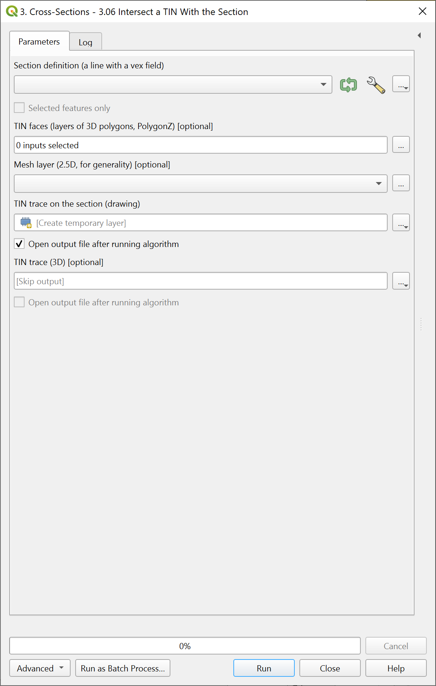{width=58%}

The mechanics are pure geometry. The section is a vertical curtain along the polyline. Each TIN triangle is intersected with the vertical plane of its segment, giving a segment (station along the line, real elevation), and all segments are assembled into the surface trace. Overhang comes out naturally: several segments at different elevations above one station, and the trace folds - the limbs of an overturned fold come out as they are.

The inputs are layers of **3D polygons** (PolygonZ, TIN faces; non-triangles are fan-split into triangles) and optionally a **mesh layer**. The line and vex come from the section definition, the height from the faces themselves, so nothing needs to be set for a TIN. Besides the drawing trace you can also get it in real 3D coordinates.

An important limit: **a QGIS mesh is 2.5D**, its height is a scalar per vertex, one value above a point again, so overturning is not preserved in a mesh. Overhangs therefore come only from true 3D faces from a geomodeller (Leapfrog, Micromine and the like). A mesh is accepted for generality, on single-valued surfaces. The demo generator outputs an overturned TIN fold - the folding trace is visible on it at once.

## Parameters

| Parameter | What it sets | Default / hint |
|---|---|---|
| Section definition | The definition layer from 3.01: the line and vex. The height comes from the faces themselves. | - |
| TIN faces (PolygonZ) | Layers of 3D polygons - TIN faces from a geomodeller. Overhang and overturning are reproduced. | optional |
| Mesh layer (2.5D) | A QGIS mesh, for generality. One value above a point, overturning is not preserved in a mesh. | optional |
| TIN trace on the section (drawing) | The output 2D trace in the section axes, may fold. | created |
| TIN trace (3D) | The output trace in real 3D coordinates. | on request |

Supply at least one of the two inputs - TIN faces or a mesh.

# 3.07 Project objects onto the section (beta)

The **Project objects onto the section** tool projects points, lines and polygons onto the section line. For each vertex the horizontal coordinate is the distance along the line to its projection, the height is the elevation from the 3D geometry or from a chosen field. Distant objects are cut off by a corridor.

This generalises the borehole projection to any objects: anomalies, sampling points, traces, outlines. The result is in the section axes, placed on top of the drawing.

# 3.08 Unproject from the section (beta)

The **Unproject from the section** tool does the reverse: objects drawn on the section drawing are returned to real coordinates. The horizontal coordinate of a vertex is read as the distance along the line (giving the plan), the height as the elevation Z = height / vex. The line and vex come from the same definition the drawing was built with.

So an object drawn by hand on the section - an ore outline, a fault, a boundary - gets back into the plan and into 3D with a Z elevation.

# 3.09 Shaft wall unwrap (beta)

The **Shaft wall unwrap** tool builds a cylindrical section. Around the shaft axis at a given radius a circle is taken with an angular step (1 degree by default), and the surface grids are sampled along it. The unwrap lies in axes of arc length along the circle and elevation.

Each marker surface gives the line of its intersection with the shaft wall - where the beds dip the lines are tilted and wavy. The axis is set by a collar point layer, the radius is in map units, the vertical scale is as in the section.

# 3.10 Create a section example

The **Create a section example** tool prepares a complete training set for the **Cross-sections** group, so its tools can be tried without kriging real data. In the panel it stands last in the **Cross-sections** group.

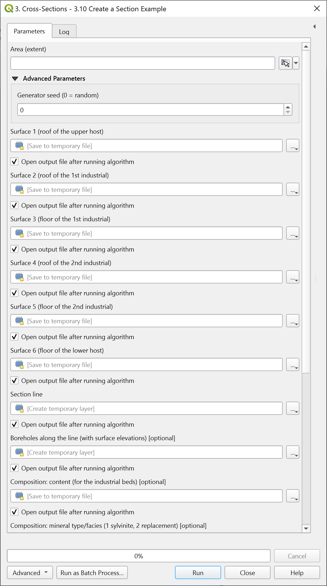{width=52%}

A single run outputs six stacked surfaces with a dip and variable thickness (five interbedded beds, the 2nd and 4th industrial and thin), a polyline section line across the area, boreholes along the line with surface-elevation fields h1...h6, and a multiband grid per industrial bed. The bed-grid band convention: band 1 - the roof, band 2 - the bottom, bands 3 and further - parameters (here the content and the mineral type with a replacement zone; the content fields of the beds are independent, stochastic). One file describes the whole bed - like a block model where new parameters are added as bands. For the intersection tools it adds demo vectors: a fault without an elevation, a marker contour with Z, a replacement zone, and an overturned TIN fold from PolygonZ 3D faces.

{width=70%}

## Demo layers and their attributes

| Layer | Geometry | Attributes |
|---|---|---|
| Section line (demo) | line | name. A polyline with two bends - the vertices test the stationing. |
| Boreholes (demo) | points | name; h1…h6 - elevations of the six surfaces at the borehole. |
| Zone (demo, polygon) | polygon | name. For the vector-intersection tool 3.05. |
| Fault (demo, 2D) | line | name. Crosses the trace, moved off the line bend. |
| Marker with Z (demo, 3D) | line Z | name. Tests 3D geometries in 3.05. |
| Overturned TIN (demo) | polygons Z | name. An overturned fold for 3.06. |
| Surface 1…6 | raster | A single elevation band. |
| 1st/2nd industrial bed | raster | Bands: 1 roof, 2 bottom, 3 content, 4 mineral type. |

The workflow is shown in section 3.01: the surfaces go into **Cross-section along a line**, the boreholes into **Boreholes on the section**, the composition grid into **Bed composition on the section**, and the demo vectors and TIN into the intersection tools 3.05 and 3.06. The whole cross-section group then runs on consistent data.

## Parameters

| Parameter | What it sets | Default / hint |
|---|---|---|
| Area (extent) | The rectangle in which the set is generated. | set per project |
| Generator seed (Adv.) | The RNG seed for reproducibility. 0 means random on each run. | 0 |
| Surface 1...6 | Six rasters top to bottom: the roofs and floors of the host beds and the two industrial beds. | created |
| Section line | A polyline across the area to feed into 3.01. | created |
| Boreholes along the line | Points with surface-elevation fields h1...h6 for 3.02. | on request |
| Composition: content | A content grid of the industrial beds for 3.03. | on request |
| Composition: type/facies | A mineral-type grid (1 sylvinite, 2 replacement) for 3.03. | on request |
| Fault, Z marker, zone | Demo vectors for 3.05: a line without Z, a contour with Z, a zone polygon. | on request |
| Overturned TIN | 3D faces of an overturned fold for 3.06. | on request |

# 4.01 Assemble a bed grid

A production bridge to the multiband-grid convention: the tool assembles a bed from separate rasters that usually come out of kriging one by one - the roof, the bottom, the content, the mineral type. The roof sets the output grid, the bottom and the parameters are resampled to it bilinearly, so the input grids may have different grids and resolutions. The band names are written into the descriptions: roof, bottom, then the names of the parameter layers - the band drop-downs in the 3D viewer will show them by name.

One assembled file feeds **Bed composition on the section** (bands 1/2/3), the **3D viewer** (bed bodies, colouring by an own band) and the mesh export.

## Parameters

| Parameter | What it sets | Default / advice |
|---|---|---|
| Roof (raster) | Sets the output grid and band 1. | - |
| Bottom (raster) | Band 2; resampled to the roof grid. | - |
| Parameters | A batch of rasters - bands 3 and further, band 1 of each is taken. | empty |
| Roof / bottom band (Adv.) | The band number in the input rasters. | 1 |
| Bed grid | A multiband GeoTIFF by the convention. | - |

# 4.02 Bed calculator

The reserve tool of the block model: over a bed grid it computes the thickness (band 1 minus band 2), the volume, the ore tonnage via the density and, if a content band is set, the thickness-weighted mean content and the metal tonnage. The summary covers the whole bed area or the inside of a contour - polygons of a reserve block or a domain, holes are honoured.

The result is twofold: a bed grid with the appended bands "thickness" and "ore, t/cell" (ready for colouring in the 3D viewer) and an HTML report with the summary; the same numbers are printed to the log. Cells with a negative thickness (crossing surfaces) are zeroed and reported as a separate row - an indicator of interpolation problems.

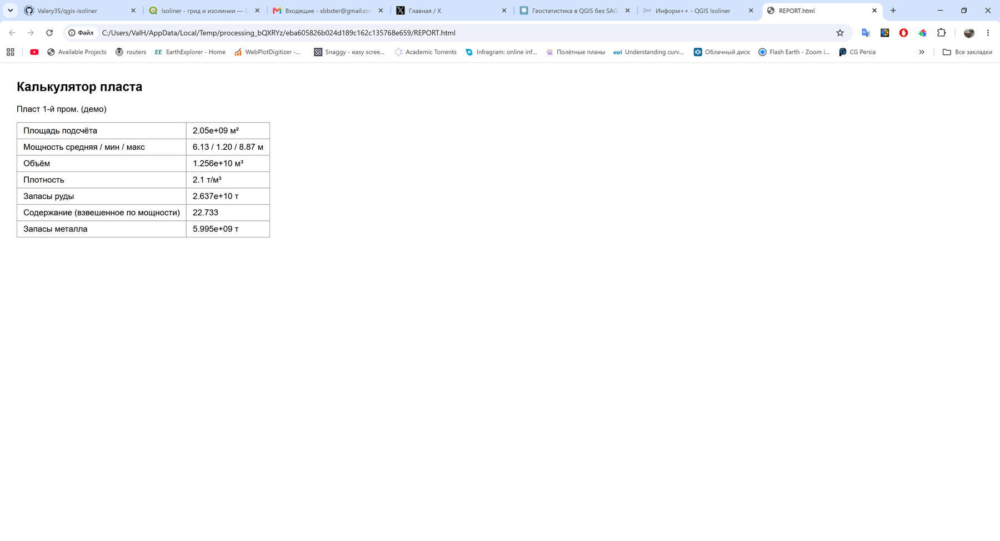{width=70%}

## Parameters

| Parameter | What it sets | Default / advice |
|---|---|---|
| Bed grid | A multiband grid by the convention. | - |
| Content band | The band with the content; empty - compute without metal. | 3 |
| Ore density | t/m³ to convert the volume into tonnage. | 2.1 |
| Reserve contour | Polygons of a block or a domain, optional. | empty |
| Bed grid with thickness and reserves | The output grid with two new bands. | - |
| Report (HTML) | The summary file. | on request |

# 4.03 Bed grid to a block model

A bridge from the raster form to the vector one: every valid cell of a bed grid becomes a centroid point. The attributes: bid, row and col, the x and y coordinates, top, bot, thick, vol, ore_t (via the density) and all the parameter bands under their names from the band descriptions.

From there the standard QGIS vector machinery works: expression filters (say, "content > 20 AND mintype = 1"), joins of tables from external databases, the field calculator - the model grows by attributes without rebuilding, and the schema with top and bot is ready for a future split of a column into several vertical blocks. The reserve contour limits the export to a block or a domain.

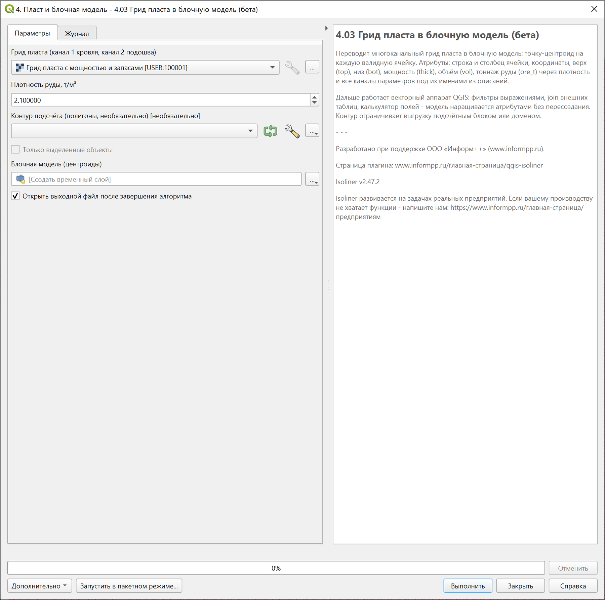{width=74%}

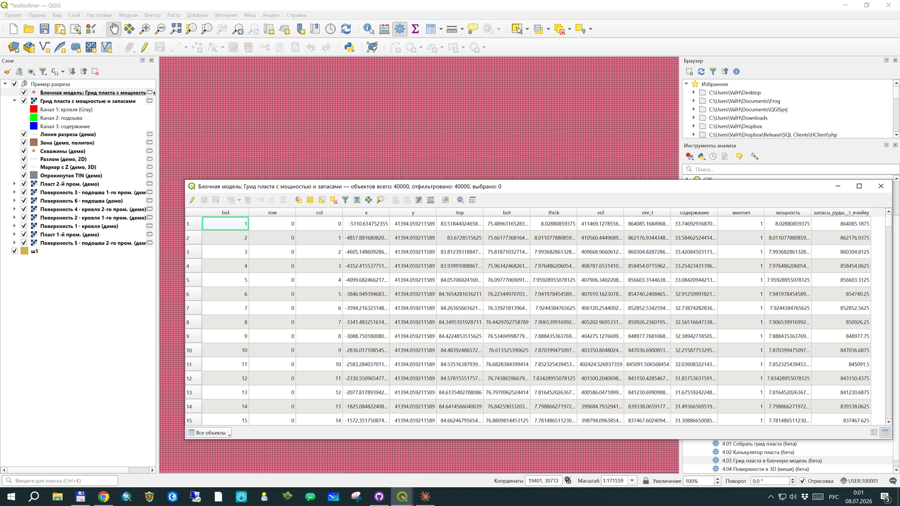{width=92%}

## Parameters

| Parameter | What it sets | Default / advice |
|---|---|---|
| Bed grid | A multiband grid by the convention. | - |
| Ore density | t/m³ for the ore_t attribute. | 2.1 |
| Reserve contour | Polygons, optional. | empty |
| Block model (centroids) | A point layer with the block attributes. | - |

# 4.05 Domains to a bed band

The tool rasterises domain polygons (reserve blocks, replacement zones, mining contours) into an extra band of the bed grid: each cell gets the code of the domain it falls into, zero - outside the domains. The code is taken from a numeric field of the layer, or, if no field is set, it is the feature order number from one. The source grid bands are kept, the **domain** band is appended last.

Then the domain works as an ordinary parameter: the bed calculator sums over the domain contour, the block model is filtered by an expression on the code. The key scenario is **reserve write-off**: compute the reserves over the contour before and after the mining and subtract one from the other, and the difference of two block models is automated by tool 4.06.

| Parameter | What it sets | Default |
|---|---|---|
| Bed grid | A multiband grid. | - |
| Domain polygons | Zone or block contours. | - |
| Domain code field (Adv.) | A numeric code field, empty - order number. | - |
| Bed grid with a domain band | The same grid plus the domain band. | - |

# 4.06 Reserve difference (write-off)

The tool computes the difference of two block models over the cells with the same **row** and **col** (and **lay** if the models are split vertically): how much reserve was lost between the "before" and "after" states. For each cell the chosen field, **ore_t** by default, is subtracted, the result is centroid points with the **before**, **after** and **delta** (before minus after) fields. The total write-off is printed to the log.

This is the direct path of operational write-off: the model before mining the chambers minus the model after, the sum of **delta** over the contour gives the written-off tonnage. The models must be built from the same grid so that the row and col split matches.

| Parameter | What it sets | Default |
|---|---|---|
| The "before" model | The block model before the change. | - |
| The "after" model | The block model after. | - |
| Reserve field (Adv.) | What to subtract. | ore_t |
| Difference (centroids) | Points with delta, before, after. | - |

# 4.04 Surfaces to 3D (meshes)

The **Surfaces to 3D (meshes)** tool exports a batch of grids into mesh layers of the standard 2DM format (MDAL). Such layers are understood by the QGIS profile tool, the mesh calculator, the built-in 3D view and third-party software, so a stack of horizons goes to meshes in a single run, without manual conversions.

A vertical transform is applied to the elevations on write: Z' = Z × scale + offset. The scale gives vertical exaggeration, the offset and the Z spacing unfold a collapsed stack into a readable shelf. Cells without data are skipped: no node is written and triangles are built only over quads whose four corners are valid.

## Parameters

| Parameter | What it sets | Default / advice |
|---|---|---|
| Surface grids | A batch of rasters, each becomes a separate 2DM. | - |
| Z scale | Vertical exaggeration of the elevations on write. | 1 |
| Z offset | A common vertical shift. | 0 |
| Z spacing | Every next grid shifts one step down. | 0 |
| Node thinning (Adv.) | Every Nth node - for large grids. | 1 |
| Elevation band (Adv.) | The band with elevations, for multiband grids. | 1 |
| Folder for meshes (2DM) | Where to write the files; the layers are loaded into the project. | - |

# 4.07 Create a polyhedral example (beta)

The tool builds a single demonstration polyhedron so you can see how a closed volumetric shell looks in QGIS. Four examples are available: **Bed body** (an analytic fold-lens between a roof and a floor), **Suite** (a stack of folded beds, each bed loaded as a separate **Suite: bed k** layer for visibility control and coloured on its own), **Cube** and **Tetrahedron**. The bed-body shell is watertight: the roof, the reversed floor and the side skirt are stitched into a closed surface with no holes. The output layer name follows the example (**Bed (demo)**, **Suite x3 (demo)**, **Cube (demo)**, **Tetrahedron (demo)**) so the objects are distinct in the **Bodies** tab list.

From QGIS 3.40 on, the output is written as a native **PolyhedralSurface Z** (or **TIN Z** if the flag is set). Older builds have no such geometry type, so the object degrades to **MultiPolygon Z** with a warning in the log; the faces are the same, only the layer type differs. The result carries the fields **name**, **kind**, **patches** (face count) and **watertight**.

The plan position and size come from the **extent (map view)**, like the other generators: the body is centred in the extent and takes its smaller side. Vertically the body runs from the base elevation (floor) up to that elevation plus the thickness. The geometry type is flat, so Z is not visible in the 2D map view. The Z range is printed to the log, and the body itself is best viewed in **Plugins - Isoliner - 3D surface viewer**, the **Bodies** tab.

This is a first step towards the future **bed body -> PolyhedralSurface** bridge: for now the tool only shows the geometry type on simple examples, while volumetric boolean operations on bed bodies are the next step (via QSFCGAL in QGIS 3.40 and newer).

| Parameter | What it sets | Default |
|---|---|---|
| Example | Bed body, Suite, Cube or Tetrahedron. | Bed body |
| Extent (map view) | Plan placement and size of the example. | map view |
| Thickness | Vertical thickness of the body, map units. | 25 |
| Bed body resolution | Grid density of the bed body (cells per side). | 8 |
| Base elevation (Adv.) | Floor elevation, map units. | 0 |
| Beds in the suite (Adv.) | How many beds in the Suite example. | 3 |
| TIN instead of PolyhedralSurface | Write as a triangulated surface. | no |
| Polyhedron (layer) | The result with the fields name, kind, patches, watertight. | - |

# 3D surface viewer (beta)

The plugin has its own 3D window: **Plugins - Isoliner - 3D surface viewer (beta)…** It does not depend on the built-in QGIS 3D view: the render runs on pyqtgraph and PyOpenGL bundled with the plugin, nothing to install.

The left panel has two tabs. **Layers** - the project rasters and the per-layer settings. **Vectors** - the section plane and the boreholes. Below the tabs live the scene-wide settings: the vertical exaggeration, the Z spacing, the opacity, the **Top view** and **Side view** buttons, **PNG snapshot…** and **Update the scene**. On the right is the scene: rotate with the mouse, zoom with the wheel. Large grids are automatically thinned to about 60 thousand nodes.

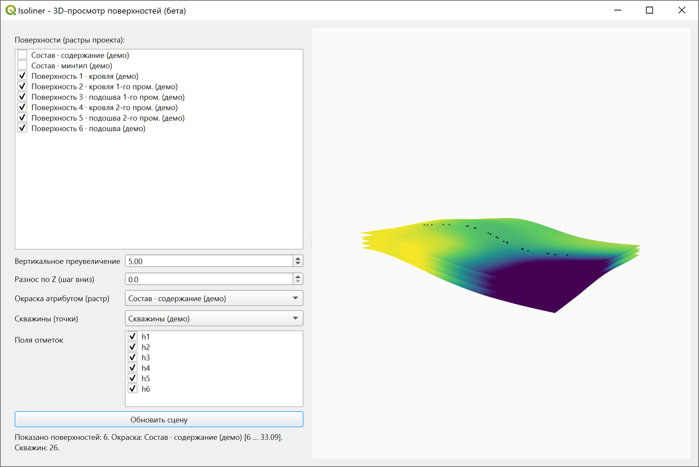{width=78%}

## The Layers tab: the set and the layer settings

The list shows all the project rasters. The **Filter layers…** line narrows the list by a substring, the **All** and **None** buttons check and uncheck the rows visible after the filter - the scene set is assembled by hand in seconds even in a project with dozens of rasters. The checks survive a list refresh.

Under the list is the **Layer settings** panel for the selected row, individual per layer:

- **Mode**: Auto (a multiband grid is drawn as a body, a singleband one as a surface), Surface (forced, any band as heights), Bed body.
- **Elevation band (Z)** - a drop-down of this raster's bands with their names.
- **Colouring** - a single list: Palette, Custom colour, then the layer's own bands by name, then the project rasters. Picking an external raster enables the **Attribute band**, and Custom colour enables the swatch to the right of the list: a click opens the colour picker, the colour lives in the layer settings.

The colouring priority: the own band, then the external raster, then the palette. The scale is one per scene, the bar with the range appears under the buttons, no-data cells are grey.

{width=86%}

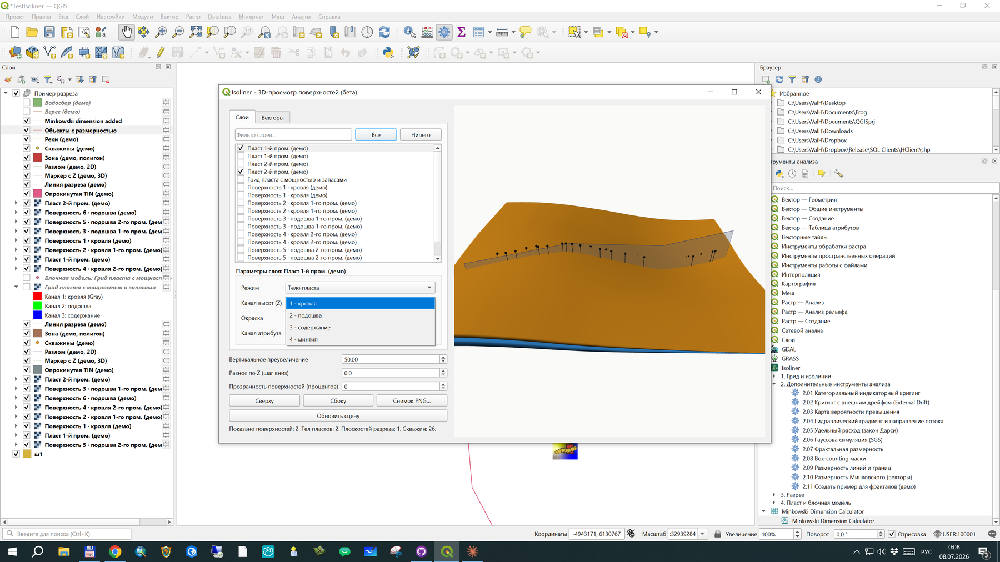{width=86%}

## Bed bodies

In the Auto mode a multiband grid by the convention is read as a body: band 1 - the roof, band 2 - the bottom, the volume is closed by a side skirt along the data boundary, a watertight body results. Beds assembled by tool **4.01** show their band names in the lists: roof, bottom, then the names of the parameter layers. Bodies and plain surfaces live in one scene.

{width=78%}

## The Vectors tab: boreholes and the section

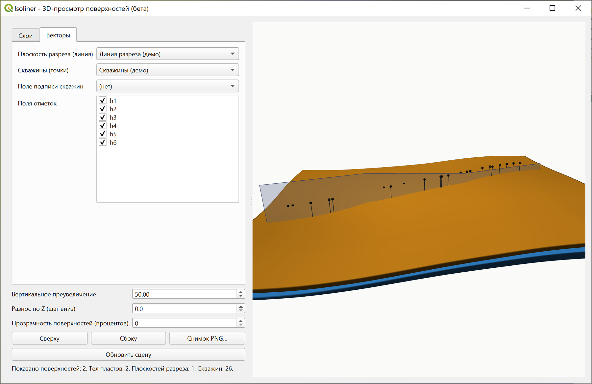{width=86%}

**Boreholes (points)**: pick a layer and check the numeric elevation fields, fields like h1…h6 are checked automatically. Every borehole is a stem of cylindrical segments between neighbouring elevations, the intervals coloured by stratigraphic position (the order of the checked fields), so the same horizon reads in one colour across all boreholes. Above the collar there is a mast with a ball: the mast lifts the collar above the roof by two percent of the scene span, the borehole stays visible even where the stem goes inside an opaque body.

**Borehole label field** adds text above the masts: fields like name and well are guessed automatically, "(none)" switches the labels off. The labels are thinned automatically: if a labelled borehole is already nearby, the text is skipped, and dense well stocks stay readable. The cap is 500 labels.

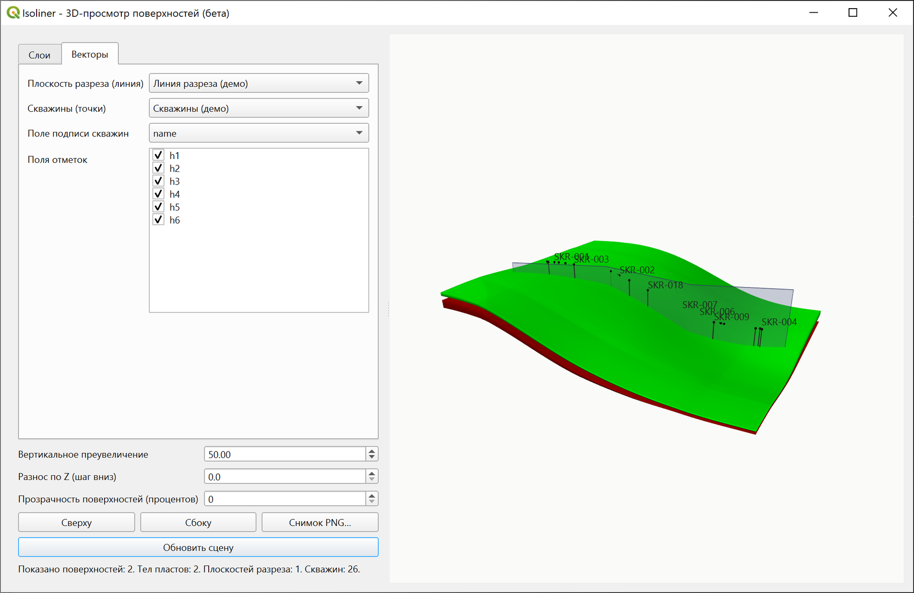{width=86%}

**Section plane (line)** accepts any line layer. The best input is the **Section definition** from tool 3.01: the ribbon takes the height range from its zmin and zmax fields. For an arbitrary line the ribbon stretches over the scene span with a margin. Polylines and multiple lines are supported, the bends are drawn by the vertices. A bright trace runs along the ribbon over the surfaces, and for bodies from the **Bodies** tab a section contour is drawn where the vertical curtain along the line cuts the body.

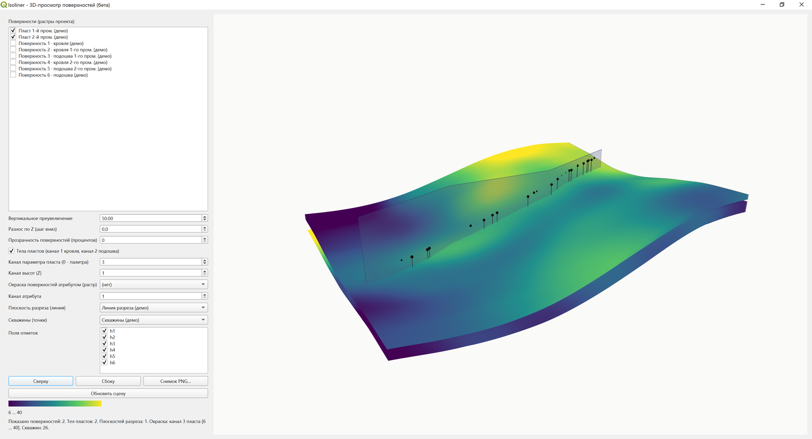{width=78%}

## The Bodies tab: polyhedra and polygons with Z

The **Bodies** tab shows polygon layers that carry a Z elevation (polyhedral surfaces, TIN, MultiPolygon Z) as volumetric bodies right in the scene, next to surfaces and bed bodies. Tick the layers you want and press **Rebuild scene**. The geometry of each feature is broken into triangles as a separate mesh and coloured on its own, so a suite of several beds comes out multi-coloured, and the tab also takes the examples from tool 4.07 and any third-party bodies with Z. The same vertical exaggeration and transparency apply to bodies as to surfaces, so a polyhedron and a stack of horizons read at one scale.

## Querying the scene by a click

When a section plane is set, a **section trace** runs along its line over every surface - a bright red thread of the plane intersecting the roof and the bottom. The trace shows exactly where the section cuts each bed.

A click on a surface or a body (without dragging - the rotation is unaffected) queries the block model: a ray is cast from the camera through the cursor, the nearest intersection with the relief is found, and the status line prints the layer name, the point coordinates and the values of all the bands by name, plus the thickness for a bed. The hit is marked with a red ball until the next click or a scene rebuild.

<!-- SCREENSHOT: viewer_pick.png | A click on a bed body: the red ball on the surface, the status line reads the full band readout -->

## The rest

**Top view** and **Side view** set orthogonal views, **PNG snapshot…** saves a frame of the scene to a file for reports and presentations. The Z spacing spreads the surfaces into a stack, the opacity helps to look inside the bodies.

# Typical situations and solutions

| What you see | Cause | Solution |
|---|---|---|
| Concentric "bull's eyes", cones | Kriging pulls the value exactly through outlier wells (nugget 0). | Set a nugget C0 (0.2-0.4 of the sill, in absolute variance units). And/or enable grid smoothing in **2D Kriging**. |
| Angular isolines ("octagons") | A coarse grid: vertices are placed at cell edges. | Increase **Line rounding** to 3 or reduce the cell size in kriging. |
| Radial/fan lines in empty corners | Extrapolation beyond the data. | Enable **Clip to well hull** or set a clip mask. |
| Isolines cross in dense areas | Formerly - a consequence of smoothing each line. | Smoothing is done over the field (in **2D Kriging**). Increase the grid-smoothing radius there. |
| Polygons of one colour | By default the layer is created with a single symbol. | Set graduated symbology by ELEV_MIN. |

# Appendix. Lessons and self-check

This section is a hands-on practicum on the demo data: short working cycles (lessons) and tests to make sure the tools compute correctly. Everything is reproduced by the plugin generators, no own data is needed. The section grows as the plugin develops.

## Preparing the demo

1. A new QGIS project.
2. **1.7 Create a well example (demo)** - demo wells with elevation and content fields appear.
3. **3.10 Create a cross-section example** - the section line, the zone polygon, the ready beds "Bed 1 (demo)" and "Bed 2 (demo)" and separate roof and bottom surfaces.

The ready "Bed 1 (demo)" is already a multiband grid by the convention (band 1 roof, 2 bottom, 3 content), it suits all the lessons below without assembly.

## Test 1. Reserve write-off: domains, split, difference

The goal is to make sure the "domains - block model - difference" chain computes the write-off correctly. It checks tools 4.05, 4.03 and 4.06.

**Step A. Domains to a band (4.05).** Bed grid = "Bed 1 (demo)", polygons = "Zone (demo, polygon)", the code field empty. The log will show "Cells in domains: N" above zero. Open the result in the 3D viewer, colour it by the **domain** band - the zone lights up with code 1, zero outside it, the colour boundary matches the polygon contour.

**Step D. Tonnage conservation on the split (4.03).** Build a block model from "Bed 1 (demo)" with **Vertical layers = 1**. In the attribute table right-click the **ore_t** field, open the statistics and note the sum. Build the same model with **layers = 5** and take the ore_t sum again. The sums must match to the last digits, and the second model has exactly five times more rows. This is the key check: splitting a column into layers neither creates nor loses reserve.

**Step E. The control zero (4.06).** Run "4.06 Reserve difference" feeding the same model both as "before" and "after", the ore_t field. The log must show a total write-off of exactly zero. This checks that subtracting identical states gives no false write-off.

**Step F. Mining emulation (4.06).** Duplicate the block model (right-click the layer, Duplicate), name it "after". In the edit mode zero the ore_t field of several centroids, having first noted their total reserve as a control number. Save the edits. Run 4.06: "before" is the original model, "after" is the modified one. The total write-off in the log must equal the zeroed reserve. The modified points have a positive **delta**, **before** equal to the old value, **after** equal to zero, the rest have delta zero. The write-off within an arbitrary contour is obtained by selecting the difference points with a polygon and summing delta over the selection - that is the tonnage going into the report.

**Test result.** If step A matched the boundary to the contour, step D gave equal sums, step E a zero, step F a match with the control number, then the whole write-off chain is correct. After that the same steps D and F should be repeated on a real bed: the demo data is clean, while the real one brings gaps and degenerate cells, and checking on it is the last step before production use.

# For enterprises

Isoliner grows on the tasks of real mining operations. We implement custom features to match production regulations, provide guaranteed technical support contracts and integrate the module into the production cycle, including corporate database connections. Details: https://www.informpp.ru/главная-страница/предприятиям

# License and support

The plugin is distributed under the GNU GPL v2 or later (GPL-2.0-or-later) - the same as QGIS itself. The full text is in the bundled LICENSE file. © Inform++ LLC, www.informpp.ru.
